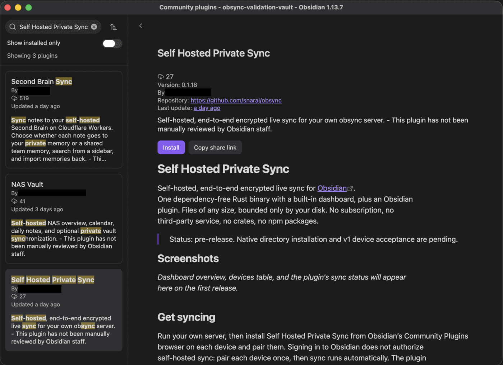
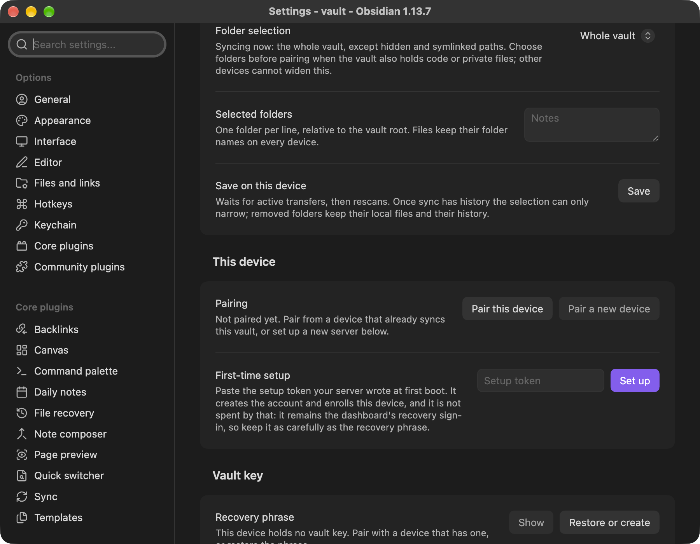
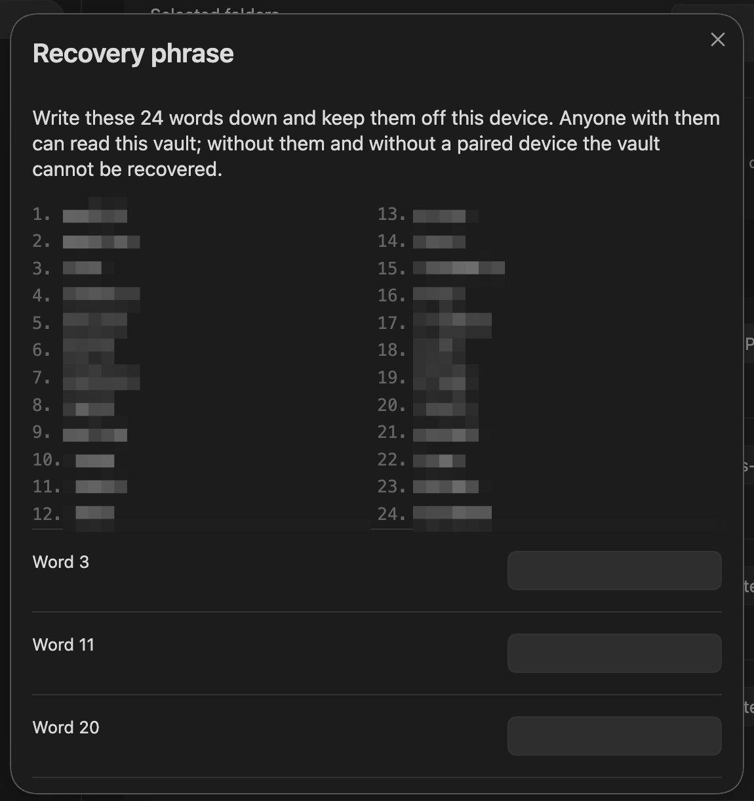
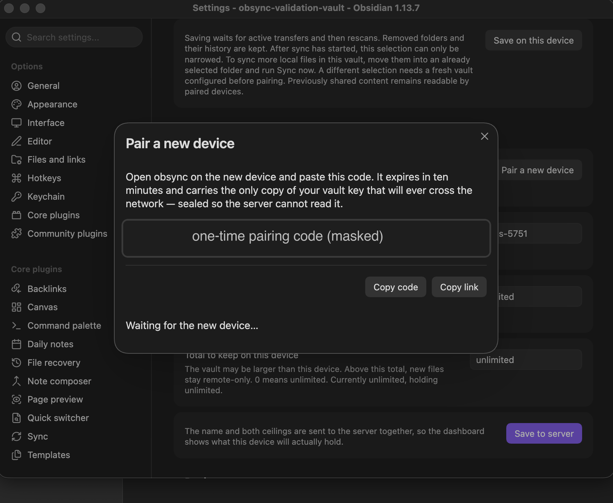
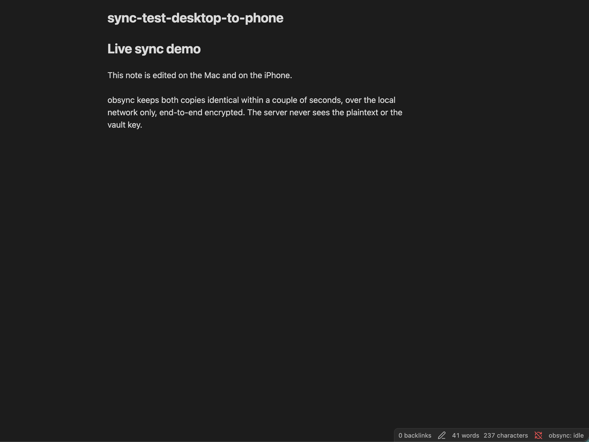

# Self Hosted Private Sync

Self-hosted, end-to-end encrypted live sync for [Obsidian](https://obsidian.md).
One dependency-free Rust binary with a built-in dashboard, plus an Obsidian
plugin. Files of any size, bounded only by your disk. No subscription, no
third-party service, no crates, no npm packages.

1.0.1, listed in Obsidian's community plugin directory as **Self Hosted
Private Sync** (plugin id `obsync-private-sync`): install it from Settings →
Community plugins → Browse, on every platform Obsidian runs on. The device run
behind it is recorded in
[`docs/validation-runs/2026-09-14.md`](docs/validation-runs/2026-09-14.md): it
proved setup, pairing and two-way sync between a Mac and an iPhone on one LAN,
and it proved nothing about iPad, Windows, or reaching the server from off that
LAN.

## What it does

- Syncs one vault across every Obsidian platform (macOS, Windows, Linux, iOS,
  iPadOS, Android) through a plugin that talks to your own server.
- Encrypts every chunk and every manifest on the device. The server stores
  ciphertext only and never learns the vault key or a single file name.
- Handles large files by content-defined chunking with resumable, deduplicated
  uploads: a 100 GB video and a 2 KB note follow the same path.
- Keeps 30 days of versions and never silently discards a conflicting edit.
- Ships a dashboard: account, devices, storage per volume, scrub and
  garbage-collection state, pairing, and installation guidance.
- Runs as one static binary: Docker, Kubernetes (Helm chart included), or a
  bare host.

> [!IMPORTANT]
> This plugin syncs to a server **you** run. There is no hosted service and no
> account with anyone but yourself: without your own `obsyncd` reachable over
> HTTPS, the plugin has nothing to sync to.

> [!IMPORTANT]
> Back up your vault before the first sync, and keep the 24-word recovery
> phrase somewhere other than the device that generated it. The server stores
> ciphertext only and cannot recover a vault for you.

> [!IMPORTANT]
> Do not run this plugin alongside another sync solution on the same vault —
> Obsidian Sync, a file-syncing cloud folder, or another sync plugin. Two
> writers on one vault produce conflicts neither of them can reconcile.

## What this plugin talks to

- **Your own server, and nothing else.** Every sync request goes to the
  **Server URL** you type into the plugin's settings. There is no obsync
  service, no analytics, no advertising, no crash reporter, and no
  third-party host anywhere in the sync path.
- **An account on that server is required**, and you create it: the first
  device uses the setup token your server wrote at first boot, and every other
  device is paired from a device that already syncs. Signing in to Obsidian
  does not enroll anything.
- **Obsidian's own directory and GitHub**, for installation and updates only.
  Obsidian downloads the release's `main.js`, `manifest.json` and `styles.css`
  from this repository's GitHub Releases when you install or update. The
  plugin never fetches or executes code from the sync server. Each Release
  also carries the plugin ZIP and the evidence manifest, for people deploying
  the server; Obsidian ignores both.
- **Your edge, if you put one there.** If an access-controlled proxy sits in
  front of your server, the headers you paste under **Edge service-token
  headers** are sent to it, because it is on the path to your server.
- **Your vault's file list, and the files you chose to sync.** The plugin
  lists every file in the vault to decide what is in scope, reads the ones
  inside your folder selection, and writes what other devices changed.
- **The clipboard, only when you press Copy.** The two Copy buttons in **Pair
  a new device** write the pairing code or link; nothing is ever read from it.

What the server can and cannot see is in
[`SECURITY.md`](SECURITY.md) and [`docs/threat-model.md`](docs/threat-model.md).

## Documentation

| Page | What it answers |
| --- | --- |
| [`docs/troubleshooting.md`](docs/troubleshooting.md) | Something is wrong: symptom, cause, fix, and how to collect a report |
| [`docs/settings.md`](docs/settings.md) | Every setting in the plugin, its default, and when to change it |
| [`docs/recovery.md`](docs/recovery.md) | A lost device, a lost server, a moved server, a rotated token |
| [`docs/conflicts.md`](docs/conflicts.md) | What a conflict copy is, how it is named, what to do with it |
| [`chart/README.md`](chart/README.md) | Installing the server on Kubernetes with the signed chart |
| [`docs/community-plugin.md`](docs/community-plugin.md) | Installation, updates, and device credential custody |
| [`docs/architecture.md`](docs/architecture.md) | How the whole system is built, and every environment variable |
| [`docs/protocol.md`](docs/protocol.md) | The wire contract between plugin and server |
| [`docs/storage.md`](docs/storage.md) | Volumes, durability, retention, scrub, and every refusal |
| [`docs/threat-model.md`](docs/threat-model.md) | What is defended, and what is not |
| [`docs/security/dashboard.md`](docs/security/dashboard.md) | The dashboard's own threat model: sessions, sign-in, revocation, residuals |
| [`docs/validation.md`](docs/validation.md) | The device validation plan and what "ready" means |
| [`docs/release.md`](docs/release.md) | How a release is cut, signed, and audited |
| [`CHANGELOG.md`](CHANGELOG.md) | What changed in each version |
| [`SECURITY.md`](SECURITY.md) | Posture, supported versions, and how to report a vulnerability |
| [`CONTRIBUTING.md`](CONTRIBUTING.md) | How to work on this repository |

<!-- README screenshot rule (AGENTS.md): this section leads with captures of
     the plugin and the dashboard. The five files below are committed PNGs from
     a validated device run; docs/captures/README.md holds the convention and
     the redaction rules. A change to what either surface renders asks the
     owner for fresh captures. -->

## Get synced in five steps

The path this release was validated on, from an empty vault to two devices in
sync. Each step is written out in full under [Get syncing](#get-syncing)
below, and all five assume your own server is already running.

1. **Install from Community plugins.** In Settings → Community plugins →
   Browse, search for **Self Hosted Private Sync** and select Install, then
   Enable — the same way every other Obsidian plugin arrives, on every
   platform.

   

2. **Point it at your server and set it up.** Open the plugin's settings tab,
   set **Server URL** to your own server, choose which folders this device
   syncs, then paste your setup token under **First-time setup**.

   

3. **Keep the recovery phrase.** Setup generates the vault key on this device
   and shows a 24-word phrase once: write it down and keep it somewhere other
   than this device, because the server holds ciphertext only and cannot
   recover a vault for you.

   

4. **Pair a second device with a one-time code.** Run **Pair a new device** on
   the first device, enter the code it shows on the second within ten minutes,
   and approve the device by name — the vault key travels encrypted under a
   pairing secret the server never sees.

   

5. **Edit on either device and watch it land.** Type in a note on one device
   and it appears on the other within seconds, in both directions, with the
   status bar showing what sync is doing.

   

The dashboard's device list and its revoke button are documented under
[See your devices](#4-see-your-devices) and were not exercised in the 1.0.0
device run recorded in
[docs/validation-runs/2026-09-14.md](docs/validation-runs/2026-09-14.md).

## Get syncing

Run your own server, then install Self Hosted Private Sync from Obsidian’s Community Plugins
browser on each device and pair them. Signing in to Obsidian does not authorize
self-hosted sync: pair each device once, then sync runs automatically. The plugin
needs an account on your own server. There is no Self Hosted Private Sync subscription or hosted account. Obsidian uses
its directory and GitHub to install and update the plugin; encrypted sync
uses only the server and optional network provider you configure.

### 1. Run the server

The server speaks plain HTTP on port 8080 and must sit behind a TLS
terminator: Obsidian on iOS and Android refuses plain HTTP. Which terminator
is your choice, and it is the one deployment decision that changes who else
is on the path:

| Where you put it | Good for | Notes |
| --- | --- | --- |
| LAN or VPN, with a certificate your devices trust | everything, and the right place for a bulk first sync | HTTPS is required on mobile, so the trusted certificate is not optional |
| An HTTPS reverse proxy on hardware you own | a permanent public endpoint | you own the terminator, so you own its terms |
| A tunnel provider on a public hostname | reaching the server with no inbound port | read the provider's terms on sustained large transfers, and do the bulk first sync on the LAN |

A tunnel is one supported transport, not the foundation. Whatever terminates
TLS reads your credentials -- the device secret at pairing, the dashboard
session cookie -- and never your notes: every chunk and manifest is encrypted
on the device, and no key that decrypts them ever crosses the wire
(`docs/architecture.md` section 2.1). "Files of any size" is a promise about
this server; a provider on the path has its own terms.

Deploy by digest, never by tag. The image and chart are signed keyless by
this repository’s publisher. New releases carry
`obsync-X.Y.Z-release-manifest.json`, which names their digests and the
SHA-256 of the plugin bundle and each native installation file. Verify the signature with cosign, read the digest from the verified
payload (it must match the manifest on the Release page), and run exactly
that digest. The tag below is the release you are installing -- `v1.0.1` here,
`vX.Y.Z` for whichever release you took off the Releases page:

```sh
cosign verify ghcr.io/snaraj/obsync:v1.0.1 \
  --certificate-identity https://github.com/snaraj/obsync/.github/workflows/release-publisher.yml@refs/heads/main \
  --certificate-oidc-issuer https://token.actions.githubusercontent.com

docker volume create obsync-blobs
docker volume create obsync-journal
docker run -d --name obsync -p 127.0.0.1:8080:8080 \
  -v obsync-blobs:/data/blobs -v obsync-journal:/data/journal \
  -e OBSYNC_BLOBS_CAPACITY=250GiB -e OBSYNC_JOURNAL_CAPACITY=4GiB \
  -e OBSYNC_PUBLIC_URL=https://sync.example.org \
  ghcr.io/snaraj/obsync@sha256:<the digest cosign just verified>
```

On Kubernetes, [`chart/README.md`](chart/README.md) is the whole standalone
path: the `helm install` command against the signed OCI chart, the one command
that creates the `OBSYNC_SERVER_KEY` Secret, and the four values a cluster that
is not the owner's must override before a pod can run. The reference deployment
(a single-node cluster on a Raspberry Pi, reached over private connectivity
with no public hostname) is described in `docs/platform-onboarding.md` and
`docs/architecture.md` section 10. The server takes ownership of nothing: each volume must be presented owned by uid 65532 and writable by it, or already hold the server's `v1`, or the start is refused with `reason=unwritable`. Static local volumes and `hostPath` directories: create them as `65532:65532`, mode `0700`, with root-owned, closed parents and no symlink on the path. A dynamic provisioner that presents a root-owned or world-writable volume root: prepare the backing directory once as the node administrator (`chown 65532:65532` and `chmod 0700`), then start. The chart sets no `fsGroup`, because a group-writable volume is refused (`docs/storage.md`, "Volume posture").

At first boot the server mints a setup token and writes it, mode 0600 and
never logged, to `v1/setup-token` on the journal volume. The token creates
the account once, and it then remains the dashboard's recovery sign-in for
the life of the server (`docs/architecture.md` section 4.5), so keep it
with the same care as the recovery phrase: anyone holding it can sign in to
the dashboard and revoke devices. Read it without any helper image, from the
container's own volume, running or stopped:

```sh
docker cp obsync:/data/journal/v1/setup-token - | tar -xO
```

On Kubernetes the same file is on the journal volume, and
[`chart/README.md`](chart/README.md) gives the two ways to read it there —
`kubectl exec` and `kubectl cp` are not among them, because the image has no
shell and no `tar` for either to use. The journal
volume also carries the journal itself and, when
`OBSYNC_SERVER_KEY` is not supplied, the generated server key: back it up as
the sensitive volume it is.

`GET /readyz` answers `{"ready":true,"seq":<n>}` once the server is serving.

### 1b. Any network, no provider: Compose with Caddy

Step 1 assumes you already have a TLS terminator. If you have none -- a LAN, a
Pi or a NUC at home, no account with anybody -- `deploy/compose` is the whole
deployment: the same digest-pinned server with **no published port at all**,
and a terminator of your own in front of it.

Verify the signature exactly as in step 1, then, from a checkout of this
repository:

```sh
OBSYNC_IMAGE=ghcr.io/snaraj/obsync@sha256:<digest> \
  OBSYNC_HOST=sync.example.org \
  OBSYNC_BIND_ADDRESS=192.168.1.10 \
  docker compose -f deploy/compose/docker-compose.yml up -d
```

`OBSYNC_HOST` is the name your devices will use, and it needs no public
existence at all: a name in your own DNS, a router entry, or a hosts file is
enough, because it only has to resolve on the networks you sync from -- your
LAN, or a VPN back to it. What it DOES need is HTTPS, without exception:
Obsidian on iOS and Android refuses plain HTTP and the plugin speaks nothing
else. Two ways to get a certificate a phone will accept for a private name,
neither of which needs this server reachable from the internet -- what it IS
reachable from is `OBSYNC_BIND_ADDRESS` below, not either of these:

- **the private authority below**, exported once and installed on each
  device. This is what the compose file does out of the box, and it is the
  route with no prerequisites of any kind.
- **a public certificate issued over DNS-01**, where the challenge is
  answered by a DNS record instead of by a connection, so the name may resolve
  only on your own network. Caddy answers DNS-01 only in a build carrying your
  DNS provider's module, which the stock image pinned here does not have: that
  is a deliberate substitution of the `caddy` image, not something this file
  does for you.

A public hostname, a reachable port 80 and 443, or a tunnel provider are one
optional way to reach this server from outside your own network. None of them
is a requirement, and nothing below assumes them.

`OBSYNC_BIND_ADDRESS` is the host address ports 80 and 443 are published
on, and it is the answer to a question the two certificate options above do
not touch. The private name and the certificate authority decide what this
service is CALLED and which devices TRUST it; they decide nothing about who
can reach it -- a client from anywhere can pick the name itself and skip
certificate verification entirely. The bind address decides which of this
host's interfaces accepts connections: a bind address limits the destination
interface, not the source. `127.0.0.1` accepts only connections from this
machine, which is what you want when a VPN terminates here or another
reverse proxy sits in front. A LAN address of this host (`192.168.1.10`)
accepts every connection that arrives at that address, which is your LAN
and also anything routed to it: a VPN that routes into your LAN, another
subnet your router forwards, or a port forward you set up. So a non-loopback
bind assumes three things you own: your router forwards nothing from the
internet to this host on 80 or 443, a host firewall or router policy limits
sources to the networks you intend, and you know which VPNs route into the
LAN. `0.0.0.0` publishes on every interface this host has, and that IS the
decision to expose it wherever the host is reachable -- legitimate behind a
firewall or a NAT you control, and then the firewall is yours to get right.
Compose refuses to start until you have chosen, because there is no value
here that is safe for everybody.

`deploy/compose/docker-compose.yml` gives the server
`OBSYNC_EDGE=none` and trusts forwarded addresses only from the compose
network's own range, which is written in that file beside the network it
belongs to. Ports 80 and 443 on the address you chose are the only ones
opened, and `OBSYNC_HTTP_PORT` and `OBSYNC_HTTPS_PORT` move that pair of HOST
ports if something on this machine already holds them -- they default to 80 and
443, and the container ports, the certificate and the name never change with
them. A host port you moved has to appear everywhere a device names this
server: set the plugin's **Server URL** to `https://name:PORT`, and the
deployment's own generated links and its HTTP-to-HTTPS redirect carry the same
port without being told twice.

That holds while devices arrive at THIS host's port. If another reverse proxy
sits in front — holding 443 on this machine, which is the usual reason to move
these ports at all — then devices still arrive at `https://name`, and the
deployment has to be told: add `OBSYNC_PUBLIC_URL=https://name` to the compose
command. An explicit value always wins over the file's default, and it is the
address the plugin checks a generated link against, so it must be the address
your devices actually use.

The setup token is read the same way as in step 1, from the container compose
created:

```sh
docker cp obsync-obsync-1:/data/journal/v1/setup-token - | tar -xO
```

`scripts/ci/compose-smoke.sh` brings this exact file up on every pull request
and proves the path end to end: the bind address required before anything
starts, TLS through the proxy, `/readyz` truthful, the server itself with no
published port, 80 and 443 published on the chosen address and on nothing
else, the redirect off port 80 keeping the port you published, the token
readable, both containers hardened.

#### Trust the certificate authority, once per device

`deploy/compose/Caddyfile` issues certificates from an authority Caddy
generates on first start, so nothing needs to be reachable from the internet
and you need no domain. The price is that each device must be told to trust
that authority once -- the Obsidian plugin speaks HTTPS only, and on phones
there is no "continue anyway". Export the root certificate:

```sh
docker cp obsync-caddy-1:/data/caddy/pki/authorities/local/root.crt - \
  | tar -xO > obsync-root.crt
```

Copy `obsync-root.crt` to each device and install it:

- **macOS:** `sudo security add-trusted-cert -d -r trustRoot -k
  /Library/Keychains/System.keychain obsync-root.crt`
- **Windows** (an Administrator prompt): `certutil -addstore -f Root
  obsync-root.crt`
- **Linux** (Debian, Ubuntu): `sudo cp obsync-root.crt
  /usr/local/share/ca-certificates/obsync-root.crt`, then `sudo
  update-ca-certificates`. On Fedora and its relatives the directory is
  `/etc/pki/ca-trust/source/anchors/` and the command is `update-ca-trust`.
- **iOS and iPadOS:** mail or AirDrop the file to the device, open it, then
  Settings, Profile Downloaded, Install. Trust is a SECOND step and Obsidian
  fails without it: Settings, General, About, Certificate Trust Settings,
  and turn the certificate on.
- **Android:** Settings, Security, Encryption & credentials, Install a
  certificate, CA certificate. Android keeps user-installed authorities
  separate from the system ones and an app may decline to trust them; if
  Obsidian on Android refuses to connect, that is what happened, and the
  answer is the public-ACME block documented in
  `deploy/compose/Caddyfile` -- a real domain, ports 80 and 443 reachable,
  and a certificate every device already trusts. Nothing else changes.

#### Reaching it from outside your LAN

The server needs no public existence for this, and nothing below asks it to
become reachable from the internet. What has to be true is true on the ROAMING
DEVICE, and all five of these, because the first one that is missing is the
one that makes sync look broken:

- **A private route back to the server.** An overlay network the device joins:
  WireGuard, Tailscale, or a tunnel provider's private network with its client
  app. The route has to carry the HTTPS port, not only SSH or one service.
- **The same Server URL, resolving and routing on that device.** The plugin
  sends every request to the address you typed, so that name must resolve to
  an address the route reaches -- the overlay's own DNS, the device's hosts
  file, or a split-DNS entry. A name that resolves to a LAN address the device
  cannot route to fails exactly like an offline server.
- **The same private authority, trusted on that device.** Section above, once
  per device. A phone that trusts the certificate at home trusts it away from
  home; a device that never installed it does not.
- **On iOS, the local-network permission accepted.** iOS prompts once, the
  first time Obsidian reaches an address on a local network, and the answer
  afterwards lives in Settings, Obsidian. It is one of the steps the recorded
  device run answered by hand on the phone.
- **The host firewall admitting the HTTPS port from the route.** A bind
  address decides which interface accepts connections; the firewall decides
  which sources do. An overlay's addresses are a new source.

What has actually been proved is the LAN: the recorded run
([`docs/validation-runs/2026-09-14.md`](docs/validation-runs/2026-09-14.md))
took a Mac and an iPhone through setup, pairing and two-way sync over the
Compose route, on one home network, with HTTPS on a non-default port. Sync
from off that LAN is not a proven result in any release so far, on either
route.

### 2. Set up this computer (the first device)

Use Obsidian 1.13.0 or newer on each device. Credentials and vault keys use
Obsidian's native secret storage; unavailable storage stops setup and sync.

1. In your vault, open Settings → Community plugins and allow community
   plugins. Select Browse and search for **Self Hosted Private Sync**.
2. Select **Install**, then **Enable**. No hidden folders or manual file
   copies are part of installation.
3. Open the Self Hosted Private Sync settings tab. Set **Server URL** to the
   URL your devices reach the server at, port included when it is not 443
   (`https://name:8443`). If an access-controlled edge sits in front of the
   server, paste its headers under **Edge service-token headers**, one per
   line as `Name: value`.
4. Under **Sync folders on this device**, choose **Selected folders only**
   if the vault also contains code or files you do not want shared, and
   enter relative folders such as `Notes`, one per line. **Set up** and
   **Pair this device** apply what you typed; **Save** applies it on its own.
   An empty selected list syncs no files; **Whole vault** is the default.
   Select the final folders now: after sync has history, the selection may
   only narrow. To stage a first sync within one vault, keep personal files
   in an excluded folder, test disposable notes inside the selected folder,
   then move the personal files in and run **Sync now**.
5. Under **First-time setup**, paste the setup token and select **Set up**:
   the plugin creates the account and this device, generates the vault key
   on this computer, and shows the **recovery phrase** (24 words).
   Write it down and keep it off this machine: without any paired device and
   without this phrase, the vault is unrecoverable by design. The server never
   sees the key. [`docs/recovery.md`](docs/recovery.md) is what the phrase
   does and does not get you back.
6. Sync starts. The status bar shows the state; the command **Sync now**
   forces a pass, and **Show sync status** explains what it is doing.

Existing installations migrate their own credentials before removing them
from plugin data. Keep the vault and recovery phrase intact if a storage
error appears. Check Obsidian's secret storage and reload; do not delete the
credential reference or repeat server setup. A partially enrolled device
still needs approval before an existing recovery phrase can restore sync.
A pending pairing dialog does not resume after app restart. Secret storage is
shared with other trusted plugins in that vault and is not an OS or plugin
isolation boundary. Native restart persistence is a separate validation step.

### 3. Pair your phone

1. In the phone's local vault, install and enable **Self Hosted Private Sync** through Settings →
   Community plugins → Browse. Set the same **Server URL** and connect to
   its private network if needed. The server must provide HTTPS trusted by
   the phone. Choose this phone's folder selection before pairing; **Pair this
   device** applies it, and it is local, not copied by the pairing code.
   Files keep their relative folder names.
2. On the computer, run the command **Pair a new device** (also a button in
   the settings tab). It shows a one-time pairing code, valid ten minutes, and
   an `obsidian://obsync-private-sync/pair?code=...` link you can send yourself.
3. On the phone, open **Pair this device** in the settings tab, paste the code
   under **Pairing code** and tap **Pair** — or open the link, which is the
   same dialog with the code already in it.
4. Back on the computer, approve the device by its name when asked. The phone
   receives the vault key encrypted under a pairing secret that never touches
   the server; until you approve, the phone has no authority of any kind.
5. Edit a note on the phone. It appears on the computer within seconds, and
   the other way round. That is the whole loop.

### 4. See your devices

On any paired computer, run **Open dashboard**: it mints a one-time sign-in
link to the dashboard, where you see every device (type, address, country,
last sign-in, last edit), storage per volume, scrub and garbage-collection
state, and installation guidance. Revoke a lost device there or
from the **Devices** list in the plugin settings.

### Commands and the status bar

Every command is under **Self Hosted Private Sync** in the command palette
(`plugin/src/main.ts`):

| Command | What it does |
| --- | --- |
| Sync now | Forces one pass instead of waiting for the watcher |
| Show sync status | What the engine is doing, and why it is not doing more |
| Pair a new device | Mints a one-time pairing code on this device |
| Show recovery phrase | Re-displays the 24 words, from this device's own key |
| Restore from history | Browses retained versions and restores one as a copy |
| Show remote-only files | Lists files above this device's ceilings, to fetch on demand |
| Open dashboard | Mints a one-time dashboard sign-in link |

The status bar reads `obsync: not paired` before pairing, then `obsync: idle`,
`obsync: syncing <n>` while `n` files are in flight, `obsync: offline` when the
server is unreachable, and `obsync: error — <reason>` when sync has stopped.

### If something looks wrong

- **The status bar says `offline`.** The device cannot reach the server:
  check the URL in settings, the certificate, and the private network if the
  deployment needs one. Mobile Obsidian refuses plain HTTP entirely.
- **Sync stopped with an error.** The plugin stops rather than guessing. The
  message names the cause; `Show sync status` repeats it. Credential-storage
  failures are covered in
  [installation trust and distribution](docs/community-plugin.md).
- **A file is not syncing.** Hidden folders (`.obsidian`, `.git`), symlinked
  folders, and anything outside this device's folder selection are excluded by
  design — see *What syncs and what does not* below.
Every other symptom, the error codes you are most likely to meet, and how to
collect a report worth sending are in
[`docs/troubleshooting.md`](docs/troubleshooting.md).

### What syncs and what does not

- obsync syncs one person's vault across their own devices. Every device you
  pair has owner access; the current runtime has no recipient role. Giving anyone else
  access to part of a vault is phase 2 work, gated on the acceptance
  criteria in `docs/architecture.md` section 5.
- Hidden folders (`.obsidian`, `.git`) and symlinked folders are not synced
  in either direction.
- A saved folder selection limits obsync's reads, writes and deletions on
  this device. Narrowing keeps excluded local files and server history.
  It does not sandbox Obsidian or other plugins, or revoke a paired device's
  access to content already shared. Keep administration code outside
  selected folders. Expansion of a used device's selection is refused;
  moving local files into an already selected folder and running **Sync
  now** is the supported way to add content within the same vault.
- On phones, files above **Largest file to download** (512 MiB by default)
  stay on the server and are listed by **Show remote-only files** for
  on-demand fetch; **Total to keep on this device** defaults to 50 GiB. Both
  are settings. Computers have no ceiling.
- Every edit is kept as a version for 30 days and at least the last 10
  versions per file; conflicts never discard an edit — text merges cleanly or
  you get a conflict copy ([`docs/conflicts.md`](docs/conflicts.md)).
- Update through Settings → Community plugins → Check for updates on each
  device. The plugin never installs code from the sync server. See
  [installation trust and distribution](docs/community-plugin.md).

### Restore a retained version

Open **Self Hosted Private Sync: Restore from history** in the command palette. Optionally
enter part of a filename, select **Restart search**, then **Load next**.
Versions appear oldest first, including retained content of deleted notes.
Each click checks at most 20 records; an empty filtered page can still have
more history after it. Select **Restore a copy** on a content version to
create a uniquely named sibling inside the currently selected folder.
Deletion markers themselves contain no file bytes.

The original file, unsynced edits and original history remain unchanged.
The notice first confirms a local copy and requests ordinary sync; check
sync status for upload failures. Device size/budget limits apply to the
additional copy. Desktop streams into a temporary file and publishes only
to an unoccupied name; a filesystem without that primitive is refused.
Mobile buffers the verified file and uses Obsidian's create-only API.

Cancel prevents later work, but Obsidian cannot abort a network request or
local create already dispatched. A late create may finish; check any copy
path named in an error before retrying. The network API buffers responses
before a size check is possible. Reopening history does not start another
manual request until the outstanding one settles. These are platform
limits, not a claim of power-loss or real-device validation.

## Questions, bugs, and security

- **A question, or something you are not sure is a bug:**
  [Discussions](https://github.com/snaraj/obsync/discussions).
- **A bug:** [open an issue](https://github.com/snaraj/obsync/issues/new/choose)
  with the bug-report template, and the report described in
  [`docs/troubleshooting.md`](docs/troubleshooting.md). Include no token, no
  recovery phrase, and no address you would not publish.
- **A suspected vulnerability:** privately, through
  [`SECURITY.md`](SECURITY.md) — never a public issue.

## Layout

| Path | Contents |
| --- | --- |
| `crates/obsync-core` | Homegrown primitives: SHA-256, HMAC, HKDF, CRC32, encodings, JSON, HTTP/1.1 |
| `crates/obsyncd` | The server: storage engine, journal, sync API, dashboard, CLI |
| `plugin/` | The Obsidian plugin (TypeScript, WebCrypto, no runtime dependencies) |
| `dashboard/` | Static dashboard assets embedded into the server |
| `chart/` | Helm chart |
| `bench/` | Benchmark harness; LiveSync is the reference to beat |
| `docs/` | Architecture, protocol, storage, threat model, validation, onboarding |

Start with [`AGENTS.md`](AGENTS.md) (the contract) and
[`docs/architecture.md`](docs/architecture.md).

## License

MIT. See [`LICENSE`](LICENSE).
