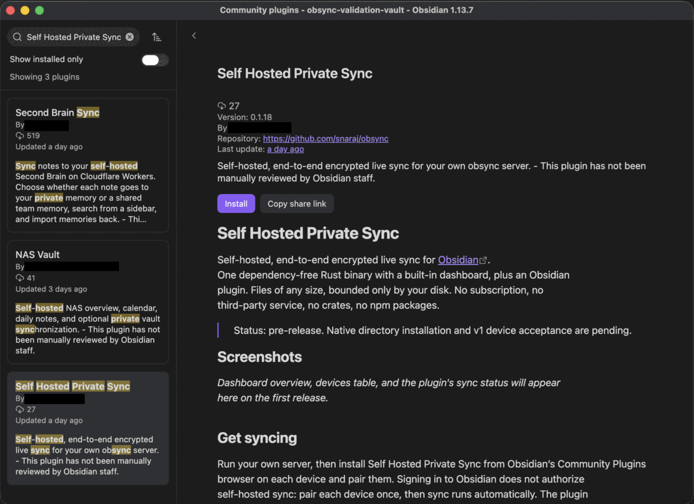
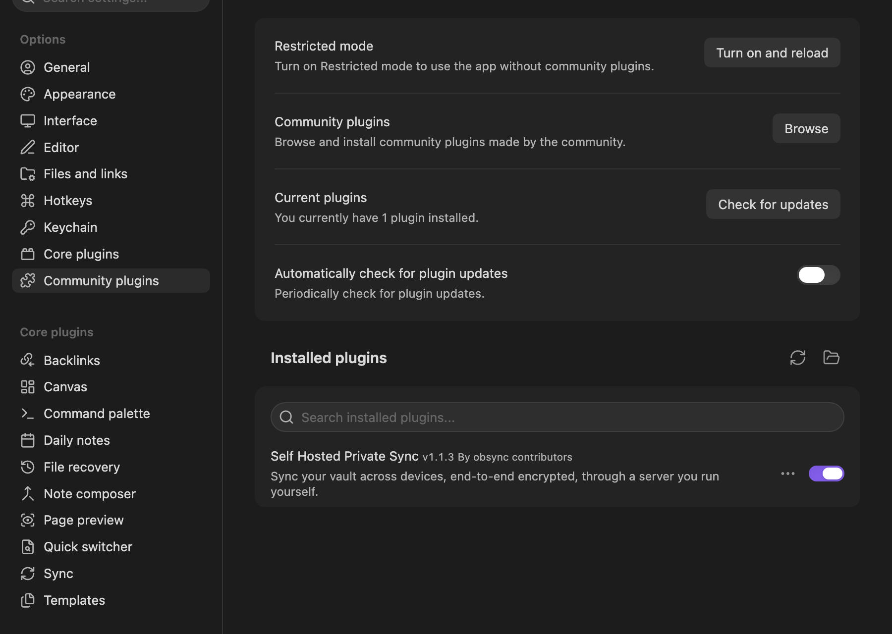

# Install the plugin

*For people using obsync.*

Self Hosted Private Sync installs and updates through Obsidian's Community
plugins browser, on desktop and on mobile, like every other Obsidian plugin.
The sync server never installs code on your device, and copying plugin files
by hand is not the way to install it.

The plugin id is `obsync-private-sync`; the name you search for is
**Self Hosted Private Sync**. A build from before the directory listing, with a
different id, is a separate installation. The plugin does not read or import
another installation's settings. Keep that installation's recovery phrase
before removing it, then choose the new installation's folders and pair it in
Self Hosted Private Sync settings.

## Install and connect

You need Obsidian 1.13.0 or newer. Signing in to Obsidian does not connect a
device to your server: pair each device once, and sync then runs by itself.

1. Open the vault to sync. In **Settings → Community plugins**, allow community
   plugins, select **Browse**, search for **Self Hosted Private Sync**, then
   **Install** and **Enable**.

   

   Once it is enabled, it is listed under **Installed plugins**:

   

   On Android, Obsidian first asks for file access and to leave Restricted
   mode; [Prepare an Android phone](quickstart.md#prepare-an-android-phone)
   shows each screen.

2. Open **Self Hosted Private Sync** settings and enter the HTTPS address of
   your server. The device must already trust the server's certificate
   ([how](server.md#trust-the-certificate-authority-once-per-device)). If the
   server is only on a private network or a VPN, connect to it first.
3. Choose and save the folders this device should sync before setup or
   pairing. For a workspace vault, select only the note folders you mean to
   share. Each device keeps its own folder selection.
4. On the first device, use **Setup or recover** with the server's setup token
   and keep the recovery phrase safe. On every other device, enter the pairing
   code from **Pair a new device** on a device that already syncs, then approve
   the new device there. The [Quickstart](quickstart.md) shows each step.

## Update

Use **Settings → Community plugins → Check for updates** on each device.
Obsidian downloads the release's `main.js`, `manifest.json` and `styles.css`
from GitHub. The plugin never fetches or runs code from the sync server, never
installs a loader and never updates itself. When your server reports a newer
plugin version, the plugin's notice opens Obsidian's own plugin manager.

## Where your keys are kept

The plugin keeps the vault key, this device's secret and any edge header values
in Obsidian's secret storage, never in plain plugin data. That storage belongs
to the vault and is shared with the other plugins you trust there; it is not a
separate lock against them or against your operating system. How the entry is
written, migrated and recovered is in
[credential custody](architecture.md#device-local-credential-custody), and
Obsidian's own [storage guide](https://docs.obsidian.md/plugins/guides/secret-storage)
describes the storage itself.

If secret storage is unavailable or cannot be verified, sync stops with an
error, and nothing is sent or changed. Then:

1. Reload Obsidian.
2. If it keeps happening, have your recovery phrase or another syncing device
   at hand, reinstall obsync, and pair this device again. Your notes stay in
   the vault. Do not repeat server setup.

A copied vault, or one whose folder was renamed outside Obsidian, is not an
error: it opens unpaired, says so, and offers **Pair this device** and
**Start fresh**
([what to do](troubleshooting.md#a-copied-or-renamed-vault-shows-a-storage-error)).

A pairing waiting for approval finishes even if its dialog was closed, and
after Obsidian restarts, as long as it is approved within the code's ten
minutes; after that, pair again with a new code. The recovery phrase cannot
approve a pending device. Other plugin installations are never imported
automatically.

## Trust and network use

The plugin talks to your own server for setup, pairing, encrypted sync,
history, device management and version information. It has no subscription,
advertising or telemetry service. Obsidian itself contacts its directory and
GitHub to install and update community plugins. Any network access provider
in front of your server is chosen by whoever runs the server.

Four more things the plugin touches, each only when you act:

- **Your edge, only if you configured one.** Headers you paste under **Edge
  service-token headers** ride on every request to the Server URL, because
  the proxy that needs them is on the path to your server.
- **Your browser, when you ask for the dashboard.** **Open dashboard** opens a
  sign-in link in your browser, and only when that link is on your server's
  own address.
- **Your browser, when you ask for the setup guide.** **Setup guide** in the
  settings and the command **Open the setup guide** open the project's guide,
  a fixed address shipped with the plugin. The plugin itself sends nothing there.
- **Obsidian's secret storage.** The vault key, the device secret and any edge
  header values live there, never in plain plugin data.

Installing any community plugin means trusting its code with your vault.
Obsidian installs this one from the project's GitHub releases; how those files
are built, signed and attested, and what Obsidian does and does not check
before running them, is in the [release path](release.md#the-community-directory-listing).

For a phone, the server needs HTTPS with a certificate the phone trusts. A
publicly trusted certificate can cover a server that is only reachable
privately: trusting a certificate and reaching a server are separate choices.
A private certificate authority, as `deploy/compose` makes, works too, with a
one-time trust step on each device. Never bypass a certificate error.
