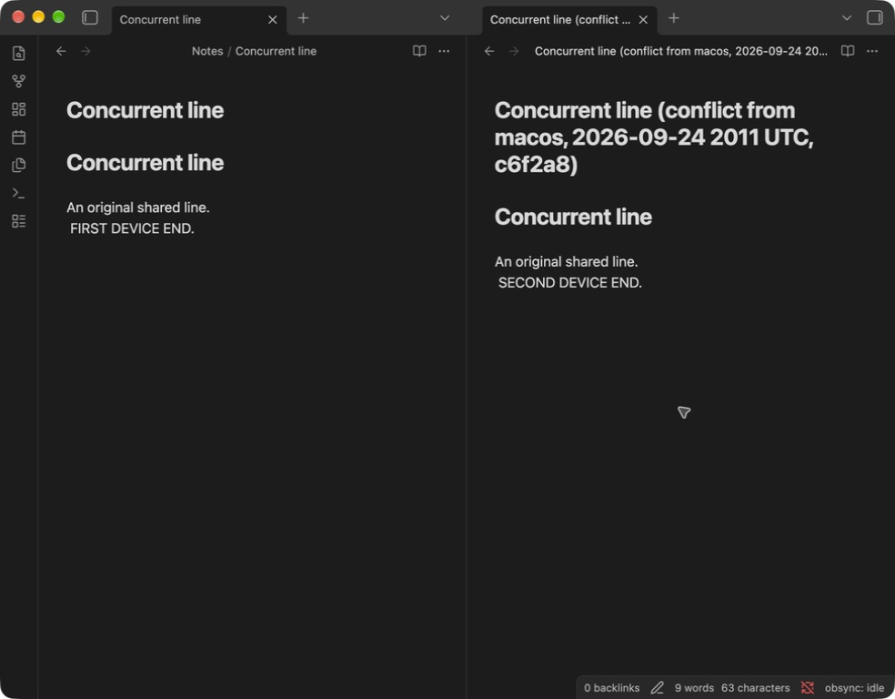

# Conflicts

Two devices edited the same file before either of them synced. obsync never
discards an edit to resolve that, so exactly one of two things happens.

Changes in different paragraphs usually appear together in one note. Text
added to the same line can also merge, including continued typing before text
that just arrived from another device. When both devices replace the same
existing text, obsync keeps a second file beside the original so you can
compare them. Your notes remain ordinary files you can open and edit in Obsidian.

While you are typing, incoming changes to that note can wait until you pause.
obsync waits for your text to save and for ten seconds without typing in the
note, then brings in the latest changes automatically. Other notes keep
syncing. You do not need to close the note or press **Sync now**.

## What to do with a conflict copy

1. Open the original and the file with **conflict from** in its name. You can
   use Obsidian's **Open to the right** action to compare them side by side.
2. Copy the text you want to keep into the original, then check the result.
3. Delete the extra copy when you are satisfied. That deletion syncs too;
   [retained history](storage.md) still holds the earlier versions.

This real desktop capture uses a disposable note edited differently on two
devices. The left note holds the first device's sentence; the right copy holds
the second. Both files reached both devices.



## One device deleted the note while another edited it

The edit stays. You get the edited note back, without a new conflict copy or
repeated successful-resolution notices. The deletion stays in history. If an
edit cannot yet be uploaded, it remains on that device with a warning until
it can be sent.

The sections below explain the detailed merge rules and filenames.

## A text file is merged

A merge happens only when ALL of these hold, and any one of them failing gives
you a conflict copy instead:

- **It is a text format**: `.md`, `.markdown`, `.txt`, `.csv`, `.json`,
  `.yaml`/`.yml`, `.ts`, `.js`, `.css`, `.html`, `.xml`, `.toml`, `.ini`,
  `.log` — and the local file holds no NUL byte.
- **Both sides are under 8 MiB**, the chunk ceiling: a merge input is held
  whole in memory, so the incoming version must be a single chunk, and so must
  the version the two devices last agreed on. A 12 MiB `.csv` or `.log` is
  never merged, extension notwithstanding; the log line says
  `reason=base_above_one_chunk` when it was the common ancestor that was too
  large.
- **The two versions share a common ancestor.** Two devices that independently
  created the same path have none — there is nothing to merge against, and
  neither side is a later version of the other.
- **The two sides are close enough to align.** The merge lines up each side
  against the common ancestor with a table bounded at 4,000,000 cells, counted
  after the shared opening and closing lines are trimmed. Two versions that
  differ by thousands of lines in the middle exceed it, the merge answers
  `too_large`, and you get a conflict copy. Ordinary note editing is nowhere
  near this.
- **The changes can be combined.** Edits in different parts of the file merge.
  Additions to one line can merge when its original characters remain in order
  on both devices and its beginning is unchanged. Shared added text appears
  once; different additions at the same position use a consistent order.
  Character alignment has the same 4,000,000-cell bound. Competing prefixes,
  replacements and deletions of the same text remain conflicts.

## The same note on two devices is not a conflict

Two devices that start with the same notes -- a vault copied to the second
device by hand, or moved over from another sync tool -- each publish every note
before either has seen the other's. When the two files at one name hold the
same bytes, there is nothing to decide: every device keeps one file and makes
no copy. That holds once every device syncing the vault runs 1.1.2 or later; an
older device still copies identical content, and the copy can simply be
deleted.

Only byte-identical content qualifies. Two notes that differ by one character,
a trailing newline, or their line endings (`\r\n` against `\n`) are two notes
created independently, and you get a conflict copy as described below.

## Everything else becomes a conflict copy

A conflict copy is a new file beside the original, in the same folder:

```text
Notes/Ideas.md  ->  Notes/Ideas (conflict from iPhone, 2026-09-07 1432).md
```

- The name includes the original's name, **conflict from**, the other device,
  and a timestamp. Current shared conflict names use UTC and a short stable
  suffix so devices choose the same copy. Older or locally preserved copies
  can use the earlier local-time format shown above.
- `<device>` is the other device's name, as it appears in the plugin's Devices
  list. Characters a vault or a filesystem rejects are replaced with spaces and
  the name is cut to 40 characters, so a device named from another machine can
  never shape the path.
- A file with no extension keeps none; a dotfile keeps its leading dot.

Nothing is lost: the original keeps one side of the edit and the copy carries
the other. There is no third state and no silent overwrite.

## Avoiding them

- Let a device finish syncing before editing the same note on another one. The
  status bar reads `obsync: idle` when there is nothing in flight. This is the
  only one of these that helps with a large file or a file two devices created
  independently, because neither of those can ever merge.
- Do not run a second sync tool on the same vault. Two writers produce
  conflicts neither tool can reconcile, and obsync can only see its own.
- On a device that has been offline for a long time, open Obsidian and let
  **Sync now** finish before editing.

An identical note is adopted from another file identity only while that incoming
version is the server's sole current head. Replaying an old version of a note
that has since been deleted or changed does not retire a later independent
note. An edit or replacement of the local record during that check also stops
adoption. The selected keeper is saved before the duplicate identity is retired.


If one device deletes a note while another edits it, the edit stays. The
settlement incorporates the deletion as a parent, so the server holds one
current note and keeps the deletion only in history. Later edits do not reopen
the same deletion conflict, and successful settlement produces no notice.
An unpublished edit that cannot yet be sent remains on its device with a
warning until it can be published.
