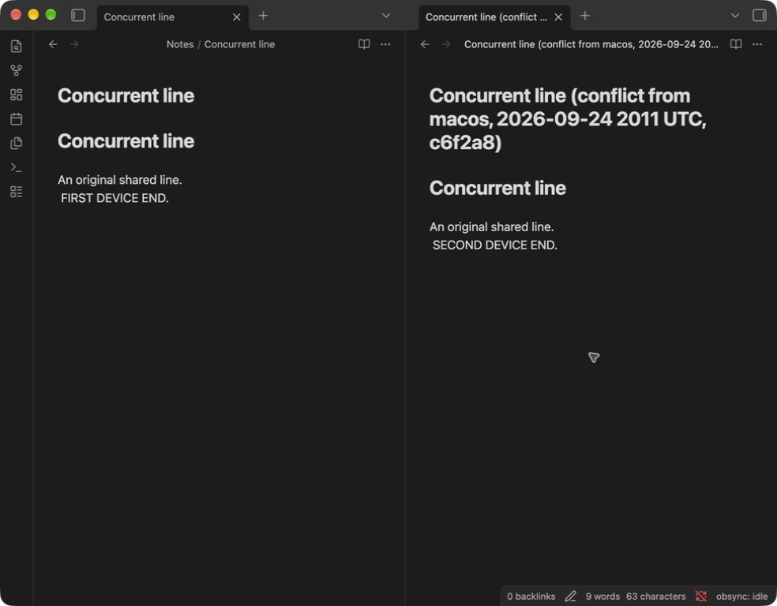

# Conflicts

*For people using obsync.*

Two devices edited the same file before either of them synced. obsync never
discards an edit to resolve that, so exactly one of two things happens.

Changes in different paragraphs usually appear together in one note. Text
added to the same line can also merge, including continued typing before text
that just arrived from another device. When both devices replace the same
existing text, obsync keeps a second file beside the original so you can
compare them. Your notes remain ordinary files you can open and edit in Obsidian.

While you are typing, incoming changes to that note can wait until you pause.
obsync waits for your text to save and for ten seconds without typing in the
note, then brings in the latest changes automatically. Other notes keep
syncing. You do not need to close the note or press **Sync now**.

## What to do with a conflict copy

1. Open the original and the file with **conflict from** in its name. You can
   use Obsidian's **Open to the right** action to compare them side by side.
2. Copy the text you want to keep into the original, then check the result.
3. Delete the extra copy when you are satisfied. That deletion syncs too;
   [retained history](storage.md) still holds the earlier versions.

This real desktop capture uses a disposable note edited differently on two
devices. The left note holds the first device's sentence; the right copy holds
the second. Both files reached both devices.



## One device deleted the note while another edited it

The edit stays. You get the edited note back, without a new conflict copy or
repeated successful-resolution notices. The deletion stays in history. If an
edit cannot yet be uploaded, it remains on that device with a warning until
it can be sent.

## A text file is merged

obsync combines two versions into one note when all of these are true.
If any one of them is not, you get a conflict copy instead:

- **It is a text file**: `.md`, `.markdown`, `.txt`, `.csv`, `.json`,
  `.yaml` or `.yml`, `.ts`, `.js`, `.css`, `.html`, `.xml`, `.toml`, `.ini`
  or `.log`.
- **Both versions are smaller than 8 MiB.** A larger text file, such as a big
  `.csv` or `.log`, is never combined.
- **Both versions grew from the same earlier version.** Two devices that each
  created a file with the same name have nothing to combine.
- **The versions are not wildly different.** Two versions that differ by
  thousands of lines are kept apart. Ordinary note editing is nowhere near this.
- **The changes fit together.** Edits in different parts of a note combine.
  Text two devices added to the same line can combine too, as long as the
  line's original text is still there on both. When both devices replace or
  delete the same text, that stays a conflict.

The exact rules are in [the architecture](architecture.md#62-plugin-loops),
under Conflicts.

## The same note on two devices is not a conflict

Two devices that start with the same notes -- a vault copied to the second
device by hand, or moved over from another sync tool -- each publish every note
before either has seen the other's. When the two files at one name hold the
same bytes, there is nothing to decide: every device keeps one file and makes
no copy. That holds once every device syncing the vault runs 1.1.2 or later; an
older device still copies identical content, and the copy can simply be
deleted.

Only byte-identical content qualifies. Two notes that differ by one character,
a trailing newline, or their line endings (`\r\n` against `\n`) are two notes
created independently, and you get a conflict copy as described below.

## Everything else becomes a conflict copy

A conflict copy is a new file beside the original, in the same folder:

```text
Notes/Ideas.md  ->  Notes/Ideas (conflict from iPhone, 2026-09-07 1432).md
```

- The name includes the original's name, **conflict from**, the other device,
  and a timestamp. Current shared conflict names use UTC and a short stable
  suffix so devices choose the same copy. Older or locally preserved copies
  can use the earlier local-time format shown above.
- `<device>` is the other device's name, as it appears in the plugin's Devices
  list. Characters a vault or a filesystem rejects are replaced with spaces and
  the name is cut to 40 characters, so a device named from another machine can
  never shape the path.
- A file with no extension keeps none; a dotfile keeps its leading dot.

Nothing is lost: the original keeps one side of the edit and the copy carries
the other. There is no third state and no silent overwrite.

## Avoiding them

- Let a device finish syncing before editing the same note on another one. The
  status bar reads `obsync: idle` when there is nothing in flight. This is the
  only one of these that helps with a large file or a file two devices created
  independently, because neither of those can ever merge.
- Do not run a second sync tool on the same vault. Two writers produce
  conflicts neither tool can reconcile, and obsync can only see its own.
- On a device that has been offline for a long time, open Obsidian and let
  **Sync now** finish before editing.
