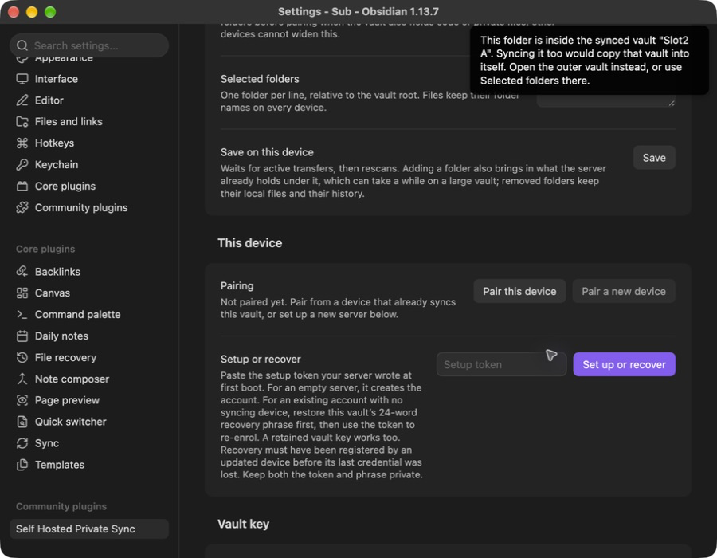
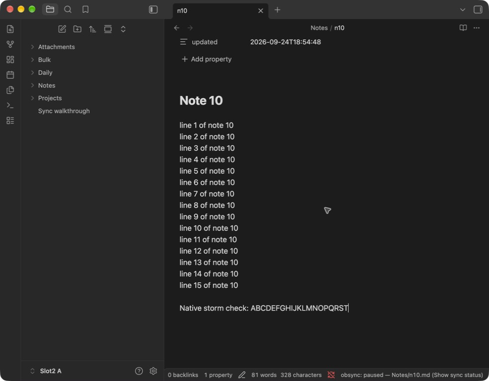

# Daily use

Once two devices are paired, sync runs on its own. This page is the rest of
it: the commands, what the status bar is telling you, what obsync does and
does not touch, how to get an older version of a note back, and the dashboard.

## Commands and the status bar

Every command is under **Self Hosted Private Sync** in the command palette:

| Command | What it does |
| --- | --- |
| Sync now | Checks file contents now, including changes another tool made without changing the file's size or date |
| Show sync status | What the engine is doing, and why it is not doing more |
| Pair a new device | Mints a one-time pairing code on this device |
| Show recovery phrase | Re-displays the 24 words, from this device's own key |
| Restore from history | Browses retained versions and restores one as a copy |
| Show remote-only files | Lists files above this device's ceilings, to fetch on demand |
| Open dashboard | Mints a one-time dashboard sign-in link |
| Open the setup guide | Opens the setup guide in your browser |

The status bar reads `obsync: not paired` before pairing, then `obsync: idle`
(`obsync: idle — syncing no folders` when **Selected folders** is empty),
`obsync: syncing <n>` while `n` files are in flight, `obsync: offline —
retrying` when the server cannot be reached, and `obsync: error — <reason>`
when sync has stopped and needs you.

`obsync: paused — <note>` means a note is being rewritten repeatedly after
sync, often by a plugin that updates a timestamp. The note stays on your
device, and other notes continue syncing. See [Stop repeated rewrites](#stop-repeated-rewrites).

`offline — retrying` clears itself. A device that opens Obsidian away from its
server -- a laptop waking before Wi-Fi, a phone off the home network, a server
restarting -- keeps trying on its own, 5 s apart at first and every 5 minutes
at most, and starts the moment the device reports its network back. Nothing
needs pressing when you return; **Sync now** only makes the next attempt
happen now. `error` is different: it names a refusal the plugin will not retry
by itself, such as a revoked device or a clock too far off, and the reason
says what to do.

## What syncs and what does not

- obsync syncs one person's vault across their own devices. Every device you
  pair has owner access; the current runtime has no recipient role. Giving anyone else
  access to part of a vault is phase 2 work, gated on the acceptance
  criteria in `architecture.md` section 5.
- Hidden folders (`.obsidian`, `.git`) and symlinked folders are not synced
  in either direction.
- A folder opened as its own vault with obsync installed is excluded from
  the outer vault. Pairing that inner vault is refused on desktop: otherwise
  the two vaults could repeatedly copy each other. Use **Selected folders**
  in the outer vault when you want a smaller set of notes on a device.
- A saved folder selection limits obsync's reads, writes and deletions on
  this device. Narrowing keeps excluded local files and server history.
  It does not sandbox Obsidian or other plugins, or revoke a paired device's
  access to content already shared. Keep administration code outside
  selected folders. Adding a folder in this device's settings brings in
  its existing server history too; allow that first download to finish.
  Another device cannot change this device's selection.
- On phones, files above **Largest file to download** (512 MiB by default)
  stay on the server and are listed by **Show remote-only files** for
  on-demand fetch; **Total to keep on this device** defaults to 50 GiB. Both
  are settings. Computers have no ceiling.
- Every edit is kept as a version for 30 days and at least the last 10
  versions per file; conflicts never discard an edit — text merges cleanly or
  you get a conflict copy ([`conflicts.md`](conflicts.md)).
- Update through Settings → Community plugins → Check for updates on each
  device. The plugin never installs code from the sync server. See
  [installation trust and distribution](community-plugin.md).

If you accidentally open a folder inside your synced vault as another vault,
this message explains how to continue. The capture uses disposable test vaults.

## Stop repeated rewrites

If a note keeps bouncing between devices, obsync pauses that note and names
it in the status bar. Your local edits stay in the file. Updated devices share
the pause; an older plugin version cannot honour it, so update every device.

1. Stop or reconfigure the plugin that rewrites the note, on every device
   where it runs. For example, a timestamp plugin should not treat a download
   as a new edit you made.
2. On each device that still shows the pause, open **Show sync status** and
   select **Resume** for the note, or run **Sync now**. A device keeps its
   local hold until you resume it there. Let the devices finish syncing.
3. Check the note on both devices. If a conflict copy remains, compare it with
   the main note before deleting it; [Conflicts](conflicts.md) explains how.

The capture below shows a disposable note paused during a real desktop test.
All twenty typed letters remained in the editor while the timestamp plugin
continued rewriting the file. This is a 1.1.3 candidate capture, not evidence
that the candidate is already available in Community plugins.

**Show sync status** provides the Resume button beside each paused note.
Stop the rewriting plugin before using it.

[The validation record](validation-runs/2026-09-24-rewrite-storm.md) separates
native observations from automated coverage.

## Restore a retained version

Open **Self Hosted Private Sync: Restore from history** in the command palette. Optionally
enter part of a filename, select **Restart search**, then **Load next**.
Versions appear oldest first, including retained content of deleted notes.
Each click checks at most 20 records; an empty filtered page can still have
more history after it. Select **Restore a copy** on a content version to
create a uniquely named sibling inside the currently selected folder.
Deletion markers themselves contain no file bytes.

The original file, unsynced edits and original history remain unchanged.
The notice first confirms a local copy and requests ordinary sync; check
sync status for upload failures. Device size/budget limits apply to the
additional copy. Desktop streams into a temporary file and publishes only
to an unoccupied name; a filesystem without that primitive is refused.
Mobile buffers the verified file and uses Obsidian's create-only API.

Cancel prevents later work, but Obsidian cannot abort a network request or
local create already dispatched. A late create may finish; check any copy
path named in an error before retrying. The network API buffers responses
before a size check is possible. Reopening history does not start another
manual request until the outstanding one settles. These are platform
limits, not a claim of power-loss or real-device validation.

## See your devices

On any paired computer, run **Open dashboard**: it mints a one-time sign-in
link to the dashboard, where you see every device (type, address, country,
last sign-in, last edit), storage per volume, scrub and garbage-collection
state, and installation guidance. Revoke a lost device there or
from the **Devices** list in the plugin settings.
