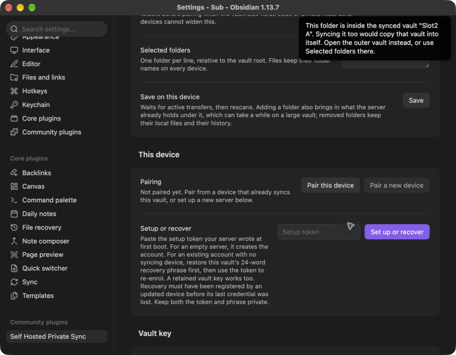
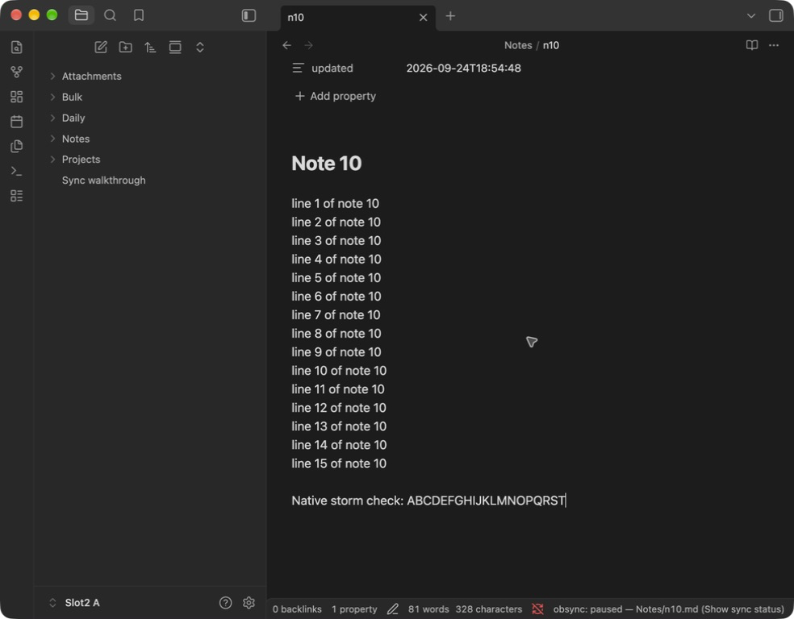
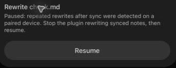
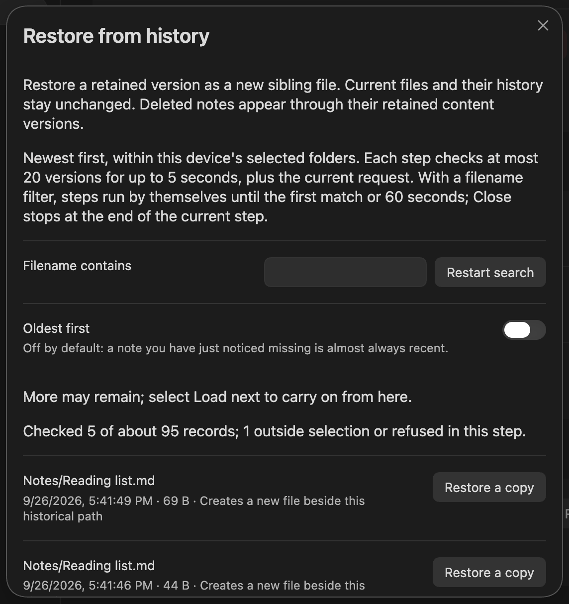

# Daily use

*For people using obsync.*

Once two devices are paired, sync runs on its own. This page is the rest of
it: the commands, what the status bar is telling you, what obsync does and
does not touch, how to get an older version of a note back, and the dashboard.

## Commands and the status bar

Every command is under **Self Hosted Private Sync** in the command palette,
and each name ends in `(obsync)`, so typing `obsync` there lists them all:

| Command | What it does |
| --- | --- |
| Sync now | Sends and fetches everything waiting now. A computer also checks the contents of files up to 8 MiB; a phone asks its storage for each file's size and date and reads only the files that differ |
| Verify all files | Checks every file's contents, however large. Slower; use it if you think another tool changed a file without changing its size or date |
| Show sync status | What the engine is doing, and why it is not doing more |
| Pair a new device | Mints a one-time pairing code on this device |
| Pair this device | Opens the dialog that takes a pairing code from a device that already syncs; on a device that syncs already, it only says so |
| Show recovery phrase | Re-displays the 24 words, from this device's own key |
| Restore from history | Browses retained versions and restores one as a copy |
| Show remote-only files | Lists files above this device's ceilings, to fetch on demand |
| Open dashboard | Mints a one-time dashboard sign-in link |
| Open the setup guide | Opens the setup guide in your browser |

The status bar shows one icon, always the same width: a check when this
device is up to date, a turning wheel while it syncs (it stands still under
Reduce Motion), a cloud struck through while the server does not answer, an
alert in your theme's error colour when sync has stopped and needs you, and a
pause sign for a paused note. A faint cloud means the device is not paired yet,
or syncs no folders. A save that syncs within half a second leaves the check
where it is, so the bar does not flicker while you type.

Hover the icon for its words: `obsync: not paired` before pairing, then
`obsync: idle` (`obsync: idle — syncing no folders` when **Selected folders**
is empty), `obsync: syncing <n>` while `n` files are in flight, `obsync:
offline — retrying` when the server cannot be reached, and `obsync: error —
<reason>` when sync has stopped and needs you. Click it for **Show sync
status**, which says the same in full, stays current while it is open, and
offers the one thing to do next: **Retry now**, **Pair again** or **Open
settings**. **Sync now** always answers with a notice: what it sent, that
nothing needed sending, or why it could not.

On a phone or tablet, where Obsidian hides the status bar, the same icon sits
in the header of the note in front; tap it for **Show sync status**. A refusal
that needs you there -- this device removed from the account, a clock that is
off, a full server -- is also said once in a notice.

An incoming update may also stay pending while you type in its note. After
your text saves and you pause typing for ten seconds, obsync retries it
automatically. Other notes keep syncing; **Show sync status** explains the
wait.

`obsync: paused — <note>` means a note is being rewritten repeatedly after
sync, often by a plugin that updates a timestamp. The note stays on your
device, and other notes continue syncing. See [Stop repeated rewrites](#stop-repeated-rewrites).

`offline — retrying` clears itself. A device that opens Obsidian away from its
server -- a laptop waking before Wi-Fi, a phone off the home network, a server
restarting -- keeps trying on its own, 5 s apart at first and every 5 minutes
at most, and starts the moment the device reports its network back. Nothing
needs pressing when you return; **Sync now** only makes the next attempt
happen now. `error` is different: it names a refusal the plugin will not retry
by itself, such as a revoked device or a clock too far off, and the reason
says what to do.

## What syncs and what does not

- obsync syncs one person's vault across their own devices. Every device you
  pair has full access to the vault. Sharing part of a vault with someone
  else is not supported ([what that would take](architecture.md#5-sharing-phase-2)).
- Hidden folders (`.obsidian`, `.git`) and symlinked folders are not synced
  in either direction.
- A folder opened as its own vault with obsync installed is excluded from
  the outer vault. Pairing that inner vault is refused on desktop: otherwise
  the two vaults could repeatedly copy each other. Use **Selected folders**
  in the outer vault when you want a smaller set of notes on a device.
- A saved folder selection limits obsync's reads, writes and deletions on
  this device. Narrowing keeps excluded local files and server history.
  It does not sandbox Obsidian or other plugins, or revoke a paired device's
  access to content already shared. Keep administration code outside
  selected folders. Adding a folder in this device's settings brings in
  its existing server history too; allow that first download to finish.
  Another device cannot change this device's selection.
- On phones, files above **Largest file to download** (512 MiB by default)
  stay on the server and are listed by **Show remote-only files** for
  on-demand fetch; **Total to keep on this device** defaults to 50 GiB. Both
  are settings. Computers have no ceiling.
- Every edit is kept as a version for 30 days and at least the last 10
  versions per file; conflicts never discard an edit — text merges cleanly or
  you get a conflict copy ([`conflicts.md`](conflicts.md)).
- Update through Settings → Community plugins → Check for updates on each
  device. The plugin never installs code from the sync server. See
  [installation trust and distribution](community-plugin.md).

If you accidentally open a folder inside your synced vault as another vault,
this message explains how to continue. The capture uses disposable test vaults.

## Stop repeated rewrites

If a note keeps bouncing between devices, obsync pauses that note and names
it in the status bar. Your local edits stay in the file. Updated devices share
the pause; an older plugin version cannot honour it, so update every device.

1. Stop or reconfigure the plugin that rewrites the note, on every device
   where it runs. For example, a timestamp plugin should not treat a download
   as a new edit you made.
2. On each device that still shows the pause, open **Show sync status** and
   select **Resume** for the note, or run **Sync now**. A device keeps its
   local hold until you resume it there. Let the devices finish syncing.
3. Check the note on both devices. If a conflict copy remains, compare it with
   the main note before deleting it; [Conflicts](conflicts.md) explains how.

The capture below shows a disposable note paused during a real desktop test.
All twenty typed letters remained in the editor while the timestamp plugin
continued rewriting the file. This is a 1.1.3 candidate capture, not evidence
that the candidate is already available in Community plugins.

**Show sync status** provides the Resume button beside each paused note.
Stop the rewriting plugin before using it.

On a phone, open **Show sync status** from the command palette. The same
explanation and **Resume** control appear below the status details:

[The validation record](validation-runs/2026-09-24-rewrite-storm.md) separates
native observations from automated coverage.

## Restore a retained version

1. Open **Self Hosted Private Sync: Restore from history** in the command
   palette.
2. Optionally type part of a file name and select **Restart search**, then
   **Load next**. Versions appear newest first, including notes that have
   since been deleted; turn on **Oldest first** to start from the other end.
   Each **Load next** checks at most 100 entries, so an empty page can still
   have more history after it: select **Load next** again.
3. Select **Restore a copy** beside the version you want. obsync creates a
   copy with a new, unique name beside the original, inside the folders this
   device syncs. A deletion entry has no content to restore; a deleted
   note's saved versions are listed before its deletion entry.

   

   A restored copy works on any drive, a USB stick or memory card included,
   and never replaces a file that is already there.

Nothing else changes: the original note, your unsynced edits and the history
all stay as they were, and the copy syncs like any new note. The notice
confirms the local copy; **Show sync status** shows whether it has uploaded.
This device's size limits apply to the copy too.

If you cancel while a copy is already being written, that copy may still
appear. If an error names a path, check that path before you try again. How
restoring works inside, per platform, is in
[the architecture](architecture.md#622-native-retained-history-recovery).

## See your devices

On any paired computer, run **Open dashboard**: it mints a one-time sign-in
link to the dashboard, where you see every device (type, address, country,
last sign-in, last edit), storage per volume, scrub and garbage-collection
state, and installation guidance. Revoke a lost device there or
from the **Devices** list in the plugin settings.
