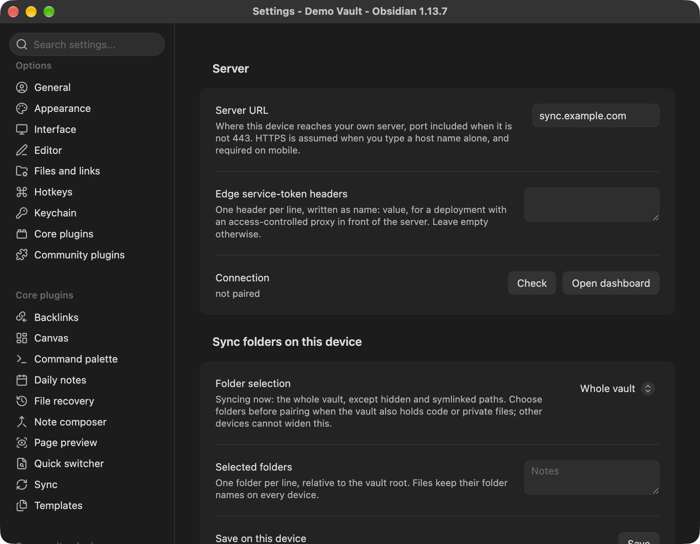
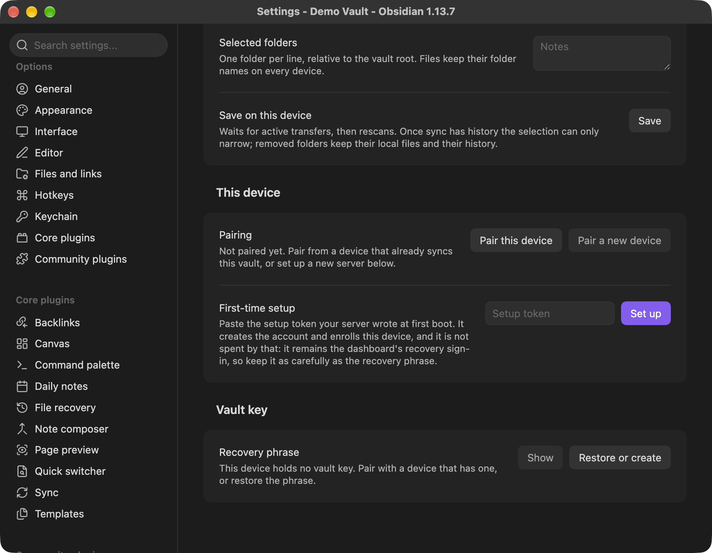
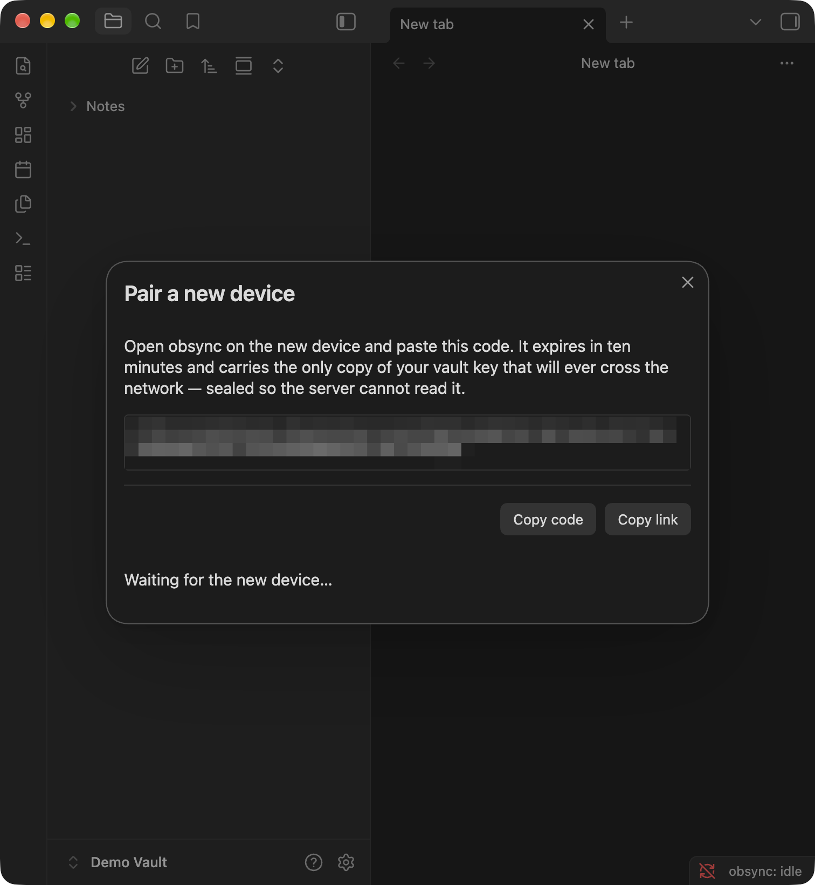
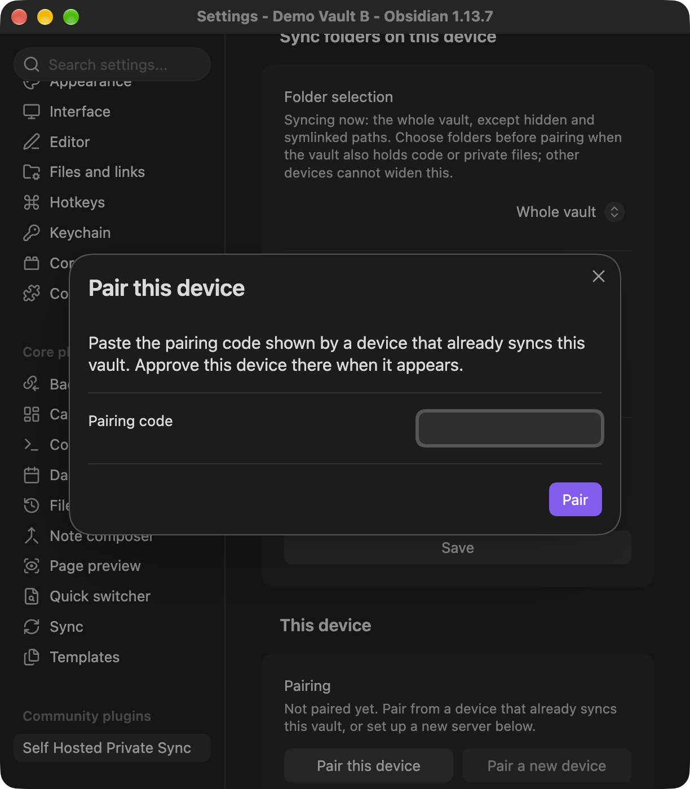
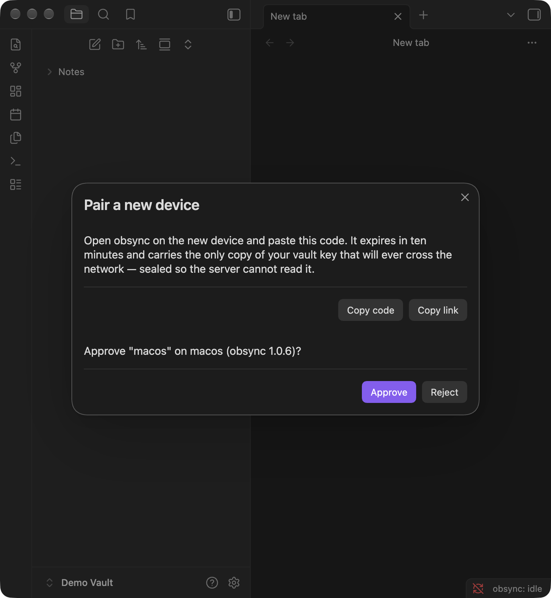
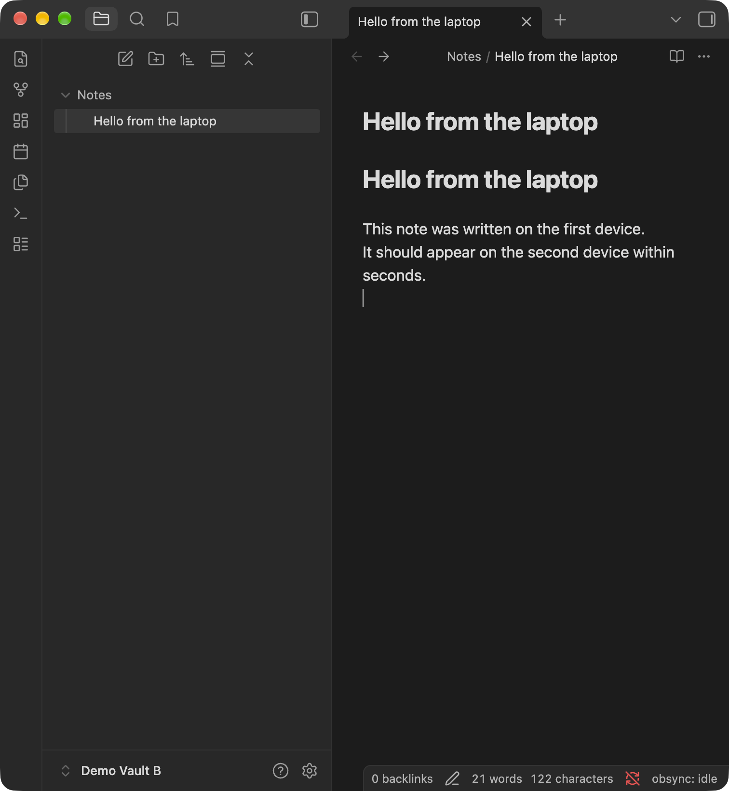
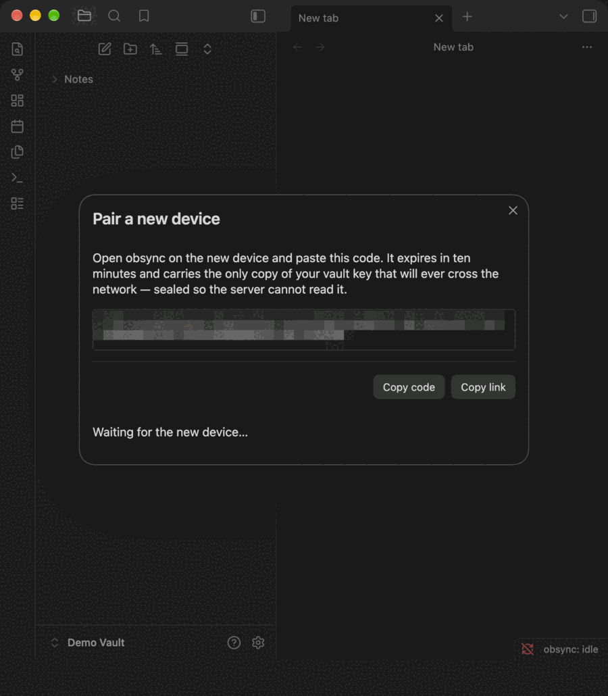

> Diese Übersetzung folgt dem [englischen Original](../../README.md). Der englische Text ist maßgeblich; Befehle, Flags, URLs und Platzhalter bleiben unverändert.

# Self Hosted Private Sync

Selbst gehostete, Ende-zu-Ende-verschlüsselte Live-Synchronisation für
[Obsidian](https://obsidian.md): ein abhängigkeitsfreier Rust-Server mit
eingebautem Dashboard, den du selbst betreibst, plus dieses Plugin. Dateien
jeder Größe, jede Obsidian-Plattform, kein Abo, kein Dritter.

Installiere es unter Einstellungen → Externe Erweiterungen → Durchsuchen als
**Self Hosted Private Sync** (Plugin-ID `obsync-private-sync`), ab Obsidian
1.13.0.

> [!IMPORTANT]
> Dieses Plugin synchronisiert mit einem Server, den **du** betreibst. Es gibt
> keinen gehosteten Dienst und kein Konto bei irgendwem außer dir selbst: Ohne
> deinen eigenen `obsyncd`, erreichbar über HTTPS, hat das Plugin nichts, womit
> es synchronisieren könnte.

> [!IMPORTANT]
> Sichere deinen Vault vor der ersten Synchronisation, und bewahre die
> 24-Wörter-Wiederherstellungsphrase woanders auf als auf dem Gerät, das sie
> erzeugt hat. Der Server speichert nur Chiffretext und kann einen Vault nicht
> für dich wiederherstellen.

> [!IMPORTANT]
> Betreibe dieses Plugin nicht neben einer anderen Sync-Lösung auf demselben
> Vault — Obsidian Sync, einem Cloud-Ordner mit Dateisynchronisation oder einem
> anderen Sync-Plugin. Zwei Schreiber auf einem Vault erzeugen Konflikte, die
> keiner von beiden auflösen kann.

## Bevor du dich darauf verlässt

Das ist junge Software, die die einzige Kopie deiner Notizen synchronisiert.

- **[`CHANGELOG.md`](../../CHANGELOG.md) ist die gepflegte Liste dessen, was
  bekannt ist.** Lies den Eintrag zu deiner Version und die Einträge darüber.
  Release-Seiten behalten die Notizen, mit denen sie veröffentlicht wurden;
  spätere Erkenntnisse kommen hier hinzu.
- **Aktualisiere jedes Gerät, das einen Vault synchronisiert.** Ein einziges
  Gerät auf einer älteren Version kann noch nach dem alten Verhalten handeln
  und die anderen beeinflussen.
- **Was auf Hardware tatsächlich geprüft wurde**, steht pro Lauf in
  [`docs/validation-runs/`](../validation-runs/), einschließlich dessen, was
  ein Lauf nicht abgedeckt hat. Eine Plattform, die kein Lauf nennt, ist nicht
  nachgewiesen.
- **Ein Strom von „merged concurrent edits“-Hinweisen** auf zwei Geräten, die
  eine Notiz bearbeiten: Beende Obsidian auf einem davon, damit das andere
  seine Arbeit abschließen kann, aktualisiere beide, dann mach weiter.

## Worauf dieses Plugin zugreift

Kurz und vollständig, damit du vor der Installation entscheiden kannst.

- **Ein einziges Netzwerkziel: dein eigener Server.** Jede Anfrage geht an die
  **Server URL**, die du in den Einstellungen des Plugins einträgst, und an
  nichts sonst. Es gibt keine Telemetrie, keine Analyse, keinen Absturzmelder,
  keine Werbung und keinen Drittanbieterdienst irgendwo auf dem Sync-Pfad. Das
  Plugin lädt auch nie Code von diesem Server herunter oder führt ihn aus.
- **Ein Konto auf diesem Server, das du selbst anlegst.** Das erste Gerät
  benutzt das Setup-Token, das dein Server beim ersten Start geschrieben hat;
  jedes weitere Gerät wird von einem Gerät aus gekoppelt, das bereits
  synchronisiert. Dein Obsidian-Konto spielt keine Rolle.
- **Obsidian und GitHub, nur für Installation und Updates.** Obsidian selbst
  lädt `main.js`, `manifest.json` und `styles.css` aus den GitHub-Releases
  dieses Repositories. Jedes Release trägt außerdem ein Plugin-ZIP und ein
  Release-Manifest für Leute, die den Server betreiben; Obsidian ignoriert
  beide.
- **Deine Edge, nur wenn du eine konfiguriert hast.** Header, die du unter
  **Edge service-token headers** einfügst, reisen mit jeder Anfrage an die
  obige Server URL mit, weil der Proxy, der sie braucht, auf dem Weg zu deinem
  Server liegt.
- **Die Dateiliste deines Vaults.** Das Plugin listet jede Datei im Vault, um
  zu entscheiden, was im Umfang ist, liest die Dateien in deiner Ordnerauswahl
  und schreibt, was andere Geräte geändert haben. Versteckte Ordner
  (`.obsidian`, `.git`) und symbolisch verlinkte Ordner werden übersprungen.
- **Die Zwischenablage, nur geschrieben, nie gelesen.** Nur die Schaltflächen
  **Copy code** und **Copy link** in **Pair a new device** schreiben hinein.
  Nichts im Plugin liest die Zwischenablage.
- **Dein Browser, wenn du das Dashboard anforderst.** **Open dashboard** öffnet
  einen Anmeldelink in deinem Browser, und nur, wenn dieser Link auf dem
  Ursprung deines eigenen Servers liegt.
- **Obsidians geschützter Speicher.** Der Vault-Schlüssel, das Gerätegeheimnis
  und etwaige Edge-Header-Werte liegen dort, nie in einfachen Plugin-Daten.

Was der Server sehen kann und was nicht, steht in
[`SECURITY.md`](../../SECURITY.md) und
[`docs/threat-model.md`](../threat-model.md).

## In fünf Schritten synchron

Der Pfad, auf dem dieses Release geprüft wurde, vom leeren Vault bis zu zwei
synchronen Geräten. Alle fünf setzen voraus, dass dein eigener Server bereits
läuft, was der Abschnitt darunter ist; jeder Schritt ist im Schnellstart voll
ausgeschrieben.

1. **Aus den externen Erweiterungen installieren.** Suche unter Einstellungen
   → Externe Erweiterungen → Durchsuchen nach **Self Hosted Private Sync**,
   wähle Installieren und dann Aktivieren — so, wie jedes andere
   Obsidian-Plugin ankommt, auf jeder Plattform.

   

2. **Auf deinen Server zeigen und einrichten.** Öffne den Einstellungsreiter
   des Plugins, setze **Server URL** auf deinen eigenen Server, wähle, welche
   Ordner dieses Gerät synchronisiert, und füge dann dein Setup-Token unter
   **First-time setup** ein.

   

3. **Die Wiederherstellungsphrase aufbewahren.** Die Einrichtung erzeugt den
   Vault-Schlüssel auf diesem Gerät und zeigt einmal eine Phrase aus 24
   Wörtern: Schreib sie auf und bewahre sie woanders auf als auf diesem Gerät,
   denn der Server hält nur Chiffretext und kann einen Vault nicht für dich
   wiederherstellen.

   

4. **Ein zweites Gerät mit einem Einmalcode koppeln.** Führe auf dem ersten
   Gerät **Pair a new device** aus, gib den angezeigten Code innerhalb von
   zehn Minuten auf dem zweiten ein und genehmige das Gerät mit seinem Namen —
   der Vault-Schlüssel reist verschlüsselt unter einem Kopplungsgeheimnis, das
   der Server nie sieht.

   

5. **Auf einem der Geräte tippen und zusehen, wie es ankommt.** Tippe auf
   einem Gerät in eine Notiz, und sie erscheint innerhalb von Sekunden auf dem
   anderen, in beide Richtungen, während die Statusleiste zeigt, was die
   Synchronisation tut.

   

Die Geräteliste des Dashboards und ihre Widerrufen-Schaltfläche sind unter
[Deine Geräte sehen](../daily-use.md#see-your-devices) beschrieben und wurden
im Gerätelauf zu 1.0.0, festgehalten in
[docs/validation-runs/2026-09-14.md](../validation-runs/2026-09-14.md), nicht
geprüft.

## Loslegen

Der kürzeste korrekte Weg: Eine Maschine, die dir gehört, betreibt den Server,
jedes Gerät erreicht ihn über HTTPS, und jedes Gerät wird einmal gekoppelt. Die
Anmeldung bei Obsidian autorisiert hier nichts; das einzige Konto ist das auf
deinem Server.

### 1. Den Server starten

Zwei Wege, ihn zu starten. Beide führen genau die Bytes aus, die der Publisher
signiert hat: Prüfe die Signatur, lies den Digest aus der geprüften Ausgabe und
führe genau diesen Digest aus. `v1.0.6` ist das Release, für das diese Seite
geschrieben wurde; nimm das Tag des Releases, das du installierst.

```sh
cosign verify ghcr.io/snaraj/obsync:v1.0.6 \
  --certificate-identity https://github.com/snaraj/obsync/.github/workflows/release-publisher.yml@refs/heads/main \
  --certificate-oidc-issuer https://token.actions.githubusercontent.com
```

**Noch kein HTTPS?** `deploy/compose` startet den Server hinter seinem eigenen
TLS-Terminator (Caddy), in jedem Netz, ohne Domain und ohne Konto bei irgendwem.
Aus einem Checkout dieses Repositories:

```sh
OBSYNC_IMAGE=ghcr.io/snaraj/obsync@sha256:<digest> \
  OBSYNC_HOST=sync.example.org \
  OBSYNC_BIND_ADDRESS=192.168.1.10 \
  docker compose -f deploy/compose/docker-compose.yml up -d
```

`OBSYNC_HOST` ist der Name, den deine Geräte eintippen werden. Er muss nur in
deinem eigenen Netz auflösbar sein. `OBSYNC_BIND_ADDRESS` ist die Adresse
dieses Hosts, auf der die Ports 80 und 443 veröffentlicht werden: Eine
Bind-Adresse begrenzt die Zielschnittstelle, nicht die Quelle, also
entscheidet deine Firewall, wer ihn erreicht. Compose startet erst, wenn du
gewählt hast. Beides ist in [Server betreiben](../server.md) erklärt.

**Schon HTTPS davor**, durch einen Reverse-Proxy oder einen Tunnel, dem du
vertraust? Starte den nackten Server. Er spricht auf Port 8080 einfaches HTTP,
und dein Terminator leitet an ihn weiter:

```sh
docker volume create obsync-blobs
docker volume create obsync-journal
docker run -d --name obsync -p 127.0.0.1:8080:8080 \
  -v obsync-blobs:/data/blobs -v obsync-journal:/data/journal \
  -e OBSYNC_BLOBS_CAPACITY=250GiB -e OBSYNC_JOURNAL_CAPACITY=4GiB \
  -e OBSYNC_PUBLIC_URL=https://sync.example.org \
  ghcr.io/snaraj/obsync@sha256:<the digest cosign just verified>
```

### 2. Das Setup-Token lesen

Beim ersten Start prägt der Server ein Setup-Token und schreibt es auf sein
Journal-Volume, Modus 0600, nie protokolliert. Das Token legt dein Konto einmal
an und bleibt danach für die Lebensdauer des Servers die
Wiederherstellungsanmeldung des Dashboards: Behandle es mit derselben Sorgfalt
wie die Wiederherstellungsphrase. Lies es direkt aus dem Container, ohne
Hilfs-Image. Auf dem Compose-Pfad:

```sh
docker cp obsync-obsync-1:/data/journal/v1/setup-token - | tar -xO
```

Auf dem Pfad mit nacktem Server:

```sh
docker cp obsync:/data/journal/v1/setup-token - | tar -xO
```

### 3. Dem Zertifikat vertrauen, einmal pro Gerät (Compose-Pfad)

Caddy hat das Zertifikat von einer Zertifizierungsstelle ausgestellt, die es
beim ersten Start erzeugt hat, also muss jedem Gerät einmal gesagt werden, dass
es dieser Stelle vertraut. Exportiere das Wurzelzertifikat:

```sh
docker cp obsync-caddy-1:/data/caddy/pki/authorities/local/root.crt - | tar -xO > obsync-root.crt
```

Installiere `obsync-root.crt` auf jedem Gerät. Die Schritte für macOS,
Windows, Linux, iOS und Android stehen unter
[Der Zertifizierungsstelle vertrauen, einmal pro Gerät](../server.md#trust-the-certificate-authority-once-per-device).
Unter iOS ist das Vertrauen ein zweiter Schalter nach der Installation.

### 4. Das erste Gerät einrichten

1. Einstellungen → Externe Erweiterungen → Durchsuchen → **Self Hosted Private
   Sync** → Installieren → Aktivieren.
2. Setze in den Einstellungen des Plugins **Server URL** auf deinen Server,
   mit Port, wenn es nicht 443 ist: `https://sync.example.org`.

   

3. Wähle jetzt **Whole vault** oder **Selected folders only**. Sobald ein
   Gerät synchronisiert hat, kann seine Auswahl nur noch enger werden.
4. Füge das Setup-Token unter **First-time setup** ein und wähle **Set up**.
   Schreib die 24-Wörter-Wiederherstellungsphrase auf und bewahre sie nicht
   auf diesem Gerät auf.

   

### 5. Das zweite Gerät koppeln

1. Installiere und aktiviere dort das Plugin, setze dieselbe **Server URL**
   und wähle seine Ordner.
2. Führe auf dem ersten Gerät **Pair a new device** aus. Es zeigt einen Code,
   der zehn Minuten gültig ist.

   

3. Öffne auf dem zweiten Gerät **Pair this device**, füge den Code ein und
   wähle **Pair**.

   

4. Genehmige auf dem ersten Gerät das neue Gerät mit seinem Namen. Bearbeite
   auf einem der beiden eine Notiz; sie erscheint innerhalb von Sekunden auf
   dem anderen.

   

   

Der ganze Kopplungsablauf in einer kurzen Schleife:



Bildschirmfotos vom Telefon sind noch nicht in diesem Repository; sie werden
auf den Geräten des Maintainers aufgenommen und hinzugefügt, sobald ein
Validierungslauf sie festhält.

Jeder Schritt in voller Länge, mit dem, was jeder Bildschirm verlangt und
warum: [Schnellstart](../quickstart.md).

**Nur auf einem Computer ausprobieren?** Auf einem Computer akzeptiert das
Plugin auch eine einfache `http://`-Adresse, sodass `http://127.0.0.1:8080`
den nackten Server oben ohne Terminator erreicht. Telefone nicht: Obsidian auf
iOS und Android verweigert einfaches HTTP.

## Fortgeschritten: Cloudflare

Die Referenzinstallation hat **keinen öffentlichen Hostnamen**. Ein Cloudflare
Tunnel verbindet das private Netz des Servers mit Cloudflare, eine private
Route sagt Cloudflare, welche Adressen hinter diesem Tunnel liegen, und der
Cloudflare One Client auf jedem Gerät trägt die Server URL dorthin. Nichts ist
aus dem Internet erreichbar, und große Erstsynchronisationen laufen nicht über
einen öffentlichen Hostnamen. Die andere Variante, ein öffentlicher Hostname
hinter Cloudflare Access mit einem Service-Token in **Edge service-token
headers** und `OBSYNC_EDGE=cloudflare` auf dem Server, wird ebenfalls
unterstützt. Beide, Schritt für Schritt: [Cloudflare](cloudflare.md).

## Andere Wege zu deinem Server

Eine Zeile pro Weg, keine Anleitung. Was auch immer du wählst: Das Plugin
braucht HTTPS mit einem Zertifikat, dem jedes Gerät vertraut, und der Server
selbst bleibt hinter diesem Terminator bei einfachem HTTP.

- **Nur LAN.** Der Compose-Pfad oben, nur zu Hause erreichbar. Am einfachsten;
  keine Synchronisation unterwegs.
- **WireGuard.** Dein eigenes VPN zurück in dein Netz. Am schnellsten und ganz
  deins; du trägst auf jedem Gerät eine Peer-Konfiguration und hältst einen
  Endpunkt erreichbar.
- **Tailscale.** Ein verwaltetes WireGuard-Mesh mit eigenen Namen. Am
  wenigsten Einrichtung auf den Geräten; ein Dritter koordiniert das Mesh,
  und seine Tariflimits musst du selbst lesen.
- **Ein Reverse-Proxy mit automatischem TLS**, etwa Caddy auf einem
  öffentlichen Namen. Ein öffentlich vertrautes Zertifikat und eine dauerhafte
  Adresse; der Server ist dann aus dem Internet erreichbar, und der Proxy und
  seine Updates liegen in deiner Verantwortung.
- **Cloudflare Tunnel.** Siehe oben. Kein eingehender Port; ein Anbieter auf
  dem Pfad mit eigenen Bedingungen.

Was ein Gerät unterwegs braucht, egal, was du wählst (die Route, den Namen,
das Zertifikat, die iOS-Abfrage für das lokale Netz, die Firewall):
[Von außerhalb deines LANs erreichen](../server.md#reaching-it-from-outside-your-lan).

## Fehlersuche

| Symptom | Wahrscheinliche Ursache | Erster Versuch |
| --- | --- | --- |
| `obsync: offline` | Das Gerät erreicht die Server URL nicht | Öffne die URL in einem Browser auf demselben Gerät; prüfe Port, HTTPS und die Route |
| Ein Telefon verbindet sich nicht, während ein Computer synchronisiert | Dem privaten Zertifikat wird auf dem Telefon nicht vertraut | Installiere das Wurzelzertifikat; schalte es unter iOS zusätzlich unter „Zertifikatsvertrauenseinstellungen“ ein |
| `401 stale_timestamp` | Eine Uhr geht um mehr als 300 Sekunden falsch | Schalte die automatische Zeit ein, auf dem Gerät oder dem Server |
| `403 device_pending` | Niemand hat das Gerät bisher genehmigt | Genehmige es mit seinem Namen auf dem Gerät, von dem aus du gekoppelt hast |
| Eine Datei kommt nie an | Sie liegt außerhalb der Ordnerauswahl oder über der Größenobergrenze eines Telefons | Prüfe **Sync folders on this device**; führe auf dem Telefon **Show remote-only files** aus |

Jedes andere Symptom, jeder Fehlercode und wie man einen brauchbaren Bericht
sammelt: [Fehlersuche](../troubleshooting.md).

## Dokumentation

| Seite | Was sie beantwortet |
| --- | --- |
| [Schnellstart](../quickstart.md) | Das erste Gerät und das zweite, jeder Schritt in voller Länge |
| [Server betreiben](../server.md) | Docker, Compose mit Caddy, Zertifikate, Backups, Erreichbarkeit von außerhalb deines LANs |
| [Cloudflare](cloudflare.md) | Tunnel mit privater Route und dem Cloudflare One Client, oder ein öffentlicher Hostname hinter Access |
| [Kubernetes](../../chart/README.md) | Den Server mit dem signierten Helm-Chart installieren |
| [Täglicher Gebrauch](../daily-use.md) | Befehle, die Statusleiste, was synchronisiert wird und was nicht, eine Version wiederherstellen, das Dashboard |
| [Einstellungen](../settings.md) | Jede Einstellung, ihr Standardwert und wann man sie ändert |
| [Fehlersuche](../troubleshooting.md) | Symptom, Ursache, Abhilfe und wie man einen Bericht sammelt |
| [Konflikte](../conflicts.md) | Was eine Konfliktkopie ist und was man damit tut |
| [Wiederherstellung](../recovery.md) | Ein verlorenes Gerät, ein verlorener Server, ein umgezogener Server, ein rotiertes Token |
| [Installieren und aktualisieren](../community-plugin.md) | Obsidians Verzeichnis, Updates, Verwahrung der Zugangsdaten, die Listing-Prüfung |
| [Bedrohungsmodell](../threat-model.md) | Was verteidigt wird und was nicht |
| [Das Bedrohungsmodell des Dashboards](../security/dashboard.md) | Sitzungen, Anmeldung, Widerruf, Restrisiken |
| [Architektur](../architecture.md) | Wie das ganze System gebaut ist, und jede Umgebungsvariable |
| [Protokoll](../protocol.md) | Der Drahtvertrag zwischen Plugin und Server |
| [Speicher](../storage.md) | Volumes, Dauerhaftigkeit, Aufbewahrung, Scrub und jede Verweigerung |
| [Validierung](../validation.md) | Der Geräte-Validierungsplan und was „bereit“ bedeutet |
| [Releases](../release.md) | Wie ein Release geschnitten, signiert und geprüft wird |
| [Übersetzungen](../translations.md) | In welchen Sprachen die Anleitungen vorliegen und wie sie aktuell gehalten werden |
| [`CHANGELOG.md`](../../CHANGELOG.md) | Was sich in jeder Version geändert hat |
| [`SECURITY.md`](../../SECURITY.md) | Haltung, unterstützte Versionen und wie man eine Schwachstelle meldet |
| [`CONTRIBUTING.md`](../../CONTRIBUTING.md) | Wie man an diesem Repository arbeitet |

## Fragen, Fehler und Sicherheit

- **Eine Frage, oder etwas, bei dem du nicht sicher bist, ob es ein Fehler
  ist:** [Discussions](https://github.com/snaraj/obsync/discussions).
- **Ein Fehler:** [Eröffne ein Issue](https://github.com/snaraj/obsync/issues/new/choose)
  mit der Fehlerbericht-Vorlage und dem Bericht, der in der
  [Fehlersuche](../troubleshooting.md) beschrieben ist. Ohne Token, ohne
  Wiederherstellungsphrase und ohne eine Adresse, die du nicht
  veröffentlichen würdest.
- **Eine vermutete Schwachstelle:** vertraulich, über
  [`SECURITY.md`](../../SECURITY.md) — nie als öffentliches Issue.

## Lizenz

MIT. Siehe [`LICENSE`](../../LICENSE).
