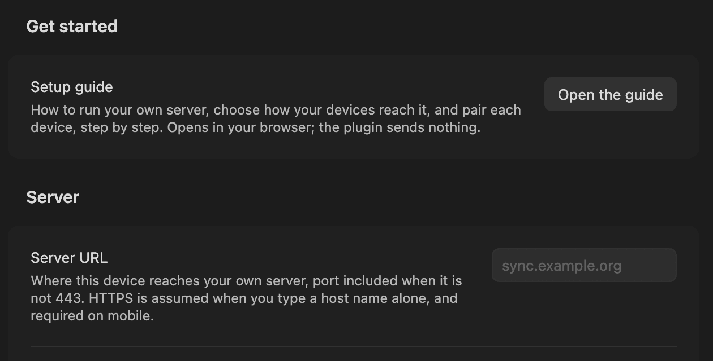

> این ترجمه از [متن اصلی انگلیسی](../../README.md) پیروی می‌کند. متن انگلیسی مرجع است؛ فرمان‌ها، گزینه‌ها، نشانی‌های URL و جانگهدارها بدون تغییر به انگلیسی می‌مانند.


# Self Hosted Private Sync

همگام‌سازی زندهٔ خودمیزبان و سرتاسر رمزگذاری‌شده برای [Obsidian](https://obsidian.md). یادداشت‌هایتان از راه سروری همگام می‌شوند که خودتان اجرا می‌کنید. یادداشت‌ها، پیوست‌ها و نام فایل‌ها روی دستگاه شما رمزگذاری می‌شوند و سرور هرگز کلید را دریافت نمی‌کند. افزونه روی هر پلتفرمی که Obsidian روی آن اجرا می‌شود کار می‌کند، هم رایانهٔ رومیزی و هم تلفن همراه. نه اشتراکی در کار است و نه حسابی جای دیگر.

**چیزی کار نمی‌کند؟ ← [رفع اشکال](https://snaraj.github.io/obsync/troubleshooting/)**

## آنچه لازم دارید را پیدا کنید

همهٔ صفحه‌ها روی [وب‌سایت مستندات](https://snaraj.github.io/obsync/) هم هستند. صفحه‌هایی که به آن‌ها پیوند داده شده به انگلیسی‌اند.

### استفاده از obsync

| می‌خواهم… | بروید به |
| --- | --- |
| انتخاب کنم دستگاه‌هایم چگونه به سرورم برسند | [راه‌اندازی خود را انتخاب کنید](../setup.md) |
| همه‌چیز را روی شبکهٔ خانگی‌ام راه بیندازم، با تک‌تک صفحه‌های تلفن | [همان شبکه، گام به گام](../same-network.md) |
| افزونه را نصب کنم | [نصب افزونه](../community-plugin.md) |
| نخستین دستگاهم را راه بیندازم | [شروع سریع](../quickstart.md) |
| یک تلفن یا رایانهٔ دیگر را جفت کنم | [تلفنتان را جفت کنید](../quickstart.md#pair-your-phone) |
| بدانم نماد وضعیت و فرمان‌ها چه معنایی دارند | [استفادهٔ روزمره](../daily-use.md) و [خواندن نوار وضعیت](../troubleshooting.md#reading-the-status-bar) |
| نسخهٔ قدیمی‌تر یک یادداشت را برگردانم | [بازگرداندن نسخهٔ نگه‌داشته‌شده](../daily-use.md#restore-a-retained-version) |
| بدانم یک تنظیم چه کاری می‌کند | [تنظیمات](../settings.md) |
| با یک نسخهٔ تعارض کنار بیایم | [تعارض‌ها](../conflicts.md) |
| مشکلی را رفع کنم | [رفع اشکال](../troubleshooting.md) |
| پس از گم کردن یک دستگاه دوباره وارد شوم | [بازیابی](../recovery.md) |
| خزانه‌ام را به سرور دیگری ببرم | [انتقال این خزانه به سروری دیگر](../recovery.md#moving-this-vault-to-a-different-server) |

### اجرای سرور

| می‌خواهم… | بروید به |
| --- | --- |
| سرورم را با Docker یا Compose اجرا کنم | [اجرای سرور](../server.md) |
| آن را پشت پراکسی خودم بگذارم (Caddy، nginx، Traefik، HAProxy) | [از پیش پایان‌دهندهٔ TLS دارید](../server.md#already-have-a-tls-terminator-docker) |
| آن را بدون کانتینر، زیر systemd اجرا کنم | [فایل اجرایی ایستا](../server.md#without-a-container-the-static-binary) |
| سرورم را روی Kubernetes اجرا کنم | [Kubernetes](../kubernetes.md) و [مرجع چارت](../../chart/README.md) |
| بیرون از خانه به سرورم برسم، از راه VPN یا پراکسی خودم | [رسیدن به آن از بیرون LAN شما](../server.md#reaching-it-from-outside-your-lan) |
| از Cloudflare استفاده کنم (اختیاری) | [Cloudflare](cloudflare.md) |
| روی هر دستگاه به گواهی سرورم اعتماد کنم | [اعتماد به مرجع صدور گواهی](../server.md#trust-the-certificate-authority-once-per-device) |
| بدانم چقدر حافظه و دیسک لازم دارد | [چقدر حافظه لازم دارد](../server.md#how-much-memory-it-needs) و [ذخیره‌سازی](../storage.md) |
| از سرورم پشتیبان بگیرم | [پشتیبان‌گیری از دو حجم](../server.md#back-up-the-two-volumes) |
| سرورم را به‌روز کنم | [به‌روزرسانی با چکیده](../server.md#upgrade-by-digest) |
| دستگاه‌هایم را ببینم و یکی را باطل کنم | [داشبورد](../dashboard.md) |
| سرورم را پاک کنم و از نو شروع کنم | [پاک‌سازی کامل سرور](../purge.md) |
| ببینم در هر نسخه چه چیزی تغییر کرده است | [`CHANGELOG.md`](../../CHANGELOG.md) |

### اعتماد و حریم خصوصی

| می‌خواهم… | بروید به |
| --- | --- |
| بدانم این افزونه روی دستگاه و شبکه‌ام به چه چیزهایی دسترسی دارد | [این افزونه به چه چیزهایی دسترسی دارد](#این-افزونه-به-چه-چیزهایی-دسترسی-دارد) |
| بفهمم چه چیزی رمزگذاری می‌شود و سرور چه می‌تواند ببیند | [مدل تهدید](../threat-model.md) و [مدل تهدید داشبورد](../security/dashboard.md) |
| یک مشکل امنیتی را گزارش کنم | [`SECURITY.md`](../../SECURITY.md) |

### درون پروژه

برای مشارکت‌کنندگان و بازبینان: [`CONTRIBUTING.md`](../../CONTRIBUTING.md)، [معماری](../architecture.md)، [پروتکل](../protocol.md)، [سنجه‌های کارایی](../benchmarks.md)، [اجراهای اعتبارسنجی روی دستگاه‌ها](../validation-runs/) و [همهٔ صفحه‌ها](../README.md).

## نصب



افزونه را از **تنظیمات ← افزونه‌های شخص‌ثالث ← مرور** نصب کنید. **Self Hosted Private Sync** را جست‌وجو کنید (شناسهٔ افزونه `obsync-private-sync`). به Obsidian نسخهٔ 1.13.0 یا جدیدتر نیاز دارد. تنظیماتش با راهنمای راه‌اندازی باز می‌شود، تنها با یک کلیک.

> [!IMPORTANT]
> - با سروری همگام می‌شود که **خودتان** آن را اجرا می‌کنید: هیچ سرویس میزبانی‌شده‌ای، هیچ حسابی جای دیگر.
> - نخست از خزانه‌تان پشتیبان بگیرید؛ عبارت بازیابی ۲۴ کلمه‌ای را بیرون از دستگاهی که آن را ساخته است نگه دارید.
> - هرگز آن را کنار همگام‌سازی دیگری (Obsidian Sync، یک پوشهٔ ابری، افزونه‌ای دیگر) روی یک خزانه اجرا نکنید.
> - نرم‌افزاری جوان است: مدخل [`CHANGELOG.md`](../../CHANGELOG.md) مربوط به نسخه‌تان را بخوانید، هر دستگاه را به‌روز کنید، و بدانید هر [اجرای اعتبارسنجی](../validation-runs/) چه چیزی را پوشش داده است.

## شروع همگام‌سازی

کوتاه‌ترین مسیر کامل، Compose به‌همراه Caddy روی شبکهٔ خودتان است، از یک نسخهٔ محلی این مخزن. HTTPS روی هر شبکه‌ای به شما می‌دهد، بدون دامنه و بدون حساب در هیچ جا. [همان شبکه، گام به گام](../same-network.md) این مسیر را با تک‌تک صفحه‌ها نشان می‌دهد. در ادامه `vX.Y.Z` را با انتشاری که نصب می‌کنید جایگزین کنید، یعنی تازه‌ترین تگ در [صفحهٔ Releases](https://github.com/snaraj/obsync/releases/latest).

**۱. ایمیج را تأیید کنید.** سپس دقیقاً همان چکیده‌ای را اجرا کنید که فرمان چاپ کرد:

```sh
cosign verify ghcr.io/snaraj/obsync:vX.Y.Z \
  --certificate-identity https://github.com/snaraj/obsync/.github/workflows/release-publisher.yml@refs/heads/main \
  --certificate-oidc-issuer https://token.actions.githubusercontent.com
```

**۲. سرور را راه بیندازید:**

```sh
OBSYNC_IMAGE=ghcr.io/snaraj/obsync@sha256:<digest> \
  OBSYNC_HOST=sync.example.org \
  OBSYNC_BIND_ADDRESS=192.168.1.10 \
  docker compose -f deploy/compose/docker-compose.yml up -d
```

`OBSYNC_HOST` نامی است که دستگاه‌هایتان تایپ خواهند کرد. فقط لازم است روی شبکهٔ خودتان حل شود. `OBSYNC_BIND_ADDRESS` نشانی‌ای است که پورت‌های 80 و 443 روی آن منتشر می‌شوند: مقید کردن به یک نشانی، رابط مقصد را محدود می‌کند، نه مبدأ را، پس این فایروال شماست که تصمیم می‌گیرد چه کسی به آن می‌رسد. Compose تا وقتی انتخاب نکرده باشید راه نمی‌افتد.

**۳. توکن راه‌اندازی را بخوانید.** در نخستین راه‌اندازی، سرور یک توکن راه‌اندازی می‌سازد و آن را روی حجم ژورنالش می‌نویسد، با مجوز 0600، و هرگز در لاگ نمی‌آید. این توکن یک بار حسابتان را می‌سازد و پس از آن ورود بازیابی داشبورد می‌ماند. با همان دقتی نگهش دارید که عبارت بازیابی را:

```sh
docker exec obsync-obsync-1 obsyncd setup-token
```

```sh
docker cp obsync-obsync-1:/data/journal/v1/setup-token - | tar -xO
```

**۴. هر دستگاه را راه بیندازید.** یک بار به گواهی سرور اعتماد کنید ([چگونه](../server.md#trust-the-certificate-authority-once-per-device)). افزونه را نصب کنید، سپس [شروع سریع](../quickstart.md) را دنبال کنید: دستگاه نخست را راه بیندازید، سپس دیگر دستگاه‌ها را جفت کنید.

از پیش HTTPS جلوی آن دارید، از پراکسی یا تونلی که به آن اعتماد دارید؟ به‌جایش [سرور خام](../server.md#already-have-a-tls-terminator-docker) را اجرا کنید.

## این افزونه به چه چیزهایی دسترسی دارد

- **سرور خودتان، و بس.** هر درخواست به همان **Server URL** می‌رود که تایپ می‌کنید؛ هیچ تله‌متری، هیچ شخص ثالثی.
- **یک حساب روی همان سرور**، که از توکن راه‌اندازی ساخته می‌شود؛ حساب Obsidian شما هیچ نقشی ندارد.
- **انتشارهای GitHub، از طریق Obsidian**، برای نصب و به‌روزرسانی؛ Obsidian فایل‌های اضافی انتشار را نادیده می‌گیرد.
- **فهرست فایل‌های خزانه‌تان**، تا تصمیم بگیرد چه چیزی همگام شود؛ پوشه‌های پنهان (`.obsidian`، `.git`) و پوشه‌هایی که پیوند نمادین‌اند نادیده گرفته می‌شوند.
- **کلیپ‌بورد، فقط برای نوشتن**، با **Copy code** و **Copy link** در **Pair a new device**؛ هرگز خوانده نمی‌شود.
- **مرورگرتان، وقتی راهنمای راه‌اندازی را می‌خواهید.** راهنمای پروژه در آن باز می‌شود؛ خودِ افزونه چیزی نمی‌فرستد.

آنچه سرور می‌تواند ببیند و آنچه نمی‌تواند: [`SECURITY.md`](../../SECURITY.md) و [مدل تهدید](../threat-model.md).

## نسخه‌ها

انتشار LATEST تازه‌ترین تگ در [صفحهٔ Releases](https://github.com/snaraj/obsync/releases/latest) است؛ همان چیزی که Obsidian نصب می‌کند و به آن به‌روز می‌شود. `main` همان EDGE است: کارهای ادغام‌شده‌ای که هنوز منتشر نشده‌اند، برای کسانی که از کد منبع می‌سازند. هیچ کانال بتا و هیچ تگ پیش‌انتشاری در کار نیست. بخش «Unreleased» در سیاههٔ تغییرات، محتوای EDGE را ثبت می‌کند.

## پرسش‌ها، باگ‌ها و امنیت

- **یک پرسش، یا چیزی که مطمئن نیستید باگ باشد:** [Discussions](https://github.com/snaraj/obsync/discussions).
- **یک باگ:** [یک issue باز کنید](https://github.com/snaraj/obsync/issues/new/choose) با گزارشی که [رفع اشکال](../troubleshooting.md#how-to-collect-a-report) شرح می‌دهد. هر توکن، عبارت یا نشانی‌ای را که حاضر نیستید منتشر کنید کنار بگذارید.
- **یک آسیب‌پذیری مشکوک:** به‌صورت خصوصی، از طریق [`SECURITY.md`](../../SECURITY.md)، هرگز به‌صورت issue عمومی.

## مجوز

MIT. به [`LICENSE`](../../LICENSE) نگاه کنید.
