# Quickstart

*For people using obsync.*

The first device and the second one, every step in full. It assumes your own
server is already running; if it is not, start with [Run the server](server.md)
and come back here.

Your notes remain ordinary files on your devices. The server stores encrypted
copies; it does not receive the key that opens your notes or their names.
You choose where it runs: a computer at home, a homelab, or another host you
control. You can reach it away from home through your own VPN or HTTPS front
end. Cloudflare is one optional route. [Run the server](server.md) explains
those choices, including who you trust to handle the connection.

Keep a separate backup of your vault and store your recovery phrase somewhere
safe. Sync carries changes between devices, including unwanted changes made
by a compromised device; encryption alone cannot protect that device from
malware or replace a backup. [Recovery](recovery.md) explains what obsync can
restore, and [Obsidian's backup guide](https://obsidian.md/help/backup) explains
how a separate backup protects your local files.

<!-- Capture rule (AGENTS.md, docs/captures/README.md): the five files below
     are committed PNGs from a validated device run, displayed in the declared
     form that scripts/ci/test_capture_contract.py pins. A change to what the
     plugin or the dashboard renders asks the owner for fresh captures. -->

## Get synced in five steps

The installation path, from an empty vault to two devices in sync. Older
captures call the setup row First-time setup; its current name is Setup or
recover. All five assume your own server is already running.

1. **Install from Community plugins.** In Settings → Community plugins →
   Browse, search for **Self Hosted Private Sync** and select Install, then
   Enable — the same way every other Obsidian plugin arrives, on every
   platform.

   

2. **Point it at your server and set it up.** Open the plugin's settings tab,
   set **Server URL** to your own server, choose which folders this device
   syncs, then paste your setup token under **Setup or recover**.

   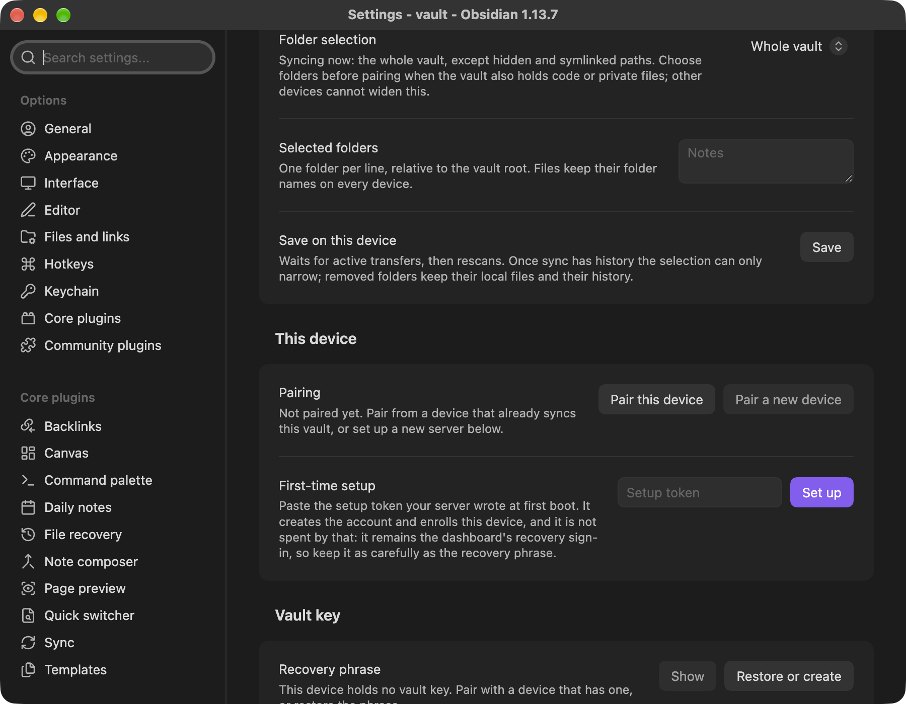

3. **Keep the recovery phrase.** Setup generates the vault key on this device
   and shows a 24-word phrase once: write it down and keep it somewhere other
   than this device, because the server holds ciphertext only and cannot
   recover a vault for you.

   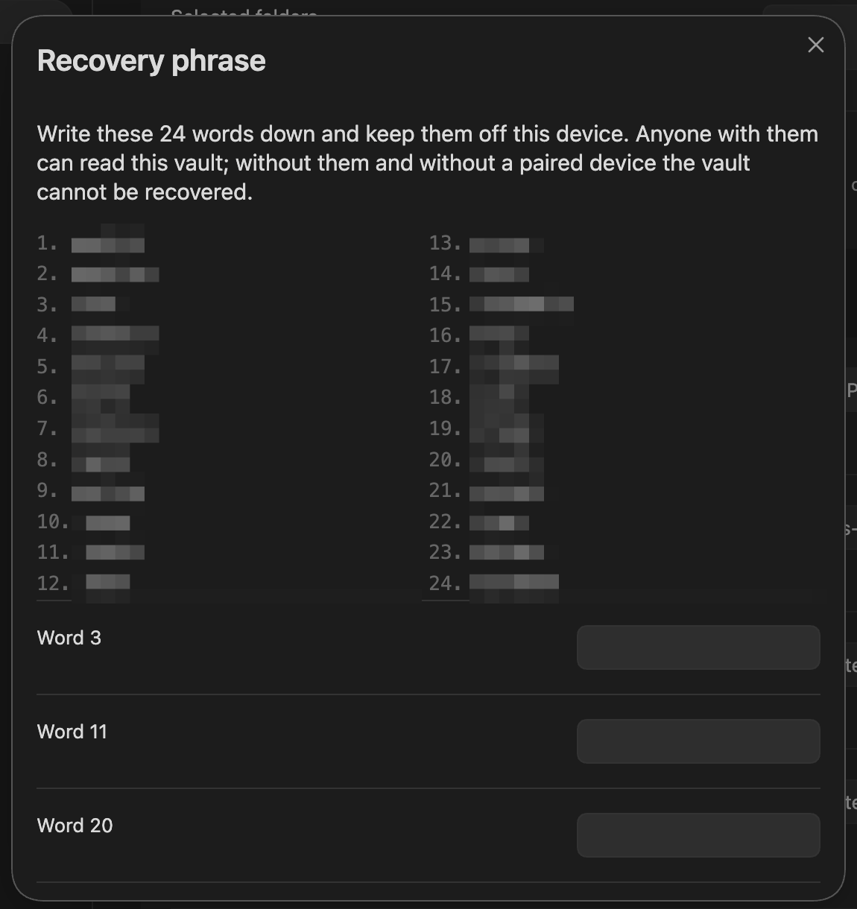

4. **Pair a second device with a one-time code.** Run **Pair a new device** on
   the first device, enter the code it shows on the second within ten minutes,
   and approve the device by name — the vault key travels encrypted under a
   pairing secret the server never sees.

   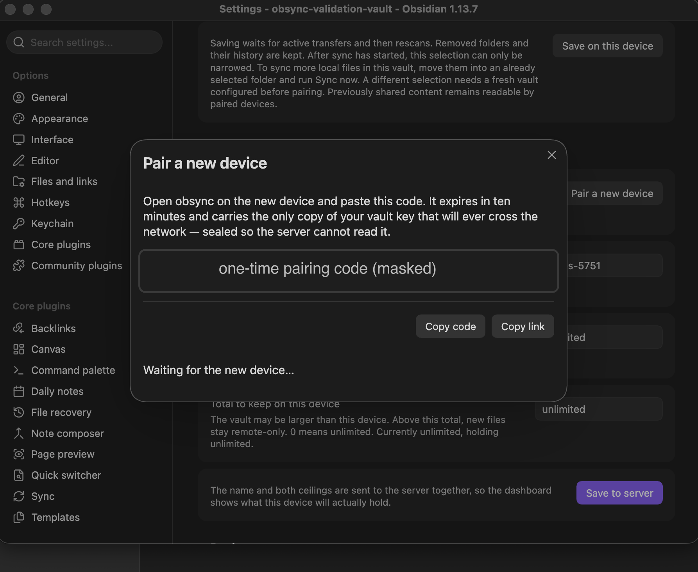

5. **Edit on either device and watch it land.** Type in a note on one device
   and it appears on the other within seconds, in both directions, with the
   status bar showing what sync is doing.

   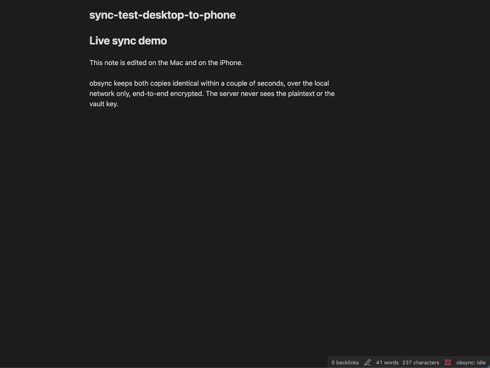

The dashboard's device list and its revoke button are described under
See your devices in the daily-use page and were not exercised in the 1.0.0
device run recorded in the validation runs for 2026-09-14.

Capture provenance: the first four screenshots record the original
installation journey. The fifth shows the two-way edit check on the 1.1.3
candidate. The validation records identify newer recovery screens and the
exact builds tested; the sections below describe the current controls.

## Set up this computer (the first device)

Use Obsidian 1.13.0 or newer on each device. Credentials and vault keys use
Obsidian's native secret storage; unavailable storage stops setup and sync.

1. In your vault, open Settings → Community plugins and allow community
   plugins. Select Browse and search for **Self Hosted Private Sync**.
2. Select **Install**, then **Enable**. No hidden folders or manual file
   copies are part of installation.
3. Open the Self Hosted Private Sync settings tab. Set **Server URL** to the
   URL your devices reach the server at, port included when it is not 443
   (`https://name:8443`). If an access-controlled edge sits in front of the
   server, paste its headers under **Edge service-token headers**, one per
   line as `Name: value`. Trying it on one computer? A desktop also accepts
   plain `http://127.0.0.1:8080` for a server on that same machine; Obsidian
   on iOS and Android refuses plain HTTP.

   

4. Under **Sync folders on this device**, choose **Selected folders only**
   if the vault also contains code or files you do not want shared, and
   enter relative folders such as `Notes`, one per line. **Set up or recover** and
   **Pair this device** apply what you typed; **Save** applies it on its own.
   An empty selected list syncs no files; **Whole vault** is the default.
   To stage a first sync within one vault, keep personal files
   in an excluded folder, test disposable notes inside the selected folder,
   then move the personal files in and run **Sync now**.
   You can add folders later in this device's settings; saving the wider
   selection downloads existing server history for those folders. Removing a
   folder later keeps its files on this device.

   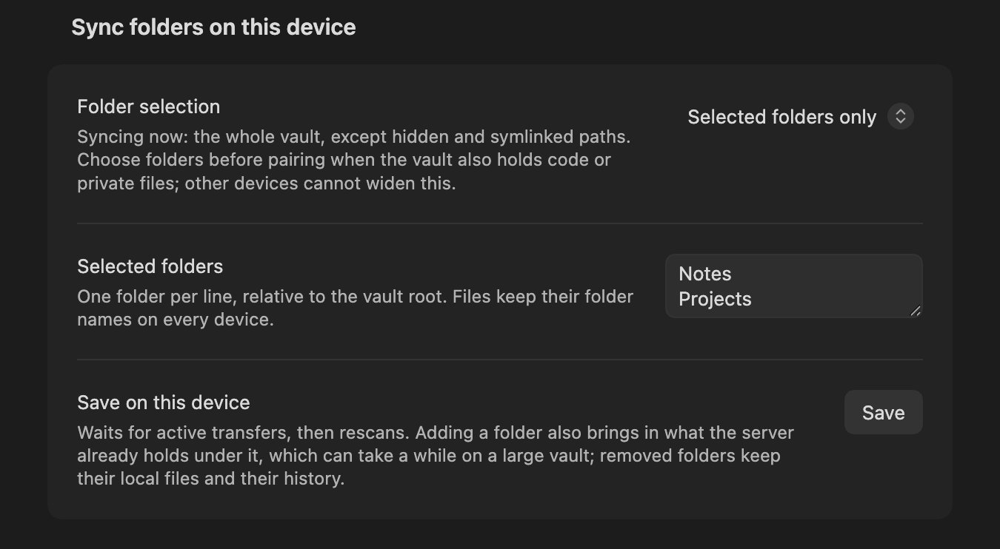

5. Under **Setup or recover**, paste the setup token and select **Set up or recover**.
   The plugin creates the account and this device, and makes the vault key
   on this computer.

   <!-- CAPTURE(1.1.4): the This device section on a new device: Pairing, and the Setup or recover row with its masked Setup token field -->

6. It then shows the **recovery phrase**, 24 words, and asks for three of
   them to check you wrote them down. Write it down and keep it off this
   machine: without any paired device and without this phrase, the vault
   cannot be recovered, by design. The server never sees the key.
   [Recovery](recovery.md) is what the phrase does and does not get you back.
   If you closed the dialog without the check,
   [write the phrase down now](troubleshooting.md#you-closed-the-recovery-phrase-without-checking-it).

   <!-- CAPTURE(1.1.4): the recovery phrase check, with every word hidden and the three answer fields empty -->
7. Sync starts. The status bar shows the state; the command **Sync now**
   forces a pass, and **Show sync status** explains what it is doing.

If a storage error appears instead, keep the vault and the recovery phrase
as they are and follow [Where your keys are kept](community-plugin.md#where-your-keys-are-kept):
do not delete anything and do not repeat server setup.

## Prepare an Android phone

On an iPhone, skip to [Pair your phone](#pair-your-phone). On Android,
Obsidian asks for a few permissions the first time; these are the screens.
They come from an Android 15 emulator running Obsidian 1.13.8. No Android
device has a recorded sync run yet ([Your devices](setup.md#your-devices)).

1. **Create a vault.** Open Obsidian and select **Create a vault**. When it
   offers Obsidian's own sync service, choose **Continue without sync**. Name
   the vault, keep **Device storage**, and select **Create a vault**.

   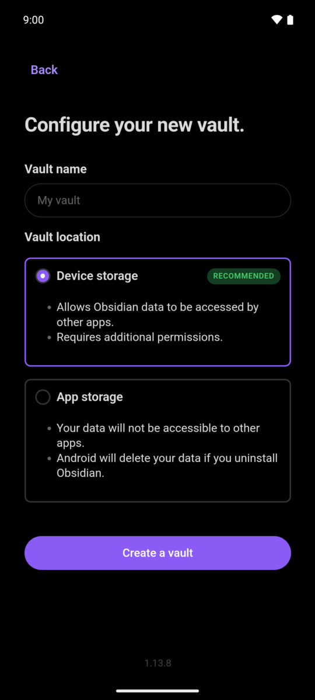

2. **Allow file access.** Select **Allow file access**. Android opens **All
   files access**: turn on **Allow access to manage all files** for Obsidian,
   then go back.

   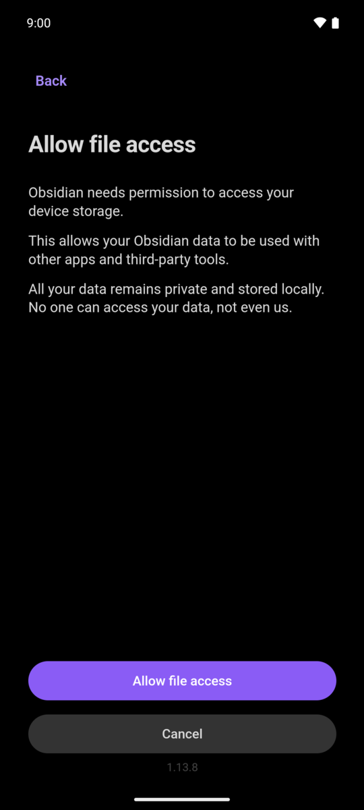

   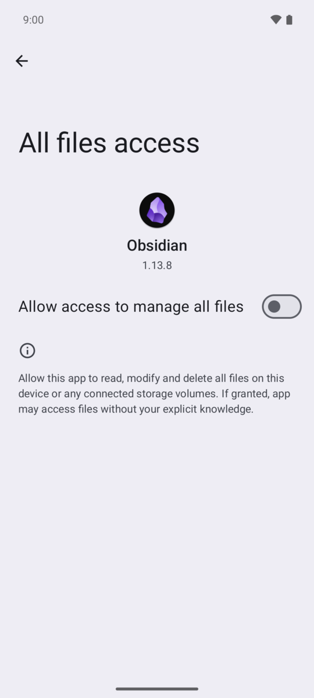

   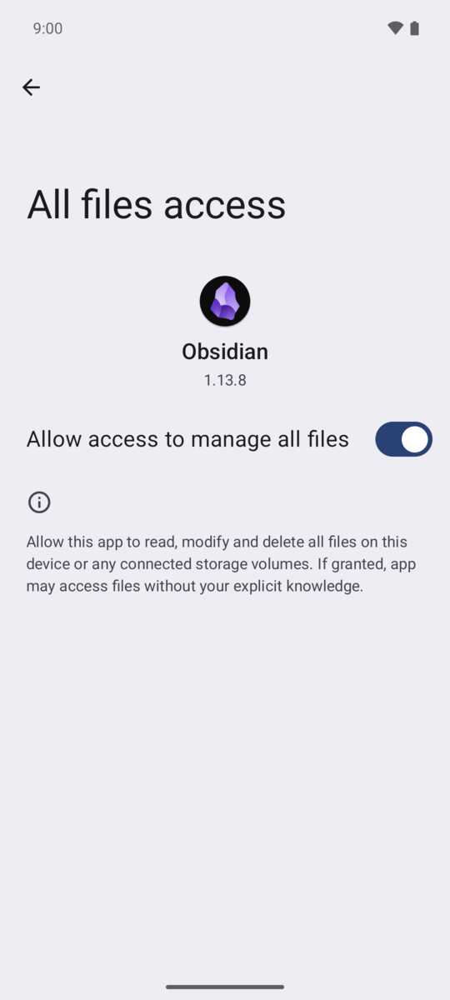

3. **Choose the folder.** When Android shows the **Documents** folder, select
   **Use this folder**, then **Allow**. The storage name is covered in these
   captures.

   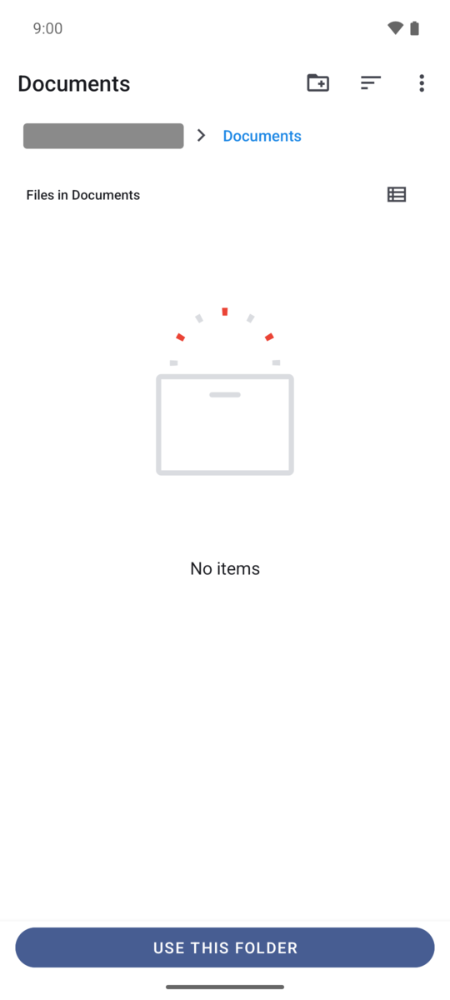

   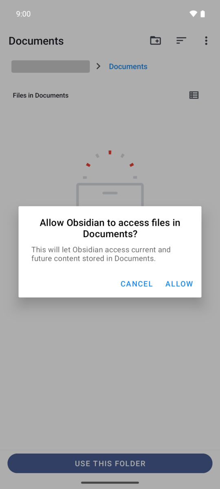

   The new, empty vault opens.

   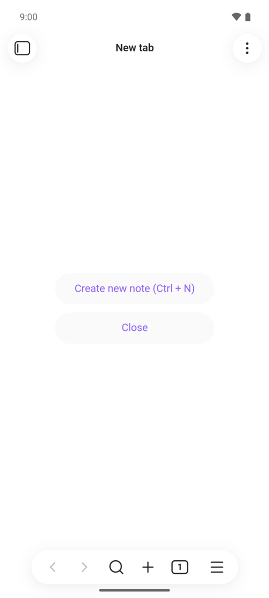

4. **Allow community plugins.** Open **Settings → Community plugins** and
   select **Exit Restricted mode**. Then select **Browse**, search for **Self
   Hosted Private Sync**, and select **Install**, then **Enable**.

   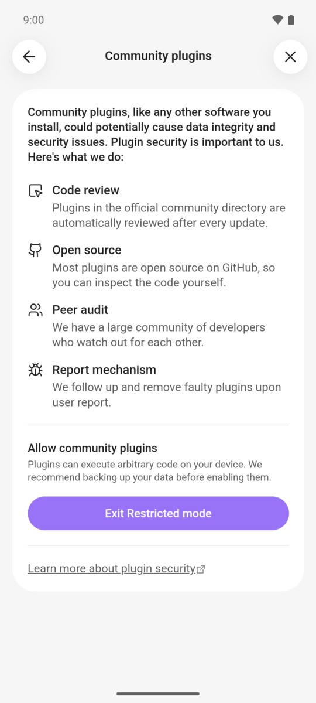

   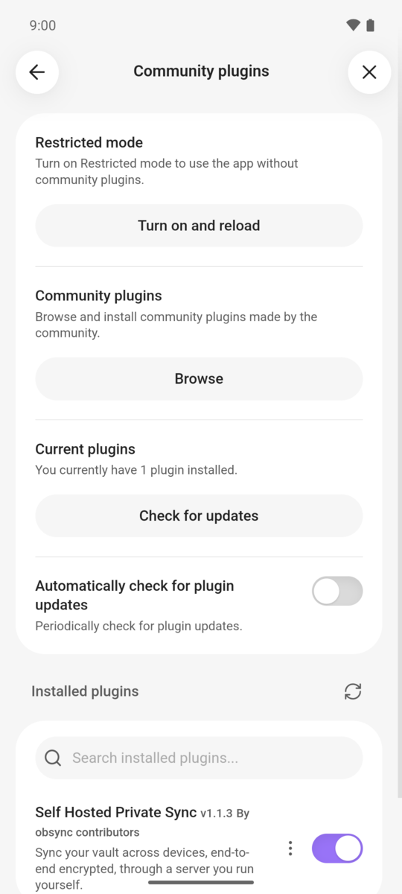

   If Obsidian asks whether you trust the author of this vault, the vault
   already holds plugins. Choose **Trust author and enable plugins** only for
   a vault that is your own.

   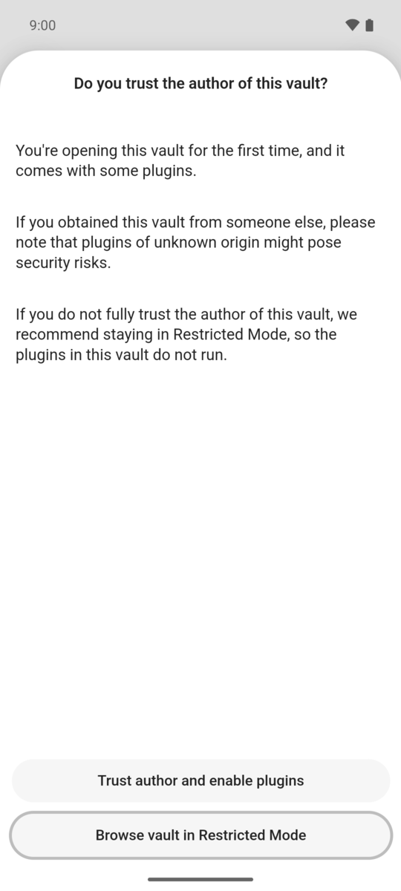

5. **Open the plugin's settings.** In **Settings**, scroll to **Community
   plugins** and select **Self Hosted Private Sync**. Then continue with
   [Pair your phone](#pair-your-phone).

   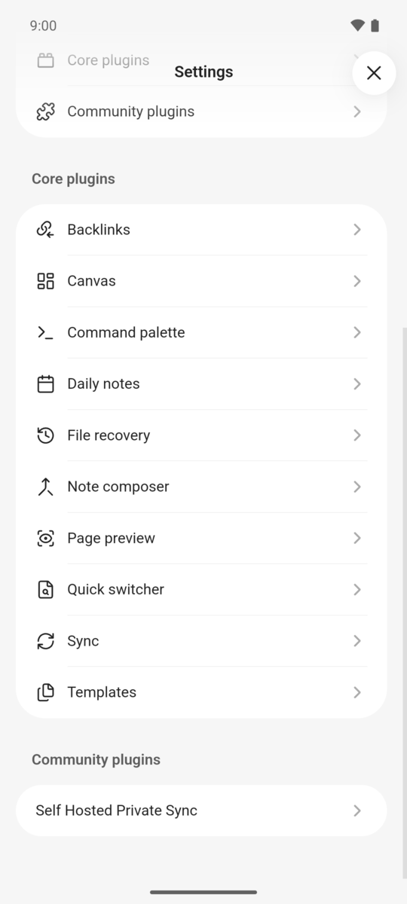

   <!-- CAPTURE(1.1.4): the plugin's settings on Android: Server URL, folders, and pairing -->

Android keeps certificates you install yourself apart from the built-in ones,
and an app may ignore them. If Obsidian on Android will not connect to a
server with its own certificate authority, see
[the certificate entry in Troubleshooting](troubleshooting.md#the-certificate-is-not-trusted-on-this-device).

## Pair your phone

1. In the phone's local vault, install and enable **Self Hosted Private Sync** through Settings →
   Community plugins → Browse. Set the same **Server URL** and connect to
   its private network if needed. The server must provide HTTPS trusted by
   the phone. Choose this phone's folder selection before pairing; **Pair this
   device** applies it, and it is local, not copied by the pairing code.
   Files keep their relative folder names.

   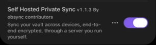

   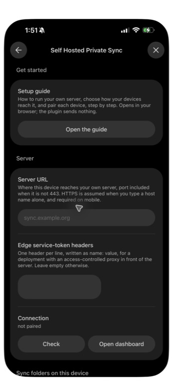

2. On the computer, run the command **Pair a new device** (also a button in
   the settings tab). It shows a one-time pairing code, valid ten minutes, and
   an `obsidian://obsync-private-sync/pair?code=...` link you can send yourself.

   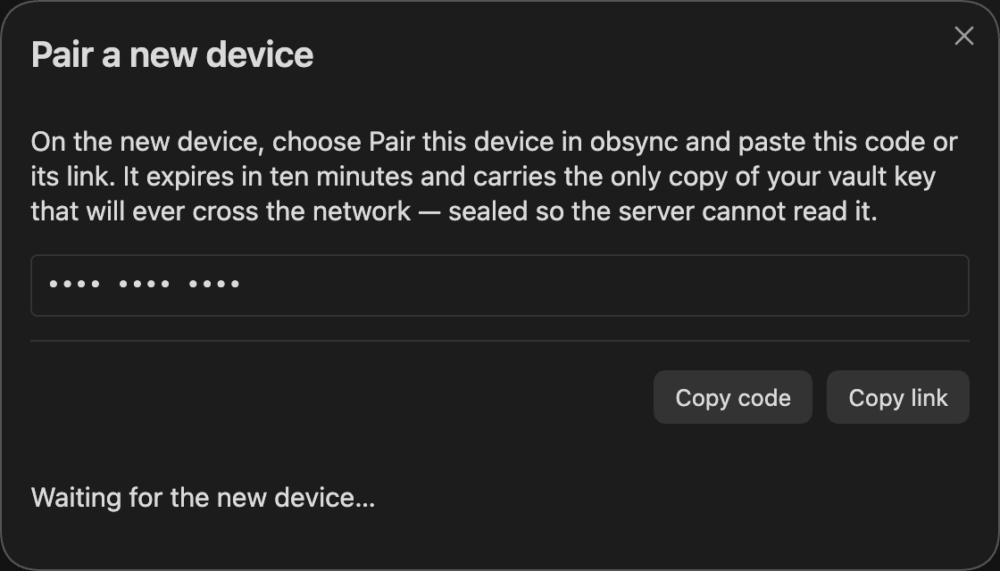

   <!-- CAPTURE(1.1.4): the Pair a new device dialog with its code hidden, as 1.1.4 draws it -->

3. On the phone, open **Pair this device** in the settings tab, paste the code
   under **Pairing code** and tap **Pair** — or open the link, which is the
   same dialog with the code already in it.

   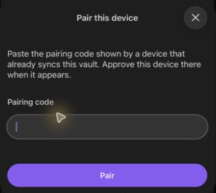

   This is the actual phone dialog, captured before entering a code. For
   certificate setup, follow [Add the phone](same-network.md#add-the-phone).
4. Back on the computer, check the device name, that both screens show the
   same match code, and, on updated devices, the new device's vault name and
   note count before approving. If these are not the vault you intended, or
   the match codes differ, select **Reject**. The phone receives the vault key
   encrypted under a pairing secret that never touches the server; until you
   approve, the phone has no authority of any kind. If the phone's dialog is
   closed or Obsidian restarts while it waits, pairing still finishes once you
   approve within the code's ten minutes; after that, pair again with a new
   code.

   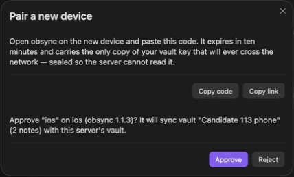

   <!-- CAPTURE(1.1.4): the approval question with the pairing match code, on the computer and on the phone -->

   If the phone holds notes the server does not have, it asks before adding
   them. **Pair and upload** shares those notes with your other paired
   devices. Choose **Cancel** if this is a different vault you want to keep
   separate; it needs its own server. The server address is covered in this
   screenshot.

   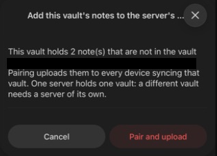

5. Edit a note on the phone. It appears on the computer within seconds, and
   the other way round. That is the whole loop.

   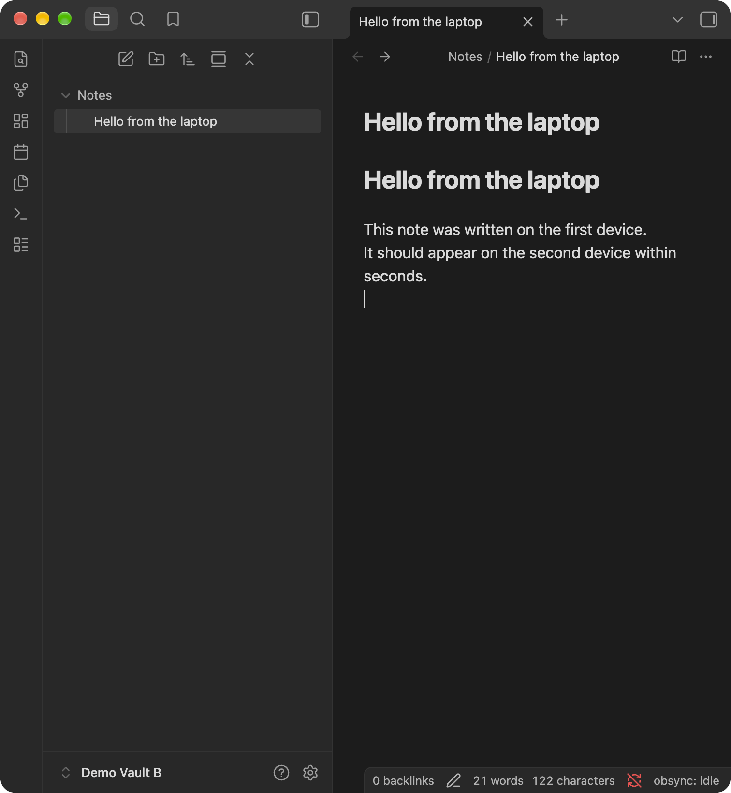

   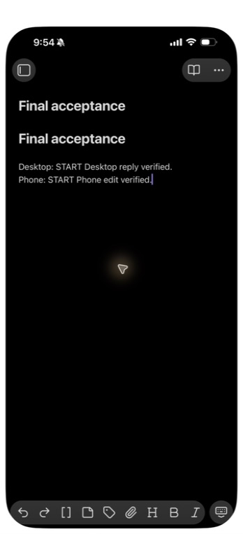

The second vault does not have to be empty. If it already holds the same notes
-- copied over by hand, or kept in step by another sync tool until now -- each
note that is byte-identical on both devices stays one note, with no copy. A note
whose text differs between the two is kept twice, the second as a conflict copy
you review ([Conflicts](conflicts.md)). Turn the other sync tool off before
pairing: two tools syncing one vault undo each other's work.

The whole exchange in one loop, both devices being computers:

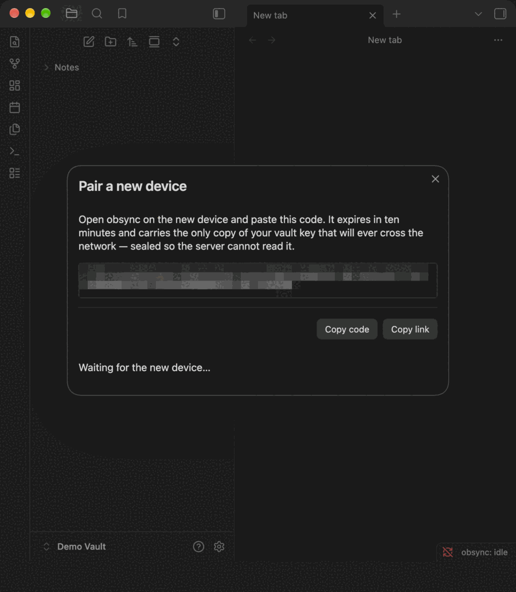

## Next

- [Daily use](daily-use.md): the commands, the status bar, what syncs, the
  dashboard, and how to restore a retained version.
- [Troubleshooting](troubleshooting.md): symptom, cause, fix.
