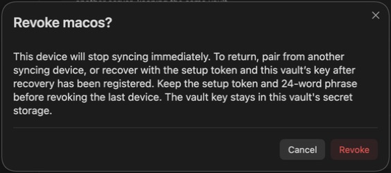
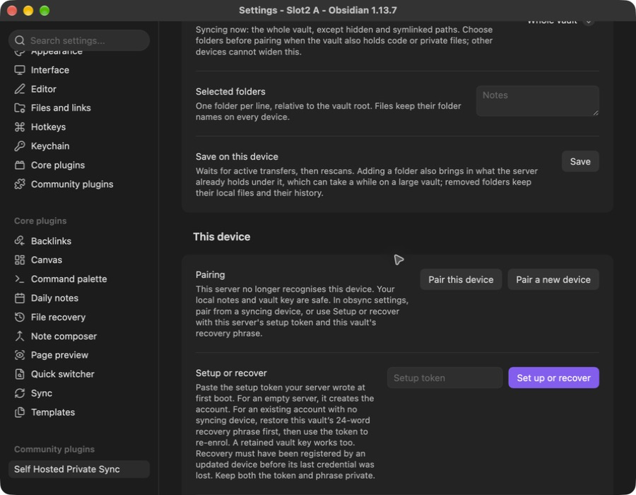
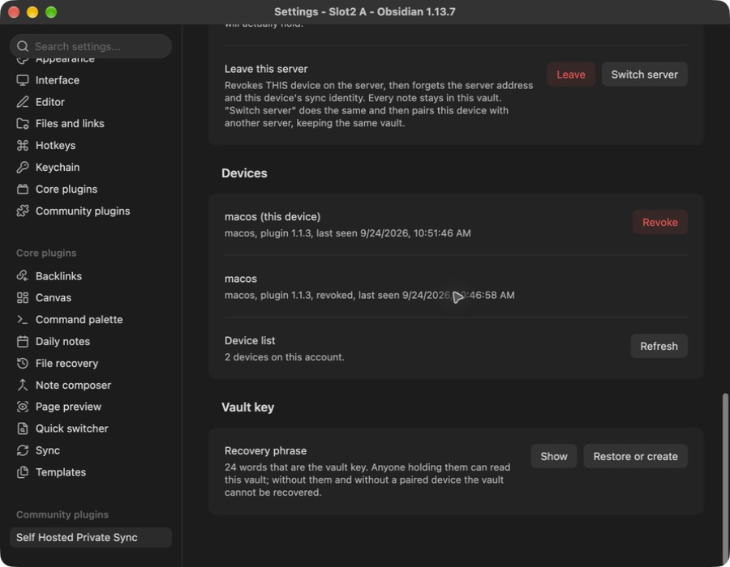
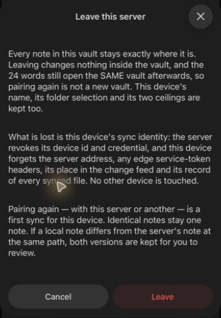
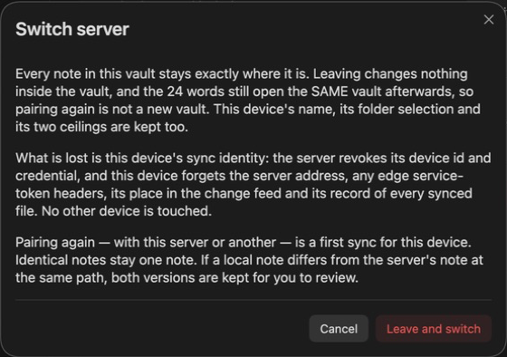

# Recovery

What to do when a device, a credential, or the server is gone. Every path here
is one the shipped code supports; where there is no path, this page says so
rather than implying one.

## The four secrets, and what each one protects

| Secret | Where it lives | What it unlocks | If you lose it |
| --- | --- | --- | --- |
| The **vault key**, written out as the 24-word recovery phrase | on each paired device, in Obsidian's secret storage | your notes: every chunk and every file name | the stored content cannot be read by anyone, you included |
| A **device secret** | on that device, wrapped under the server key on the server | that device's access to the server | pair the device again |
| The **server key** (`OBSYNC_SERVER_KEY`) | the operator's Secret, or the journal volume | the wrapped device secrets | every device must pair again — and see "every device is gone" below |
| The **setup token** | `v1/setup-token` on the journal volume | creating the account, signing in to the dashboard, and re-enrolling with proof of the vault key | mint a new one (below) |

The server holds none of the first one and cannot read a note. That is the
design, and it is also the reason recovery has the shape it does.

## A device is lost or stolen

1. **Revoke it** — the dashboard's Devices list, or **Devices** in the plugin
   settings on another paired device. Revocation destroys that device's
   wrapped secret on the server; it is final, and a revoked device gets
   `403 device_revoked` for every request it tries. It also ends that
   device's hold on the dashboard: any sign-in link it minted stops working,
   and any dashboard session opened from one of its links is closed at the
   same moment.

   **Two things revocation does not do.** It cannot be undone — there is no
   un-revoke route and no CLI that restores a revoked device, so the way
   back is to pair that device again as a new one, which gives it a new
   device id and a new secret. The last active device can be revoked once
   vault recovery is registered: keep the setup token and the 24-word phrase
   before doing so. An older server or account without that registration
   still refuses with `409 last_device`; update server and plugin while a
   credential still works, or pair the replacement first.
2. **Pair the replacement** from a device that still syncs: **Pair a new
   device** there, the code on the new one, approval back on the first. The
   vault key travels inside the pairing envelope, encrypted under a secret the
   server never sees, so the recovery phrase is not needed for this.

The lost device keeps whatever plaintext was already in its vault folder. That
is a device-security problem (disk encryption, remote wipe), not something a
sync server can undo.

The confirmation explains how to return before you revoke the device. This
capture uses a disposable desktop device named by its role:

## A device's plugin data is gone, but other devices still sync

A reinstall, a cleared secret storage, or a vault copied without its
`.obsidian` folder. The device has no credential and no vault key, and the
plugin says `not paired`.

Pair it again from a device that still syncs. If it ends up enrolled but
without a vault key, the **Vault key** dialog offers two buttons, and only one
of them is recovery:

- **Restore**, with the 24 words, adopts the existing vault key: the device
  reads the history that is already on the server.
- **Create a new vault key** starts a NEW vault. Existing devices will not read
  it and the old content stays unreadable to this device. It is the right
  button only when you are deliberately starting over.

## Every device is gone

If you still have the server's setup token and this vault's recovery phrase,
you can get back in without a second working device once recovery has been
registered. You do not need to delete your vault or create a different key.

With server and plugin 1.1.3 or later, use the **setup token and the vault's
24-word recovery phrase** together. The token alone cannot re-enrol a device.

1. Install and enable obsync in the vault, set **Server URL**, and retain any
   access headers your deployment requires.
2. In **Vault key**, choose **Restore** and enter this vault's 24 words. If
   this installation retained its vault key, keep that key.
3. Under **Setup or recover**, enter this server's setup token and select
   **Set up or recover**. A successful recovery creates a new active device
   credential on the existing account. Its history and encrypted files stay
   on the server; previously revoked devices remain revoked.
4. Let the first sync finish. Local notes stay in the vault; ordinary conflict
   handling keeps differing local and remote versions.

**Upgrade boundary:** recovery must be registered before the last credential
is lost. New 1.1.3 setups register it with account creation. An updated paired
plugin registers it after successfully opening the vault on an updated server.
Older accounts that lost every credential before that registration cannot
prove ownership through this route. They still need a working device or a
backup containing one. The error says recovery is unavailable; it does not
claim the phrase can grant access by itself.

The plugin persists its vault key before sending first setup. If the answer
is lost, it does not retry automatically: check the result, then explicitly
use **Set up or recover** again with the retained key and token. A device may
have been enrolled by the lost attempt; revoke that unused entry once access
is restored. Keep an ordinary backup of the vault folder as well as the two
recovery secrets.

## This server no longer recognises this device

A `401 bad_signature` or revoked credential stops sync with an explicit
forgotten-device message, instead of a repeating offline status. Confirm the
server address, then use **Setup or recover**. That action clears the rejected
device ID, feed cursor and sync records while keeping local notes, the vault
key, server address and access headers. It sets up an empty rebuilt server or
re-enters a recoverable existing account. No uninstall is needed. **Pair this
device** can instead obtain a new credential from a device that still syncs.

The updated settings show the action directly when a device is forgotten:

After recovery, the new active device appears beside the old revoked one:

These desktop captures use a disposable vault. The
[native recovery record](validation-runs/2026-09-24-account-recovery.md)
names the tested build and confirms that all 217 local files were unchanged.

## The server is rebuilt from a volume backup

**What the volumes hold.** `obsync-blobs` is every ciphertext chunk.
`obsync-journal` is the journal (the source of truth), the index snapshots, the
setup token, and — only when `OBSYNC_SERVER_KEY` is not supplied — the
generated server key. Treat the journal volume as the sensitive one.

**What a consistent backup needs.** Both volumes from the same moment, with the
server stopped, or a filesystem or volume snapshot that captures them together.
The journal is append-only and replays on start, so a backup taken while the
server was writing recovers to the last complete frame and says which frames
survived. A blobs backup NEWER than its journal is safe; a journal newer than
its blobs is not, because it names chunks the restored blob volume does not
hold.

**What to restore, in order.** The server key first (the Secret, or the file on
the journal volume), then both volumes, then start the server and read
`/readyz`. It answers `{"ready":true,"seq":<n>}` only once the volumes are writable and
the journal has replayed.

**Changes made after the backup.** The restore takes from the server
everything written after the backup: new notes, edits, renames, deletions and
folders. The devices still hold them. Each device on plugin 1.1.3 or later
notices the restore, re-sends what it holds, and shows one notice: "The server
was restored to an earlier state; this device re-sent N changes."

- **When a device notices.** When it starts or reconnects, it asks the server
  for the last change-feed entry it read. A journal that no longer holds that
  entry where it was, or holds entries where the device read none, was
  rebuilt. The repair pass also notices when the server does not hold a
  version the device recorded less than a day ago.
- **What it re-sends.** Each note, rename and folder the server lost, onto
  the versions the server still holds. Each deletion the device made or
  received, from the last 1000 it remembers. Then it reads the rebuilt feed
  from the start, skipping what it had already seen, so what other devices
  wrote on the restored server arrives too.
- **What it never does.** It never replaces a change another device made on
  the restored server: the two are merged, or both are kept, by the ordinary
  conflict rules. It never deletes a note because the server lacks it. A
  version the server pruned by retention is not a lost one, and is not
  re-sent.
- **What it cannot re-send.** A deletion older than the last 1000 the device
  remembers comes back on a device paired after the restore. A change made
  before the device updated to 1.1.3 is re-sent only if the server lost the
  whole note. A device paired after the backup is unknown to the restored
  server (below), so it re-sends nothing until it is paired again.

So after a restore, start every device that was syncing, let each reach
`idle`, and only then pair a new device or reinstall one: the new device gets
what the others re-sent. Each device logs one `restore decision=start` and one
`restore decision=summary` line, with its budget of 1000 reads and 10 minutes.

**Two ways this bites:**

- **A journal older than a pairing.** Devices paired after that backup do not
  exist in the restored index, and every request they make is refused
  `401 bad_signature`. Pair from a device the restore knows, or use the
  forgotten-device recovery action above when recovery was registered in the backup.
- **A lost server key.** Every device secret was wrapped under it, so no device
  can authenticate and no device can open a pairing for a new one. That is the
  "every device is gone" case, arriving from the server's side. Back the key up
  the way you back up a password.

## Reading the setup token

Ask the server: `obsyncd setup-token` prints the token that stands on the
journal volume on standard output, alone and newline terminated, and nothing
else — every diagnostic is on standard error and the token reaches no log
line. It reads the same file a start reads, through the same measured volume
pass, and opens no journal, so it answers from a server that is serving:
`kubectl exec deploy/obsync -- obsyncd setup-token` on Kubernetes,
`docker compose exec obsync obsyncd setup-token` under Compose, neither
needing a shell the image does not have.

It exits non-zero and names the reason when there is nothing to print: no
token stands on these volumes yet (`reason=absent`, the state between the two
steps below), the file is not a token (`reason=corrupt`), or the volume itself
is refused (`reason=unsafe_posture`). Reading the file off the volume — the
node's copy, or a read-only mount of the claim — stays the fallback for a
server that is not running; `chart/README.md` and `README.md` have the exact
commands for each deployment.

## Minting a new setup token

The token is written once, at first boot, and then stands: it is the
dashboard's recovery sign-in for the life of the server. To replace one you
believe is exposed:

1. Stop the server.
2. Delete `v1/setup-token` from the journal volume.
3. Start the server.

It mints a new 64-hex token, writes it mode 0600, and logs
`event=setup_token_ready … state=recovery_login` — never the token itself. The
old token stops working the moment the file is replaced. Existing devices are
unaffected: they authenticate with their own secrets, not with this token.

**How to tell it has been used.** A sign-in with this token logs
`event=dashboard_login decision=recovery_login` at `warn` — never the token,
not even a prefix — and the dashboard's Overview page carries a notice for as
long as that session lasts. A sign-in from a device's link logs
`decision=link_login` at `info` instead. If you see the first and did not do
it, rotate the token with the three steps above and use **Sign out
everywhere** on the dashboard, which closes every session the server holds.

**Who holds it.** Whoever can read the journal volume. Its custody is the
dashboard's custody, and that is why it is worth rotating after a restore
from a backup somebody else handled ([`security/dashboard.md`](security/dashboard.md)).

## Stop syncing this device

Open the plugin's settings, find **Leave this server**, and choose **Leave**.
Read the confirmation before continuing. Your notes and recovery phrase stay
on this device; the server revokes only this device's access. Other devices
keep syncing. Choose **Cancel** to keep this device connected.

Pairing again is a fresh sync. Identical notes remain single notes; if the
same path holds different text, both versions are preserved for you to review.

## Moving this vault to a different server

A different server INSTANCE, not the same one at a new address: a rebuilt
server, a second one you are migrating to, or a laptop's test server you are
done with. The device credential is bound to the server that minted it, so
changing **Server URL** alone yields the forgotten-device message.

The confirmation explains what stays on this device and what it forgets.
Choose **Cancel** to keep using the current server.

1. On the device, **This device** → **Leave this server** → **Switch server**.
   It revokes this device on the old server, forgets the server address, the
   edge headers, the feed cursor and every file record, and then asks for the
   new address. Choose **Pair with existing vault** or **Set up or recover**.
2. Pair against the new server: a code from a device that already syncs this
   vault there, or **Set up or recover** with that server's setup token if the
   new server has no account yet. Either way the VAULT KEY on this device is
   kept, so this is the same vault; a new key would be a new vault
   ([`settings.md`](settings.md)).
3. Switch each device in that order. Once recovery is registered, the last
   device is revoked normally too, so none remains active on the old server.
   An older server or unregistered legacy account still refuses the last
   revoke and explains the upgrade requirement. Leaving locally is explicit;
   it keeps that credential active remotely. A device already revoked simply
   leaves. Keep the old server's setup token and vault phrase if you need to
   return to its history later.

Pairing again is a first sync for this device. Identical notes stay one note.
If the local and server versions differ at the same path, both are kept for
you to compare ([Conflicts](conflicts.md)). Leaving the old server does not
delete your local notes.

## Moving the server to a new address

The address is not part of any key; it is what each device is configured with.

1. Stand the server up at the new address, with a certificate that name's
   devices trust.
2. On each device, set **Server URL** to the new address, port included when it
   is not 443. The stored credential is re-bound to the new address as the
   setting is saved; the device id and its secret do not change.
3. If the deployment names itself to its clients (`OBSYNC_PUBLIC_URL`, or the
   chart's `publicUrl`), update that too, so generated dashboard links point at
   the address devices actually use.

A device whose plugin data and stored credential disagree about the address
stops with a storage error instead of guessing
([`community-plugin.md`](community-plugin.md)); it does not silently sync to
the wrong server.
