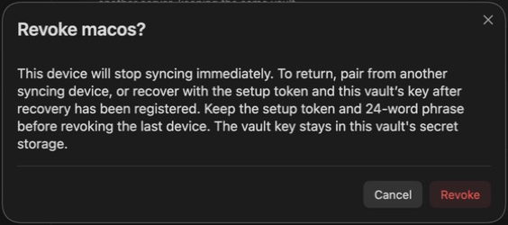
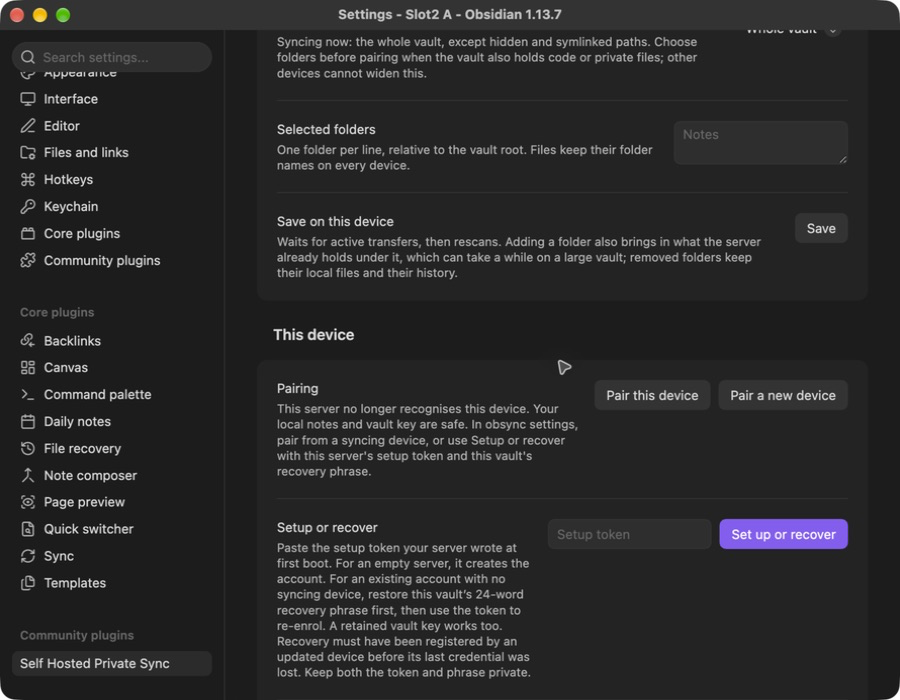
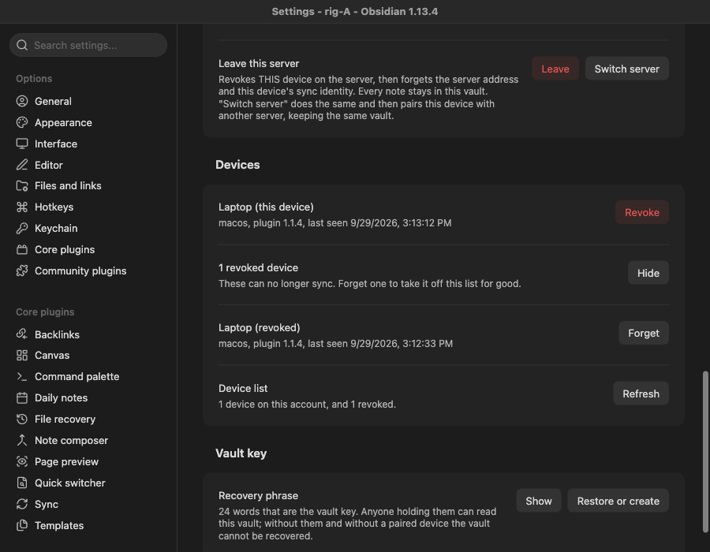
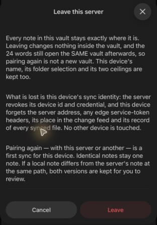
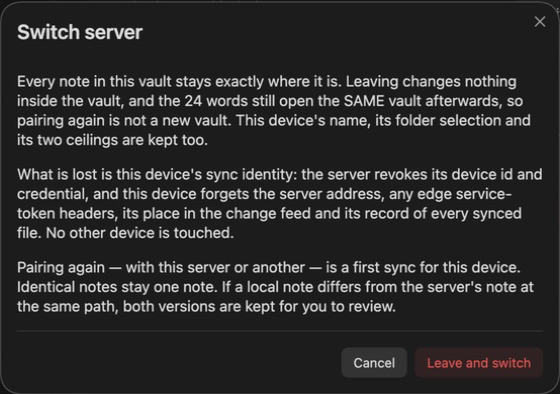

# Recovery

*For people using obsync.*

What to do when a device, a credential, or the server is gone. Every path here
is one the shipped code supports; where there is no path, this page says so
rather than implying one.

## The four secrets, and what each one protects

| Secret | Where it lives | What it unlocks | If you lose it |
| --- | --- | --- | --- |
| The **vault key**, written out as the 24-word recovery phrase | on each paired device, in Obsidian's secret storage | your notes: every chunk and every file name | the stored content cannot be read by anyone, you included |
| A **device secret** | on that device, wrapped under the server key on the server | that device's access to the server | pair the device again |
| The **server key** (`OBSYNC_SERVER_KEY`) | the operator's Secret, or the journal volume | the wrapped device secrets | every device must pair again — and see "every device is gone" below |
| The **setup token** | `v1/setup-token` on the journal volume | creating the account, signing in to the dashboard, and re-enrolling with proof of the vault key | mint a new one (below) |

The server holds none of the first one and cannot read a note. That is the
design, and it is also the reason recovery has the shape it does.

## A device is lost or stolen

1. **Revoke it** — the dashboard's Devices list, or **Devices** in the plugin
   settings on another paired device. Revocation destroys that device's
   wrapped secret on the server; it is final, and a revoked device gets
   `403 device_revoked` for every request it tries. It also ends that
   device's hold on the dashboard: any sign-in link it minted stops working,
   and any dashboard session opened from one of its links is closed at the
   same moment.

   

   **Two things revocation does not do.** It cannot be undone — there is no
   un-revoke route and no CLI that restores a revoked device, so the way
   back is to pair that device again as a new one, which gives it a new
   device id and a new secret. The last active device can be revoked once
   vault recovery is registered: keep the setup token and the 24-word phrase
   before doing so. An older server or account without that registration
   still refuses with `409 last_device`; update server and plugin while a
   credential still works, or pair the replacement first. From 1.1.5 a
   recovery key registered less than seven days ago keeps the last active
   device too (`409 recovery_too_new`), for the reason in
   [Another device set a different recovery key](#another-device-set-a-different-recovery-key).
2. **Pair the replacement** from a device that still syncs: **Pair a new
   device** there, the code on the new one, approval back on the first. The
   vault key travels inside the pairing envelope, encrypted under a secret the
   server never sees, so the recovery phrase is not needed for this.

The lost device keeps whatever plaintext was already in its vault folder. That
is a device-security problem (disk encryption, remote wipe), not something a
sync server can undo.

The confirmation explains how to return before you revoke the device. This
capture uses a disposable desktop device named by its role:



## A device's plugin data is gone, but other devices still sync

A reinstall, or a vault copied without its `.obsidian` folder. The device has
no credential and no vault key, and the plugin says `not paired`. A vault
copied with its `.obsidian` folder, or whose folder was renamed outside
Obsidian, reads `not paired` too and says it is a copy. A cleared secret
storage in a vault that has synced stops with a storage error instead, which
says to pair again if a reload does not bring the credentials back.

Pair it again from a device that still syncs. If it ends up enrolled but
without a vault key, the **Vault key** dialog offers two buttons, and only one
of them is recovery:

- **Restore**, with the 24 words, adopts the existing vault key: the device
  reads the history that is already on the server.
- **Create a new vault key** starts a NEW vault. Existing devices will not read
  it and the old content stays unreadable to this device. It is the right
  button only when you are deliberately starting over.

## Every device is gone

If you still have the server's setup token and this vault's recovery phrase,
you can get back in without a second working device once recovery has been
registered. You do not need to delete your vault or create a different key.

With server and plugin 1.1.3 or later, use the **setup token and the vault's
24-word recovery phrase** together. The token alone cannot re-enrol a device.

1. Install and enable obsync in the vault, set **Server URL**, and retain any
   access headers your deployment requires.
2. In **Vault key**, choose **Restore** and enter this vault's 24 words. If
   this installation retained its vault key, keep that key.
3. Under **Setup or recover**, enter this server's setup token and select
   **Set up or recover**. A successful recovery creates a new active device
   credential on the existing account. Its history and encrypted files stay
   on the server; previously revoked devices remain revoked.
4. Let the first sync finish. Local notes stay in the vault; ordinary conflict
   handling keeps differing local and remote versions.

**Upgrade boundary:** recovery must be registered before the last credential
is lost. New 1.1.3 setups register it with account creation. An updated paired
plugin registers it after successfully opening the vault on an updated server.
With a server **before 1.1.5**, an account that lost every credential before
that registration cannot prove ownership through this route: it answers that
recovery is unavailable, and the account still needs a working device or a
backup containing one. A server **1.1.5 or later** answers the same until
whoever runs it resets recovery: `obsyncd recovery reset apply` rotates the
setup token and arms one re-enrolment from the phrase, as
["Getting the owner back in after a clear"](#getting-the-owner-back-in-after-a-clear)
describes. The phrase alone still grants nothing, and neither does a setup
token from before that reset.

The plugin persists its vault key before sending first setup. If the answer
is lost, it does not retry automatically: check the result, then explicitly
use **Set up or recover** again with the retained key and token. A device may
have been enrolled by the lost attempt; revoke that unused entry once access
is restored. Keep an ordinary backup of the vault folder as well as the two
recovery secrets.

## Another device set a different recovery key

*Server and plugin 1.1.5 or later.*

Each updated device registers this vault's recovery key with the server when
it opens the vault: a check value derived from the 24 words, which is what
lets the setup token and the phrase re-enrol a device later. It opens nothing;
the server keeps the first key registered and cannot tell whether it came
from this vault's phrase. A device whose own key differs from the one the
server holds says so, in a notice that stays until you dismiss it, and at the
top of **Show sync status** and of obsync's settings, under **Security**, until
its own key is registered. While that stands, your 24-word phrase cannot re-enrol
a device through this server.

Two things lead there:

- **One of your devices holds a different vault key**: words restored wrongly,
  or a new vault key made on a device that was already paired. That device
  does not read this vault's notes either.
- **Someone holding a copy of one of your device credentials registered it.**
  A device credential never carries the vault key and cannot read a note, but
  until it is revoked it acts as a device on your server.

**What the server does meanwhile.** For seven days after a recovery key is
registered, the account's only active device cannot be revoked
(`409 recovery_too_new`), whoever asks; every other revoke works as before. A
key you did not register cannot then be used to end every device you have
before you have seen the warning. A key registered before 1.1.5 carries no
registration time and keeps the older rule.

**What to do:**

1. Check that every device shows this vault's notes. On one that does not,
   restore the right 24 words (**Vault key**, **Restore**) before anything else.
2. On a device that shows the warning, open obsync's settings, **Devices**, and
   revoke every device you do not recognise. If you recognise all of them, a
   copy of one device's credential may exist: pair a replacement for any
   device you are unsure of from another one, then revoke the old entry.
3. Ask whoever runs the server to clear the recovery key (below).
4. Start the server and let a device that holds this vault's key sync: it
   registers its key, and the warning clears on every device that showed it
   at their next start.

### Clearing the recovery key

For whoever runs the server. `obsyncd recovery reset` reads and writes the
journal, so, like `check` and `export`, it runs with the server stopped
([One writer](storage.md#one-writer)); against a running server it refuses
with `journal_locked` and changes nothing. There is no route for it: a device
cannot ask for it.

- `obsyncd recovery reset plan` says whether a recovery key is registered, since
  when, and until when it keeps the only active device, and what `apply` would
  do; it changes nothing.
- `obsyncd recovery reset apply` does three things. It **clears the key**, if
  one is registered. It **rotates the setup token**: the standing one is
  removed, the next start mints a new one, and the old one stops working, for
  recovery and for the dashboard's recovery sign-in alike. And it **arms one
  re-enrolment**: the first recovery key registered after the next start
  becomes the account's, whether a device that still syncs registers its own
  when it opens the vault or the owner recovers with the new token and the
  phrase (below). Until then the account's only active device cannot be
  revoked (`409 last_device`).
- `--output json` prints one JSON object on standard output instead of
  sentences, refusals included: `schema_version`, `operation`
  (`recovery.reset.plan` or `recovery.reset.apply`), `state` (`planned`,
  `completed` or `refused`), `data` (`recovery_key`, `registered_at` and
  `hold_ends_at` as the command found them; `change`: `clear` or `none` for a
  plan, `cleared` or `none` for an apply; `setup_token`: `rotate` for a plan,
  `rotated` for an apply; `re_enrolment`: `arm` for a plan, `armed` for an
  apply), `error` (`code`, `message`), `next_actions`, `observed_at` and
  `duration_ms`. Times are UTC RFC 3339. A refused plan has no `data`; a
  refused apply says in `data` how far it got: `setup_token` (`standing`,
  `removed_unconfirmed` when the folder holding it could not be synced, or
  `rotated`) and `reset` (`not_reached` or `refused`).
- Exit status: `0` the step did what was asked, including a reset with no key
  to clear, which still rotates the token and arms; `1` refused, with the
  reason in the output; `2` the command or the configuration is malformed. An
  apply removes the old setup token before it resets the key, so a refusal
  after that removal says the token is gone and the key is not reset yet;
  `obsyncd recovery reset plan` shows what stands, and `apply` again, once the
  cause is fixed, finishes the reset. Any other refusal changed nothing. Each
  run logs one `event=recovery_reset mode=… decision=…` line, and an apply's
  refusal also names `setup_token=`. Nothing either step prints or logs is a
  secret.

Under Compose:

```sh
docker compose -f deploy/compose/docker-compose.yml stop obsync
docker compose -f deploy/compose/docker-compose.yml run --rm obsync recovery reset plan
docker compose -f deploy/compose/docker-compose.yml run --rm obsync recovery reset apply
docker compose -f deploy/compose/docker-compose.yml start obsync
```

On Kubernetes, scale the Deployment to zero
(`kubectl scale deploy/obsync --namespace obsidian --replicas=0`), run the same
two commands in a pod that mounts the server's two claims and its key Secret
the way the Deployment does, then scale it back to one.

### Getting the owner back in after a clear

The same reset is the way back for an owner with no working device. With no
key registered, the server has nothing to check a phrase against, so the
authority is the operator's: the offline reset, and the setup token it rotated,
which only someone who can read the journal volume since then holds. The
owner's phrase only chooses the key that is registered. Neither a device on the
server nor its credential can do any of it: the reset runs only on the server's
volumes, and the re-enrolment is authenticated by the setup token, never by a
device.

1. **Reset** as above (`recovery reset apply`, server stopped). It clears the
   key, rotates the setup token and arms one re-enrolment.
2. **Start the server and read the new token** with `obsyncd setup-token`
   (["Reading the setup token"](#reading-the-setup-token)). Give it to the owner
   privately; the token from before the reset no longer works.
3. **The owner recovers on a device:** install and enable obsync, set the
   **Server URL**, then **Vault key → Restore** with the 24 words, and **Setup
   or recover** with the new token. The recovery registers the key the phrase
   derives — timed, so the seven-day hold starts now — and enrols this device
   on the same account. Its history and encrypted files stay; previously
   revoked devices stay revoked; nothing is renamed.
4. **Revoke the devices the owner does not recognise** from **Devices** in the
   plugin or the dashboard, so no credential that should not be there remains.

The first recovery key registered after the reset becomes the account's. If a
device that still syncs registers its own first, the owner's recovery is the
ordinary one and succeeds only with the phrase for that key. If that device is
not the owner's, or the owner restored the wrong words — which locks out
nobody but the owner — reset again, and the owner recovers with the next token.

Once a recovery key is registered again, the ordinary rules return: a later
recovery must prove that key, and the last active device is held for the key's
first seven days.

**Compatibility.** This re-enrolment is a server-1.1.5 behaviour. An account
with no recovery key that has not been reset answers
`409 recovery_unavailable`, on 1.1.5 as on every server before it; a server
before 1.1.5 has no reset, so an account that lost every credential while it
ran one needs the server upgraded, then the reset above. A 1.1.4 server
reading a journal a reset wrote ignores the arm, so it still refuses. A plugin
before 1.1.5 recovers against a 1.1.5 server through the same setup token and
phrase, so the owner's device need not be updated first. A device recovering
with a **freshly made** vault key, rather than a restored phrase, is told to
pair or restore instead: a new key never re-enrols over the vault the server
holds.

## This server no longer recognises this device

A `401 bad_signature` or revoked credential stops sync with an explicit
message saying the server does not recognise this device, instead of a
repeating offline status. Confirm the
server address, then use **Setup or recover**. That action clears the rejected
device ID, feed cursor and sync records while keeping local notes, the vault
key, server address and access headers. It sets up an empty rebuilt server or
re-enters a recoverable existing account. No uninstall is needed. **Pair this
device** can instead obtain a new credential from a device that still syncs.

The settings show that action directly when the server no longer recognises
this device (which is not what **Forget** on a revoked row does — that one
only takes a device off the list):



After recovery, the new active device leads the list, and the revoked
predecessor waits behind the **1 revoked device** row; **Show** opens it, as
here:



These desktop captures use a disposable vault. The
[native recovery record](validation-runs/2026-09-24-account-recovery.md)
names the tested build and confirms that all 217 local files were unchanged.
The last capture was taken again, by the same journey, once revoked devices
were folded; [its record](validation-runs/2026-09-29-revoked-devices.md#the-recovery-capture-again)
names that build.

## The server is rebuilt from a volume backup

**What the volumes hold.** `obsync-blobs` is every ciphertext chunk.
`obsync-journal` is the journal (the source of truth), the index snapshots, the
setup token, and — only when `OBSYNC_SERVER_KEY` is not supplied — the
generated server key. Treat the journal volume as the sensitive one.

**What a consistent backup needs.** Both volumes from the same moment, with the
server stopped, or a filesystem or volume snapshot that captures them together.
The journal is append-only and replays on start, so a backup taken while the
server was writing recovers to the last complete frame and says which frames
survived. A blobs backup NEWER than its journal is safe; a journal newer than
its blobs is not, because it names chunks the restored blob volume does not
hold.

**What to restore, in order.** The server key first (the Secret, or the file on
the journal volume), then both volumes, then start the server and read
`/readyz`. It answers `{"ready":true}` only once the volumes are writable and
the journal has replayed.

**Changes made after the backup.** The restore takes from the server
everything written after the backup: new notes, edits, renames, deletions and
folders. The devices still hold them. Each device on plugin 1.1.3 or later
notices the restore, re-sends what it holds, and shows one notice: "The server
was restored to an earlier state; this device re-sent N changes."

- **When a device notices.** When it starts or reconnects, it asks the server
  for the last change-feed entry it read. A journal that no longer holds that
  entry where it was, or holds entries where the device read none, was
  rebuilt. The repair pass also notices when the server does not hold a
  version the device recorded less than a day ago, whenever it reads that
  version back: for a chunk the server lacks, or one it does not remember yet.
- **What it re-sends.** Each note, rename and folder the server lost, onto
  the versions the server still holds. Each deletion the device made or
  received, from the last 1000 it remembers. Then it reads the rebuilt feed
  from the start, skipping what it had already seen, so what other devices
  wrote on the restored server arrives too.
- **What it never does.** It never replaces a change another device made on
  the restored server: the two are merged, or both are kept, by the ordinary
  conflict rules. It never deletes a note because the server lacks it. A
  version the server pruned by retention is not a lost one, and is not
  re-sent.
- **What it cannot re-send.** A deletion older than the last 1000 the device
  remembers comes back on a device paired after the restore. A change made
  before the device updated to 1.1.3 is re-sent only if the server lost the
  whole note. A device paired after the backup is unknown to the restored
  server (below), so it re-sends nothing until it is paired again.

So after a restore, start every device that was syncing, let each reach
`idle`, and only then pair a new device or reinstall one: the new device gets
what the others re-sent. Each device logs one `restore decision=start` and one
`restore decision=summary` line, with its budget of 1000 reads and 10 minutes.

**Two ways this bites:**

- **A journal older than a pairing.** Devices paired after that backup do not
  exist in the restored index, and every request they make is refused
  `401 bad_signature`. Pair from a device the restore knows, or use the
  forgotten-device recovery action above when recovery was registered in the backup.
- **A lost server key.** Every device secret was wrapped under it, so no device
  can authenticate and no device can open a pairing for a new one. That is the
  "every device is gone" case, arriving from the server's side. Back the key up
  the way you back up a password.

## Reading the setup token

Ask the server: `obsyncd setup-token` prints the token that stands on the
journal volume on standard output, alone and newline terminated, and nothing
else — every diagnostic is on standard error and the token reaches no log
line. It reads the same file a start reads, through the same measured volume
pass, and opens no journal, so it answers from a server that is serving:
`kubectl exec deploy/obsync -- obsyncd setup-token` on Kubernetes,
`docker exec obsync-obsync-1 obsyncd setup-token` under Compose, neither
needing a shell the image does not have.

It exits non-zero and names the reason when there is nothing to print: no
token stands on these volumes yet (`reason=absent`, the state between the two
steps below), the file is not a token (`reason=corrupt`), or the volume itself
is refused (`reason=unsafe_posture`). Reading the file off the volume — the
node's copy, or a read-only mount of the claim — stays the fallback for a
server that is not running; `chart/README.md` and `README.md` have the exact
commands for each deployment.

## Minting a new setup token

The token is written once, at first boot, and then stands: it is the
dashboard's recovery sign-in for the life of the server. To replace one you
believe is exposed:

1. Stop the server.
2. Delete `v1/setup-token` from the journal volume.
3. Start the server.

It mints a new 64-hex token, writes it mode 0600, and logs
`event=setup_token_ready … state=recovery_login` — never the token itself. The
old token stops working the moment the file is replaced. Existing devices are
unaffected: they authenticate with their own secrets, not with this token.
`obsyncd recovery reset apply` rotates it the same way, as part of the reset
([Clearing the recovery key](#clearing-the-recovery-key)).

**How to tell it has been used.** A sign-in with this token logs
`event=dashboard_login decision=recovery_login` at `warn` — never the token,
not even a prefix — and the dashboard's Overview page carries a notice for as
long as that session lasts. A sign-in from a device's link logs
`decision=link_login` at `info` instead. If you see the first and did not do
it, rotate the token with the three steps above and use **Sign out
everywhere** on the dashboard, which closes every session the server holds.

**Who holds it.** Whoever can read the journal volume. Its custody is the
dashboard's custody, and that is why it is worth rotating after a restore
from a backup somebody else handled ([`security/dashboard.md`](security/dashboard.md)).

## Stop syncing this device

Open the plugin's settings, find **Leave this server**, and choose **Leave**.
Read the confirmation before continuing. Your notes and recovery phrase stay
on this device; the server revokes only this device's access. Other devices
keep syncing. Choose **Cancel** to keep this device connected.



Pairing again is a fresh sync. Identical notes remain single notes; if the
same path holds different text, both versions are preserved for you to review.

## Moving this vault to a different server

A different server INSTANCE, not the same one at a new address: a rebuilt
server, a second one you are migrating to, or a laptop's test server you are
done with. The device credential is bound to the server that minted it, so
changing **Server URL** alone yields the forgotten-device message.

The confirmation explains what stays on this device and what it forgets.
Choose **Cancel** to keep using the current server.



1. On the device, **This device** → **Leave this server** → **Switch server**.
   It revokes this device on the old server, forgets the server address, the
   edge headers, the feed cursor and every file record, and then asks for the
   new address. Choose **Pair with existing vault** or **Set up or recover**.
2. Pair against the new server: a code from a device that already syncs this
   vault there, or **Set up or recover** with that server's setup token if the
   new server has no account yet. Either way the VAULT KEY on this device is
   kept, so this is the same vault; a new key would be a new vault
   ([`settings.md`](settings.md)).
3. Switch each device in that order. Once recovery has been registered for
   seven days, the last device is revoked normally too, so none remains
   active on the old server.
   An older server or unregistered legacy account still refuses the last
   revoke and explains the upgrade requirement. Leaving locally is explicit;
   it keeps that credential active remotely. A device already revoked simply
   leaves. Keep the old server's setup token and vault phrase if you need to
   return to its history later.

Pairing again is a first sync for this device. Identical notes stay one note.
If the local and server versions differ at the same path, both are kept for
you to compare ([Conflicts](conflicts.md)). Leaving the old server does not
delete your local notes.

## Moving the server to a new address

The address is not part of any key; it is what each device is configured with.

1. Stand the server up at the new address, with a certificate that name's
   devices trust.
2. On each device, set **Server URL** to the new address, port included when it
   is not 443. The stored credential is re-bound to the new address as the
   setting is saved; the device id and its secret do not change.
3. If the deployment names itself to its clients (`OBSYNC_PUBLIC_URL`, or the
   chart's `publicUrl`), update that too, so generated dashboard links point at
   the address devices actually use.

A device whose plugin data and stored credential disagree about the address
stops with a storage error instead of guessing
([`community-plugin.md`](community-plugin.md)); it does not silently sync to
the wrong server.
