# Same network, step by step

One computer at home runs the server; your phone and your other computers sync
with it whenever they are on the same Wi-Fi. There is no tunnel, no VPN, no
domain and no account with anybody. When a device is away from home, its edits
wait on the device and go up the next time it is back on that network.

Every screen below is from the [2026-09-23 run](validation-runs/2026-09-23.md):
a Mac running the server and a desktop vault, and an iPhone on the same Wi-Fi.
Names and codes that belong to that run are blurred.

## What you need

- A computer that stays on while you sync, with Docker. A Mac, a Windows PC, a
  Linux box or a Raspberry Pi all work; the run below used a Mac with Docker
  Desktop.
- Obsidian on each device.
- About twenty minutes, most of it the phone's certificate.

## Start the server

Follow [Compose with Caddy](server.md#any-network-no-provider-compose-with-caddy)
in *Run the server*. It verifies the image and starts it. Three values are
yours to choose, and on a home network they are:

- **`OBSYNC_HOST`**: a name every device can look up. The simplest is the
  computer's own local name, which Apple devices and most others resolve on a
  home network with nothing to configure. On a Mac it is **System Settings →
  General → Sharing → Local hostname**, and ends in `.local`.
- **`OBSYNC_BIND_ADDRESS`**: the computer's address on the Wi-Fi. On a Mac,
  `ipconfig getifaddr en0` prints it. The server then answers only on that
  network.
- **The ports**: on a Mac, Docker Desktop refuses ports 80 and 443 unless
  **Enable privileged port mapping** is on in its settings. Otherwise set
  `OBSYNC_HTTP_PORT=8080` and `OBSYNC_HTTPS_PORT=8443`, and add `:8443` to
  the name everywhere below.

Use the name you chose for **`OBSYNC_HOST`** in the plugin's **Server URL**.
The Wi-Fi address used for `OBSYNC_BIND_ADDRESS` is a different setting.
Replacing the name with that address can cause a TLS error because the
certificate identifies the name. Keep certificate checks enabled and use
the matching name.

**Let your devices in.** A computer's firewall can drop every connection from
the phone even while the server is running. On a Mac, open **System Settings →
Network → Firewall → Options**. Turn off **Block all incoming connections**,
and let **Docker** accept incoming connections. Stealth mode can stay on.

## Export the certificate

Your server makes its own certificate authority, so every device must trust it
once. Export it with the one command in
[Trust the certificate authority](server.md#trust-the-certificate-authority-once-per-device).
It produces `obsync-root.crt`. On a computer, the same section has the one
command that installs it.

## Trust the certificate on the phone

1. **Send the file to the phone.** AirDrop, mail, or save it to iCloud Drive.
   If AirDrop saves it to **Files** without asking anything, open the Files app
   and find `obsync-root.crt` there. Open it.

   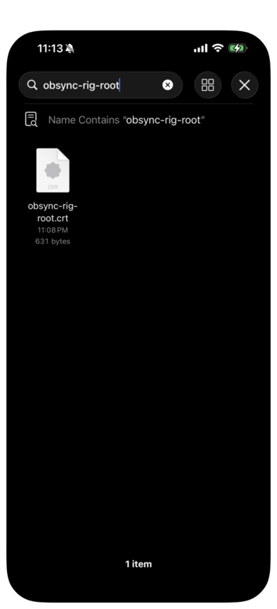

2. **Choose the phone.** iOS asks which device should install it; choose
   **iPhone**. It then says the profile was downloaded; select **Close**.

   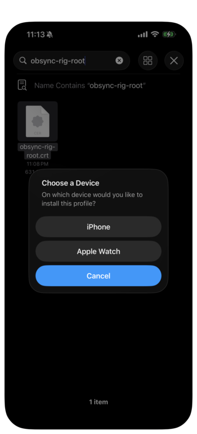

   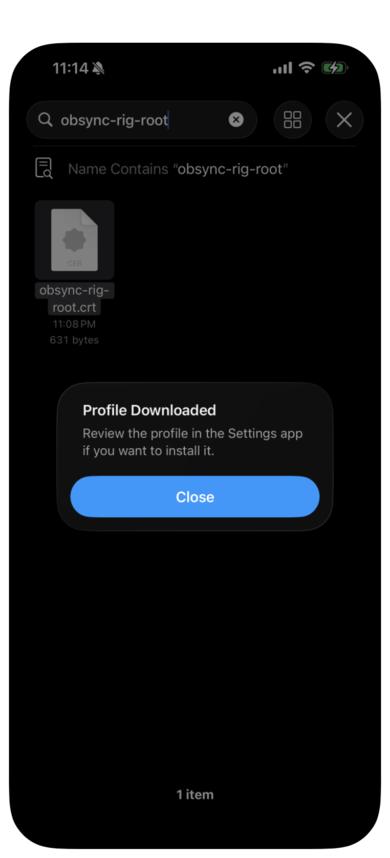

3. **Install it.** Open **Settings → General → VPN & Device Management**. The
   certificate is listed under **Downloaded Profile**. Open it, select
   **Install**, enter your passcode, and confirm **Install**. It reads **Not
   Verified** because it is your own authority and not a public one; that is
   expected. Then select **Done**.

   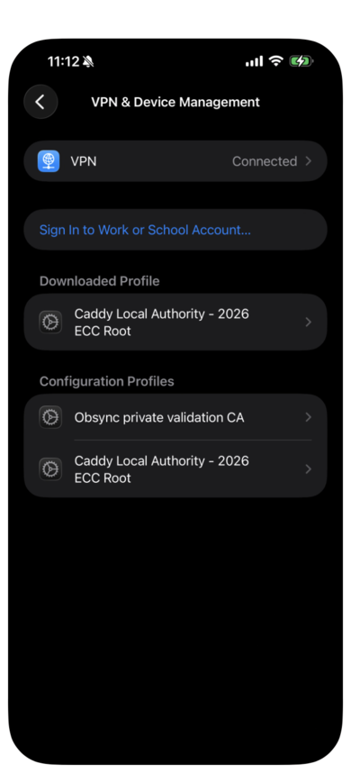

   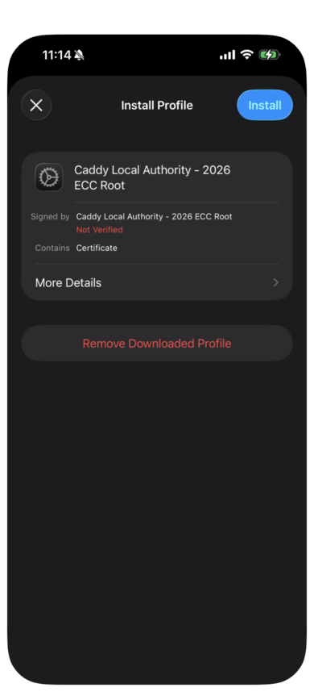

   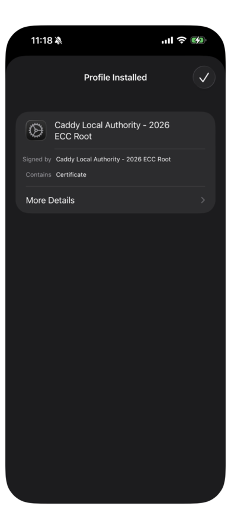

4. **Trust it.** Installing is not enough, and Obsidian refuses the server
   until this switch is on. Open **Settings → General → About → Certificate
   Trust Settings** (at the very bottom). Turn on your certificate, then select
   **Continue**.

   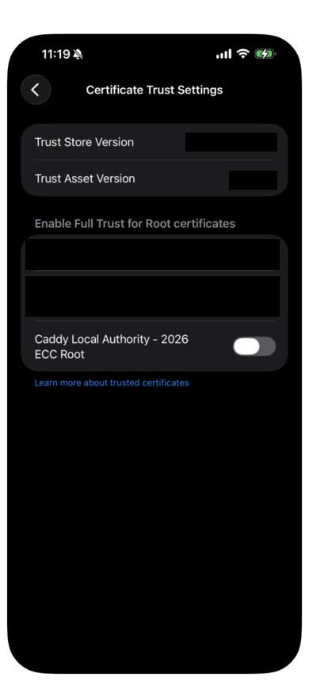

   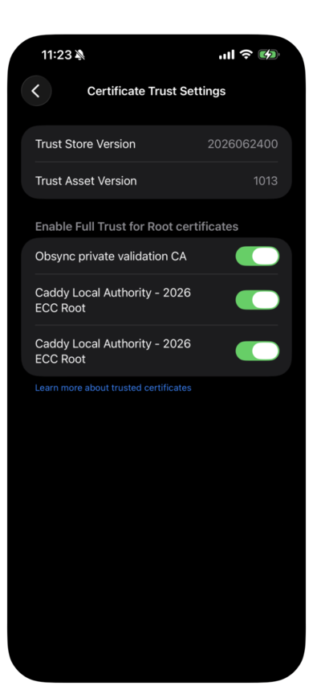

5. **Check it.** In Safari on the phone, open `https://<your name>/readyz`,
   with `:8443` if you moved the port. A page reading `{"ready":true,...}`
   means the phone reaches the server and trusts it. For a privacy or TLS
   warning, first check that the address uses your `OBSYNC_HOST` name, then
   check the trust switch in step 4. "The network connection was lost" can mean the
   firewall above, or a phone that is not on the same Wi-Fi.

   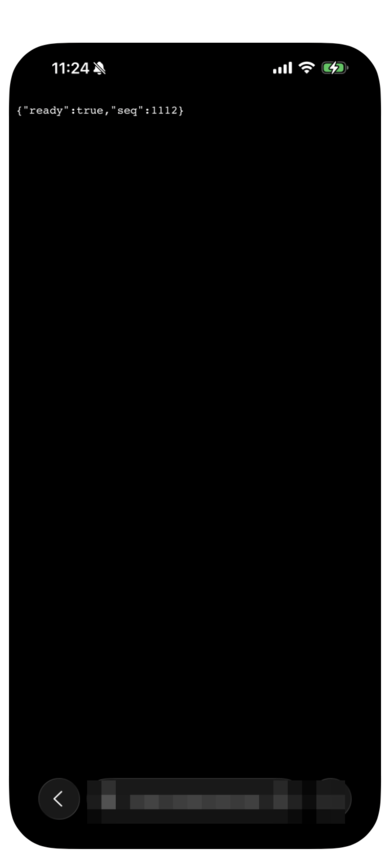

## Set up the first device

On your computer, follow the [Quickstart](quickstart.md) to install the plugin,
set **Server URL** to your name (with `:8443` if you moved the port), and run
**Setup or recover** with the server's setup token. That device creates the
vault key and shows you the recovery phrase.

## Add the phone

1. **Make or open the vault** on the phone. Any vault except one another tool
   is already syncing.

   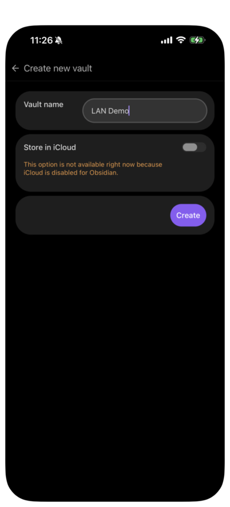

2. **Allow community plugins.** Settings → Community plugins → **Exit
   Restricted mode**, then **Browse**.

   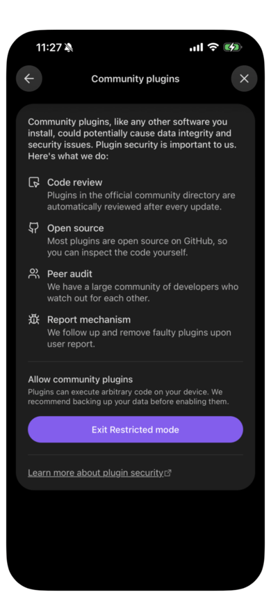

3. **Find the plugin by its full name**: **Self Hosted Private Sync**. A
   shorter search such as "Private Sync" can bury it under other results.
   Select it, then **Install**, then **Enable**.

   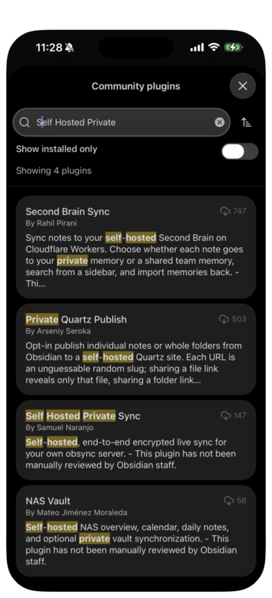

   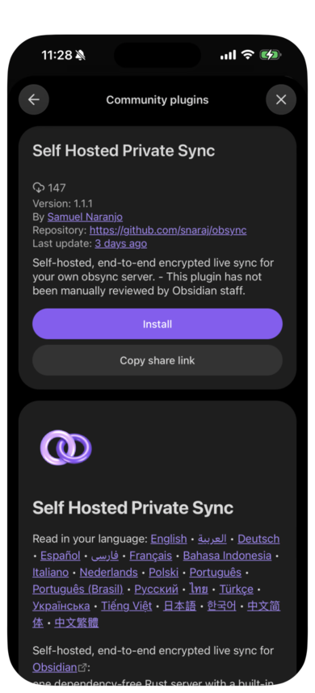

4. **Set the Server URL** under **Options**, exactly as on the first device.
   The setup guide is one press away at the top of this page.

   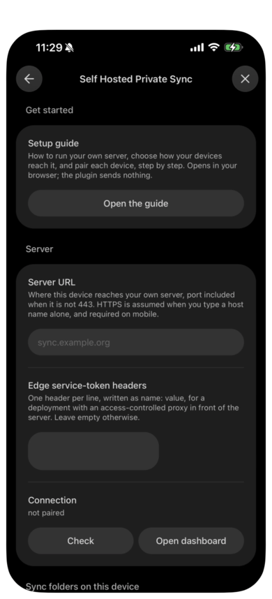

## Pair

1. **On the computer**, run **Pair a new device** from the command palette or
   the settings tab. It shows a one-time code, valid for ten minutes.

   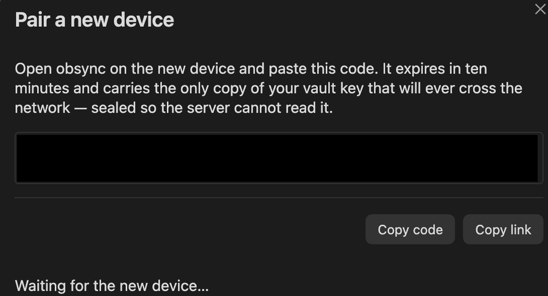

2. **On the phone**, open the code. The easiest way is **Copy link** on the
   computer, then send the link to the phone and open it: Safari offers to open
   it in Obsidian, with the code already filled in. Or paste the code under
   **Pair this device**. Select **Pair**.

   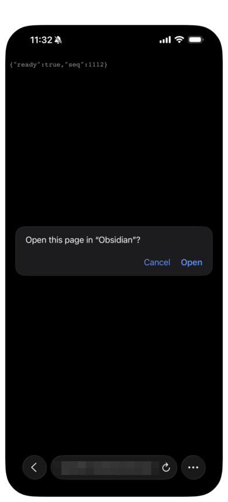

   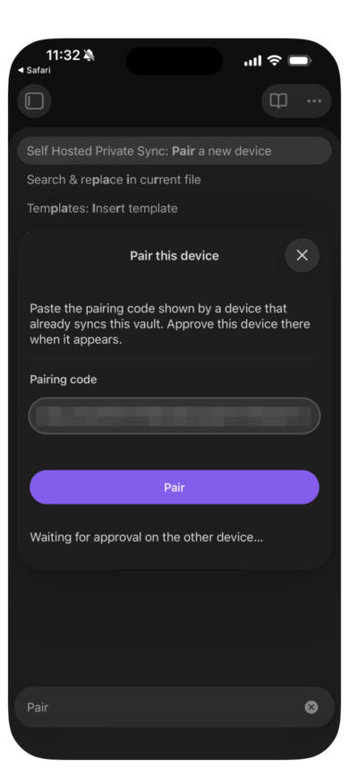

3. **Approve it on the computer.** It names the new device and its platform.
   Until you approve, the phone has no access of any kind.

   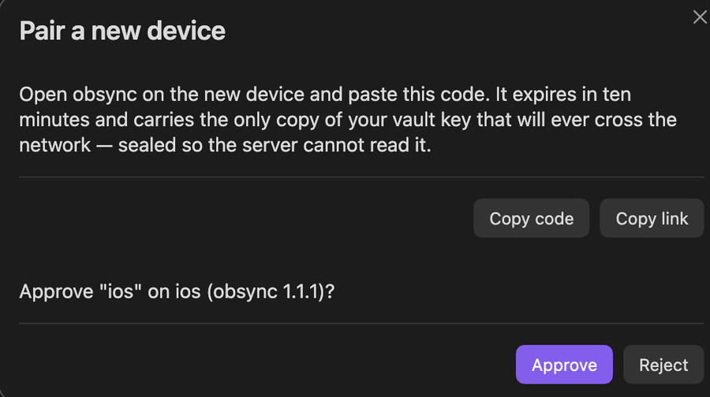

## Sync

Within seconds the phone holds the computer's notes, and an edit on either side
reaches the other.

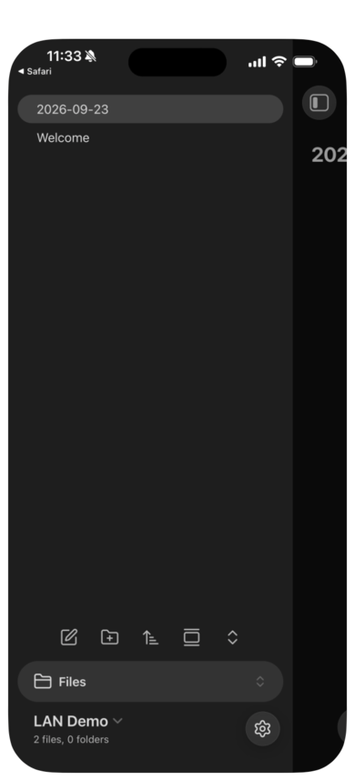

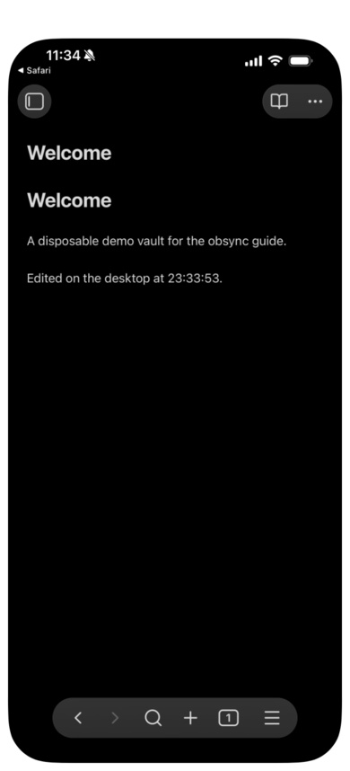

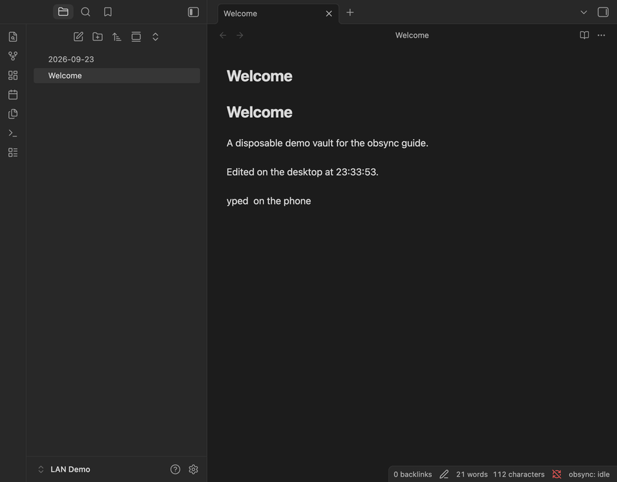

## Afterwards

- **Away from home**, a device keeps its edits and sends them when it is back
  on the network. From 1.1.2 it resumes by itself.
- **Your other computers** pair the same way, and trust the certificate with
  the one-line command for their system in
  [Trust the certificate authority](server.md#trust-the-certificate-authority-once-per-device).
- **Android** may decline a certificate you installed yourself; if it refuses
  to connect, that page lists the fix.
- **To stop trusting the certificate**, remove the profile under Settings →
  General → VPN & Device Management.
