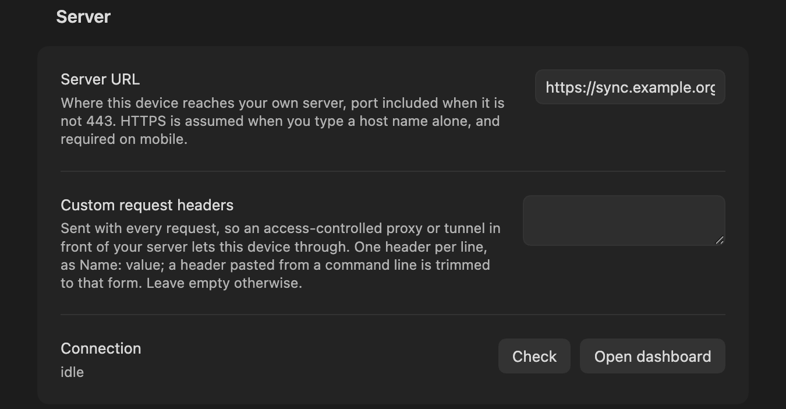
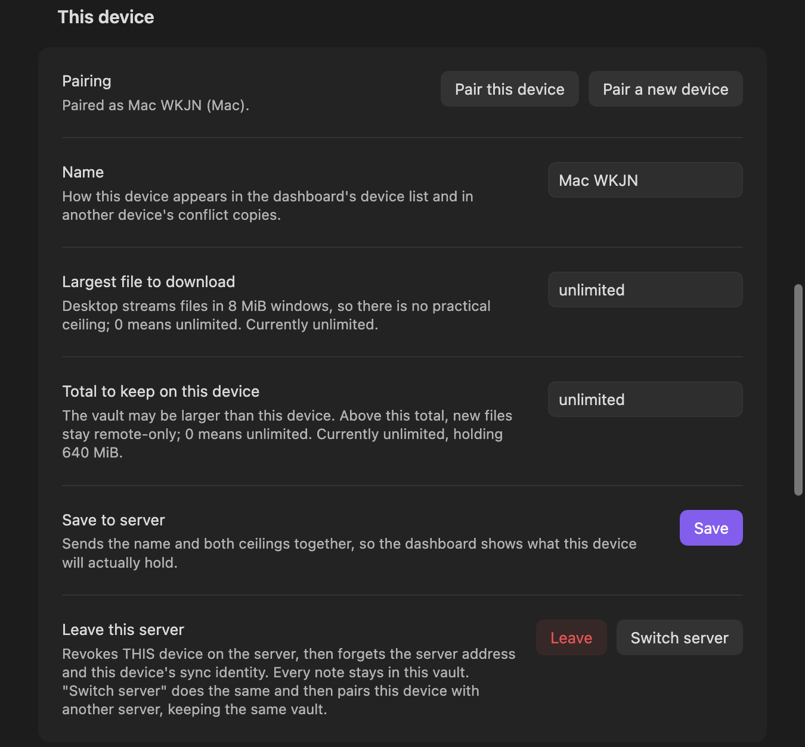
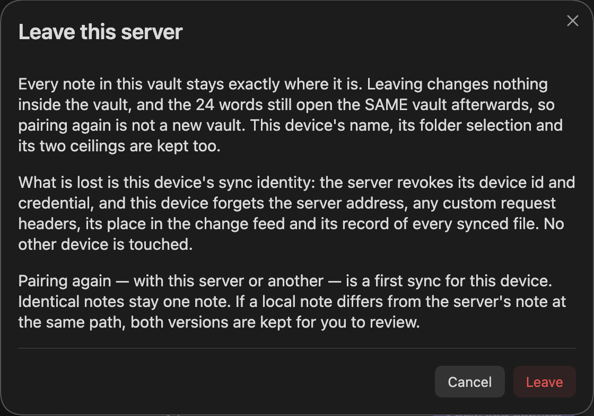
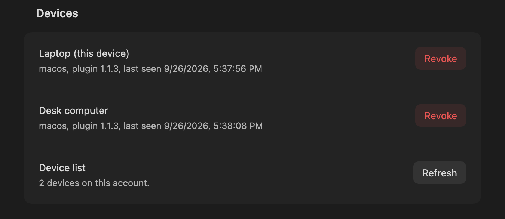

# Plugin settings

*For people using obsync.*

Every row in Settings → Community plugins → Self Hosted Private Sync, what it
defaults to, and when it is worth changing. The rows are
`plugin/src/ui/settings.ts`; both ceilings default per platform from
`plugin/src/policy.ts`, this device's **Name** from `defaultDeviceName()` in
`plugin/src/main.ts`, and the rest from the row itself. Obsidian indexes every
row for its settings search, so typing a row's name in the search box finds it.

Everything here is **per device**. Nothing in this tab is synced, and no other
device can change it for you.

## Get started

| Setting | Default | What it does | When to change it |
| --- | --- | --- | --- |
| **Setup guide** → **Open the guide** | — | Opens this project's setup guide in your browser. The address ships with the plugin; the plugin itself sends nothing there. | When you set up a server or add a device |

## Server

| Setting | Default | What it does | When to change it |
| --- | --- | --- | --- |
| **Server URL** | empty | Where this device sends every sync request. A host name alone becomes `https://host`; give the port when it is not 443 (`host:8443`). HTTPS only on iOS and Android. | Once at setup, and again if the server moves ([`recovery.md`](recovery.md)) |
| **Custom request headers** | empty | Sent with every request, so an access-controlled proxy or tunnel in front of your server lets this device through. One `Name: value` per line; a header pasted from a command line is trimmed to that form, and one that cannot be sent is refused when you leave the box. | Only if your proxy or tunnel requires a header. Leave empty otherwise |
| **Connection** → **Check** | — | Asks the server who it is and reports the account name and device count. | Any time you want one round trip to prove the address, the certificate and the credential together |
| **Connection** → **Open dashboard** | — | Mints a single-use sign-in link and opens the dashboard. The link is resolved against the Server URL above and opened only if it stays on that origin. | — |
| **Update available** → **Open Community plugins** | shown only when the server reports a newer plugin version than this device runs | One sentence naming the plugin and both versions, and a button that opens Obsidian's own Community plugins page, where **Check for updates** installs. The 15-second notice says the same thing and opens the same page when you tap it. Nothing here installs code: the plugin never fetches its own bundle from the sync server. | — |

## Sync folders on this device

| Setting | Default | What it does | When to change it |
| --- | --- | --- | --- |
| **Folder selection** | Whole vault | `Whole vault`, or `Selected folders only`. Its description reads back what this device is syncing NOW, which is the saved selection. Hidden folders (`.obsidian`, `.git`) and symlinked folders are excluded either way. | Before the first sync, if the vault also holds code or private files |
| **Selected folders** | empty | One relative folder per line. An empty list with `Selected folders only` syncs nothing, and saving one says so. A folder the vault does not have is asked about before it is saved, with Cancel as the default; a folder typed in another case (`notes` for `Notes`) is saved the way the vault spells it, and a notice says so. | With the setting above |
| **Save on this device** → **Save** | — | Keeps the choice at once, stops any upload at its next chunk (the button names it, with **Cancel** beside it to keep the old selection), then rescans; the stopped upload resumes where it left off. If Obsidian closes first, the next start applies the choice and says so. **Set up or recover** and **Pair this device** do this for you when the selection on screen is not yet saved. | After a change on a device that already syncs |

You can narrow or widen the selection after pairing. Widening replays retained
history for the newly selected folders and publishes their local files;
returning to **Whole vault** does the same. Narrowing keeps removed folders'
local files and their history on the server. Save the selection on each device
independently; no re-pairing or state reset is needed.

## This device

On a device that is not paired yet, this section also shows **Setup or recover**.

| Setting | Default | What it does | When to change it |
| --- | --- | --- | --- |
| **Pairing** → **Pair this device** | — | Applies an unsaved folder selection, then opens the dialog that takes a pairing code from a device that already syncs. On a device that syncs already it claims nothing and says to leave the server first. Before the first sync it asks when this vault holds notes the server's vault does not. | On every device after the first |
| **Pairing** → **Pair a new device** | — | Mints a code, valid ten minutes, for another device to claim. | When adding a device |
| **Setup or recover** → **Set up or recover** | — | With the server's setup token, creates an empty account or re-enrolls in an existing account using this vault's retained or restored key. Existing accounts must have recovery registered. Applies an unsaved folder selection first. | First device, or recovery after credentials are lost |
| **Name** | what the device is and a tag it made itself, e.g. `Mac 7KQ4` | How this device appears in the dashboard's device list and in another device's conflict copies. | Give each device a name you will recognise months later |
| **Largest file to download** | `0` (unlimited) on desktop, `512 MiB` on mobile | Files above it stay on the server and appear under **Show remote-only files**, to fetch on demand. | On a phone with room to spare, or one with none. `0` means unlimited. Sizes read as `1 MB`, `2 GB` (decimal) or `1 MiB`, `2 GiB` (binary); anything else is refused with a notice when you leave the field |
| **Total to keep on this device** | `0` (unlimited) on desktop, `50 GiB` on mobile | Above this total, new files stay remote-only. | Same |
| **Save to server** → **Save** | — | Sends the name and both ceilings together, so the dashboard shows what this device will actually hold. | After changing any of the three above |
| **Leave this server** → **Leave** | — | Revokes THIS device on the server, then forgets the server address, the edge headers, the sync cursor and every file record. Every note stays in the vault. | Retiring this device, or handing the computer on |
| **Leave this server** → **Switch server** | — | The same, then asks for the new address and opens **Pair this device** for it. | Moving this vault to a different server |

Mobile ceilings exist because Obsidian on a phone reads and writes whole files
in memory: a ceiling is what keeps one large attachment from ending the app.
Desktop streams files in 8 MiB windows, which is why it has no practical
ceiling.

Leaving asks first, and says what it costs. **Kept:** every note, the vault
key (so pairing again is the SAME vault, never a new one), this device's name,
its folder selection and both ceilings. **Lost:** this device's sync identity.
It is refused while this device holds changes the server never received — the
dialog names them, and either **Sync now** first (while the server can be
reached) or discard them on purpose. When the server cannot remove this device
— it does not answer, does not know the device, or refuses — the dialog offers
**Leave on this device only**: this device forgets the server and its
credential all the same, and the server lists it until you remove it from
another device's Devices list or the dashboard.
The last ACTIVE device may leave once account recovery is registered. Keep
the setup token and recovery phrase first. An older server or unregistered
account still refuses with `409 last_device`; local leave keeps that credential
active remotely and the dialog explains the upgrade requirement. Pairing again is a first sync for this device: a note identical to the
server's current note at the same path stays one note, and one that differs
keeps both versions for you to review ([`conflicts.md`](conflicts.md)).

## Devices

Every device on the account, one row each, with **Revoke** beside each one not
already revoked; **Device list** → **Refresh** reads the list again.
Revocation destroys that device's wrapped secret on the server and is final —
a revoked device is paired again as a new device.

## Vault key

| Setting | What it does |
| --- | --- |
| **Recovery phrase** → **Show** | Re-displays the 24 words from this device's own key. Anyone holding them can read this vault. Until this device has confirmed them, the row reads **Not confirmed — Show and confirm** and the button asks for three of the words |
| **Recovery phrase** → **Restore or create** | **Restore** adopts an existing vault key from its phrase, and refuses words that open nothing on a server that holds a vault. **Create a new vault key** starts a NEW vault that existing devices will not read, and asks first on a server that holds one — see [`recovery.md`](recovery.md) before pressing it |

## Commands, not settings

`Sync now`, `Show sync status`, `Pair a new device`, `Show recovery phrase`,
`Restore from history`, `Show remote-only files`, `Open dashboard`,
`Leave this server` and `Switch server` live in the command palette under
**Self Hosted Private Sync**, and the README describes what each one does.
