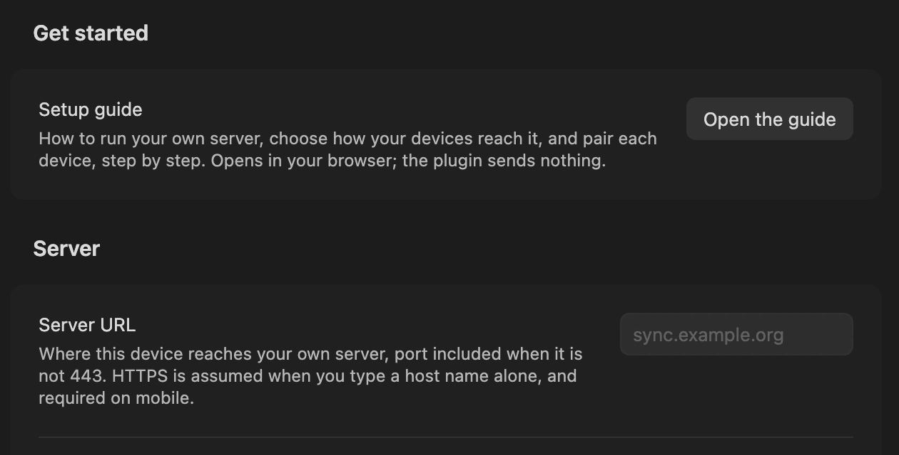

# Choose your setup

Every setup has the same three parts:

- **The server:** one container you run on a computer or a Raspberry Pi that stays on.
- **HTTPS in front of it,** with a certificate every device trusts.
- **A way for each device to reach it.**

Only the last part differs between setups. Pick the row that matches how you want to sync, then follow its guide.

Not sure? Start with **Same network**: [Same network, step by step](same-network.md) shows every screen, phone included. The [Quickstart](quickstart.md) takes you from nothing to two devices in sync, with a screenshot of each step in the plugin.

## Start with your homelab

Yes: obsync can live on a Raspberry Pi, mini PC, or home server you already
own. You do not need Cloudflare, a public website, or an account with a sync
provider. Your notes stay as ordinary files in your Obsidian vault; your server
stores their encrypted copies and history.

1. **Get it working at home.** Follow [Same network, step by step](same-network.md).
   It includes the phone screens, certificate trust, plugin installation and
   pairing. Docker Compose runs the server and its HTTPS front end together.
2. **Check both directions.** Make a disposable note on the computer, edit it
   on the phone, and confirm that both show the same text before adding your
   real notes. Keep a separate backup of those notes.
3. **Add access away from home if you need it.** Connect your devices to your
   own VPN, or use an HTTPS reverse proxy or tunnel you choose. Keep the same
   server and vault: changing how you reach them does not require changing
   your encryption keys. The [network checklist](server.md#reaching-it-from-outside-your-lan)
   explains the route, name, certificate and firewall each device needs.

Already run a Kubernetes homelab? Use [the Kubernetes guide](kubernetes.md)
for storage, chart values, HTTPS and network policy. Docker and Kubernetes
run the same server and use the same plugin. The choice of host is independent
of the choice of VPN, proxy or tunnel.

## What protects your notes

**Encryption protects their contents.** Notes, attachments and file names are
encrypted on your device before upload. The server and a network intermediary
do not receive the vault key. HTTPS also protects the connection and checks
that the device reached the server named in its address; keep certificate
verification enabled.

**Your devices and backups protect your ability to keep working.** Notes already
on a device remain ordinary local files when the server is unavailable. A phone
may deliberately keep only part of a large vault, so it is not automatically a
complete backup. Keep an independent backup that the sync server cannot rewrite,
and keep the recovery phrase and setup token somewhere safe. Try restoring a
disposable note before relying on that backup.

Encryption cannot make a compromised device safe, stop a host from deleting or
withholding its stored copies, or guarantee access during an outage. A TLS
terminator can see access credentials and traffic metadata even though it cannot
read note contents. For the exact boundaries, see [Security](https://github.com/snaraj/obsync/blob/main/SECURITY.md)
and [Recovery](recovery.md). No provider is required to hold your plaintext.

## The setups

"Proven" names the evidence, and nothing else counts. There are two kinds:

- **CI runs the guide:** on every change, CI runs the commands the page shows.
- **A recorded run:** real devices completed setup, pairing and sync both ways, and a validation run records it ([how runs work](validation.md)).

| Setup | Syncs when | You need | Proven |
| --- | --- | --- | --- |
| **Same network:** [step by step](same-network.md), or [Compose with Caddy](server.md#any-network-no-provider-compose-with-caddy) in brief | Your devices are on the same network as the server | A computer with Docker. One certificate trusted per device | CI runs the guide. Recorded runs: macOS and iPhone, [2026-09-14](validation-runs/2026-09-14.md) and [2026-09-23](validation-runs/2026-09-23.md), the second with a Mac laptop as the server |
| **Side by side, no Wi-Fi:** the same-network setup on one device's personal hotspot | Both devices are on that hotspot | As above, with the server's computer joined to the hotspot | Not yet recorded |
| **Private route to a cluster:** [Kubernetes](kubernetes.md), reached through your VPN or private-network route | The device's private-network client is connected | A Kubernetes node, and the private-network client on each device | CI installs the chart. The recorded route used the optional [Cloudflare implementation](cloudflare.md#shape-a-a-private-route-and-the-cloudflare-one-client): macOS and iPhone, [2026-09-20](validation-runs/2026-09-20.md) and [2026-09-21](validation-runs/2026-09-21.md) |
| **Your own VPN:** WireGuard or Tailscale to either server above | The VPN is connected | A VPN on every device, plus [what a roaming device needs](server.md#reaching-it-from-outside-your-lan) | Not yet recorded |
| **A public name:** your HTTPS reverse proxy, or an optional [tunnel and access policy](cloudflare.md#shape-b-a-public-hostname-behind-access) | The device has internet | A domain. For an access policy, its service token in the plugin | Not yet recorded |

In every recorded run so far, the devices were on the server's own network or its private route. Syncing from somewhere else entirely has not been recorded yet: [Reaching it from outside your LAN](server.md#reaching-it-from-outside-your-lan) lists what that needs.

## Your devices

| Platform | Status |
| --- | --- |
| macOS | In every recorded run |
| iPhone and iPad | iPhone is in every recorded run. Trust the certificate once, in [two steps](server.md#trust-the-certificate-authority-once-per-device) |
| Windows and Linux | Not yet in a recorded run. The plugin runs the same code as on macOS |
| Android | Not yet in a recorded run. Android apps may decline certificates you install yourself. If Obsidian refuses to connect, use a public name with a publicly trusted certificate ([how](server.md#trust-the-certificate-authority-once-per-device)) |

## When a device is away from the server

Nothing is lost while a device cannot reach the server:

- Edits stay on the device.
- The server keeps everything the other devices sent.

When the device can reach the server again, sync resumes by itself: while it waits the status bar reads `obsync: offline — retrying`, and it tries again at once when the device reports its network back, otherwise within five minutes. **Sync now** from the command palette makes the next attempt happen now. The plugin then compares the vault with the server, sends what changed while you were away, and brings down what changed elsewhere.

The server keeps each deletion for 30 days by default. A device away for longer than that may still hold a note deleted elsewhere; delete it again there. Letting every device reach the server at least once a month avoids this.

## Get help

- [Troubleshooting](troubleshooting.md) covers every symptom and error code, and how to report one.
- In Obsidian, **Settings → Self Hosted Private Sync → Setup guide** opens this page.

