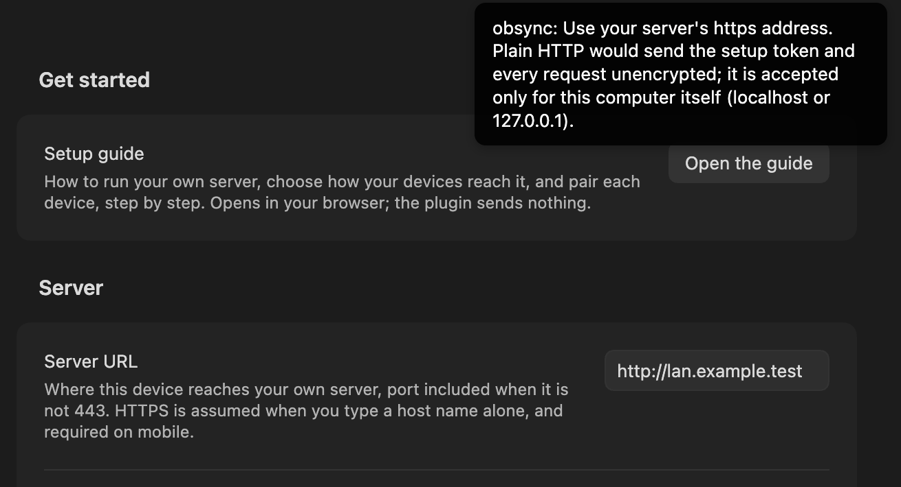
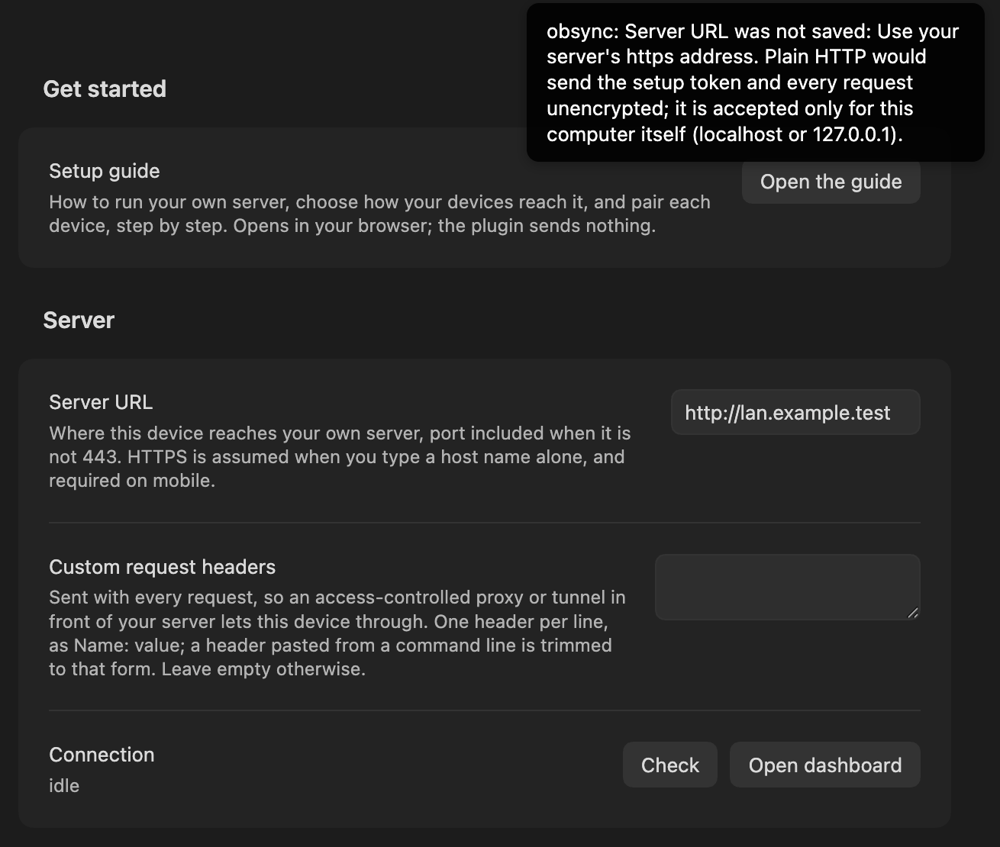
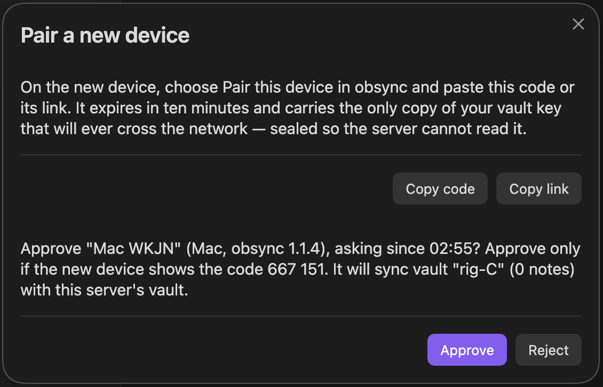
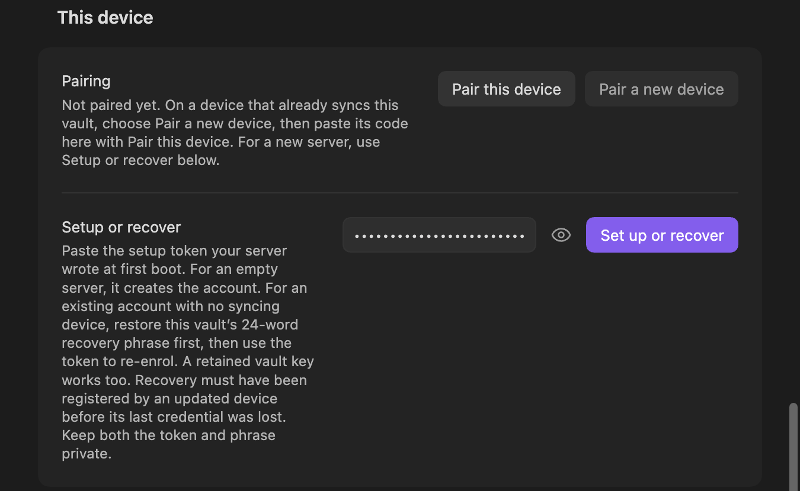
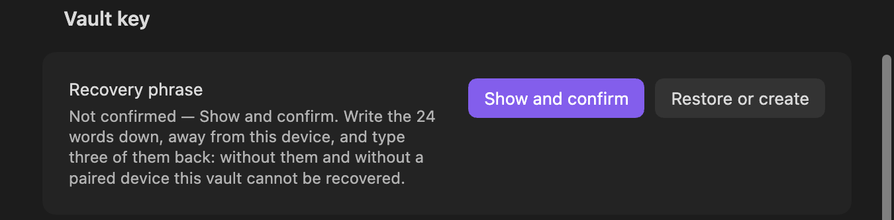
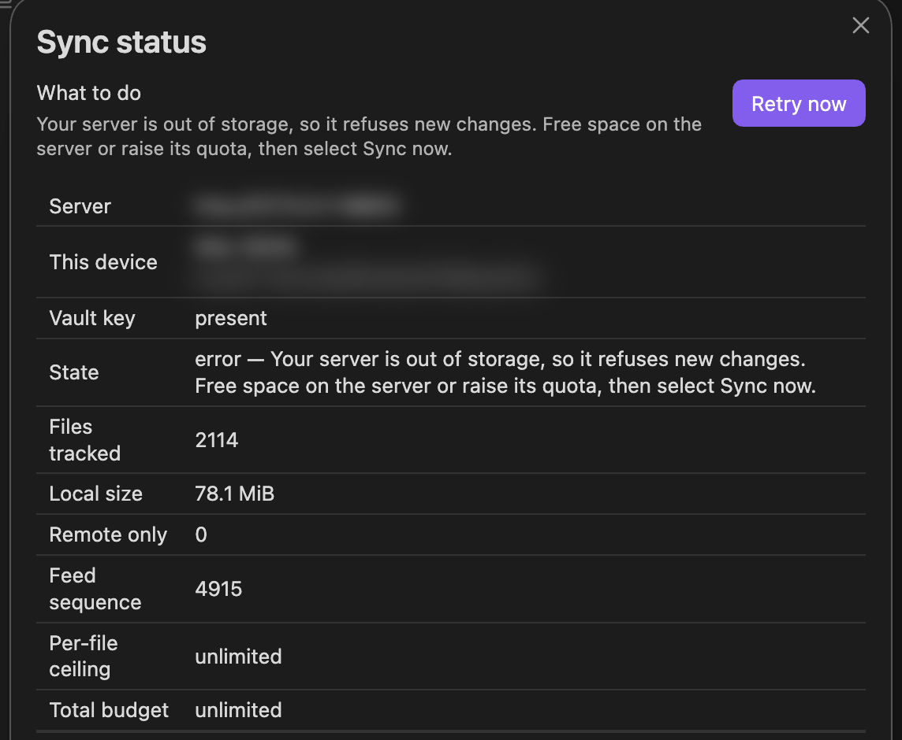
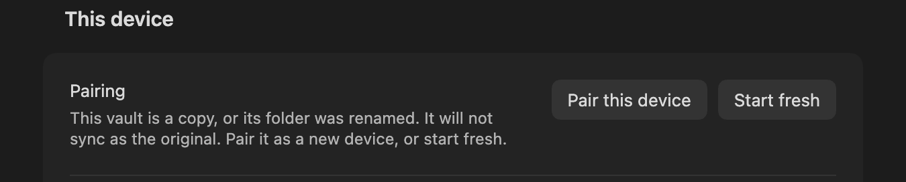
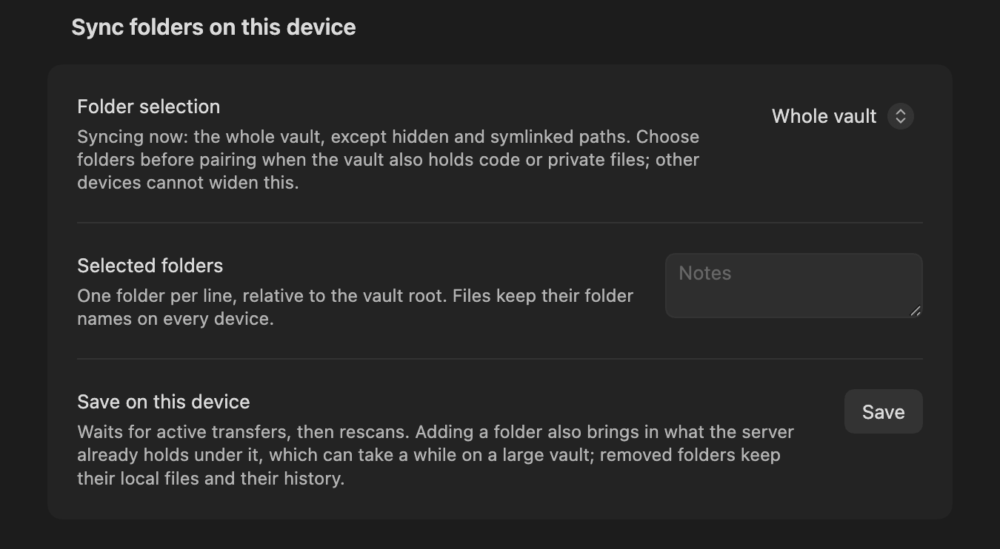
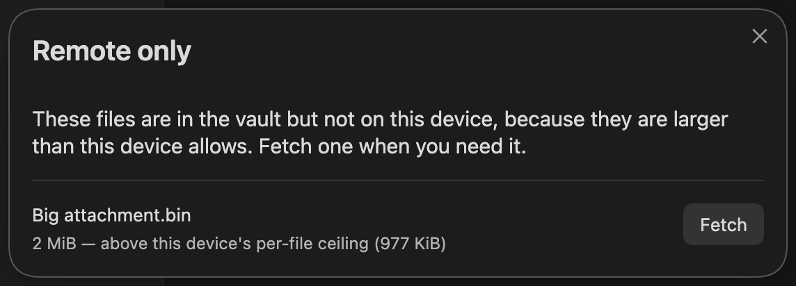

# Troubleshooting

*For people using obsync.*

Find what you see in the list below and follow its link. Every entry has the
same three parts: **what you see**, **why it happens**, and **how to fix it**.
If nothing matches, [collect a report](#how-to-collect-a-report) and ask.

Your notes stay on your devices through every problem on this page. None of
the fixes below asks you to delete a vault, and none needs you to set up the
server again unless the entry says so.

## What you see

**Connecting to your server**

| What you see | Go to |
| --- | --- |
| The status bar icon is not the check mark | [Reading the status bar](#reading-the-status-bar) |
| A second sync icon, red with a line through it, sits beside obsync's | [Reading the status bar](#reading-the-status-bar) |
| The status bar shows a cloud with a line through it, and nothing syncs | [The device cannot reach the server](#the-device-cannot-reach-the-server) |
| "Use your server's https address", or on a phone "Mobile Obsidian only reaches HTTPS servers"; **Check** says "Server URL was not saved" | [Obsidian asks for an https address](#obsidian-asks-for-an-https-address) |
| **Check** takes about a minute, then says the server is unreachable | [Check says the server cannot be reached](#check-says-the-server-cannot-be-reached) |
| One device connects and another does not, or a browser warns about the certificate | [The certificate is not trusted on this device](#the-certificate-is-not-trusted-on-this-device) |
| obsync says the certificate was made for another name, or **Check** says nothing answered while a browser says the certificate is not valid for this name | [The certificate is for another name](#the-certificate-is-for-another-name) |
| obsync says the server's certificate has expired or is not valid yet | [The certificate has expired or is not valid yet](#the-certificate-has-expired-or-is-not-valid-yet) |
| A phone says "A server with the specified hostname could not be found" at home | ["A server with the specified hostname could not be found"](#a-server-with-the-specified-hostname-could-not-be-found) |
| A phone says "A TLS error caused the secure connection to fail" | ["A TLS error caused the secure connection to fail"](#a-tls-error-caused-the-secure-connection-to-fail) |
| **Check** answers `403` and a message from your proxy | [Your proxy or access service refuses the plugin](#your-proxy-or-access-service-refuses-the-plugin) |
| `421 edge_required` | [`edge_required`](#edge_required) |

**Setting up and pairing**

| What you see | Go to |
| --- | --- |
| `obsync: not paired` | [The plugin says this device is not paired](#the-plugin-says-this-device-is-not-paired) |
| Setup says the setup token does not match | [Setup says the setup token does not match](#setup-says-the-setup-token-does-not-match) |
| Pairing says the code is not valid | [Pairing says the code is not valid](#pairing-says-the-code-is-not-valid) |
| Pairing says the code expired, or was already used | [Pairing says the code expired or was already used](#pairing-says-the-code-expired-or-was-already-used) |
| The new device keeps waiting for approval | [The new device waits for approval](#the-new-device-waits-for-approval) |
| Pairing says to update your obsync server | [Pairing says to update your obsync server](#pairing-says-to-update-your-obsync-server) |
| The two devices show different match codes, or pairing warns that a device runs an older obsync | [The two devices show different match codes](#the-two-devices-show-different-match-codes) |
| After approving, the device that made the code says the new device did not keep the key, or has not started syncing | [The device that made the code says the new device did not keep the key](#the-device-that-made-the-code-says-the-new-device-did-not-keep-the-key) |
| **Pair a new device** closed as soon as you selected **Approve** | [Pair a new device closed after approving](#pair-a-new-device-closed-after-approving) |
| You closed the recovery phrase without writing it down | [You closed the recovery phrase without checking it](#you-closed-the-recovery-phrase-without-checking-it) |
| "obsync security warning: Another device set a different recovery key" | [Another device set a different recovery key](#another-device-set-a-different-recovery-key) |
| Leave says the recovery key was set less than 7 days ago, or `409 recovery_too_new` | [The only device cannot leave in its first week](#the-only-device-cannot-leave-in-its-first-week) |
| You set up or paired on a work laptop or an inspected network, or sent a pairing code through work email or chat | [Pairing on a network you don't control](#pairing-on-a-network-you-dont-control) |
| On Linux, Obsidian says secrets are stored without encryption, or you use no keyring and want to know how obsync's keys are kept | [On Linux, the keys may not be in a keyring](#on-linux-the-keys-may-not-be-in-a-keyring) |

**Your notes and folders**

| What you see | Go to |
| --- | --- |
| A note came back as a conflict copy | [A conflict copy appeared](#a-conflict-copy-appeared) |
| A note or file never arrives on another device | [A file is not syncing](#a-file-is-not-syncing) |
| On a computer, a change made while Obsidian's window is minimized or behind other windows arrives minutes later | [Changes wait while Obsidian is in the background](#changes-wait-while-obsidian-is-in-the-background) |
| The status stays at `syncing 1 file` and another device's change to a note does not appear | [A note stays at syncing 1 file](#a-note-stays-at-syncing-1-file) |
| This computer's changes reach your other devices, but theirs stop arriving here, or **Sync now** says `waiting for` a sync step | [Changes from your other devices stop arriving](#changes-from-your-other-devices-stop-arriving) |
| The status reads idle, but a note from another device is not in the file list, or one it deleted is still listed | [A note that synced does not show in Obsidian](#a-note-that-synced-does-not-show-in-obsidian) |
| Search does not find the words another device just added to a note | [A note that synced does not show in Obsidian](#a-note-that-synced-does-not-show-in-obsidian) |
| A large file is missing on a phone | [A large file did not arrive on a phone](#a-large-file-did-not-arrive-on-a-phone) |
| A photo or PDF from a phone on a weak connection never arrives on the other devices | [A photo or PDF from my phone never arrives on my other devices](#a-photo-or-pdf-from-my-phone-never-arrives-on-my-other-devices) |
| Notes you deleted on one device disappeared everywhere | [Notes deleted on one device disappeared everywhere](#notes-deleted-on-one-device-disappeared-everywhere) |
| A note you deleted is back on one device after you changed Sync folders | [A deleted note came back after changing Sync folders](#a-deleted-note-came-back-after-changing-sync-folders) |
| After you renamed one of your Sync folders, your other devices still show an empty folder with the old name | [A renamed Sync folder left an empty folder behind](#a-renamed-sync-folder-left-an-empty-folder-behind) |
| A note you moved out of your Sync folders is missing on that device after it went back to the whole vault | [A note moved out of Sync folders is missing after syncing the whole vault again](#a-note-moved-out-of-sync-folders-is-missing-after-syncing-the-whole-vault-again) |
| After pairing a device again, a note you once renamed shows up under its old name too | [A renamed note came back under its old name after pairing again](#a-renamed-note-came-back-under-its-old-name-after-pairing-again) |
| A note you moved out of your Sync folders, then deleted or hid there, is back under its old name after syncing the whole vault | [A note came back under its old name after syncing the whole vault again](#a-note-came-back-under-its-old-name-after-syncing-the-whole-vault-again) |
| A note another device had just written is empty everywhere | [A note became empty on every device](#a-note-became-empty-on-every-device) |
| A note you emptied on a phone still has its text on your other devices | [A note you emptied on a phone keeps its text elsewhere](#a-note-you-emptied-on-a-phone-keeps-its-text-elsewhere) |
| On a phone, Leave lists files your other devices already have | [Leave lists files your other devices already have](#leave-lists-files-your-other-devices-already-have) |
| On a phone, a note another app changed keeps its old text on your other devices | [On a phone, a note another app rewrote stays old elsewhere](#on-a-phone-a-note-another-app-rewrote-stays-old-elsewhere) |
| A folder deleted on another device stays on a Mac | [A deleted folder stays on a Mac](#a-deleted-folder-stays-on-a-mac) |
| A computer you paired later shows an empty folder under a name another device renamed away | [An empty folder appeared on a computer paired later](#an-empty-folder-appeared-on-a-computer-paired-later) |
| An empty folder appeared where another device has a linked folder | [A linked folder shows up empty on other devices](#a-linked-folder-shows-up-empty-on-other-devices) |
| Two folders whose names differ only in capitals | [Two folders that differ only in capitalisation](#two-folders-that-differ-only-in-capitalisation) |
| A note or folder you renamed has another device's name | [A note or folder took the other device's name](#a-note-or-folder-took-the-other-devices-name) |
| **Restore a copy** fails on a USB stick or memory card | [Restoring a copy fails on a USB stick or memory card](#restoring-a-copy-fails-on-a-usb-stick-or-memory-card) |
| I copied or renamed my vault, and obsync says it is a copy (up to 1.1.3: that credential storage could not be verified) | [A copied or renamed vault says it is a copy](#a-copied-or-renamed-vault-says-it-is-a-copy) |
| obsync says Obsidian closed while it was saving this device's keys (up to 1.1.3: the plugin did not load, and its log read `identity_mismatch`) | [Obsidian closed while obsync was saving this device's keys](#obsidian-closed-while-obsync-was-saving-this-devices-keys) |

**Sync stopped**

| What you see | Go to |
| --- | --- |
| `obsync: error` and a reason | [Sync stopped with an error](#sync-stopped-with-an-error) |
| "Changes from your server could not be read", and it stays | [Changes from your server could not be read](#changes-from-your-server-could-not-be-read) |
| "This device's disk did not answer in time" | [Changes from your other devices stop arriving](#changes-from-your-other-devices-stop-arriving) |
| The reason mentions the clock or `stale_timestamp` | [The clock is wrong](#the-clock-is-wrong) |
| "This server no longer recognises this device" | [The server no longer recognises this device](#the-server-no-longer-recognises-this-device) |
| My server says its storage is full | [The server has run out of storage](#the-server-has-run-out-of-storage) |
| Another code, such as `409 missing_chunks` | [Other refusals a device can show](#other-refusals-a-device-can-show) |

**Notices**

| What you see | Go to |
| --- | --- |
| A notice reads `obsync: 4 more — see Recent in Show sync status` | [A notice says there are more](#a-notice-says-there-are-more) |
| A notice ends `(3 times)`, or **Sync now** pressed again changes no notice | [A notice says there are more](#a-notice-says-there-are-more) |
| **Recent**, or `obsync-private-sync:recent`, shows `•••` where a pairing code was | [Recent hides the pairing code](#recent-hides-the-pairing-code) |
| The status bar shows the alert sign while everything syncs | [Another device set a different recovery key](#another-device-set-a-different-recovery-key) |
| Another device's edits appear in a note you are editing, and no notice says so | [obsync no longer says when it combines edits](#obsync-no-longer-says-when-it-combines-edits) |
| `obsidian obsync-private-sync:notices` answers `Command ... not found`, or that the command line is not enabled | [The command line does not find obsync](#the-command-line-does-not-find-obsync) |
| Two **Sync status** windows, one over the other | [Show sync status opened twice](#show-sync-status-opened-twice) |

**Running the server and its dashboard**

| What you see | Go to |
| --- | --- |
| The server stops as it starts, its last line `listen_failed` | [The server cannot listen on its address](#the-server-cannot-listen-on-its-address) |
| The server stops as it starts: "expected a size above the free-space watermark" | [The server refuses a volume size](#the-server-refuses-a-volume-size) |
| The dashboard signs you out on every page | [The dashboard signs itself out on every page load](#the-dashboard-signs-itself-out-on-every-page-load) |
| Repeated `dashboard_login_refused` lines in the log | [Repeated `dashboard_login_refused` lines](#repeated-dashboard_login_refused-lines) |
| An occasional `replayed_nonce` | [A request arrived twice](#a-request-arrived-twice) |
| `409 last_device` when revoking | [The last device cannot be revoked](#the-last-device-cannot-be-revoked) |
| A device could not be forgotten | [A device could not be forgotten](#a-device-could-not-be-forgotten) |

## Reading the status bar

From 1.1.4 the status bar shows one icon, always the same width. Hover over
it on a computer to read its words; click it, or tap it in a phone's note
header, for **Show sync status**. The icons below were captured from a
desktop status bar in the dark theme; yours follow your theme's colours.

| Icon | Its words | What it means | What to do |
| --- | --- | --- | --- |
|  | `obsync: idle` | Everything is in sync | Nothing |
|  | `obsync: syncing 3 files`, or `obsync: checking 40 files for changes` | Files are uploading or downloading; or **Sync now** or **Verify all files** is reading files that show no change, to be sure | Nothing. A large file can take a while; **Show sync status** names the file that is moving. If the words go on `waiting for unsaved changes in <note>`, see [A note stays at syncing 1 file](#a-note-stays-at-syncing-1-file); if they go on `waiting for` another sync step, see [Changes from your other devices stop arriving](#changes-from-your-other-devices-stop-arriving) |
|  | `obsync: offline — retrying` | The device cannot reach the server; it keeps trying on its own | [The device cannot reach the server](#the-device-cannot-reach-the-server) |
|  | `obsync: error — <reason>` | Sync stopped and needs you | [Sync stopped with an error](#sync-stopped-with-an-error) |
|  | `obsync: paused — <note>` | One note is held because something on this device keeps rewriting it; every other note keeps syncing | [Stop repeated rewrites](daily-use.md#stop-repeated-rewrites) |
|  | `obsync: not paired`, or `obsync: idle — syncing no folders` | This device is not paired yet, or **Selected folders** is empty | [The plugin says this device is not paired](#the-plugin-says-this-device-is-not-paired), or choose folders in the plugin's settings |

The wheel appears only when syncing lasts longer than half a second, so a
note that saves and syncs while you type leaves the check where it is. With
Reduce Motion on, the wheel stands still.

**Show sync status**, in the command palette, always says in words what sync is
doing and why it is not doing more.

A second sync icon beside obsync's, red with a line through it, is Obsidian's
own **Sync** core plugin, not obsync; hovering over it reads `Uninitialized`
when it was never set up. obsync works the same either way. If you do not use
Obsidian Sync, turn it off under **Settings**, **Core plugins**, **Sync**, and
never run both on one vault.

<a id="the-status-bar-says-offline--retrying"></a><a id="the-status-bar-says-offline-retrying"></a>

## The device cannot reach the server

**What you see.** The status bar shows a cloud with a line through it, whose
words read `obsync: offline — retrying` (up to 1.1.3 the bar shows those words
themselves), and nothing syncs in either direction.

**Why it happens.** The device cannot reach the server at the **Server URL** in
settings, or reaches something that is not the server: a proxy or a tunnel that
answers `502`, `503` or `504` with no obsync server behind it reads the same
way. An error your obsync server answers itself does not (1.1.5). The plugin
keeps trying by itself: 5 seconds apart at first, then less often, up to every
5 minutes, and again the moment the device reports its network is back. A
device that is simply away from a home-only or VPN-only server resumes on its
own when it returns, with nothing to press. In a test on a desktop, sync
resumed about ten seconds after the server came back.

**How to fix it,** when the device stays offline on a network the server IS on:

1. Select **Sync now** in the command palette, to try again at once.
2. Open the Server URL in a browser on the SAME device. A dashboard sign-in
   page means the address and the certificate are fine.
3. Check the port. A server on a port other than 443 needs it in the Server
   URL: `https://name:8443`.
4. Check the scheme: the address must start with `https://`
   ([Obsidian asks for an https address](#obsidian-asks-for-an-https-address)).
5. Check the route. If the server is at home or behind a VPN, the device has to
   be on that network, and the name has to work there
   ([Reaching it from outside your LAN](server.md#reaching-it-from-outside-your-lan)).
6. If you run the server, check it is serving: `https://<your name>/readyz` in
   a browser shows `{"ready":true,...}`. If it shows `not_ready`, the server's
   log names the volume that is the problem ([Storage](storage.md)).
7. If the Server URL ends in `trycloudflare.com`, it is a Cloudflare quick
   tunnel. Its address stops working when the tunnel restarts or loses its
   connection, and the new tunnel gets a different address, so every device
   stays offline until you paste the new one into **Server URL**. A quick
   tunnel has no access policy either: it is for a short test with a
   throwaway vault. For daily use, pick a shape in [Cloudflare](cloudflare.md)
   or [reach the server another way](server.md#reaching-it-from-outside-your-lan).

## Obsidian asks for an https address

**What you see.** A notice as you type the **Server URL**. On a computer:

> Use your server's https address. Plain HTTP would send the setup token and every request unencrypted; it is accepted only for this computer itself (localhost or 127.0.0.1).



On a phone or tablet:

> Mobile Obsidian only reaches HTTPS servers.

If you select **Check** before you correct the address, Check says the same
thing, after "Server URL was not saved:", and asks no server. It does not
ask the address saved before either.



**Why it happens.** The address starts with `http://`. Plain HTTP would send
your credentials unencrypted, so the plugin accepts it only for a server on the
same computer, and never on a phone. An address the plugin refuses is not
saved, even though the field still shows it.

**How to fix it.**

1. Type the address with `https://`, the way your devices reach the server:
   `https://sync.example.org`, or `https://sync.example.org:8443` with a port.
2. The server needs HTTPS in front of it. [Run the server](server.md) shows
   the simplest way, with nothing else to sign up for.

## Check says the server cannot be reached

**What you see.** You select **Check** under **Connection**, and within about
ten seconds a notice says:

> Nothing answered at &lt;your Server URL&gt;. Check the Server URL, port included; if it has worked before, your server may be switched off or out of this network's reach.

If something answered but this device does not trust its certificate, the
notice reads "This device does not trust your server's certificate, so it
refused the connection." instead. Up to 1.1.3, **Check** waits about a minute
and reads `0 unreachable: network=net::ERR_CONNECTION_REFUSED` when nothing
answers at that address and port, and
`0 unreachable: network=net::ERR_CERT_AUTHORITY_INVALID` when the certificate
is not trusted.

**Why it happens.** The device could not open a connection to the Server URL,
or it did and refused the certificate it was shown.

**How to fix it.**

1. Nothing answered (`ERR_CONNECTION_REFUSED` up to 1.1.3): check the address
   and the port in the Server URL, and that the server is running.
2. The certificate is not trusted (`ERR_CERT_AUTHORITY_INVALID` up to 1.1.3):
   trust the server's certificate on this device
   ([The certificate is not trusted on this device](#the-certificate-is-not-trusted-on-this-device)).
3. Anything else: work through
   [The device cannot reach the server](#the-device-cannot-reach-the-server).

## "A server with the specified hostname could not be found"

**What you see.** On a phone or tablet, on your OWN Wi-Fi, obsync reports that
the hostname could not be found, while a laptop on the same network syncs and
the same phone works over mobile data or over the VPN.

**Why it happens.** Your router's DNS-rebinding protection. Many home routers
drop a DNS answer that points at a private address (`192.168.…`, `10.…`,
`172.16–31.…`) when it comes from a public name, because that pattern is also
how a rebinding attack works. Your name is exactly that shape. The phone is not
told the answer was dropped, so it reports that the name does not exist.

**How to fix it,** any one of these; the first is usually the least work:

1. **Confirm it first:** with mobile data and the VPN on, the same name works.
   That takes ten seconds.
2. **Point the phone at a public DNS resolver** instead of the router. A
   phone's Wi-Fi settings can set DNS per network.
3. **Use the VPN's resolver,** which also works away from home.
4. **Allow the name in the router's rebinding protection.** Most routers that
   filter have an exception list; it is worded differently on every one.

Nothing in obsync or the server needs to change for this.

## The certificate is not trusted on this device

**What you see.** One device connects and another does not. **Check**, the
status and **Show sync status** on the failing device say:

> This device does not trust your server's certificate, so it refused the connection. Trust that certificate on this device. See Troubleshooting, "The certificate is not trusted on this device".

Up to 1.1.3, **Check** ended with `net::ERR_CERT_AUTHORITY_INVALID` instead. A
browser on that device warns about the certificate too.

**Why it happens.** The server uses its own certificate authority, and this
device has never been told to trust it. Trust is set once per device, and on
iPhone and iPad it takes two steps.

**How to fix it.** Install the server's root certificate on this device, then
turn trust on:

- **iPhone and iPad:** install the profile, THEN turn it on in Settings →
  General → About → Certificate Trust Settings. Obsidian fails until that
  second step is done. Every screen is in
  [Same network, step by step](same-network.md#trust-the-certificate-on-the-phone).
- **Android:** Settings → Security → Encryption & credentials → Install a
  certificate → CA certificate. Android keeps certificates you install
  separate from the built-in ones, and an app may ignore them; if Obsidian
  still refuses, the server needs a publicly trusted certificate. Issued over
  the DNS-01 challenge it needs no open port and no public address
  ([how](server.md#trust-the-certificate-authority-once-per-device)).
- **macOS, Windows, Linux:** the one command for each is in
  [Trust the certificate authority](server.md#trust-the-certificate-authority-once-per-device).

**On Linux, trusted and still refused.** Obsidian reads the authorities you
add from your own NSS database, `~/.pki/nssdb`, not from the system store
`update-ca-certificates` writes. So `curl` on that computer can accept the
server while Obsidian refuses it. Add the root to that database as the user
who runs Obsidian, with the `certutil` command in
[Trust the certificate authority](server.md#trust-the-certificate-authority-once-per-device),
then restart Obsidian. CI proves that command with the official AppImage, and
proves an instance without it is refused.

## The certificate is for another name

**What you see.** **Check** under **Connection**, the status bar's words and
**Show sync status** say:

> This device refused your server's certificate because it was made for another name than the one in the Server URL. Use the name it was made for in the Server URL, or make the certificate again for this name. See Troubleshooting, "The certificate is for another name".

A browser on the same device, given the same address, says the certificate is
not valid for this name (Chromium browsers show
`NET::ERR_CERT_COMMON_NAME_INVALID`). A phone is named this way only when its
own error says so; otherwise **Check** says nothing answered at your Server URL
and the status bar shows the cloud with a line through it, although the server
is running. Up to 1.1.3, **Check** reads
`0 unreachable: network=net::ERR_CERT_COMMON_NAME_INVALID`.

**Why it happens.** A certificate lists the names it is valid for, and the
device refuses one that does not list the name in the **Server URL**. Usually
the Server URL is not the name the certificate was made for:

- it uses the server's address, such as `https://192.168.1.10`, and the
  certificate names only the host name (the Compose setup's certificate is for
  `OBSYNC_HOST` alone);
- it uses a short name, such as `https://nas`, and the certificate names the
  full one, or the other way round;
- the name changed, on the devices or on the server, and the other side still
  uses the old one;
- something in front of the server, such as a reverse proxy or a Zero Trust
  service, shows its own certificate for another name.

**How to fix it.**

1. Put the exact name the certificate is for in the **Server URL**, with
   `https://`, and the port when it is not 443. For the Compose setup that is
   the `OBSYNC_HOST` you started it with.
2. Not sure which names it lists? Open the Server URL in a browser on a
   computer and view the certificate: its Subject Alternative Name field lists
   them.
3. Changed the name on purpose? Start Compose again with the new
   `OBSYNC_HOST`; Caddy makes a certificate for it as it starts, from the same
   authority, so the devices need no new root. Then change the Server URL on
   every device.
4. Do not turn certificate checks off to get past this. The name check is
   what keeps another machine from answering in your server's place.

## The certificate has expired or is not valid yet

**What you see.** **Check**, the status bar's words and **Show sync status**
say:

> This device refused your server's certificate because it has expired or is not valid yet. Renew the certificate on your server, or check that this device's date and time are right.

When the certificate expired, every device says it at once. When only one
device says it, that device's date is usually wrong. Up to 1.1.3, **Check**
reads `0 unreachable: network=net::ERR_CERT_DATE_INVALID`, and the status bar
shows the cloud with a line through it.

**Why it happens.** A certificate is valid between two dates. Before the first
or after the last, by this device's clock, the device refuses it.

**How to fix it.**

1. If every device says it, renew the certificate where it is made: your
   reverse proxy or certificate tool. Its log says why it did not renew.
2. If one device says it, set that device's date and time to update
   automatically.
3. Sync tries again by itself; **Check** says at once whether it is fixed.
4. Do not turn certificate checks off to get past this.

## "A TLS error caused the secure connection to fail"

**What you see.** On a phone, behind an access-controlled proxy (a Zero Trust
service, or a tunnel with an access policy in front), every request fails with
this TLS error. The same name works from a computer, or from the same phone on
another network, and the certificate is valid.

**Why it happens.** Usually the access service's own decision, not the
certificate. Three different decisions look identical on the phone, because
each one cuts the connection before it is set up:

1. The phone no longer passes a **device check** the policy requires (an
   enrolment that lapsed, a failing posture check).
2. The policy wants you to **sign in again** (many services ask weekly).
3. The **certificate really expired**, which fails every device at once.

**How to fix it.**

1. Read the access service's own log for THAT device. It names the rule and
   the action; an action of "authenticate" means cause 2, a failing check
   means cause 1.
2. For cause 2, sign in again in the access client app on the phone; just
   reconnecting is not enough. For cause 1, repair the enrolment or the check
   the rule requires.
3. Only then look at the certificate: if a browser on a computer on the same
   route accepts it, the certificate is not the problem.

## Your proxy or access service refuses the plugin

**What you see.** **Check**, or the status bar's words, say:

> Something between this device and your server, such as a proxy or an access policy, answered instead of obsync. Check the Server URL and the Custom request headers in obsync settings.

The status bar adds "Sync resumes by itself."; if Obsidian started while this
was so, it adds "Once that is fixed, select Sync now." instead.

A proxy that answers in obsync's own format can instead produce "Your server
refused this request; the obsync log names the reason." Up to 1.1.3, **Check**
answers `403` followed by your proxy's own message, for example
`403 error: access denied`.

**Why it happens.** Your server sits behind a proxy or access service that
wants a header, such as a service token, and the header is missing or its
value is wrong: the box under **Custom request headers** is empty, or holds
another value than the one your proxy expects. Up to 1.1.3, a header pasted
from a command line with `-H` and quotes, or a value with curly quotes (`“…”`)
that a text editor added, failed the same way. From 1.1.4 obsync removes a
pasted `-H` and the quotes around a line by itself, and says so, and refuses
to save a line it cannot send, naming the line and the character.

**How to fix it.**

1. Open **Custom request headers** in the plugin's settings.
2. Write one header per line, as `Name: value`, with no `-H` and no quotes:
   `CF-Access-Client-Id: <the client id>`, not
   `-H "CF-Access-Client-Id: <the client id>"`.
3. If obsync says a line was not saved, correct what it names there, such as a
   curly quote, and leave the box again.
4. Select **Check** again. On a device that is not paired yet, success reads
   "obsync: reached your obsync server."

<a id="device_pending"></a>

## The new device waits for approval

**What you see.** The new device's pairing dialog stays at "Waiting for
approval on the other device…". A request from it may be refused with
`403 device_pending`.

**Why it happens.** The pairing code was accepted and nobody has approved the
new device yet. Until the new device collects the vault key you approve, it has
no access of any kind.

**How to fix it.**

1. On the device you made the code on, keep **Pair a new device** open.
2. It asks whether to approve the new device, by name and vault, and shows a
   match code. Approve only if the name and vault are right and the new
   device's screen shows the same match code; otherwise select **Reject**.
3. A pairing that ends before the new device collects the key (rejected, or
   past its ten minutes, approved or not) leaves nothing behind: pair again
   with a new code.



## Pairing says to update your obsync server

**What you see.** **Pair a new device** shows no code, only:

> Your obsync server runs a version older than 1.1.5, or does not say which, so no code was made. Update your obsync server to 1.1.5 or later, then pair again. See Troubleshooting, "Pairing says to update your obsync server".

**Why it happens.** From 1.1.5, pairing adds a key exchange between the two
devices, which the server has to pass on; an older server drops it, and the
new device could never finish pairing through it. So before it makes a code,
the device reads the version your server reports (the plugin release it
ships, which is also what **Check** reaches) and stops there if it is older
than 1.1.5 or missing. A server started without its plugin bundle
(`OBSYNC_PLUGIN_DIR`) reports no version at all.

**How to fix it.**

1. Update obsyncd on your server to 1.1.5 or later
   ([Upgrade by digest](server.md#upgrade-by-digest)).
2. If it already runs 1.1.5 or later, make sure it serves its plugin bundle:
   the container image and the systemd unit do by default; a server you
   started yourself needs `OBSYNC_PLUGIN_DIR` pointing at the bundle
   ([Server](server.md)).
3. Choose **Pair a new device** again.

## The two devices show different match codes

**What you see.** While pairing, the approval question on the device that made
the code shows one six-digit match code, and the new device's "Waiting for
approval" shows another. Or a pairing screen adds "That device runs an older
obsync; update it so pairing can protect the code you shared.".

**Why it happens.** From 1.1.5, when both devices run 1.1.5, pairing adds a key
exchange between them, and the match code covers it. The two codes differ when
something between the two devices changed the pairing on the way. A warning
with matching codes means one device runs an older obsync: pairing works the
older way, where the code alone opens the vault key.

**How to fix it.**

1. Select **Reject** on the device that made the code. If it was approved
   anyway, the new device refuses the vault key it was sent and removes itself
   from the server, and the device that made the code says "The new device did
   not keep the vault key and removed itself from the server…". Nothing syncs
   to it.
2. Update obsync on the older device, if the warning named one, then pair
   again with a new code.
3. If both devices run 1.1.5 or later and the codes still differ, pair on a
   network you trust
   ([Pairing on a network you don't control](#pairing-on-a-network-you-dont-control)).

## The device that made the code says the new device did not keep the key

**What you see.** After you approved, **Pair a new device** closed and said
`obsync: approved "<device>": it finishes pairing by itself, and obsync tells
you here when it has.` Instead of `obsync: "<device>" is paired: it holds the
vault key now.`, a notice then said one of:

> obsync: "&lt;device&gt;" did not keep the vault key and removed itself from the server: the code it used did not match this one, or pairing was cancelled on it. It does not sync; to pair it, make a new code and paste it whole there.

> obsync: "&lt;device&gt;" collected the vault key but has not started syncing within ten minutes. Look at it: if it asks whether to add its notes, answer there; if it says it could not open the vault key, remove it under Devices.

**Why it happens.** From 1.1.5 this device says a new device is paired only
once it has kept the vault key and started syncing, not merely collected it.
The new device may still be asking whether to add its own notes, it may have
been cancelled there, or its code did not match.

**How to fix it.**

1. Look at the new device's screen: it says what happened there.
2. If it asks whether to add its notes, answer there; this device then needs
   nothing more.
3. Otherwise make a new code here and pair again. A device that says it could
   not open the vault key and is still listed under **Devices** can be
   removed there.

## Pair a new device closed after approving

**What you see.** You selected **Approve**, and **Pair a new device** closed at
once with the notice `obsync: approved "<device>": it finishes pairing by
itself, and obsync tells you here when it has.`

**Why it happens.** From 1.1.5, once your approval reaches the server there is
nothing left to do on this device: the new device collects the vault key, opens
it and starts syncing by itself. This device keeps watching behind the closed
dialog, for up to ten minutes, and says the outcome in one notice:
`obsync: "<device>" is paired: it holds the vault key now.`, or why it is not
([The device that made the code says the new device did not keep the
key](#the-device-that-made-the-code-says-the-new-device-did-not-keep-the-key)).
Quitting Obsidian meanwhile ends the watch, not the pairing.

**How to fix it.** Nothing to fix. Look at the new device if no notice comes;
**Devices** in obsync's settings lists it once it is paired.

## Pairing on a network you don't control

**What you see.** You are setting up or pairing obsync on a work laptop, behind
an employer VPN, or on any network that decrypts and inspects your traffic; or
you are about to send a pairing code to yourself through work email or a work
chat so you can paste it on your other device.

**Why it matters.** Your notes stay encrypted the whole way, and an inspected
network cannot read them — that is proven ([Threat model](threat-model.md), "On
a work laptop, or a network you don't control"). But two things matter at
setup and pairing:

- **The device secret**, handed to a device when it is set up or paired. It
  crosses the network at that moment. It is not your vault key and cannot read
  a note, but it is that device's authority over the server account; someone
  who captured it could disrupt your sync.
- **The pairing code.** It never crosses the network on its own, but it
  carries a secret that helps open the sealed envelope your vault key travels
  in, and that envelope does cross the network when you approve the new device.
  From 1.1.5, when both devices run 1.1.5, the envelope also needs a key
  exchange that only the two devices hold, so a copy of the code alone no
  longer opens it; a 1.1.5 device makes no code through a server older than
  1.1.5. When one device runs an older obsync, pairing warns you and works the
  older way, where the code alone opens it. Either way, keep the code out of
  work channels.

**How to fix it.**

1. Set up your first device and pair new ones on a network you trust — your
   home Wi‑Fi, or any connection that is not inspected. Once a device is paired
   it never sends its secret again, so the exposure is only at that moment.
2. **Type the pairing code into the new device by hand.** Do not email it to
   yourself or paste it into a work chat. If both devices are with you, reading
   the code across is safest.
3. If a code or a device secret may already have leaked, open obsync's settings
   on a device that still works, and under **This device** or the device list
   revoke the device in question ([Recovery](recovery.md)); then, if you had not
   already, write down your 24‑word recovery phrase. A revoked device can make
   no further requests.

## The plugin says this device is not paired

**What you see.** A faint cloud in the status bar whose words read
`obsync: not paired`, or an error naming `not_paired`.

**Why it happens.** This device holds no credential: setup was never completed
here, or its stored credential was removed.

**How to fix it.**

1. On your first device, use **Setup or recover** with the server's setup
   token ([Quickstart](quickstart.md)).
2. On every other device, run **Pair a new device** on a device that already
   syncs, enter the code here within ten minutes, and approve the new device
   there.
3. A device that lost its credential is paired again as a new device; setting
   the server up again does not repair it.

## Setup says the setup token does not match

**What you see.** After **Set up or recover**, a notice:

> obsync: This server did not accept that setup token. Check that it is this server's token (obsyncd setup-token prints it) and paste it again.

Up to 1.1.3 it reads
`obsync: 401 bad_setup_token: setup token does not match`.

**Why it happens.** The token that arrived is not this server's: it came from
a different server, an older copy of this one, or only part of it was copied.
From 1.1.4, quotes around the token and spaces or line breaks inside it, as a
terminal window adds when it wraps a long line, are ignored. Up to 1.1.3 each
of those gave the same refusal.

**How to fix it.**

1. Read the token again from the server
   ([Read the setup token](server.md#read-the-setup-token)).
2. Copy it as one piece, without quotes or spaces.
3. Clear the **Setup token** field, paste it, and select **Set up or recover**
   again.
4. Keep the token private: anyone holding it can sign in to your dashboard.



## Pairing says the code is not valid

**What you see.** After **Pair**, a notice:

> That is not a pairing code. Paste the code, or the link, exactly as your other device shows it under Pair a new device.

or, when only part of it arrived, "That pairing code is incomplete. Copy all of
it again from your other device, or use its Copy link." Up to 1.1.3 it reads
`base32: invalid character`.

**Why it happens.** Something other than the whole code went into the
**Pairing code** field. Up to 1.1.3 the usual one was the whole pairing link
(`obsidian://obsync-private-sync/pair?code=…`), which **Copy link** puts on the
clipboard, pasted where the code goes; from 1.1.4 the link is accepted there
too.

**How to fix it.**

1. On the device that made the code, select **Copy code** rather than **Copy
   link**, and paste that.
2. Or open the link itself on the new device: it opens **Pair this device**
   with the code already filled in.

## Pairing says the code expired or was already used

**What you see.** After **Pair**, one of these notices:

> That code has expired: codes last ten minutes. Make a new one on your other device with Pair a new device.

> Another device already used that code. Make a new one on your other device with Pair a new device. If none of your devices used it, choose Reject when the other device asks.

A code this server does not know reads "That code does not match a pairing on
this server. Check that you copied all of it and that this device uses the
same server. Make a new one on your other device with Pair a new device." Up
to 1.1.3, a code claimed after its ten minutes reads
`404 unknown_pairing: no such pairing`, and a code another device already
claimed reads `409 already_claimed: the pairing is already claimed`.

**Why it happens.** Each code works once, for ten minutes, for one device.

**How to fix it.**

1. On a device that already syncs, run **Pair a new device** again for a fresh
   code.
2. Enter it on the new device within ten minutes.
3. If another device claimed the old code by mistake, reject it when asked,
   or revoke it later in **Devices**.

## You closed the recovery phrase without checking it

**What you see.** Nothing at first. After first-time setup, the recovery
phrase dialog asks for three of the 24 words. If you close it instead, setup
still succeeds. From 1.1.4, the next time Obsidian starts, one notice says
"obsync: your 24-word recovery phrase is not confirmed. Without it and without
a paired device this vault cannot be recovered. Open obsync's settings, Vault
key, and choose Show and confirm.", and until you confirm, the **Recovery
phrase** row in Settings and in **Show sync status** reads "Not confirmed —
Show and confirm". Up to 1.1.3 nothing reminds you later.

**Why it happens.** The phrase is the only way back into your vault if every
device is lost. The server never has it and cannot give it back.

**How to fix it.**

1. On a device that syncs, open **Settings → Self Hosted Private Sync →
   Vault key → Recovery phrase → Show**, or run **Show recovery phrase**.
2. Write the 24 words down and keep them somewhere other than this device.
3. Check them word by word. Never type them into a screenshot, a chat or an
   issue.



## On Linux, the keys may not be in a keyring

**What you see.** On a Linux desktop with no keyring running, such as a
minimal window manager or a container, setup and pairing work as they do
anywhere else. From the next time Obsidian starts, it shows a notice that
stays until you dismiss it: "Secrets are stored without encryption because no secret store is available on this system."

**Why it happens.** obsync keeps the vault key and this device's secret in
Obsidian's secret storage
([Where your keys are kept](community-plugin.md#where-your-keys-are-kept)).
On Linux that storage relies on the desktop's keyring, such as GNOME Keyring
or KWallet. Without one, Obsidian still accepts the keys and keeps them
unencrypted in its own storage in your home folder (seen with Obsidian
1.13.7), protected only by that folder's permissions. Obsidian does not tell
plugins which storage it uses, so obsync cannot tell you which case you are
in; Obsidian's notice is the sign.

**How to fix it.**

1. Before you set up or pair a Linux device, run a desktop that provides a
   keyring, or install GNOME Keyring or KWallet and have it unlocked when you
   sign in.
2. On a device that already syncs, use **Leave this server**, then pair it
   again while the keyring runs, so the keys are written again. Have your
   recovery phrase or another syncing device at hand.
3. If this device cannot run a keyring, keep its home folder private:
   full-disk encryption, and no other person or untrusted program with access
   to your account. Whoever can read Obsidian's files there may be able to
   read the vault key.

<a id="device_revoked"></a>

## This device was revoked

**What you see.** Within a few seconds of the revocation, the alert icon, and
its words read:

> obsync: error — This device was removed from your server. Your notes and vault key are safe here. Pair it again from a device that still syncs: obsync settings, Pair this device.

Up to 1.1.3 it shows the same message as
[The server no longer recognises this device](#the-server-no-longer-recognises-this-device),
and a request may be refused with `403 device_revoked`.

**Why it happens.** This device was revoked, from the dashboard or from another
device's **Devices** list. Revocation is final by design.

**How to fix it.** Pair the device again as a new device. Its notes stay in its
vault.

<a id="stale_timestamp--the-clock"></a><a id="stale_timestamp-the-clock"></a>

## The clock is wrong

**What you see.** The alert icon, the first time the server refuses the
device, and its words read:

> obsync: error — This device's clock is more than five minutes off, so your server refuses it. Set the date and time to update automatically. Sync resumes by itself.

If Obsidian started while this was so, it ends "Once that is fixed, select
Sync now." instead: nothing tries a refused start again by itself.

Up to 1.1.3 it reads `obsync: error — 401 stale_timestamp: timestamp is outside
the ±300 s window`, and only after Obsidian restarts; before that, edits from
that device quietly stop reaching the server.

**Why it happens.** Every request is signed with the time it was made, and the
server accepts five minutes either way. This device's clock, or the server's,
is further off than that. The window is fixed; no setting widens it.

**How to fix it.**

1. Turn automatic date and time back on, on whichever of the two is wrong.
2. A server that was suspended for a long time, and a phone with its time set
   by hand, are the usual culprits.
3. Select **Sync now**, or restart Obsidian.

## `edge_required`

**What you see.** Every request refused with `421 edge_required`, including
the first pairing attempt. Up to 1.1.3 a device that was already running reads
offline instead, and after a restart shows
`obsync: error — 421 edge_required: edge connecting-address header missing`.
From 1.1.4 the status and **Show sync status** say, and pairing says all but
the last sentence:

> This server only answers through its access-controlled edge, and this request did not come through it. Check the Server URL and the Custom request headers in obsync settings, and that your route to the server goes through that edge. Sync resumes by itself.

If Obsidian started while this was so, it ends "Once that is fixed, select
Sync now." instead: nothing tries a refused start again by itself.

**Why it happens.** The server is set up for Cloudflare's edge
(`OBSYNC_EDGE=cloudflare`), and this request did not come through it, or it
came through a connector at an address the server has not been told to trust.
In that mode the server refuses any request it cannot trace back through the
edge.

**How to fix it.**

1. Reach the server through the edge, not around it: use the edge's hostname in
   the **Server URL**.
2. If the edge requires a service token, paste its headers into **Custom
   request headers**, one per line as `Name: value`.
3. A server with nothing like that in front should run with `OBSYNC_EDGE=none`.
4. If every request is refused even when it goes through the edge, the edge's
   connector reaches the server from an address outside the private networks
   the server trusts by default. On the server, add the connector's network to
   `OBSYNC_TRUSTED_PROXY_CIDRS` and restart it.

<a id="replayed_nonce"></a>

## A request arrived twice

**What you see.** An occasional `401 replayed_nonce`, or one of the two
related `503` codes in [Other refusals](#other-refusals-a-device-can-show).

**Why it happens.** Every signed request can be used once. A repeat means the
same request reached the server twice: a proxy retried it, or two devices are
running with one device's credential.

**How to fix it.**

1. The plugin never repeats a request itself, so look outside it: turn off
   request retries in your proxy.
2. Do not copy one device's plugin data onto another. Pair each device on its
   own.

<a id="device_not_revoked"></a>

## A device could not be forgotten

**What you see.** In obsync's settings, under **N revoked devices**, or on the
dashboard's **Devices** page, **Forget** answers with one of:

> &lt;name&gt; was not forgotten: your server is too old to forget devices. Update it to obsync 1.1.5 or later, then try again.

> &lt;name&gt; was not forgotten: it can still sync. Revoke it first.

**Why it happens.** Forgetting takes a device off the lists, and it is offered
for a device that can no longer sync. The first answer is a server still
running 1.1.4 or older: it has no way to do this, and only the server can. The
second is a device that is still allowed to sync — the dashboard shows it
without the **revoked** tag — so there is something to stop before there is
anything to tidy away.

**How to fix it.**

1. For the first answer, update the server to obsync 1.1.5 or later
   ([Upgrade by digest](server.md#upgrade-by-digest)), then open the list again and press **Forget**.
   Nothing changed meanwhile: the device stays revoked and still cannot sync.
2. For the second, press **Revoke** on that device first, confirm, and then
   **Forget** it. Revoking is what stops it syncing; forgetting only tidies the
   list afterwards.
3. A device you forgot by mistake is not lost. Open obsync on it and pair it
   again from a device that still syncs: its notes are still in its vault.

<a id="device_forgotten"></a>

## This device was forgotten

**What you see.** Nothing new on the device itself. It was revoked before it
was forgotten, so it reads what a revoked device reads, and goes on reading it:

> obsync: error — This device was removed from your server. Your notes and vault key are safe here. Pair it again from a device that still syncs: obsync settings, Pair this device.

What changed is the other devices: its row is gone from their **Devices** list
and from the dashboard.

**Why it happens.** Somebody revoked this device and then pressed **Forget**
on it, from another device's **Devices** list or from the dashboard.
Forgetting is about the list, not about the device: the server keeps its
record, so it is still refused for what it is — a revoked device, not a
stranger — and the notes it wrote still carry its name in history. Nothing
about your notes changed anywhere.

**How to fix it.** If it was your device, pair it again as a new device:
obsync settings → **Pair this device**, with the code from a device that still
syncs. Its notes stay in its vault, and a note identical to the server's stays
one note ([`conflicts.md`](conflicts.md)).

<a id="last_device"></a>

## The last device cannot be revoked

**What you see.** `409 last_device` when revoking, from the plugin or the
dashboard.

**Why it happens.** It is the only ACTIVE device, and the account has no
recovery registered, so revoking it would leave an account nobody can reach.
Since 1.1.3 an account registers recovery at setup, and there the last device
can be revoked; the dialog asks you to keep the setup token and the recovery
phrase first. Older accounts and servers still refuse. From 1.1.5 the first
seven days after registration answer `409 recovery_too_new` instead
([below](#the-only-device-cannot-leave-in-its-first-week)).

**How to fix it.** Pair another device first, then revoke. Or update the
server and every device, so the account can register recovery.

<a id="recovery_too_new"></a>

## The only device cannot leave in its first week

**What you see.** **Leave this server** on your only syncing device says:

> This is the only device syncing this vault, and its recovery key was set less than 7 days ago. For your safety the server keeps its last device until that key is 7 days old, so a stolen device credential cannot lock you out of your own server. Pair another device first, or leave on this device only: it forgets the server and keeps every note, and the server lists this device until you remove it.

Revoking it from the dashboard, or with a 1.1.4 plugin, answers
`409 recovery_too_new` with the same reason.

**Why it happens.** Since 1.1.5 a recovery key keeps the account's last
active device for seven days after it is registered, and setting up a new
account registers one. [Recovery](recovery.md#another-device-set-a-different-recovery-key)
explains why the hold exists.

**How to fix it.**

1. To move to another device, pair it first; then leave on this one.
2. To stop syncing here anyway, choose **Leave on this device only**. Your
   notes stay; the server keeps listing this device until you revoke it from
   another device or the dashboard, or after the seven days.
3. Otherwise wait: the same Leave works once the key is seven days old.

<a id="recovery_mismatch"></a>

## Another device set a different recovery key

**What you see.** A notice that stays until you dismiss it, and the same text
at the top of **Show sync status** and of obsync's settings, under **Security**.
From 1.1.5 the status bar shows the alert sign for as long as the warning
stands, even while everything syncs, and its words end `— security warning:
see Show sync status`:

> obsync security warning: Another device set a different recovery key for this vault on your server, so your 24-word phrase cannot restore access there. If that was not you, a device may be compromised: revoke any device you do not recognise, then ask whoever runs your server to clear the recovery key; this device then registers yours by itself. Steps: the guide's Troubleshooting page, "Another device set a different recovery key".

The plugin's log reads
`recovery decision=refused reason=recovery_mismatch warning=shown`.

**Why it happens.** The server keeps the first recovery key any device
registers and cannot tell whether it came from this vault's 24 words. This
device's key is different: one of your devices holds another vault key, or
someone holding a copy of one of your device credentials registered one.
Your notes stay encrypted either way; the server cannot read them.

**How to fix it.**

1. Check every device shows this vault's notes; restore the right 24 words
   on one that does not.
2. In obsync's settings, **Devices**, revoke every device you do not
   recognise. If you recognise them all, pair a replacement for any device
   whose credential may have been copied, then revoke the old entry.
3. Ask whoever runs the server to clear the recovery key with
   `obsyncd recovery reset plan`, then `obsyncd recovery reset apply`, with the
   server stopped ([Clearing the recovery key](recovery.md#clearing-the-recovery-key)).
   The reset also rotates the setup token; `obsyncd setup-token` prints the new
   one after the next start.
4. Start the server and let this device sync: it registers its key and the
   warning clears. Keep the new setup token and the 24-word phrase.

## The dashboard signs itself out on every page load

**What you see.** `/login?token=…` looks fine, then every page says you are
signed out.

**Why it happens.** The address is not one the browser treats as secure. The
dashboard's cookies are marked `Secure`, and the browser silently drops them:

- over plain `http` to any IP address or network name that is not this
  computer: every browser drops them;
- over plain `http` to `localhost` or `127.0.0.1` in **Safari**: Chrome and
  Firefox keep them there, Safari does not.

**How to fix it.** Open the dashboard through its HTTPS address, by name. On
the server's own computer, Chrome and Firefox also accept plain
`http://localhost` ([the dashboard's security](security/dashboard.md)).

## Repeated `dashboard_login_refused` lines

**What you see.** `event=dashboard_login_refused decision=bad_login_token` in
the server's log, or on the dashboard's **Logs** page, from an address you do
not recognise.

**Why it happens.** Something is guessing sign-in tokens. None can succeed
without the real token. There is deliberately no attempt limit: a limit keyed
to the caller's address would lock you out too, behind a shared proxy
([the dashboard's security](security/dashboard.md)).

**How to fix it.** Nothing is required. If the noise bothers you, keep the
dashboard off any public address, and rotate the setup token if you think it
was ever exposed ([Recovery](recovery.md)).

## The server cannot listen on its address

**What you see.** The server stops as it starts. Its last line is
`event=listen_failed decision=exit addr=[::]:8080 io=AddrInUse`, with your
address, port and reason. Up to 1.1.3 the line did not name the address.

**Why it happens.** The server could not open the address and port the line
names. The `io` word says why:

- `AddrInUse`: something already listens on that port, often a second copy
  of the server or another service.
- `AddrNotAvailable`: this machine has no such address, a typing mistake or
  another machine's address.
- `PermissionDenied`: a port below 1024, which the unprivileged server may
  not open.
- Before it, a `listen_ipv4_only` line: this machine or container has no
  IPv6, so the server tried the same port on IPv4 (`0.0.0.0`), and the
  failure is about that address.

**How to fix it,** on the server: stop whatever holds the port, or set
`OBSYNC_LISTEN` to a free address and port above 1024 (the default is
`[::]:8080`), and point your proxy at it. Then start the server again. Your
devices wait and resume on their own.

## The server refuses a volume size

**What you see.** The server stops as it starts, with one line:

```text
obsyncd: configuration: OBSYNC_JOURNAL_CAPACITY is invalid: expected a size above the free-space watermark (OBSYNC_FREE_WATERMARK, by default the larger of 5% and 2GiB); at this size every write is refused
```

or the same for `OBSYNC_BLOBS_CAPACITY`. On Kubernetes the pod restarts with
this line in its log. Up to 1.1.4 such a server started and said it was ready,
then refused every write to that volume; a small journal refused even the
account's setup.

**Why it happens.** The server refuses a write that would leave a volume with
less free space than a reserve: by default 5% of the size you declared, or
2 GiB if that is larger. A volume declared no larger than its reserve could
never take a single write. A 1 GiB or 2 GiB journal is the usual case.

**How to fix it,** on the server:

1. Declare the volume larger than its reserve, which is above 2 GiB with the
   default. The guides use 4 GiB for the journal (`OBSYNC_JOURNAL_CAPACITY=4GiB`,
   or `storage.journal.size: 4Gi` in the chart), and the disk must really
   hold what you declare.
2. If the disk cannot, and you run the server with `docker run` or systemd,
   lower the reserve instead, below the size you declared: for example
   `OBSYNC_FREE_WATERMARK=5%,256MiB`.
3. Start the server again. It wrote nothing before it stopped, so nothing
   needs repair.

<a id="missing_auth-and-bad_signature"></a>

## The server no longer recognises this device

**What you see.** Sync stops with this message, the same in 1.1.3 and 1.1.4,
a few seconds after the server stopped accepting the device:

> obsync: error — This server no longer recognises this device. Your local notes and vault key are safe. In obsync settings, pair from a syncing device, or use Setup or recover with this server's setup token and this vault's recovery phrase.

Earlier versions showed `401 missing_auth` or `401 bad_signature`.

**Why it happens.** The server has no record of this device, or the record
does not match: the device was revoked, the server was rebuilt, or the server
was restored from a backup older than this pairing.

**How to fix it.**

1. Check the **Server URL** is the server you mean.
2. Pair from a device that still syncs. Or, with no syncing device left, use
   **Setup or recover** with the server's setup token, after restoring the
   24-word phrase if this is a new installation. Local notes are kept.
3. An empty, rebuilt server can simply be set up again. If the phrase is
   refused because no recovery key is registered, and no device is left, whoever
   runs a server 1.1.5 or later can reset its recovery, which rotates the setup
   token and lets you recover once with the new token and the phrase:
   [Getting the owner back in after a
   clear](recovery.md#getting-the-owner-back-in-after-a-clear). A server before
   1.1.5 needs recovery to have been registered before the credentials were
   lost; [Recovery](recovery.md) explains the limits, and
   [moving to a different server](recovery.md#moving-this-vault-to-a-different-server).

## The server has run out of storage

**What you see.** The alert icon, and its words read:

> obsync: error — Your server is out of storage, so it refuses new changes. Free space on the server or raise its quota, then select Sync now.



A phone also says it once in a notice. New and changed notes stay on the
device. Once there is room, **Sync now** sends them and clears the alert at
once; without it, a change the server refused goes again at the next check of
the vault, within five minutes, or when the note next changes. Deleting in
Obsidian the file the server refused also clears the alert at once, when no
other refused file is waiting. Up to 1.1.4
the words said sync resumes by itself, and up to 1.1.3 a device that is
already running shows it is offline and keeps retrying. The server's log and its dashboard show `volume_full` or
`journal_full`, or `storage_full` when the disk itself ran out. Up to 1.1.4 a
disk that ran out answered `500 io_error` instead, and a journal volume that
ran out `503 nonce_log_unavailable`, and devices showed they were offline.

**Why it happens.** The server refuses to write below a reserve of free space
on its volumes, rather than fill the disk. The limit is the size you declared
for each volume, minus what is already stored. `storage_full` means the disk
filled before that reserve was reached: the declared size is larger than the
disk really holds, or something else on the disk used the space.

**How to fix it,** on the server:

1. Free space on the volume the refusal names, or grow the volume. After
   `storage_full`, also lower the declared size to what the disk really holds,
   so the reserve warns you next time.
2. If you grew it, raise the declared size to match (`OBSYNC_BLOBS_CAPACITY`
   or `OBSYNC_JOURNAL_CAPACITY`, or the chart's claim sizes), then restart the
   server.
3. On a device, select **Sync now**. Nothing is lost on the devices: they
   send what they hold once the server accepts writes again.
   [Storage](storage.md) explains the reserve.

## The server needs a restart

**What you see.** The alert icon, and its words read:

> obsync: error — Your server hit a storage error and refuses changes until it is restarted. Restart your obsync server, then select Sync now.

A phone also says it once in a notice. New and changed notes stay on the
device. After the restart, **Sync now** sends them and clears the alert at
once; without it, a change the server refused goes again at the next check of
the vault, within five minutes. The server's log and its dashboard show
`journal_faulted` or `nonce_log_faulted`, and `/readyz` answers `not_ready`.
Up to 1.1.4 devices showed they were offline and said sync resumes by itself.

**Why it happens.** A write to the journal volume failed, and taking it back
failed too, usually because the volume was full or went read-only. The server
then takes nothing more rather than build on a torn record. Only a restart
clears it: the restart cuts the torn record and replays the rest.

**How to fix it,** on the server:

1. Read the line that says why: `event=journal_append_failed decision=faulted`
   or `event=nonce_log decision=faulted`, and its `rollback_io=<kind>`.
2. Fix that on the journal volume: free space, or make it writable again.
3. Restart the server, then select **Sync now** on each device. Nothing is
   lost on the devices: they send what they hold.

## Other refusals a device can show

Setup and pairing say what happened and what to do in words (1.1.4), and the
code stays in the log. Elsewhere the plugin prints the server's refusal as
`<status> <code>: <detail>`, so any code below appears in the status bar or in
a notice exactly as it is spelled here. These are the ones left after the
entries above; none of them is a reason to repeat setup.

| Code | What it means | What to do |
| --- | --- | --- |
| `409 already_claimed` | the pairing code has already been claimed by another device | mint a new one with **Pair a new device** |
| `410 pairing_expired` | the code was not claimed, or its key not collected, within its ten minutes; answered for an hour afterwards, then `404 unknown_pairing` | mint a new one |
| `409 missing_chunks` | a version was posted naming chunks the server does not hold, so it refused to record it rather than record a file it cannot serve | let sync run again; it re-uploads what is missing. A repeat is worth a report |
| `409 too_many_heads` | one file has accumulated more unmerged heads than the server will carry | resolve the conflict copies for that file, which retires its heads |
| `503 nonce_cache_full` | the replay cache is full | transient by construction: a repeatable request retries itself with backoff, and the next sweep clears it |
| `503 slow_body` | this device's connection sent a request more slowly than the server accepts; the server and its storage are fine | nothing: it retries by itself. If a large file from a phone never arrives, move the phone to a stronger connection or to Wi-Fi |
| `503 body_incomplete` | a request's body ended or its connection broke before the whole body arrived: the device went offline mid-request, or a proxy in front of the server gave up on it; the server and its storage are fine | nothing: it retries by itself. If it repeats, check the proxy's body-size and timeout settings |
| `503 nonce_share_full` | this one device has sent more signed requests in the last ten minutes than its share of the replay cache holds; other devices are unaffected | transient: its requests retry with backoff as its older ones age out. A device that keeps hitting it is misbehaving: update or revoke it |
| `503 nonce_log_unavailable` | the server could not record replay state, so it refused the request rather than accept one it cannot prove is not a replay | the server's own log names the I/O error; treat it as a storage problem |

## Sync stopped with an error

**What you see.** The alert icon, whose words read `obsync: error — <reason>`.
From 1.1.4 the reason is a sentence that says what happened and what to do,
and **Show sync status** repeats it on its **State** row. What it names does
not move until it is resolved.

**Why it happens.** The plugin stops rather than guessing. The reason names
it, and **Show sync status** repeats it.

A running device names a refusal the first time the server makes it -- a
full volume, a revoked device, a clock too far off, something in front of the
server answering instead of it -- in words, and the words clear themselves
once the server accepts again (issue #155). An error the server answers in its
own words, even a `5xx`, is retried and never reads offline (1.1.5): a change
it keeps refusing reads `syncing` and is sent again at the next pass, and a
read of changes that keeps failing reads "Changes from your server could not
be read". Only a server that does not answer, or something in front of it
answering for a server that is gone, reads `offline — retrying`. The code below
is in the obsync log line.

**How to fix it,** by what the reason says:

| Reason | What it means | What to do |
| --- | --- | --- |
| `volume_full` or `journal_full` (HTTP 507) | the server's free-space watermark refused the write; the device reads "Your server is out of storage" | free space on that volume, or grow it and the claim together |
| `storage_full` (HTTP 507) | the disk itself had no room, before the watermark was reached; the same words | free space on that disk, and declare no more than it holds |
| `quota_exceeded` (HTTP 507) | the account quota is exhausted; the same words | raise the quota, or remove files and let retention expire |
| `not_obsync` | a proxy, access policy or sign-in page answered instead of obsync | check the Server URL, and the custom request headers in obsync settings |
| `io_error` (HTTP 500) | a volume refused a read or a write; the device retries it, keeps a refused change to send again, and a read that keeps failing reads "Changes from your server could not be read" | the server's own log line names the volume and the I/O error |
| `journal_faulted` or `nonce_log_faulted` (HTTP 503) | a write to the journal volume failed and could not be taken back, so the server takes nothing until it restarts | [The server needs a restart](#the-server-needs-a-restart) |
| a credential-storage failure | Obsidian's secret storage is unavailable or unverified | reload Obsidian; if it keeps happening, reinstall obsync and pair this device again, with the recovery phrase or another syncing device at hand ([Where your keys are kept](community-plugin.md#where-your-keys-are-kept)); do not repeat server setup |

## Changes from your server could not be read

**What you see.** The alert icon, and the reason "Changes from your server
could not be read. obsync tries again every few seconds; if this stays, check
your server's log." It stays, and nothing new arrives on this device.

**Why it happens.** The device asks your server for the changes it has not
seen yet, reads them and applies them in order. When one step fails, it asks
again from the same place a few seconds later. The server's log says which
side failed: find this device's `GET /v1/changes` lines.

- **Answered with an error, or not at all:** the server, or something in
  front of it, is the cause, and the line names it.
- **Answered `200` every time:** the answer arrived, and this device could not
  apply one of the changes in it. Up to 1.1.3 a phone did this for good when
  another device deleted a note the phone no longer had: one deleted in the
  phone's Files app, or while Obsidian was closed. It tried to move the note
  to the trash, found nothing there, and stopped at that deletion on every
  attempt (issue #234).
- **Answered `200`, and the alert went away by itself a few seconds later:**
  up to 1.1.4 a computer did this once when it caught up on a folder another
  device had made and then deleted, before Obsidian had listed it -- for
  example when pairing again after a folder was renamed (issue #266). The
  next attempt usually removed the folder; if it is still there, see [An
  empty folder appeared on a computer paired
  later](#an-empty-folder-appeared-on-a-computer-paired-later). 1.1.5
  removes it the first time.

**How to fix it.**

1. If the server answered with an error, fix what its line names; see [Sync
   stopped with an error](#sync-stopped-with-an-error).
2. If it answered `200`, update obsync on this device to 1.1.4 or later. A
   deletion of a note the device no longer has is then settled as done, and
   sync goes on by itself; nothing needs to be put back.
3. If it stays on 1.1.4 with `200` answers, open an issue with those server
   lines and, from a computer, the plugin's `feed decision=retry reason=`
   line, which names the step that failed ([How to collect a
   report](#how-to-collect-a-report)).

<a id="a-copied-or-renamed-vault-shows-a-storage-error"></a>

## A copied or renamed vault says it is a copy

**What you see.** In obsync's settings: "This vault is a copy, or its folder
was renamed. It will not sync as the original. Pair it as a new device, or
start fresh." Up to 1.1.3 the plugin failed to load instead, with "Credential
storage could not be verified (missing_secret)".

**Why it happens.** Obsidian keeps each vault's secrets under that vault's own
identity. A vault copied with its `.obsidian` folder, or a vault folder renamed
while Obsidian was closed, is a new vault to Obsidian, so the copy holds none
of the original's keys. obsync never syncs it as the original. Your notes are
untouched.

**How to fix it.**

1. To keep this vault syncing, select **Pair this device** and pair it from a
   device that still syncs. It joins as a new device.
2. To use it as a separate vault, select **Start fresh**. This also forgets
   the server address the copy brought with it.
3. Once it is paired, the device the vault was before stays in the **Devices**
   list under its old name. Revoke that entry once the original vault is gone,
   never while the original still syncs.
4. To add a device, pair it. Copying a vault by hand, or renaming its folder,
   is not a way to add one.



## Obsidian closed while obsync was saving this device's keys

**What you see.** Once as Obsidian starts, then beside **Pairing** in obsync's
settings and in **Show sync status**: "Obsidian closed while obsync was saving
this device's keys, so it holds none. Pair this device again from a device
that syncs; nothing was deleted." The status bar reads `obsync: not paired`.
Up to 1.1.3 the plugin did not load at all, and its log read
`state decision=stopped reason=identity_mismatch`; from 1.1.4 it loads as
described here.

**Why it happens.** obsync saves this device's keys in Obsidian's secret
storage, then records which keys it holds in its own settings file. On a
computer, secret storage can reach the disk after the settings file does.
Obsidian killed, crashed or powered off in between, right after pairing or
another change to how this device connects, leaves a settings file naming keys
that were never kept. obsync never guesses keys, so the device holds none.
Your notes, and everything on the server, are untouched.

**How to fix it.**

1. Select **Pair this device** and pair it from a device that still syncs. It
   joins as a new device. If your server needs custom request headers, enter
   them again first.
2. If no other device syncs, select **Restore or create** under **Vault key**
   and enter this vault's 24-word recovery phrase, then use **Setup or
   recover** with the server's setup token ([Recovery](recovery.md)).
3. Once it syncs, the entry it had before may still be in the **Devices**
   list under the same name. Revoke that entry: the one not marked
   (this device).

## A file is not syncing

**What you see.** One file never appears on the other device, and nothing
reports an error.

**Why it happens.** It is left out by design. Hidden folders (`.obsidian`,
`.git`), linked (symlinked) folders, the files Windows writes into folders by
itself (`Thumbs.db`, `desktop.ini`), and anything outside this device's folder
selection are not synced in either direction.

**How to fix it.**

1. Check **Sync folders on this device** in the plugin's settings.
2. Add the file's folder there and select **Save**. The files already on this
   device under it are sent, and whatever the server holds under it is brought
   down. On a vault with a long history this takes a while.



## A large file another program changed stays old on your other devices

**What you see.** A file over 8 MiB that another program changed, often while
Obsidian was closed, still has its old contents on your other devices, and
**Sync now** says there is nothing to send.

**Why it happens.** obsync notices a changed file by its size and modified
date, and on a computer **Sync now** also reads the contents of files up to
8 MiB. A program that rewrites a larger file and keeps both its size and its date
(some encryption tools, or a copy that preserves dates) leaves nothing for
those checks to see. Reading every large file at every press would cost a
phone far more than this rare case is worth.

**How to fix it.**

1. Select **Verify all files** in the command palette. It reads every file,
   however large, and sends the ones that changed.
2. It answers with how many files it checked and how many had changed.

## On a phone, a note another app rewrote stays old elsewhere

**What you see.** You changed a note on a phone with another app (a file
manager, a text editor, a script), and your other devices still show the
old text. **Sync now** on the phone says there is nothing to send.

**Why it happens.** From 1.1.5, **Sync now** on a phone asks the phone's
storage for every note's size and modified date and reads only the notes
where either changed, instead of reading them all, which took minutes on a
large vault (issue #246). An app that rewrote a note and kept both its size
and its date leaves nothing for that check to see. If the phone's log says
`sync_now decision=fallback`, Obsidian did not offer that check, and a
press sees only what Obsidian itself noticed until it restarts.

**How to fix it.**

1. On the phone, select **Verify all files** in the command palette. It
   reads every note and sends the ones that changed.
2. It answers with how many notes it checked and how many had changed.

## Changes wait while Obsidian is in the background

**What you see.** On a computer, a note you change while Obsidian's window is
minimized, behind other windows or on another desktop reaches your other
devices minutes later, often only once you bring the window forward.

**Why it happens.** A hidden Obsidian window slows its own timers to about one
a minute, and obsync up to 1.1.3 waited on those timers before each upload.
From 1.1.4 obsync keeps time in a small background worker that a hidden window
does not slow. From 1.1.5, while it has changes to send or receive, it also
asks the window to run at full speed, and gives that back once it is done.

**How to fix it.**

1. Update obsync to 1.1.4 or later: **Settings → Community plugins → Check for
   updates**.
2. If it still happens, look in [the plugin's own log](#how-to-collect-a-report)
   for a warning that starts with `obsync timers decision=fallback`. It means
   Obsidian on this computer did not let obsync start its worker, so a change
   made in the background can again take minutes, and uploads at once when the
   window comes forward. A warning that starts with
   `obsync host decision=throttle_unavailable` means this Obsidian did not let
   obsync keep the window at full speed, so syncing runs slower while it is in
   the background. Open an issue with the line you found.

## A note stays at syncing 1 file

**What you see.** The status stays at `obsync: syncing 1 file` for minutes,
and a change another device made to one note does not appear here. From 1.1.4
the words go on `, waiting for unsaved changes in <note>`, and **Show sync
status** lists that note under **Waiting to be written**.

**Why it happens.** obsync never writes a note over text you typed that
Obsidian has not saved yet. It holds that one note, keeps syncing the others,
and brings the newer version once your typing is saved. Up to 1.1.3 a note
could be held with nothing typed in it: on a busy computer (Spotlight
indexing, for one) Obsidian can miss obsync's change to a note that is open,
keep showing the old text, and obsync took that old text for unsaved typing.
From 1.1.4 obsync puts what it writes into an open note itself, so its own
changes no longer leave one showing old text. A change another program made
that Obsidian missed still can, and obsync cannot tell that old text from
typing, so it waits.

**How to fix it.**

1. Open the note the status names. If you typed in it, wait a few seconds for
   Obsidian to save it. The newer version then arrives merged with your typing.
2. If you typed nothing there, do not type in it now: a keystroke saves the
   old text it shows over the newer version. Close that note's tab instead
   (Cmd+W on a Mac, Ctrl+W elsewhere) and open the note again. It shows the
   newer version, and the status returns to idle. On 1.1.3 or earlier, then
   update to 1.1.4.
3. If a keystroke already saved the old text, the newer version is still in
   **Restore from history**.

## Changes from your other devices stop arriving

**What you see.** On a computer, what you change here still reaches your
other devices, but their changes stop arriving here; up to 1.1.4 the status
could still read `obsync: idle` while they waited. Changing **Sync folders**,
switching servers or **Leave** may not finish either. From 1.1.5, within
about twenty seconds of **Sync now** the status's words say what it is
waiting for, for example `obsync: checking for changes, waiting for the
cleanup of interrupted writes`, and after about two minutes
[the plugin's log](#how-to-collect-a-report) has a warning that starts with
`obsync feed decision=stalled`, or `obsync scan decision=stalled` for a check
of this vault's files that has not ended.

**Why it happens.** obsync writes what arrives from your server one step at
a time, so that two writes never land on one note together. A step that does
not end holds back every step after it, and the changes from your other
devices wait behind it. The warning names the step that holds the others
(`chain=`, with how long it has run in milliseconds) and how many wait behind
it (`behind=`). When it names `page`, the step is the changes from your other
devices themselves being written: a first sync of many notes can take longer
than two minutes on a slow device, and if notes keep arriving, nothing is
wrong.

One cause is known and handled in 1.1.5. In Obsidian 1.13, Settings opens as
a window of its own. Closing it can lose the answer to a disk read or write
obsync has just started, and the step waiting for it would then hold every
later step. In testing that was a check of this vault's files (#302), and a
first sync that stopped at "syncing 300 files" (#307). From 1.1.5 every disk
call gives up after 15 seconds, and a second more for each MiB it moves. The
log has a warning such as `obsync host decision=stalled call=readdir`, sync
carries on, and the step runs again. A change this device was sending at
that moment reads "This device's disk did not answer in time. obsync tries
again by itself." until it goes. If that warning keeps coming back, a disk
under your vault is not answering, for example an external or network drive
that went to sleep or dropped. Any other cause is not known yet; the warning
is there so that a report can say.

**How to fix it.**

1. Copy the `decision=stalled` warning from the plugin's log, or the status's
   words after **Sync now**.
2. Quit Obsidian completely (Cmd+Q on a Mac; on Windows and Linux, close
   every Obsidian window) and open it again. The held step starts over.
   Nothing you changed is lost: what had not been uploaded yet is found and
   sent when obsync starts.
3. [Collect a report](#how-to-collect-a-report) and open an issue with that
   line, even if the restart fixed it.

## A note that synced does not show in Obsidian

**What you see.** The status is idle, and another device's new note is not in
Obsidian's file list, search or quick switcher on this computer. Or a note
another device renamed or deleted is still listed here under its old name.
Or search does not find the words another device just added to a note.

**Why it happens.** The note is on this computer's disk. Obsidian learns about
a file that another program writes, obsync included, from the operating
system's file events, and on a busy Mac the service that delivers them
(`fseventsd`) can fall minutes behind. Until it catches up, Obsidian does not
list the new note, and search keeps reading an edited note's old words. From
1.1.5 obsync tells Obsidian itself about the notes and folders it writes, moves
or deletes on a computer, and about the new words of a note it rewrites, so
what it syncs is listed and searchable at once however late those events are
(issues #253, #267). A note open in an editor shows the new words at once, and
search finds them after your next edit there, once the events arrive, or at a
restart: obsync leaves an open note's reload to Obsidian so it never interrupts
your typing. Obsidian still waits for the events
to notice a note you copy into the vault folder yourself, or one another
program writes. If obsync's log says `decision=skipped reason=no_reconcile`,
your Obsidian version no longer offers what obsync uses for this, and notes
wait for the events as they did before 1.1.5.

**How to fix it.** Restart Obsidian, or run **Reload app without saving** from
the command palette. Obsidian reads the vault again and lists the note. To see
whether the event service is behind, open Activity Monitor and look for
`fseventsd` using a large share of the CPU; it usually settles once whatever
is changing many files at once (an indexing run or a large copy) finishes. On
1.1.4 or earlier, update obsync to 1.1.5.

## A large file did not arrive on a phone

**What you see.** A file syncs between computers but is missing on a phone,
and **Show remote-only files** lists it.



**Why it happens.** It is above that device's limits: **Largest file to
download** (512 MiB on a phone by default) or **Total to keep on this device**
(50 GiB). A phone that runs out of memory loses the whole sync pass, so these
limits exist. Computers have none by default.

**How to fix it.**

1. Run **Show remote-only files** on that device.
2. Select **Fetch** beside the file you need.
3. Or raise the limit in settings, if the device has room.

## Notes deleted on one device disappeared everywhere

**What you see.** You deleted a folder or many notes on one device, and they
are gone from every other device too. From 1.1.4, deleting five or more notes
at once asks first, in one notice:

> obsync: you deleted 20 notes (in Notes). Delete them on your other devices too? They stay there until you choose.

with **Delete everywhere** and **Restore here**. The question also waits in
obsync's settings under **Deletions held back**. Fewer than five deletions, and
the ones you confirm, reach the other devices within seconds. Up to 1.1.3
there is no warning: in a test, 20 notes deleted as one folder left the other
device two seconds later.

**Why it happens.** A deletion syncs like any other change. The server keeps
every deleted note's content for 30 days by default.

**How to fix it.**

1. If the question is still open, choose **Restore here**: the notes come back
   on this device exactly as they were, with no copies, and nothing is deleted
   anywhere.
2. Otherwise, on any device, open **Restore from history** in the command
   palette.
3. Select **Load next**, and **Restore a copy** beside each note you want back
   ([Restore a retained version](daily-use.md#restore-a-retained-version)).
4. Each note comes back as a copy with a new name; rename it if you like.

## A deleted folder stays on a Mac

**What you see.** A folder you deleted on another device is still on a Mac,
even after **Sync now** and a restart. From 1.1.4 obsync says so once:

> obsync: kept the folder "&lt;folder&gt;" although &lt;device&gt; deleted it: it still holds 1 item that is not a synced note (a hidden file, another app's data, or a note not sent yet). Delete the folder here if you no longer need what is in it.

Up to 1.1.3 the folder stays, empty, with no word.

**Why it happens.** obsync never deletes a folder that still holds something it
did not put there. Up to 1.1.3 that included the hidden `.DS_Store` file Finder
leaves in a folder it opened. From 1.1.4 the files the operating system writes
by itself (`.DS_Store`, `._` files and a custom folder icon on a Mac;
`Thumbs.db` and `desktop.ini` on Windows) go with the folder, so a folder is
kept only for something else.

**How to fix it.** Look inside the folder on that device. If you no longer need
what is in it, delete the folder there, in Obsidian or in Finder.

## An empty folder appeared on a computer paired later

**What you see.** On a Mac, Windows or Linux computer you paired after a
folder was renamed and then renamed back on another device, an empty folder
stands under the name the folder had in between. Your other devices do not
show it.

**Why it happens.** Up to 1.1.4 a computer catching up on the vault's history
could not remove a folder Obsidian had not listed yet: the removal failed with
`EISDIR` and was tried again, and the folder stayed (issue #266). From 1.1.5
the computer removes it while catching up. Nothing is lost: the folder is
empty, and your notes are where the other devices show them.

**How to fix it.** Delete the empty folder on that computer, in Obsidian or in
the file manager. Your other devices do not have it, so nothing changes there.

## A linked folder shows up empty on other devices

**What you see.** Up to 1.1.3, on other devices, an empty folder appears with
the name of a folder that is a link (a symlink) on one device, and nothing in
it ever arrives. Tested with a linked folder inside another folder. From
1.1.4, the device with the link says once:

> obsync: does not sync linked folders: "&lt;folder&gt;" is a link, so it stays on this device only and nothing from your other devices is written into it. To sync it, move the folder itself into the vault instead of linking to it.

and the empty folders an earlier version made on the other devices go at its
next start.

**Why it happens.** obsync never syncs what is inside a linked folder: the
link points outside the vault. Up to 1.1.3 it still sent the folder's name, so
the other devices made a real, empty folder.

**How to fix it.**

1. If you want those files synced, move them into the vault as a real folder,
   instead of linking to them.
2. Otherwise, delete the empty folder on the other devices.

## Restoring a copy fails on a USB stick or memory card

**What you see.** Up to 1.1.3, **Restore a copy** says a restored copy "may
exist" at a name, and no copy appears; a conflict copy can fail the same way.
From 1.1.4 both work on these drives, and this notice appears only if a copy
could not be confirmed for another reason. The notice reads:

> A restored copy may exist at "&lt;note&gt; (restored-&lt;id&gt;).md". Check that path before retrying; no existing file was overwritten.

**Why it happens.** The vault is on a drive formatted FAT32 or exFAT, as most
USB sticks and memory cards are. obsync creates these copies with a file-system
feature those formats do not have, so that a copy can never replace a file by
accident. Ordinary syncing works on these drives; only these copies fail.

**How to fix it.**

1. Nothing was overwritten. Check the named path; there is usually nothing
   there.
2. Update obsync to 1.1.4 or later on this device, and try again.
3. If it still fails, keep the vault on the computer's own drive, or on a drive
   formatted for your system (APFS on a Mac, NTFS on Windows, ext4 on Linux),
   and send the lines the obsync log shows for that copy
   ([How to collect a report](#how-to-collect-a-report)).

## A photo or PDF from my phone never arrives on my other devices

**What you see.** On a phone with a weak connection, a photo, a PDF or another
large file stays unsynced and keeps retrying. Short notes still sync.

**Why it happens.** Before 1.1.4 the server gave each piece of a large file a
fixed time to arrive. On a slow upload link (below roughly half a megabit per
second: weak mobile data, a busy hotspot) a big piece never made it in time,
so every retry failed the same way. The server's answer blamed its storage,
but nothing was wrong with it: the connection was simply too slow, and from
1.1.4 the answer says so (`slow_body`).

**How to fix it.**

1. Update your server to 1.1.4 or later.
2. Give it time on a slow link: a large file sends more slowly, but it
   arrives.
3. If it still does not arrive, move the phone to Wi-Fi or a stronger
   connection.

## Notes I deleted are still on my other devices

**Symptom.** You deleted five or more notes at once, or a folder, and a notice
asks "Delete them on your other devices too?". The notes are still on your
other devices.

**Cause.** obsync holds a bulk deletion until you answer, so a folder deleted
by mistake is never deleted everywhere at once. The question survives a
restart; smaller deletions go at once.

**Fix.** Choose **Delete everywhere** to delete them on every device, or
**Restore here** to put them back on this device. Both answers are also under
Settings, obsync, **Deletions held back**.

## A conflict copy appeared

That is obsync refusing to throw away an edit, not a failure. See
[Conflicts](conflicts.md).

## Words typed on two devices at once went into a conflict copy

**What you see.** Two people typed in one note at the same time, on different
lines. Afterwards the last words one of them typed are missing from the note,
and a note named `<note> (conflict from <device>, <date> UTC, <id>)` holds
them. A notice said `obsync: kept both versions of "<note>": <device>'s is in
"<copy>".`, or `obsync: stopped combining edits to "<note>"` (up to 1.1.4:
`obsync kept both versions of <note>` or `obsync stopped merging <note>`). It
happens most on a busy computer, and when a third device has the note open.

**Why it happens.** Up to 1.1.4, a device could merge the two typists' versions
together with words saved on it but not sent yet, so two devices sent two
different merges of the same versions. When a third device, open and idle,
merged every change as it arrived, it could then need more history than it
reads at once to combine those merges, and settled them by a fixed rule
instead: one side is the note, the other goes into the copy. From 1.1.5 a
device sends what was typed before it merges, remembers the history it has
been shown, and both typists' words stay in the note. A computer that stalls
sends its last save late, and every change that arrives meanwhile waits for
it; up to 1.1.4 each wait counted toward stopping the merges, and enough of
them stopped them. From 1.1.5 such a wait does not count. A device still on
1.1.4 or earlier can still make such a copy. Nothing is lost: the words are in the
copy.

**How to fix it.**

1. Open the copy, select the words missing from the note, and paste them into
   the note where they belong.
2. Delete the copy once the note holds everything.
3. Update obsync on every device that syncs this vault (Settings, Community
   plugins, Check for updates), so no device on 1.1.4 or earlier is left.

## A note paused while people typed in it on a very busy computer

**What you see.** The status bar reads `obsync: paused — <note>`, and a notice
says a plugin keeps rewriting the note right after sync (up to 1.1.4: that it
was rewritten on this device right after a sync, maybe by another plugin). No plugin rewrites your notes. You, or someone on another
device, were typing in that note on a computer so busy that Obsidian stalled
for a while. The note is paused on every device.

**Why it happens.** obsync treats an edit that lands within seconds of another
device's version, with no keystroke just before it, as another plugin
answering the sync, and pauses the note so the two devices do not rewrite it
back and forth (see
[Stop repeated rewrites](daily-use.md#stop-repeated-rewrites)). Up to 1.1.4 it
timed that from the version's arrival, even when the open editor had refused
it, and it could read a note Obsidian was still saving. When Obsidian got
almost no processor time, your own save reached the disk long after you typed
it and looked like such an answer. From 1.1.5 the time counts only from a
version obsync actually wrote into the note, and a note read while it is being
saved is read again. Nothing is lost while the note is paused: each device
keeps its own text.

**How to fix it.**

1. On each device, open Show sync status and press Resume on the note. The
   note becomes what the other devices have, and this device's text goes into
   `<note> (conflict from <device>, <date> UTC, <id>)` beside it.
2. Copy any words missing from the note out of those copies, then delete the
   copies.
3. Update obsync on every device that syncs this vault (Settings, Community
   plugins, Check for updates).

## A note or folder took the other device's name

**What you see.** A note or folder you renamed now has the name another device
gave it, and a notice says it `was renamed differently on two devices`.

**Why it happens.** Two devices renamed the same note or folder differently
before either of them synced. So that every device ends with the same name,
each one picks the same one of the two names, by the same fixed rule, moves the
notes there, and says in the notice which name it kept. Edits made under either
name are kept. Nothing is copied or deleted.

**How to fix it.** Nothing needs fixing. If you prefer the other name, rename
the note or folder again on any one device and let it sync.

## A deleted note came back after changing Sync folders

**What you see.** You added a folder under Settings, obsync, **Sync folders on
this device**, or went back to syncing the whole vault. Afterwards a note or
folder you had deleted on this device is back, here only: your other devices
still have it deleted, and it may show older text than you last saw. Or the
note is missing from the file list while **Leave** says this device has edits
it has not sent, and the status shows the check mark.

**Why it happens.** Adding a folder makes the device read your vault's history
again from the start, to fetch what the new folder holds. Up to 1.1.3 it wrote
back each note another device had written, then skipped its own deletion of
that note as already done, so the note stood here again at the version before
you deleted it (issue #237).

**How to fix it.**

1. Update obsync on this device to 1.1.4 or later. From then on the device
   deletes such a note again as the history reaches your deletion, and sends
   nothing.
2. For a note that came back before you updated, delete it again, or add a
   folder under **Sync folders on this device** and save: the next read of
   the history removes it. If you edited it meanwhile, your edit is kept and
   reaches your other devices, like any edit to a note deleted elsewhere.
3. Reading the history again downloads such a note once more and moves it to
   the trash again, so this device's trash may hold one more copy.

## A renamed Sync folder left an empty folder behind

**What you see.** On a device that syncs only some folders (Settings, obsync,
**Sync folders on this device**), you renamed one of those folders. Its notes
moved on every device, and this device's selection names the folder's new
name. But your other devices still show an empty folder with the old name.

**Why it happens.** Renaming one of the selected folders updates the selection
first. Up to 1.1.4 the removal of the old folder was then checked against the
new selection, where the old name no longer belongs, so it was never sent
(issue #240). From 1.1.5 it is checked against the selection you renamed the
folder in, and sent; if the server could not be reached, or Obsidian closed
first, this device keeps it owed and sends it once the server answers, at the
latest when Obsidian starts next or you press **Sync now** (issue #265). It
is left over only when you narrowed **Sync folders on this device** before it
was sent. Nothing is lost: only the empty folder is left over.

**How to fix it.** On a device that syncs the whole vault, delete the empty
folder with the old name. That device sends the folder's removal, and your
other devices remove it too, within seconds. obsync never removes a folder
that still holds a file, so check it is empty before you delete it.

## A note moved out of Sync folders is missing after syncing the whole vault again

**What you see.** On a device that syncs only some folders, you moved a note
out of them. obsync said nothing was deleted, and your other devices kept the
note under its old name. Later you set that device back to the whole vault.
Your other devices now hold the note twice, under its old name and where you
moved it, but this device has only the copy you moved, and its status shows
the check mark.

**Why it happens.** Up to 1.1.4 the device forgot the note when it left the
selection. Going back to the whole vault sent the moved copy as a new note,
and reading your vault's history again skipped the note under its old name as
this device's own, so it was never fetched (issue #239). From 1.1.5 the device
remembers where the note went and sends it as a move instead: one copy, under
its new name, on every device. Nothing is lost either way.

**How to fix it.**

1. Update obsync on this device to 1.1.5 or later.
2. To fetch the copy under the old name, choose one folder under **Sync
   folders on this device** and save, then choose the whole vault again and
   save. This device then holds both copies, like your other devices.
3. Delete whichever copy you do not want, on any device.

## A renamed note came back under its old name after pairing again

**What you see.** You paired a device again after **Leave**, or paired a
device that already held a copy of the vault. Afterwards a note that was once
renamed or moved is on that device twice: under its current name and under
its old one, with the same text. On a computer you may see conflict copies of
such notes instead. The next pairing may ask whether to add "1 note the
server's vault does not" hold.

**Why it happens.** Pairing reads your vault's history from the start. A
renamed note's first version is written under its old name before the rename
arrives, and the rename then meets the copy this device already kept under
the new name (issue #241, fixed in 1.1.5). Nothing is lost: both copies hold
the note's text.

**How to fix it.**

1. Update obsync to 1.1.5 or later before you pair again: it keeps such notes
   where they are and sends nothing.
2. Delete the copy under the old name on the device that shows it; the copy
   under the current name is the one your other devices hold.
3. If a pairing asks whether to add notes the server's vault does not hold,
   choose **Cancel**, delete the old-name copy, and pair again: cancelling
   uploads nothing.

## A note came back under its old name after syncing the whole vault again

**What you see.** On a device that syncs only some folders, you moved a note
out of them and later deleted it there, or moved it into a hidden folder (one
whose name starts with a dot) or a linked folder. After you set the device
back to the whole vault, the note is here again under the name it had before
you moved it.

**Why it happens.** obsync never syncs a hidden or linked folder, and your
other devices still hold the note under its old name. Going back to the whole
vault gives this device every note they hold, so the note is downloaded again
(from 1.1.5). Nothing was sent from this device.

**How to fix it.**

1. If you want the note on every device, keep it; nothing else is needed.
2. If you meant to remove it everywhere, delete it under its old name on any
   one device, and let it sync.

## A note became empty on every device

**What you see.** A note or file that another device had just written is
empty everywhere, including on the device that wrote it. It happened right
after a phone received many files at once, or while a phone was pairing.

**Why it happens.** On Android, Obsidian sometimes finishes writing a
downloaded file but leaves it empty. Up to 1.1.3, obsync on the phone took
that empty file for your edit and sent it to your other devices (issue #242).
In a test, 4 of 1,600 files a desktop wrote came back empty this way. From
1.1.4, a phone that finds a download empty right after writing it writes it
again. If the file stays empty, the status names it:

> Cannot write Notes/Plan.md here: it stayed empty when it was written

The phone tries that file again later and never sends the empty file; until
then the note shows empty on the phone. From 1.1.5 that holds even when
Android ends Obsidian between those writes (issue #248). If the note was
renamed on another device meanwhile, an empty note under its old name stays
on the phone: delete it there. Moving or renaming that empty note on the
phone does not send it either, and deleting it on the phone deletes nothing
on your other devices.

**How to fix it.**

1. On any device, open **Restore from history** in the command palette.
2. Type part of the note's name, select **Restart search**, then **Load
   next**. The newest version reads **0 B**; the one below it holds the text.
3. Select **Restore a copy** beside that version, then copy its text back
   into the note, or delete the empty note and rename the copy
   ([Restore a retained version](daily-use.md#restore-a-retained-version)).

## A note you emptied on a phone keeps its text elsewhere

**What you see.** You emptied a note on a phone, and your other devices still
show its text. The phone's obsync log has a line
`reconcile decision=held reason=unfinished_download` ending in
`unverified=1` or more.

**Why it happens.** When Obsidian starts on a phone, obsync looks for empty
files a download left when Android ended the app half-way, and never sends
those (issue #248). It tells them from a note you emptied by asking your
server what is still on its way to the phone. When the server could not
answer at that moment, a note obsync last knew with text is kept back rather
than sent empty on a guess.

**How to fix it.**

1. On the phone, open the note and type one character.
2. Wait for the status to read idle, then delete that character. The note
   is sent empty as usual.

## Leave lists files your other devices already have

**What you see.** On a phone, **Leave this server** says some files "hold
changes the server never received", but your other devices show the same
files with the same text.

**Why it happens.** Android sometimes writes a downloaded file's bytes a
moment after Obsidian has looked at it. Obsidian's list of the vault's files
keeps the size it saw first, often empty, until it restarts. Up to 1.1.4
obsync counted from that list (issue #245). From 1.1.5 it asks the phone's
storage about every file whose listed size or date differs from what it
synced, and counts only what really changed there; its log says
`list decision=stale_index` for each file the storage corrected. A file the
storage does not answer for is still counted, to be safe.

**How to fix it.**

1. Select **Cancel**. Leaving then changes nothing.
2. Select **Sync now**, then **Leave this server** again.
3. If the list still names a file you did not change here, close Obsidian on
   the phone completely, open it again, and select **Leave this server**
   again.

## Two folders that differ only in capitalisation

**What you see.** One device shows two folders whose names differ only in
capitals, `team docs` with your current notes and `Team docs` with copies that
no longer change, while another device shows one.

**Why it happens.** A Mac, a Windows computer and an Android phone or tablet
normally treat `Team docs` and `team docs` as ONE folder; Linux, an iPhone and
an iPad keep them as two. A version before 1.1.0 could send a capitals-only
rename as NEW notes instead of a rename, so a device that keeps the two apart
kept both. From 1.1.0 a capitals-only rename is sent as a rename, and devices
that fold capitals rename the folder itself.

**Renaming by capitals alone on Android.** Obsidian on Android cannot rename a
note or folder by capitals alone: it answers "Destination file already
exists". Rename it on another device, or rename it here to a different name
first and then to the one you want; obsync carries the rename everywhere. From
1.1.4 an Android device RECEIVES such a rename from your other devices. If it
ever cannot, it says "obsync: could not change the capitals of ..." and keeps
the old name; the same two renames on that device fix it.

**If the other device is still on 1.0.x,** this device refuses the moves it
asks for and tells you once per folder; nothing of yours is written over,
moved or deleted. A note CREATED there meanwhile arrives in the folder this
device shows. Update that device, or rename the folder here to match, and the
two agree again.

**If a device syncs only some folders,** a capitals-only rename of its
selected folder is followed, on a device that folds capitals. **A device that
keeps the two spellings apart does not follow it:** it keeps its folder under
the old spelling and stops receiving what you put in that folder elsewhere.
Nothing is lost. Rename the folder on that device to the new spelling (or
select it again under the new name in **Sync folders on this device**), let it
sync once, and the two agree again.

**"Another device published a folder called ... and this device syncs ..."**
is the notice for a folder on ANOTHER device that differs from yours only in
capitals and is not a rename of it: that device has both folders. This device
keeps syncing the folder you chose. Open the device that has both, move the
notes out of the one you do not want and delete it (following the order
below), and let each device sync once.

**Two devices renaming the same folder to two different capitalisations at
once** end with copies of its notes on both. Nothing is lost: rename the
folder on ONE device, let every device sync once, then delete the copies you
do not want. Two different NAMES settle on one name by themselves: see
[A note or folder took the other device's name](#a-note-or-folder-took-the-other-devices-name).

**How to fix it: do not delete the stale folder first.** On a device that
folds capitals, the old spelling IS the live folder, so deleting it too early
deletes the notes you are trying to keep, everywhere. Follow this order:

1. **Check that every device runs 1.1.0 or later,** and update any that does
   not: **Devices** in obsync's settings shows each device's version. Open each
   one and let it sync once. A device that folds capitals then forgets the old
   spelling and says so once in a notice. That is what makes the next steps
   safe.
2. **Check the stale folder** on the device that shows two. Its notes should
   be the ones you renamed away from. Anything you edited there after the
   rename exists only there: move it into the live folder first, under a name
   of its own.
3. **Delete the stale folder on that one device.** That removes the abandoned
   copies on every device and touches nothing live.
4. An EMPTY folder under the old spelling can stay or go as you like.

The plugin does not do step 3 for you: it cannot know that every other device
has already been updated, and deleting one sync too early is exactly the loss
this order avoids.

## A notice says there are more

**What you see.** A notice reads `obsync: 4 more — see Recent in Show sync
status`, with fewer obsync notices above it than that.

**Why it happens.** obsync keeps at most three of its notices on screen at
once. When more arrive together -- a device catching up after a day offline,
say -- the rest are counted on that one notice instead of covering the screen.
Nothing is lost: every notice, including the counted ones, is listed under
**Recent** in **Show sync status**. A question, such as whether to delete notes
everywhere, is never counted away: it always gets a notice of its own.

The same notice again while its toast is up -- **Sync now** pressed twice
with nothing to send, say -- is counted on that toast, `(2 times)`, instead of
stacking a second one, and on one line of **Recent** the same way.

**How to fix it.**

1. Click or tap that notice, or the status bar icon, to open **Show sync
   status**.
2. Read **Recent**; **Show all** lists every one kept since obsync started.

## Recent hides the pairing code

**What you see.** **Recent**, in **Show sync status**, or
`obsidian obsync-private-sync:recent`, reads `Its prompt shows the code •••`
where the notice itself showed six digits.

**Why it happens.** A pairing's match code is for comparing on the two screens
while you pair, and for nothing afterwards. From 1.1.5 obsync shows it on the
notice and in the pairing dialog only; everything that outlives them -- Recent,
the command line, the plugin's log -- has `•••` in its place.

**How to fix it.** Nothing to fix. To compare codes, read the pairing dialog on
each device, or the notice while it is up.

## obsync no longer says when it combines edits

**What you see.** Text another device wrote appears in a note you are editing,
and no notice says so.

**Why it happens.** That is obsync combining your edits with the other
device's, and how often it says so is a setting. **Combined edits** set to
**Once per note** (the default) says it the first time, then stays quiet for
that note until it has gone five minutes without another; **Recent only** never
says it; and a **Notification level** of **Only what needs me** keeps it quiet
whatever **Combined edits** says. Every combine is still listed under **Recent**
in **Show sync status**.

**How to fix it.**

1. Open **Settings**, obsync, **Notifications**.
2. Set **Notification level** to **Everything useful**, and **Combined edits**
   to **Every time** or **Once per note**.
3. Or, from the command palette, run `Combined edits: Every time (obsync)`; or
   in a terminal, `obsidian obsync-private-sync:notices level=everything merges=every`.

## The command line does not find obsync

**What you see.** `obsidian obsync-private-sync:notices` answers
`Command "obsync-private-sync:notices" not found`, or says the command line
interface is not enabled.

**Why it happens.** Obsidian's command line reaches a running Obsidian, and
then the vault the terminal is in, or the one you name. obsync's commands exist
only in a vault where obsync is enabled, and only in Obsidian 1.12.2 or later.

**How to fix it.**

1. In Obsidian, open **Settings**, **General**, and turn on **Command line
   interface** under **Advanced**; register it when Obsidian offers to.
2. Run the command from inside the vault's folder, or name the vault first:
   `obsidian vault="My vault" obsync-private-sync:status`.
3. Check that obsync is enabled in that vault under **Settings**, **Community
   plugins**, and that Obsidian is 1.12.2 or later.

## Show sync status opened twice

**What you see.** Two **Sync status** windows, one over the other, and Escape
closes only the top one.

**Why it happens.** Up to 1.1.4, asking for **Show sync status** while it was
already open -- from the command palette, a hotkey, or a notice -- opened
another one. From 1.1.5 the one already open comes to the front instead, and
**Show recent sync activity** does the same.

**How to fix it.**

1. Press Escape once for each extra window; nothing is lost by closing them.
2. Update obsync to 1.1.5 or later under **Settings**, **Community plugins**.

## How to collect a report

1. **The plugin's own log.** On a computer, open Obsidian's developer console
   (`Cmd`+`Option`+`I` on macOS, `Ctrl`+`Shift`+`I` on Windows and Linux) and
   filter for `obsync`. Problems are at the warning level; routine decisions
   are at the verbose level, which the console hides until you turn it on.
   Every refusal names the request, the status and the code, never the content.
   Two answers a step waits for are routine, `decision=expected`: a first
   setup finding no domain map yet (`404 unknown_file`), and a new device
   asking for its approval before it is given (`409 not_approved`).
   After obsync is disabled and enabled again, or reloaded, a line ending
   `decision=ended reason=session_inactive` is the old session dropping a
   request it still had waiting; nothing was sent, and the new session does
   the work.
2. **Show sync status**, from the command palette: what sync is doing and why
   it is not doing more. Its first row is this device's **Server** address;
   leave that row out, for the reason the list below gives.
3. **The server's log,** if you run the server. One line per decision. The
   useful ones: `event=request … status=<code> decision=<what it decided>`,
   `event=readiness decision=not_ready volume=<which> io=<error>`, and the
   START and SUMMARY lines of journal replay, garbage collection and scrub.
4. **Versions.** The plugin version from Settings → Community plugins, the
   server version from `obsyncd version`, and the Obsidian version.

**What never goes into a report,** whether it is an issue, a discussion or a
message to anybody:

- the setup token, a pairing code, or a dashboard sign-in link;
- the 24-word recovery phrase, or any part of it;
- the value of a custom request header;
- your server's hostname or address, if it is not one you publish;
- file names or note content that are not disposable.

A log line from this project is safe to paste by construction: the server
never logs a key or a path, and the plugin never logs a request body. A
screenshot of the settings or the dashboard is not: read every pixel first.
