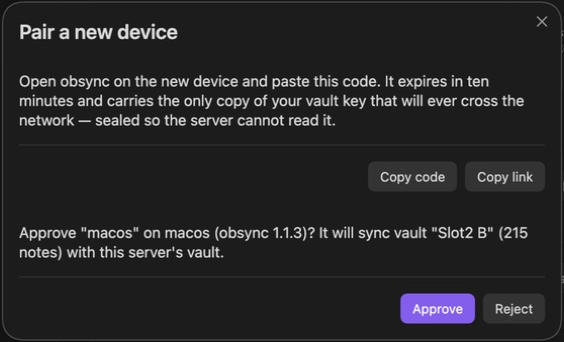

# Pairing details and delete-versus-edit, 2026-09-24

The composed #141 and #178 changes passed `make check` with the repository's
pinned Node 26.8.2/npm 11.19.1 and Rust 1.98.0: 144 core tests, 369 server
tests, two CLI tests, 977 plugin tests, 70 dashboard tests and 767 contract
tests. Rust line coverage was 94.68%. The source and history secret scans
reported no leaks. The core suite retains its existing one ignored test.

Pairing details passed 17 focused plugin mutation probes (M510–M526) and five
server mutations for envelope size, nonce shape, base64 decoding, claim
storage and creator polling. Delete-versus-edit passed ten focused probes
(M650–M657 and recut M252/M253). Each compiled and was killed by its
corresponding behavioral tests. These focused runs do not substitute for the
final complete mutation matrix, which is still pending composition of the
remaining release changes.

The server keeps the claimant vault details sealed. The creator decrypts and
validates them before presenting approval; older claims without details stay
compatible. Tests cover a closed modal during decryption and invalid payloads
without consuming a claim or enrolling a device.

The delete-versus-edit regression includes two independently syncing clients,
a startup upload racing settlement, preserved deletion history, replay, and a
later edit. See [the research and decision record](2026-09-24-delete-edit-research.md).

## Native pairing

Two isolated profiles of unmodified desktop Obsidian 1.13.7 paired through
the native interface. The approving device named the claimant's disposable
vault and its **215 notes** before approval. The candidate bundle SHA-256 was
`301a1d13f38cc799254d5f6871cac8e65d6d5462bf3c37f408dfe0571d6dc544`.
After approval both vaults held the same 217 files with identical contents.

The screenshot crops the actual approval dialog after the pairing-code
display was closed; it contains no code or credential. The quickstart uses
this capture to explain what the approving person should check. The later
settings refresh fix is covered by modal-close callback regressions.

## Native delete-versus-edit

On candidate bundle
`7557e642f146659c8dfe3cf0e974f405d8ca904d6364898102ddaf5a92d3efed`, the
second desktop's sync was disabled through Community plugins. Its native
editor appended a sentence while the first desktop deleted the same
disposable note through **Delete current file**. The first desktop had
published a tombstone before the second reconnected.

Re-enabling sync restored the edited note on both devices, with the same
SHA-256 and no conflict copy. Eleven observations over 300.1 seconds found
unchanged file records, unchanged contents and no new copy. A separate
same-line offline conflict ended with one copy and both sentences preserved;
[its real screenshot](../conflicts.md) illustrates the user-facing outcome.
No repeating notice was observed. The automated server test, rather than a
native screenshot, proves the single current head and retained tombstone.

Current-candidate phone acceptance remains separate from these desktop checks.
