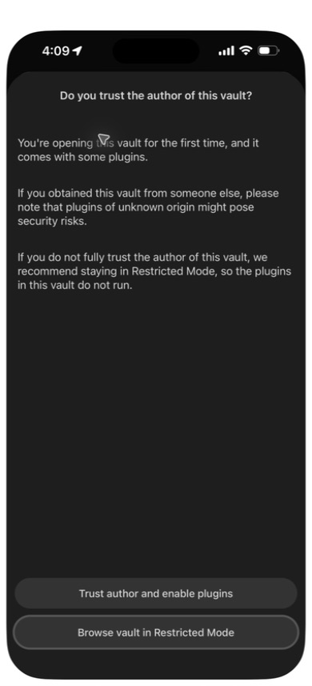
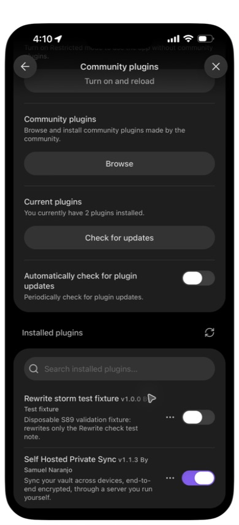
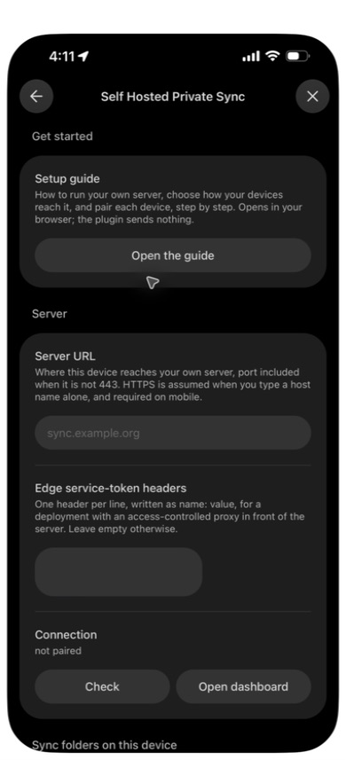
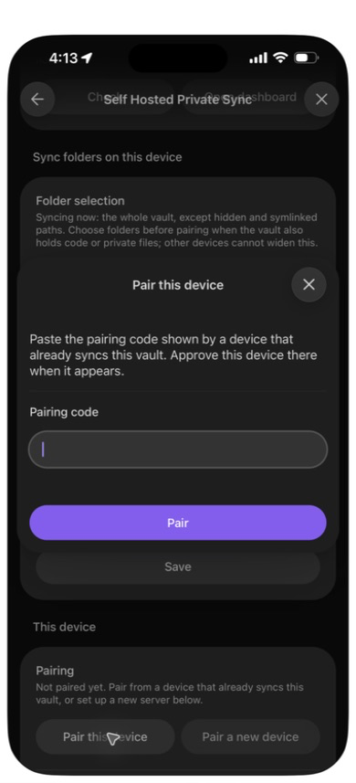
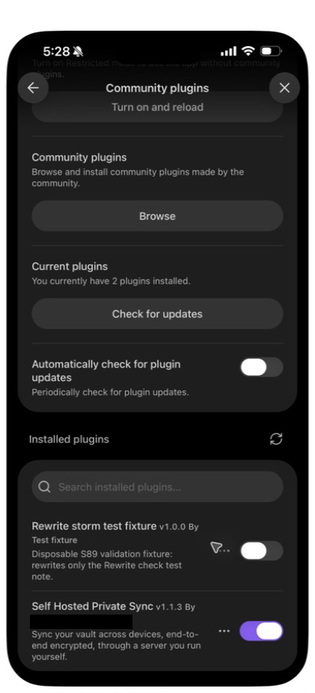
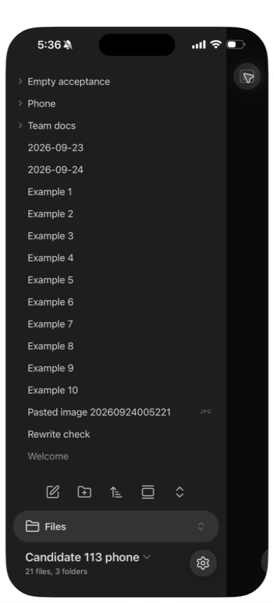
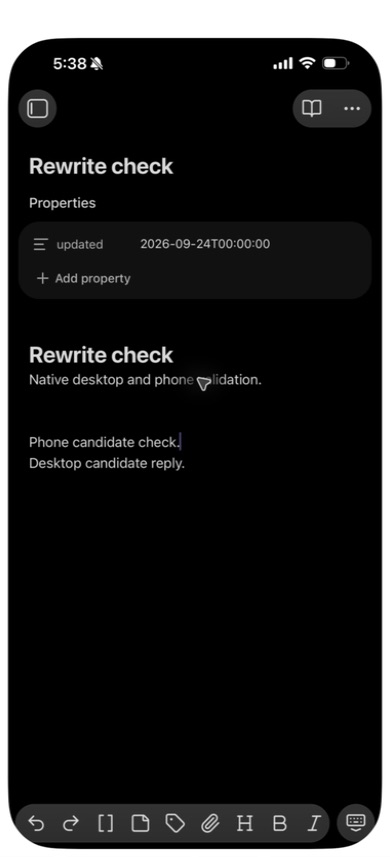
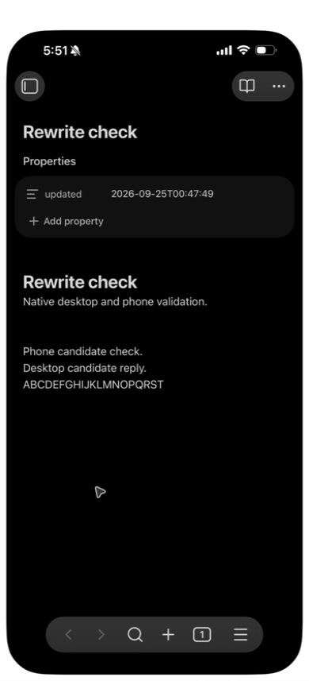
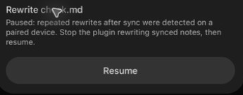

# Native phone candidate 1.1.3, 2026-09-24

This author-operated campaign uses a separate synthetic phone vault and an
isolated desktop profile. It follows the [1.1.2 phone run](2026-09-24-phone-candidate.md)
and does not replace that historical record.

- **Route:** the existing LAN HTTPS reverse proxy and previously trusted test
  certificate on the phone. No system trust setting was changed in this run.
  The desktop uses a loopback-only HTTP proxy to the same isolated backend.
- **Server:** local 1.1.3 candidate built from `4f5e67b`, image
  `sha256:dca7e238bec0bb89f726e376eb1564fe8b624c16fbe6e94070b2bbea3fb207e3`.
  The old server volumes were backed up before recreating the backend; the
  existing HTTPS front and volumes were retained.
- **Plugin:** manually installed 1.1.3 candidate, bundle SHA-256
  `fcb6f3dbd45120d615a5ce6da6be63d4f7ccce0f8548dce27ead7d8f89f4b482`.
  This includes the later #133 replacement-boundary repair. The public-code
  archive SHA-256 is `f0b486dd1d35df2333df283cad36b107355fc3b13104d31ff60c6faed6c98270`.
  It contains no enrollment, credential, token or vault key.
- **Devices:** desktop Obsidian 1.13.7 on macOS 27.0; phone Obsidian 1.13.7.
  Hardware models and phone OS version were not recorded during this run.
- **Operation:** native UI through iPhone Mirroring and the isolated desktop
  app. The archive contains one synthetic note and a disabled rewrite fixture
  limited to that note and its conflict copies. No injected Obsidian API drives
  user actions.

## Installation observed

Safari downloaded the archive. Files moved it into the local Obsidian folder
and extracted it using **Uncompress**. **Manage vaults** found the new vault;
opening it displayed the author-trust prompt below. The known local test
bundle was enabled, and Community plugins showed version 1.1.3. The rewrite
fixture remained disabled. This manual candidate path is not a result for
installation through the production Community Plugins directory.

The screenshots above belong to the initial installation. The final candidate
was installed and paired in the follow-up below. No pairing code, setup token,
recovery phrase or private connection detail appears in the published captures.

## Final candidate installation and pairing

The unpaired test vault was replaced through Files with the final candidate
built from `cba9eec021c11bdba0adce97d0c6f50ce3b97259`. Its bundle SHA-256 is
`72495e0339faa22817684baff95a38b696cbdd9ac3915a0baf76617c4c0ff211`;
the archive SHA-256 is
`0ccb6612f22a88860615378ac0d06f23f51aa6dfb5b4c9a196ec7451b5ce1512`.
The archive contains the plugin, one synthetic note and the disabled fixture,
with no credentials or enrollment data. The desktop uses the identical bundle.
The phone retained its prior trust choice for this synthetic vault path; this
replacement did not display a second author-trust prompt.

The phone's **Check** reached the existing QA server over HTTPS. With explicit
owner approval, a one-use invitation was transferred from the desktop through
native key presses and temporary memory only. It was never printed, saved or
captured. The desktop approval named **Candidate 113 phone**, reported **1
note**, and identified plugin **1.1.3**. After approval the phone showed **21
files and three folders**, matching the desktop, without conflict copies.

A line typed on the phone arrived in the desktop editor. The desktop reply
then appeared in the phone's still-open note. Neither direction used **Sync
now**. The phone contents were visually verified; no phone-filesystem hash is
claimed.

## Rewrite hold on desktop and phone

Both native editors opened the same synthetic note. Each enabled the scoped
one-second front-matter fixture through Community plugins. Twenty letters,
`ABCDEFGHIJKLMNOPQRST`, were typed on desktop through native keys with a
500 ms delay after each key. The phone detected repeated rewrites and the
desktop received the shared hold. All twenty letters remained together in
the desktop main note, while the held phone note contained its earlier `ABCD`.
The phone's **Show sync status** named the paused note and offered **Resume**.
Eleven samples over **301.45 seconds** found no new note-version POSTs,
no copies, a stable desktop file record and all twenty letters intact. Local
timestamps continued changing, showing that the fixtures were still active.
There were four version POSTs between the pre-typing baseline and the first
hold sample, counting this otherwise idle QA account's version requests.

Both fixtures were disabled through Community plugins; their disabled state
was verified. **Resume** on the phone completed, followed by **Sync now** on
the desktop. Both main notes contained all twenty letters and exactly one
conflict copy remained. The desktop main SHA-256 was
`bb7b67b6d11ea381c6c6562087bce4052a8a7b6a11f9039d1adac85662a9c318`;
the copy SHA-256 was
`1091018a831d27d1057b97194569437cffdc5915cf69c21efdef27f4f609ed62`.
Phone contents and copy count were visually verified, not filesystem-hashed.

Eleven further samples over **301.44 seconds** found zero new version POSTs,
stable desktop note and record hashes, one copy and no hold. The phone still
showed the full typed sequence. This passes the exercised desktop/phone S89
case on this bundle. It does not establish every mobile timing, every plugin's
rewriting behavior, or the opposite native Resume order. Both orders remain
covered by the automated suite.

The local receipts are `113-phone-rewrite-hold.json`,
`113-phone-rewrite-quiet.json`, `113-phone-rewrite-resume-result.json` and
`113-phone-rewrite-typing-times.json`.

## Ordinary co-typing

With both fixtures disabled, desktop and phone edited separated lines of a
fresh note. A rapid, unpaced key-injection attempt changed the intended digit
sequence and is retained as a failed test input. A phone-only rapid control,
with the desktop idle, also changed it; paced phone input preserved it. These
rapid attempts do not count as passing co-typing evidence or establish a sync
root cause.

The retry alternated native desktop and phone key presses with 500 ms after
each action. Both main notes converged with the complete desktop sequence
`ABCDEFGHIJKLMNOPQRST` and phone sequence `12345678901234567890`, with zero
conflict copies. The desktop note SHA-256 was
`e3b2341f67ec9051dbe0d9138d3b1a232bbcaffb558b5aa5dfe85bad191a822b`.
The phone result was read in its native editor. The exact dispatch times and
both failed and passing controls remain in the local evidence. This tests
interleaved real-device input at the recorded cadence, not simultaneous
physical key presses or an injected network delay.

## Remaining automated acceptance failure

The subsequent six pristine full-suite runs passed five lanes, but one failed
the separate automated co-typing case: after repeated concurrent merges,
`B012` remained in a conflict copy rather than the shared main note. Each
device converged on one main version and one copy, but that does not meet the
separate-line typing requirement. The mutation matrix remains paused while
this failure is diagnosed. The native observations above stand only for their
recorded inputs and cadence; they do not clear this failing schedule.

The subsequent [publication-order follow-up](2026-09-24-cotyping-order.md) records the repair and its focused stress evidence. It does not replace the affected native acceptance gate for the new bundle.
