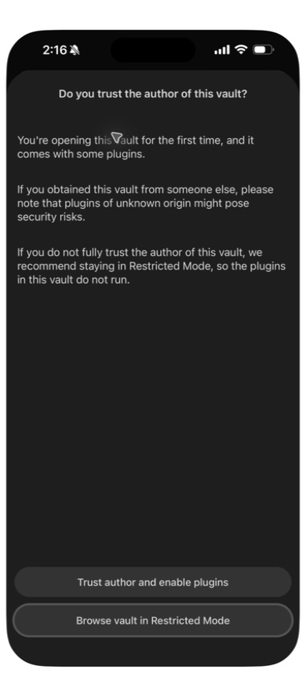
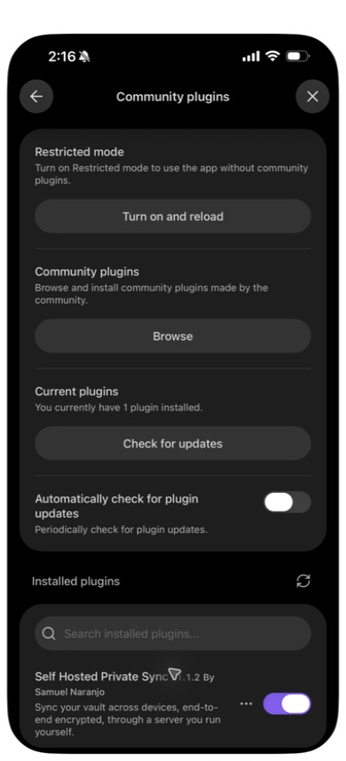
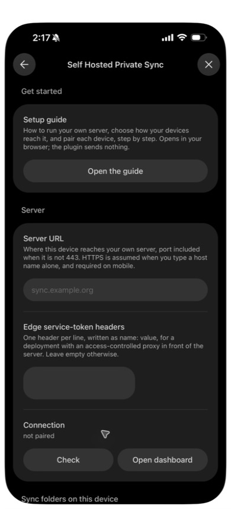

# Native iPhone candidate installation, 2026-09-24

This record uses the owner's iPhone through iPhone Mirroring, with a separate
synthetic **Candidate 112 phone** vault. The existing **LAN Demo** test vault
was left on its directory build. No private vault was opened.

## Build and installation

- Obsidian on the phone displayed **1.13.7**. The iOS version and phone
  hardware model were not recorded.
- Plugin source: `6efe0a40d0673f63e8ce56631f897d766f2ba8b6`, the repaired
  1.1.2 candidate. The directory still delivered 1.1.1; this was a manual
  candidate installation, not a published 1.1.2 update.
- `npm ci --ignore-scripts --offline` and `npm run build` used the pinned
  Node 26.8.2 toolchain. The built `main.js` SHA-256 was
  `922744e3a409a42a9763028ce8c3b8a71a50457480fd0595809e176422a693a1`.
- The ZIP contained the three plugin assets, a Community plugins list and
  ten synthetic Markdown notes. It contained no device identity, setup
  token, pairing code, vault key or recovery phrase. Its SHA-256 was
  `324cf529243edf7202bd5a78a795091c819da650b4c62449e41cca93c521ea69`.
- A temporary LAN HTTP endpoint served only that public-code ZIP. The
  downloaded bytes were checked against the source archive on the laptop.
  This is a QA transfer, not a claim of authenticated phone-side artifact
  verification or a recommended release-distribution route.

In Safari, download the prepared archive and reveal it in **Files**. Copy
it into **On My iPhone → Obsidian**, use the archive's **Uncompress** action,
then open Obsidian → **Manage vaults** and select the new test vault.
The hidden plugin directory travels inside the archive even though Files
shows only the ten ordinary notes. The phone offered this trust prompt:

After trusting this locally built test vault, Community plugins displayed
**Self Hosted Private Sync v1.1.2**, enabled:

Its settings opened normally. Server URL, optional proxy headers and
connection controls fit the phone viewport:

## Acceptance boundary

Installation and opening settings passed. Pairing, two-way edits, offline
restart and reconnection are not yet results of this record. The candidate
vault is unpaired. Automatic approval review blocked moving a one-use
pairing code through temporary agent memory under the handoff's no-storage
rule; explicit owner approval or owner-operated pairing is pending.

The corresponding desktop uses the same candidate bundle in an isolated
profile. It reaches the existing synthetic server through a loopback-only
proxy because macOS does not trust that server's test certificate authority.
The phone's configured route remains HTTPS with its existing test trust.
System certificate trust was not changed. None of these observations proves
1.1.3 phone acceptance or an internet-hosted deployment.
