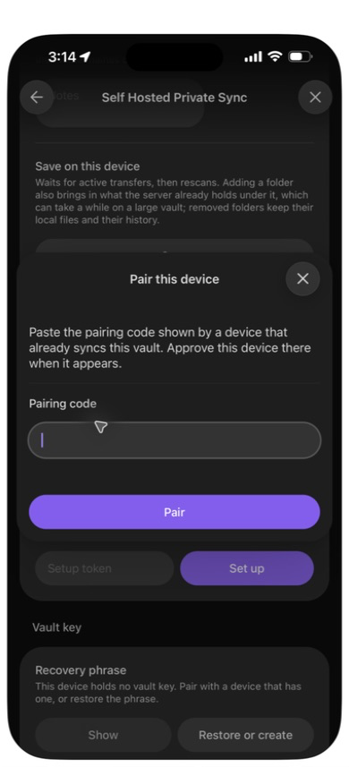
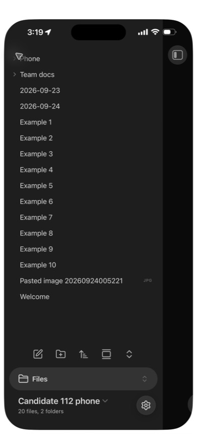
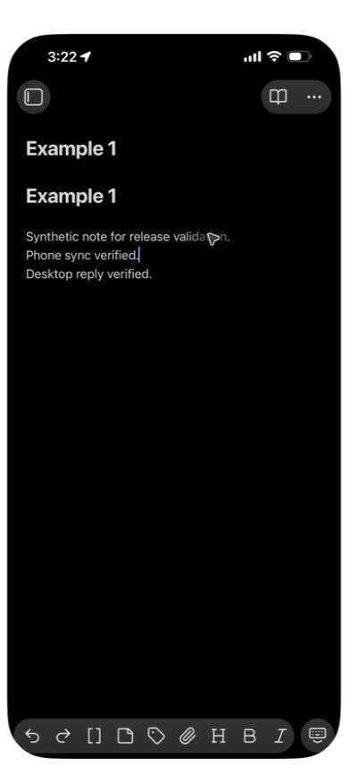
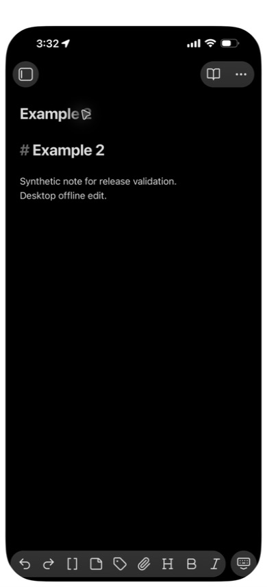
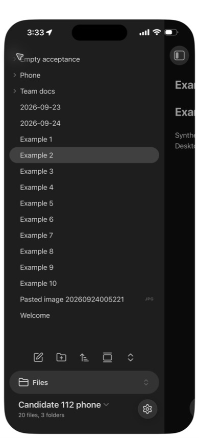

# Native iPhone installation and 1.1.2 acceptance, 2026-09-24

This record uses the owner's iPhone through iPhone Mirroring, with a separate
synthetic **Candidate 112 phone** vault. The existing **LAN Demo** test vault
was left on its directory build. No private vault was opened.

## Build and installation

- Obsidian on the phone displayed **1.13.7**. The iOS version and phone
  hardware model were not recorded.
- Plugin source: `6efe0a40d0673f63e8ce56631f897d766f2ba8b6`, the repaired
  1.1.2 candidate. The directory still delivered 1.1.1; this was a manual
  candidate installation, not a published 1.1.2 update.
- `npm ci --ignore-scripts --offline` and `npm run build` used the pinned
  Node 26.8.2 toolchain. The built `main.js` SHA-256 was
  `922744e3a409a42a9763028ce8c3b8a71a50457480fd0595809e176422a693a1`.
- The ZIP contained the three plugin assets, a Community plugins list and
  ten synthetic Markdown notes. It contained no device identity, setup
  token, pairing code, vault key or recovery phrase. Its SHA-256 was
  `324cf529243edf7202bd5a78a795091c819da650b4c62449e41cca93c521ea69`.
- A temporary LAN HTTP endpoint served only that public-code ZIP. The
  downloaded bytes were checked against the source archive on the laptop.
  This is a QA transfer, not a claim of authenticated phone-side artifact
  verification or a recommended release-distribution route.

In Safari, download the prepared archive and reveal it in **Files**. Copy
it into **On My iPhone → Obsidian**, use the archive's **Uncompress** action,
then open Obsidian → **Manage vaults** and select the new test vault.
The hidden plugin directory travels inside the archive even though Files
shows only the ten ordinary notes. The phone offered this trust prompt:

After trusting this locally built test vault, Community plugins displayed
**Self Hosted Private Sync v1.1.2**, enabled:

Its settings opened normally. Server URL, optional proxy headers and
connection controls fit the phone viewport:

## Pairing and identical first sync

The paired desktop used the same candidate bundle in an isolated profile of
Obsidian 1.13.7 on macOS 27.0. The backend was the existing local 1.1.1 QA
container. The desktop reached it through a loopback-only proxy because macOS
did not trust the test certificate authority. The phone used HTTPS with its
existing test trust. No system trust setting was changed.

Before pairing, ten byte-identical notes were seeded on the desktop from the
same fixture used in the phone archive. The desktop already had ten other
synthetic files and two folders. The phone's empty pairing form was captured
before creating the invitation:

With explicit owner authorization, the one-use code was transferred through
the UI using temporary memory only and approved on the desktop. No code was
printed, saved or captured. The phone received the desktop's additional files
and showed **20 files and two folders**, with exactly one of each of the ten
seeded notes and no conflict copies. The desktop also held 20 files and no
conflict copy. This passes the exercised identical-first-sync case in #131.
The 1.1.2 settings page retained its old unpaired description until reopened;
file arrival and the subsequent sync-status dialog established the enrollment.

## Two-way edits and automatic recovery

A line typed in the phone's native editor arrived in the desktop editor.
The desktop's reply then appeared on the phone without **Sync now**:

An empty folder created through the desktop's **Create new folder** command
arrived on the phone. The QA backend was then gracefully stopped, retaining
its volumes. The phone's status became **offline — retrying**. With the server
still stopped, the isolated desktop process was quit, verified absent and
relaunched into the same vault; its notes and empty folder opened with offline
status. The phone's **Reload app without saving** command reopened its local
note while the backend remained unavailable. No exact startup latency is
claimed; the phone observation is an app reload, not an OS force-quit test.

Each native editor then made a different offline edit, in separate notes.
After the same backend was started, no manual sync or plugin toggle was used.
The phone's edit arrived at the desktop **56.17 seconds after the local
observation loop began**, just after server readiness. The desktop's edit
was later visibly verified on the phone; that direction has no precise
arrival-time measurement. The phone's status settled to **idle**, tracking
20 files. Both devices retained the empty folder, and the phone still showed
**20 files and three folders**, without conflict copies.

These observations pass the exercised server-recovery path in #129 and the
empty-folder restart case in #148. The local evidence includes the before/after
file inventory, server readiness timestamp and two-second polling samples.
They do not establish every V/J scenario, exact network-return latency on a
roaming connection, an internet hosting route, or 1.1.3 phone S89 acceptance.
Only the two edited note contents were visually compared on the phone; this is
not a claim to have hashed the phone filesystem.
