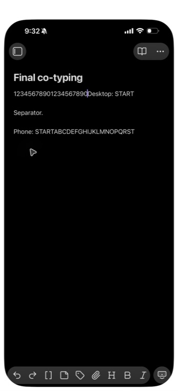
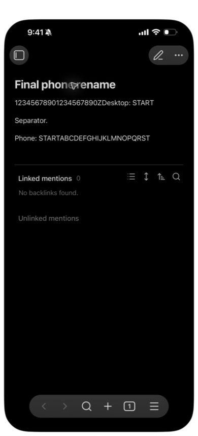

# Phone timing and first-sync follow-up, 2026-09-24

This continues the [1.1.3 phone campaign](2026-09-24-phone-1.1.3.md), using
the same isolated desktop, synthetic phone vault and local QA server. Both
devices ran Obsidian 1.13.7. The manually installed plugin bundle SHA-256 was
`530ca4aeb1fee893817f99110346226e7573714c542f3d303b45971e0f4b85aa`;
the credential-free archive SHA-256 was
`0fe0b4095330aa04d6866feb17afe824e6b7d16796624b170f3cb9ff90e2a588`.
Only obsync was enabled; the earlier rewrite fixture was absent.

## Native typing and renames

Mirroring initially accepted navigation but dropped text input. After the
owner restarted it, individual native key presses with 650 ms spacing worked.
Bulk input still dropped characters and is not used as successful evidence.

The valid co-typing case used two sections with an unchanged `Separator.`
line between them. Alternating desktop and phone input produced the full
twenty-letter sequence `ABCDEFGHIJKLMNOPQRST` and twenty-digit sequence
`12345678901234567890` in both open notes, without **Sync now** and with zero
new conflict copies. The labels in the fixture are not input provenance:
the phone typed the digit prefix of the first section; desktop typed the
letter suffix of the last section. The phone content was visually compared,
not filesystem-hashed.



A desktop rename appeared in the phone's open note. A subsequent phone edit
and phone rename both arrived at desktop, with the old paths absent and all
content intact. The incoming phone rename closed the desktop's current note
view; reopening the renamed file confirmed its contents. This establishes
content and path propagation, not uninterrupted desktop focus on rename.



Two earlier attempts are retained as limitations. One placed a caret in the
wrong section and is invalid test input. Another edited adjacent lines with
no unchanged line separating the edits; conservative line-based merging kept
conflict copies. Six copies from those attempts were present before the
separated-section test and remained unchanged. Zero **new** copies is the
measured result, not a claim that those earlier copies disappeared or that
every adjacent-line overlap merges automatically.

## First-sync regression found

Fresh pairing recreated seven conflict copies from older versions of the
synthetic typing note. Its journal retained 44 versions and one current head;
the copies were newly published by the joining phone. They were not old files
merely downloaded from the server.

The file endpoint returns its newest ten versions plus **every current head**.
The test server had exposed the entire graph. When older parent links fell
outside the real endpoint's window, the client could no longer prove that an
old fork led to a current head and treated it as an unresolved conflict.

`plugin/test/history-catchup.test.mjs` reproduces that bounded view with twelve
fork-and-merge rounds. Before repair, fresh desktop and mobile simulations
each recreated eight resolved conflicts. The repair skips an obsolete feed
entry only with a nonempty head list whose head records are all present,
leaving local bytes untouched for later feed entries to advance. An actual
older live head outside the ten-version window still preserves both edits.
Empty or incomplete head views still take the conservative conflict path.

The five focused regressions pass. Mutation controls M716, M729, M730 and
M731 each apply and compile, then fail two, one, one and one tests respectively;
the restored source passes again. An initial scratch build omitted vendored
Obsidian declarations and is retained as a setup failure, not a mutation kill.
Run the witnesses with the pinned toolchain:

```sh
npm --prefix plugin run build
node --test plugin/test/history-catchup.test.mjs
```

This section records the native failure and automated repair. Native fresh
pairing with the repaired bundle remains a separate acceptance gate; the
typing and rename screenshots above do not claim to validate that repair.
