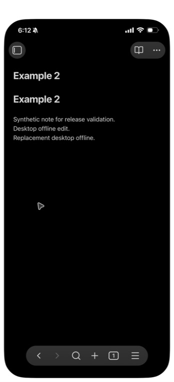
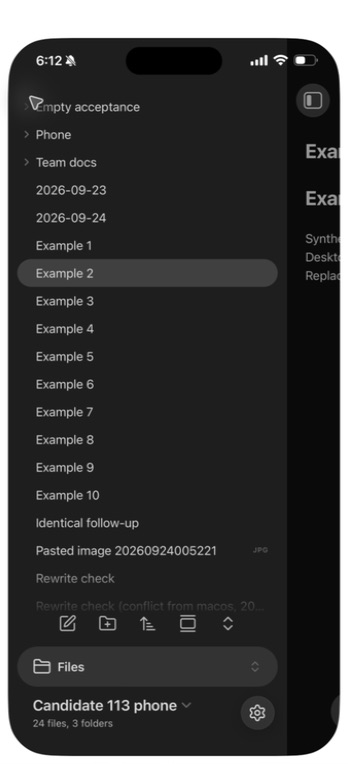

# Replacement-build device follow-up, 2026-09-24

The repaired 1.1.2 desktop candidate at
`37c05bf04ce2bc6cb1b78b8f8f1f86d3de9be221` used bundle SHA-256
`7a937b63cbcf8f7bb536a45a0c40b34aeb3c066bb57817dfa99a46acd3006848`.
Its peer was the physical iPhone running the final 1.1.3 candidate, bundle
`72495e0339faa22817684baff95a38b696cbdd9ac3915a0baf76617c4c0ff211`.
Both used unmodified Obsidian 1.13.7. This is deliberately recorded as a
mixed-version native follow-up: it does not claim that the replacement 1.1.2
bundle was installed on the phone. The earlier all-1.1.2 phone run remains
[separate historical evidence](2026-09-24-phone-candidate.md).

The phone had already completed the [final 1.1.3 pairing, two-way edit and
rewrite checks](2026-09-24-phone-1.1.3.md). The isolated desktop was closed,
its plugin assets replaced with the exact 1.1.2 bundle above, and its same
profile reopened. Its existing enrollment, files and empty folder remained
available, with idle status. No owner vault was opened.

## Offline startup and identical notes

The same isolated QA backend was gracefully stopped with its volumes retained.
Both native editors independently created **Identical follow-up** with the
same text, **Matching offline note.**, while the server was unavailable.
Each device also edited a different existing note offline. The desktop was
quit, its process absence verified, and its same profile relaunched while the
backend remained stopped. Its offline edit and empty folder survived, and the
status was **offline — retrying**. On the phone, **Reload app without saving**
reopened the local note with its offline edit intact. This is an app reload,
not an iOS force-quit claim.

After the same backend restarted, no **Sync now** or plugin toggle was used.
The phone edit arrived in the desktop file **50.22 seconds after the local
observation began**, following the backend start command. This measures the
observation window, not exact network-return latency. The desktop edit was
then visually confirmed on the phone without a precise arrival-time claim.

The new identical note remained one note with unchanged matching content and
no corresponding conflict copy. Both inventories held **24 files and three
folders**, including the retained empty folder. The one pre-existing rewrite
conflict copy remained; this run did not create another. The phone file list
and edited text were visually checked, not filesystem-hashed.

The local receipts are `112-replacement-offline-start.json` and
`112-replacement-reconnect.json`. The native observations cover the exercised
identical-note and offline/reconnect journeys. The adversarial asynchronous
identity-replacement windows remain the two deterministic regression tests
and M710/M711, not a race claimed to have been injected through the phone UI.
