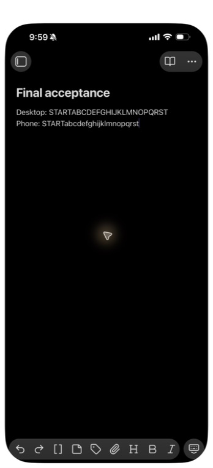
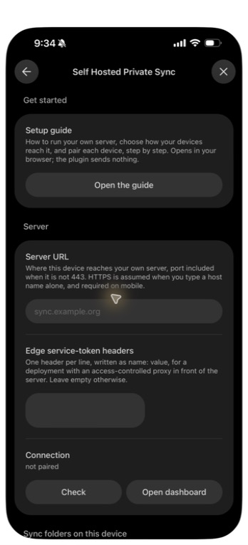
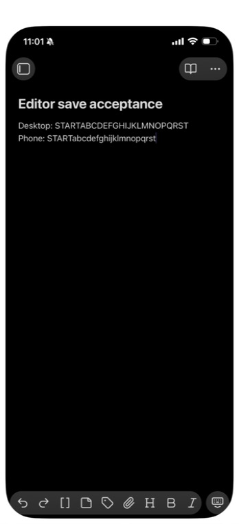

# Native editor-save follow-up, 2026-09-25

This author-operated run continues the [phone timing campaign](2026-09-24-phone-timing-followup.md).
It records two superseded candidates that failed same-line typing, followed
by the automated repair. Neither earlier native pass establishes acceptance
of the replacement bundle.

- **Route:** isolated Compose backend, LAN HTTPS reverse proxy for the phone,
  and a loopback-only HTTP proxy for desktop. The phone used the previously
  trusted test certificate; no trust setting changed during these runs.
- **Server:** local 1.1.3 candidate from `4f5e67b`, image
  `sha256:dca7e238bec0bb89f726e376eb1564fe8b624c16fbe6e94070b2bbea3fb207e3`.
  The running image was rechecked for this record.
- **Devices:** desktop and phone ran Obsidian 1.13.7. Hardware models and OS
  versions were not recorded during these runs.
- **Installation:** manual QA bundles in isolated synthetic vaults. This is
  not an installation result for the Community Plugins directory. Only
  obsync was enabled; the rewrite fixture was off.
- **Input:** ordinary native keyboard events through the desktop app and
  iPhone Mirroring. Phone contents were visually compared, not
  filesystem-hashed. The recorded cadence is part of each result.

## Published-source candidate

Bundle SHA-256:
`ddd6683f65ea001e833116f386606604b168b641e5ce995d6b19a28abb47480c`.

Fresh pairing downloaded 39 files and three folders, including 14 historical
conflict copies. Two-way edits passed. An adjacent-line run alternated twenty
desktop letters and twenty phone letters for 111.62 seconds. Both main notes
held the complete sequences, with no new copies. This run did not independently
verify the server's head count.

Same-line typing failed twice, including a repeat with individual key events.
The settled main text was `Shared: START|AbbCddEFGHIJKLMNOPQRSTfghijklmnopqrstt`:
letters were missing or duplicated. Zero new copies did not make that a pass.
The desktop displayed Obsidian's external-change merge notice during the
individual-key repeat.

The setup screenshots used in the quickstart come from this candidate. They
show installed controls and pairing; they do not establish typing acceptance.

## Unsaved-buffer guard candidate

Bundle SHA-256:
`c38c2b173f8e121deb5fa39f400ef6043cb0c4a4bc9788be2af917e3b99cf025`.

The first repair checked the open editor immediately before the native file
commit and refused to overwrite unsaved text. It passed the full local gate,
including 1,179 plugin tests and eight native-host regressions, before manual
installation on desktop and phone.

Fresh pairing encountered a seed note whose name matched a different existing
note. The expected preservation copy was retained; this was not counted as a
same-note convergence pass. A new shared note supplied the typing baseline.

| Scenario | Result | Observation |
| --- | --- | --- |
| Two-way edits | Pass | Desktop and phone verification lines appeared in both main notes without Sync now. |
| Adjacent lines, 40 key events over 106.344 seconds | Pass | Both complete twenty-letter sequences survived; zero new copies. |
| Same line, 40 key events over 120.089 seconds | Fail | Eleven phone letters were absent from the main note and eleven new conflict copies appeared. |

The adjacent-line result independently replayed the QA journal's checksummed
version frames from sequence one. It found one current head, matching the
desktop's recorded version. The same-line failure also had one head and no
paused note; its main text was
`Shared: START|ABCDEFGHIJKLMNOPQRSTacehkmoqs`. The missing phone letters were
`b,d,f,g,i,j,l,n,p,r,t`. Conflict copies contained intermediate text with
duplicate characters. A single server head and an idle status alone therefore
did not prove correct editor reconciliation.

The raw action times, UI observations, journal-derived head receipts and
failed results remain in the local QA evidence. No raw journal, credential or
device identifier is included here.

## Active-editor retry repair

Replacement bundle SHA-256:
`f96e1bc1fdb32332dc448b72a75424a55670ed6c8899d18b89ca7f282822f407`.

The unsaved-only snapshot did not cover the interval between an editor save
and Obsidian's asynchronous external-change handling. The replacement defers
the incoming native file commit while text is unsaved or trusted input was
recent. It uses the existing ten-second typing window. A one-second retry
checks only waiting editor notes, leaves other notes syncing, and reconciles
the latest server heads once the editor settles. The wait is durable across
restart and appears as pending work, without repeated failure notices.

The full local gate passed with unchanged source and test hashes: 1,188 plugin
tests and 70 dashboard tests. All nineteen added mutation controls
M798–M816 applied and compiled, produced behavioral test failures without
cancelled tests, and passed after restoration. They cover both native commit
paths, recent input and unsaved-buffer guards, pending status, retry ownership,
restart, transient failure and the separate locked-file backoff.

These are automated results. Native acceptance of this replacement and the
complete mutation campaign are still outstanding in this record. The earlier
screenshots do not stand in for those results.

## Screenshot handling and limits

Captures are actual UI pixels. Public PNGs retain only mandatory image chunks;
the approval dialog is cropped, and the confirmation's private server address
is covered with an opaque mask. Kept visible pixels were compared with their
source captures. No generative editing was used. The phone Leave dialog is
also cropped to omit its device-list background and is shown in the recovery
guide.

This record does not claim final S02 acceptance, production-path installation,
production deployment, or completed QA cleanup. Other validation scenarios
were not attempted during these typing runs; their earlier records retain
their original build scope.

The subsequent [three-device typing follow-up](2026-09-25-passive-peer-typing.md)
records the active-editor retry candidate's native failure, two additional
merge repairs and the next candidate's evidence. The checkpoint above is
retained as the state observed before that follow-up.
