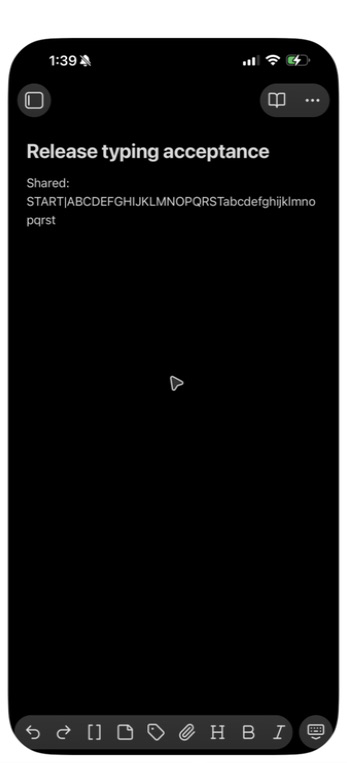
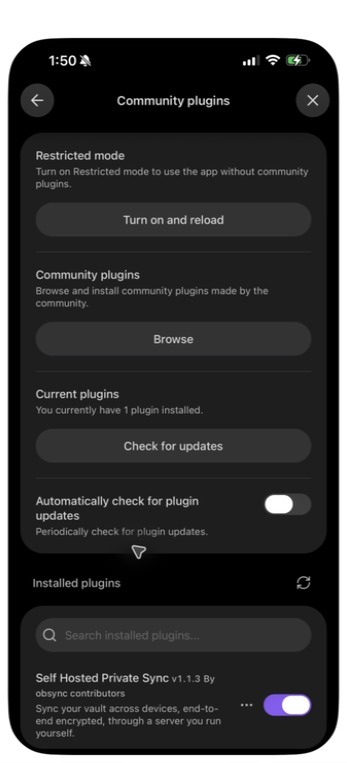

# Three-device typing follow-up, 2026-09-25

This author-operated run continues the [native editor-save campaign](2026-09-25-native-editor-save.md).
It retains two failed candidates and records the repair's automated evidence
and mixed-build diagnostic passes. Final acceptance with every device on the
same bundle remains outstanding at this checkpoint.

- **Route:** isolated Compose backend, private LAN HTTPS reverse proxy for
  the phone, and a loopback HTTP proxy for the second desktop profile. No
  public route or provider service was used.
- **Server:** local 1.1.3 candidate from `4f5e67b`, image
  `sha256:dca7e238bec0bb89f726e376eb1564fe8b624c16fbe6e94070b2bbea3fb207e3`.
- **Devices:** two isolated desktop profiles and one physical phone, all
  using Obsidian 1.13.7. Hardware models and OS versions were not recorded
  during these runs. Two profiles do not establish two physical computers.
- **Installation:** manual QA bundles in synthetic vaults. Community Plugins
  directory installation and production deployment are not claimed.
- **Input:** ordinary native key events through the desktop app and iPhone
  Mirroring. The phone's initial caret and first ten letters were checked
  visually. Final phone text was compared visually, not filesystem-hashed.
  The second desktop was a passive receiver throughout.

## Retained failures

The active-editor retry bundle
`f96e1bc1fdb32332dc448b72a75424a55670ed6c8899d18b89ca7f282822f407`
failed a verified adjacent-line run: forty key events over 78.832 seconds
left `Desktop: STARTABCDEFGHIJ` and `Phone: STARTabklmnopqrst` in the main
note, with sixteen new conflict copies. It had one server head and no paused
note. A preceding attempt had uncertain input placement and is retained
locally but is not used as the verified reproduction. A phone-only control
confirmed that all twenty individual key events could reach the editor.

The first merge repair, bundle
`b8a2789d6329142cc6ce02bb144cdeb44a86122cf178960e26dd7c0fd20c395f`,
still failed forty adjacent-line key events over 61.099 seconds. Seventeen
new copies appeared; the final main note retained the phone's sequence but
none of the desktop additions. Later desktop input moved to the start of
the note after an external update. That was part of the observed failure,
not a successful co-typing result.

## Causes and repair

Two separate paths produced false conflicts:

1. After a shared merge, additions to neighboring lines formed one changed
   block in the line alignment. Continued independent additions then looked
   like overlapping replacements. Equal-length blocks are now separated
   into individual line edits only when every line preserves its original
   prefix. Actual multi-line replacements remain atomic and conflicting.
2. A passive third device alternated between two independent authors. The
   loop detector compared each new version with the other author's previous
   version, so legitimate typing exhausted its budget. It now tracks the
   previous received version per author. Progress resets the budget only
   when it extends that author's branch without descending from the local
   publication. Feedback still reaches the existing limit. Entries whose
   versions leave the received graph are discarded.

Temporary instrumentation in the isolated desktop installations recorded
merge inputs for the single synthetic test note and trusted-input status.
It confirmed that typing protection recognized native events and that the
passive receiver refused its sixth otherwise compatible merge. The
instrumentation was removed before the repaired-bundle controls below;
both desktop bundle hashes were verified after restoration.

## Automated evidence

Repaired bundle SHA-256:
`9cda676aa68087adf1e4f3eabe5b120c128fd490004fa84651ed279dd746c233`.

The full `make check` passed with unchanged source and test hashes: 1,196
plugin tests, 70 dashboard tests, 144 core tests, 375 server tests, two CLI
tests, 767 repository contracts, 94.73% Rust line coverage and both secret
scans. One core benchmark is intentionally ignored.

Eight added regressions cover continued adjacent appends, both host paths,
Unicode and unchanged anchors, structural replacement refusal, a passive
third receiver on adjacent and shared lines, feedback between alternating
authors, and removal of forgotten progress entries. Earlier code failed the
adjacent-block and passive-receiver reproductions.

Eight new mutation controls M817–M824 and ten context recuts applied and
compiled, failed relevant tests with no cancellations, and passed after
restoration. M819 initially survived; an explicit competing multi-line
replacement witness was added before the controls were rerun. That initial
survival remains in the local evidence. M164 and M165 were also rerun against
the final co-typing test file after its changes.

All 769 catalog patches pass strict applicability without fuzz. Six pristine
copies each pass all 1,196 plugin tests. The full campaign is running against
those frozen inputs; no complete matrix result is claimed here yet.

## Mixed-build native controls

Both desktops used the repaired bundle above. The phone still used the first
merge repair, `b8a2789d…`. These controls locate the passive-receiver defect;
they do not establish final acceptance of the replacement phone build.

| Scenario | Result | Observation |
| --- | --- | --- |
| Adjacent lines, forty key events over 67.328 seconds | Diagnostic pass | Both twenty-letter sequences survived in the main note; zero new copies, one server head and no paused note. |
| Same line, forty key events over 62.789 seconds | Diagnostic pass | Main text was exactly `Shared: START\|ABCDEFGHIJKLMNOPQRSTabcdefghijklmnopqrst`; zero new copies, one server head and no paused note. |

Each sequence used individual events spaced about 1.2 seconds apart, with
a visual checkpoint after the first twenty events. The timings include that
checkpoint. Read-only replay of checksummed QA journal frames from sequence
one independently verified each final head and its match to the desktop's
record. The phone showed the same complete text. Existing copies from earlier
failed runs were counted before and after; they were not mistaken for new
copies or silently discarded.

## Final phone installation checkpoint

The repaired bundle was packaged in a credential-free archive and installed
in a fresh synthetic phone vault. Obsidian was reloaded and the plugin's
enabled 1.1.3 entry captured. The settings and empty pairing form were also
captured before entering any secret. These updated screenshots appear in the
quickstart; they establish the visible setup controls, not successful sync.

Mirroring subsequently stopped forwarding keyboard input while pointer
navigation still worked. After a reconnect, it required owner authentication.
No successful pairing claim was observed in that attempt. Matched-build
phone acceptance, the affected rewrite/Resume rerun, and final QA cleanup
remain outstanding at this checkpoint.

After the owner unlocked Mirroring, the same product bundle was reinstalled
with the scoped rewrite fixture present but disabled. The fresh vault held
two synthetic seed notes. Pairing succeeded: the approving desktop named the
expected vault and two-note count; the phone confirmed before uploading
them, and both notes arrived on desktop automatically. The quickstart uses
these approval and confirmation captures, cropped to remove the background
and masked over the private server address.

The first matched-build typing attempt was interrupted when the physical
phone entered use and Mirroring disconnected. Twenty events had been
dispatched, but no phone text checkpoint was possible. This attempt is
recorded as incomplete, not a product failure or an acceptance pass.

The [editor-budget follow-up](2026-09-25-editor-budget.md) records the later
matched-build failure, the independently reproduced editor-refusal defect,
its repair and the remaining acceptance boundaries.

## Evidence boundaries

Screenshots preserve actual UI pixels. Public PNGs contain only mandatory
image chunks, with pixel equality checked after metadata removal. No pairing
code or credential was saved in these captures. Raw diagnostic records stay
outside the repository.

These results do not establish Community Plugins directory installation,
production deployment, other operating systems, or any unattempted scenario
from the wider validation plan. Earlier run records retain their own bundle
and device scope.
