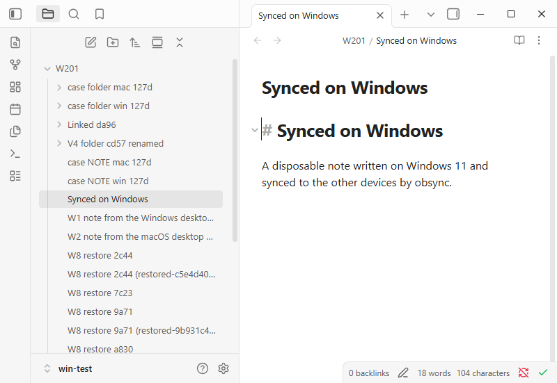
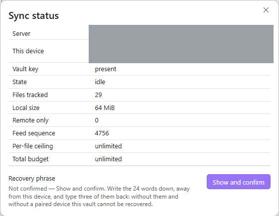

# Windows 11 desktop — 2026-09-27

*Internals, for contributors and reviewers.*

The first recorded run of obsync on Windows. It covers validation V4 (a
folder renamed on Windows, including a folder that is itself a selected sync
folder) and issue #201's Windows item: the NTFS rename, trash and link paths.
It also covers issue #222: a restore from history, and an offline conflict,
each leave exactly one copy.

## Setup

- **Windows:** Windows 11 Pro 24H2 (10.0.26100) on ARM64, in a virtual machine
  (UTM, QEMU, 4 cores, 8 GB). A local account, the vault on the system drive
  (NTFS).
- **Obsidian:** Obsidian 1.13.7 (Electron 43.3.0, Chromium 150, Node 24.18.1),
  from the official Windows ARM64 installer. Its SHA-256 was checked before
  installing:
  `F233DC24896B3F2D5F9E4B01111181A561D0760B2105F0A474024C5F3143A9BC`.
- **The vault and plugin:** `win-test`, a disposable vault. The plugin is the
  1.1.4 train build at `c6ce1d2`, `main.js` SHA-256
  `82a7576665307fcb9963587061bb603144a2ac38b93c16235fcb14b34ad776ed`. It was
  copied into the vault, because 1.1.4 is not published yet. Community plugins
  were turned on through Obsidian's own "Trust author and enable plugins".
- **The server:** obsyncd built from the same train, on the host's loopback in
  plain HTTP. The virtual machine reaches it as its own `127.0.0.1:18731`
  (QEMU user networking and a `netsh` port proxy), so nothing went to any
  other address; the desktop plugin accepts a loopback `http` address.
- **The other device:** a macOS desktop, Obsidian 1.13.4, the same build,
  syncing the whole vault.
- **The folder selection:** saved on Windows before pairing, as
  `docs/validation.md` asks: the folders `W201` and `W201 sel`.
- **How it was driven:** every act and every check was page JavaScript over
  each Obsidian's DevTools port. The Windows port reached the host only
  through a forward bound to the host's loopback. Timings are on the host
  clock around the act and the observer's wait.

## Pairing

The Server URL was typed into obsync's settings on Windows, followed by
**Pair this device** with a one-time code from the macOS desktop.

- The approval prompt on macOS named the new device as a "Windows PC" running
  obsync 1.1.4, and said it would sync vault "win-test" (0 notes).
- The match code the prompt asked for was the one Windows showed. It was
  compared before approving.
- Windows was paired, and read `synced` and `idle` straight away.

After Obsidian was quit and started again on Windows, the device was still
paired, under the same device id, with no prompt, and idle. The plugin's
`data.json` held `credentialRef` and `credentialRevision`; neither the vault
key nor the device secret appears anywhere in the file. So the credential is
held in the operating system's secret storage (V16), on Windows too.

## Journeys

| # | What | Result | Time | Observed |
| --- | --- | --- | --- | --- |
| W1 | A note made on Windows | pass | 1.3 s | On macOS under the same name, identical bytes (49 bytes), nothing done there. |
| W2 | A note made on macOS | pass | 1.6 s | On Windows under the same name, identical bytes. |
| W3 | V4: a folder of 3 notes and a subfolder with 1, renamed on Windows | pass | 0.5 s | On macOS under the new name: the same 4 files and bytes. The old name is gone, and the trash is unchanged on both. |
| W4 | V4: the selected folder `W201 sel` itself renamed on Windows | **fail** | 120 s | macOS shows both notes under the new name with identical bytes, and the Windows selection names the new path. But macOS still holds an empty folder under the old name: [issue #240](https://github.com/snaraj/obsync/issues/240). |
| W5 | Case-only renames on NTFS (`Case note` → `case NOTE`, `Case Folder` → `case folder`), made on each side in turn | pass | 0.5 s each way | The other side shows the new spelling on disk, 1 copy, no deletion. |
| W6 | The trash, both ways | pass | 1.0 s from Windows, 2.5 s from macOS | The note left the other vault, the status there read `synced`, and no error notice appeared. |
| W7 | A junction inside the vault, pointing at a folder outside it | pass | at the next sync | Refused with the notice "obsync doesn't sync linked folders: … is a link, so it stays on this device only". macOS received nothing from it, and no folder under its name. Logged `decision=excluded reason=symlink_component`. |
| W8 | #222: a note with two versions, **Restore from history** → the first → **Restore a copy** | pass | 0.5 s | The notice said the copy was saved. Exactly 1 restored copy, holding the first version's exact bytes, the same copy on macOS, and no error notice. |
| W9 | #222: the same note edited on both sides while the server was down; macOS synced first | pass | 0.4 s | Windows met the conflict. 1 conflict copy on Windows and 1 on macOS; both edits kept, one in the note, one in the copy. |
| W10 | A 64 MiB file of random bytes made on Windows | pass | 6.2 s | On macOS with an identical SHA-256. |

## Findings

- **W4, issue #240 (1.1.5).** Renaming a folder that is itself a selected sync
  folder moves its notes correctly everywhere. But the old folder's removal is
  judged against the selection *after* the rename, refused as out of scope,
  and never sent, so every other device keeps an empty folder under the old
  name.
  - It dates from 1.1.0, and the same test fails at 1.1.3.
  - The workaround was tried live: deleting the leftover empty folders on the
    macOS desktop (which syncs the whole vault) removed them from a third
    device within seconds.
- **#222 on this machine.** No `directory_fsync` line was logged in W8 or W9:
  syncing the folder did not fail here, as it does on the CI's Windows
  runner. What #222 asks of a real machine held all the same: a restore gives
  exactly one copy and no error, and a conflict leaves exactly one copy.
- **The rewrite detector, by design.** The first W9 attempt edited the note
  on macOS by script 2–4 s after it arrived, with no keyboard input. obsync
  treated that as a plugin answering a sync (#179), paused the note on macOS
  and said so. **Resume** in **Show sync status** cleared it. The recorded
  attempt waits out the 5 s window, as a person's edit would; typing is never
  treated this way.

## Not covered here

- **The production install:** Community plugins → Browse → Install, and a
  later **Check for updates** to the published 1.1.4, on Windows. Owed once
  1.1.4 is released.
- **An x64 Windows machine.** CI's `obsidian-windows` and `plugin-tests
  (windows-2025)` legs run on x64.
- **A file another program holds open.** Covered by CI's `obsidian-windows`
  leg, not by this run.
- **A server running on Windows**, or a setup token pasted from PowerShell:
  the server ran on the host.
