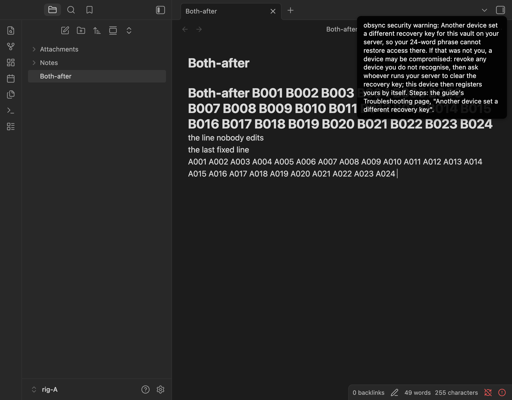

# One notice channel, and notice settings — 2026-09-29

The user, on a rig toast reading "obsync merged concurrent edits to
Both-mun1mwp3.md.": notices must be "sharp, timely, human readable, and
actually give useful updates", and any choice with fixed answers is a setting
reachable from Settings, the command palette and Obsidian's command line. This
run proves 1.1.5's first step on two real desktops: every notice through one
channel, the combined-edits notice named by title and device, the two
settings, Recent, and the command line.

## Setup

- Two isolated Obsidian 1.13.4 instances on macOS 27.0 (rig A, rig B), each
  with its own `--user-data-dir`, disposable vault and **its own `HOME`**,
  driven through their DevTools ports. Obsidian binds its command-line socket
  at `$HOME/.obsidian-cli.sock` after deleting whatever is there, so a rig
  launched under the desktop user's own `HOME` takes that user's command line
  away from their own Obsidian; with a `HOME` of its own, each rig binds a
  socket beside its profile and nothing else changes.
- Server: `obsyncd` built from this branch (server code unchanged from
  1.1.4), plain HTTP on the Mac's loopback.
- Builds (`main.js` SHA-256):
  - 1.1.4 (`afbf7e7`): `19d3202059551d72f53f3f3a0deaf3eb159971604c1d9fb481f756ac56c28d0c`;
  - this branch: `79dbe1a52a4b74bd399605d3ad04b558e1150d465c052895e7b1395aa2563f07`
    (the last #269 check). Earlier builds of it ran the rest: runs 1 to 4
    `8f50d43e…`, the sweep `a01bafff…` (two refusals and an empty Recent
    reworded), run 5 `9f3b8a4d…` (a notice without a kind is no longer held
    once drawn), run 6 and the first #269 check `49bd35ea…` (#269 for Show
    sync status); this one adds #269 for the Recent dialog. The commit's own
    build, `226a0f4a103ea22fe41aa5930b013bd8bee169a02d5009ce1bb1b04a881a372d`,
    differs from it only in the order of two methods of the Sync status dialog.
- Load: two CPU burners (`node -e 'for(;;){}'`) during every typing run, beside
  the other lanes of the train on the same Mac.

## Two devices typing into one note

Both rigs open one new note; rig A types at its end and rig B at the end of
its first line, one token every 200 ms, as trusted input. Every toast Obsidian
draws on each side is counted from the page itself (a `MutationObserver` on
`.notice`). Driver: `cotype-notices.mjs` in the lab.

**Continuous typing merges once.** At 1.1.4, 60 s of continuous typing gave
one merge per side, applied 11.7 s after the typing stopped, and one toast per
side: `obsync merged concurrent edits to Both-r0base.md.` -- the raw path with
its extension, an internal term, and no device. A merge waits while someone
types, so every run below types in three 8-second bursts 12 s apart: three
merges per side, one in each pause.

| Run | Build | Settings (set through) | Merges per side | Toasts A / B | Recent A / B | Sync |
| --- | --- | --- | --- | --- | --- | --- |
| 0 | 1.1.4 | -- | 3 | 3 / 3 | -- | pass |
| 1 | branch | Everything useful, Once per note (defaults) | 3 | 1 / 1 | 3 / 3 | pass |
| 2 | branch | Every time (Settings on A, command palette on B) | 3 | 3 / 3 | 3 / 3 | pass |
| 3 | branch | Recent only (command line on both) | 3 | 0 / 0 | 3 / 3 | pass |
| 4 | branch | Only what needs me over Every time (palette on A, Settings on B; merges by command line) | 3 | 0 / 0 | 3 / 3 | pass |
| 5 | branch, `9f3b8a4d…` | defaults | 3 | 1 / 1 | 3 / 3 | pass |
| 6 | branch, `49bd35ea…` | defaults | 3 | 1 / 1 | 3 / 3 | pass |

The branch's toast: `obsync: combined your edits to "Both-r1once" with Mac
F4MQ's.` -- the note's title and the other rig's name. Each appeared the
moment its merge was applied, 18.6 to 19.7 s into a run (10.6 s after the
first burst ended; the merge's own wait, not the notice's). "Sync" is the
convergence check of every earlier typing run: the same bytes on both disks,
every typed token present, the fixed lines intact, no conflict copy.

## The command line

The real `obsidian-cli`, run with each rig's `HOME` and from inside its vault;
the lab's wrapper refuses to run unless the socket is held by that rig's own
process.

- `obsync-private-sync:notices` printed `Notifications: Everything useful
  (level=everything)` and `Combined edits: Once per note (merges=once)`; with
  `format=json`, `{"level":"everything","merges":"once"}`; `merges=off`
  set it, and the data file then held `"notices": {"level": "everything",
  "merges": "off"}` with `storageVersion` 1.
- `obsync-private-sync:recent` printed thirteen lines, newest first, in local
  time; with `format=json`, thirteen objects of exactly `time` (UTC),
  `kind`, `note_title`, `device`, `text`.
- `obsync-private-sync:status format=json` printed `state`, `text`,
  `server`, `device` (the name), `has_vault_key` and four counts; no id.
- Refusals: `level=loud` printed `Error: level takes everything or
  needs-me.` (with `format=json`, `{"error":{"code":"unknown_value",...}}`),
  and `recent limit=5` refused the unknown flag. Obsidian's command line exits
  0 even for these, so a program reads the `error` object.
- `obsidian help` lists the three commands with their flags. A reload of the
  plugin re-registered all three with no warning.

## Across versions

Rig B's data file held `level=needs-me, merges=off` when 1.1.4 was installed
over the branch: it loaded, stayed paired and idle, and two notes crossed in
about 1 s each way. 1.1.4's next save dropped the field; the branch, installed
again, read the defaults. A 1.1.4 data file, with no field, loaded on the
branch as the defaults.

## Show sync status asked for twice (#269)

On rig A, Show sync status by command, again by command (the path a hotkey
takes), then a click on an "N more" toast while it showed. At `9f3b8a4d…`:
one, two, then three Sync status dialogs, stacked; three Escapes to clear. At
`49bd35ea…` and again at `79dbe1a5…`: one dialog after every request, one
Escape to clear. With Show recent sync activity opened over it, asking for
Show sync status again put it in front (`Recent sync activity < Sync status`
in page order), and the first Escape closed it, the second Recent. Show recent
sync activity, the same at `79dbe1a5…`: asked for twice, one dialog; asked for
again under Show sync status, in front, closed first. No warning or error in
the console.

## Whole-app sweep

Captured from both rig windows, then every dialog and the Settings window
closed:

- The combined-edits toast on each rig, while up (above).
- A command from the palette under Only what needs me still answered, for
  4 s: `obsync: notifications: Only what needs me; combined edits: Once per
  note.`
- Five notices raised at once through the channel (synthetic text) on rig A:
  three on screen, the third slot still held by the fading palette answer, so
  two plus `obsync: 3 more — see Recent in Show sync status.`; clicking it
  opened Show sync status. Three toasts dismissed by a click left room: the
  next notice had a toast of its own.
- Show sync status lists Recent under its table, newest first, each entry with
  its time and an Open button for its note; Show recent sync activity lists
  all of them. Settings shows Notifications last, with both dropdowns and a
  Show button for Recent.
- The status item stayed one 24 px icon, `obsync: idle`, on both rigs.
- Console: no warning or error from either rig through the whole sweep.
- Stacked: Show sync status opened a second time over itself when the driver
  clicked a fading "N more" toast twice. That is #269, fixed above; nothing
  else was stacked, stale or contradictory.

Not run here: a phone and Windows (phase 2 of this change, on the composed
train); a toast joined by a repeat, `(2 times)`, which needs two merges of one
note within 8 s and is pinned by `plugin/test/notice-channel.test.mjs`.

## Every notice with a kind (phase 2, 2026-09-30)

The second step gives every notice a kind and plain words. It also closes
Pair a new device once the approval lands, shows the alert icon while the
security warning stands, and counts a repeat instead of stacking it. The
same scenario ran on two builds, one after the other, on the rig above: two
isolated Obsidian instances, each with its own `HOME`, and one server on
loopback.

- Builds (`main.js` SHA-256):
  - before, the train at `38fedadd`:
    `cb6c119fb7a350f3ac456991ad3d2cc8b31ee8184ffb71d38407d78e6246fa9c`;
  - after, this change:
    `7a0ddcffb74c0c54bf695a4a38ed33f9dae90dd21a086d520eab4d8a5c2ef235`. An
    earlier build of it, `6d32ef5a…`, ran the same steps before Recent
    counted repeats. Its toasts matched, and it also ran "Room again" below.
- The scenario, `live.sh` in the lab:
  1. set up rig A, and write five notes;
  2. pair rig B, with the approval given on A;
  3. B's first sync;
  4. two typists in one note, in three 8-second bursts, beside two CPU
     burners;
  5. 20 presses of Sync now on A, 250 ms apart;
  6. the security warning standing on A;
  7. a full server;
  8. B revoked from A.
- Every toast, in every window of either rig, is counted from the page
  (a `MutationObserver` on `.notice`). A toast drawn is one count; words
  changed on a toast already up (a repeat joining it) are not.
- The security warning needs a second recovery key on the server. The one
  step not real is the server's `409 recovery_mismatch` answer to A's
  registration, which is SIMULATED IN THE PAGE. Then the real server
  answers A's next registration, which ends the warning.
- The full server is real. Its blob volume declares 64 MiB with a 48 MiB
  reserve. A writes a 24 MiB file and then a note, and the server answers
  `507`.

**Toasts drawn**, rig A / rig B:

| Phase | Before | After | What changed |
| --- | --- | --- | --- |
| Set up | 2 / 0 | 2 / 0 | the words (below) |
| Pair | 0 / 1 | 1 / 1 | A says the approval, as the dialog closes |
| B's first sync | 1 / 0 | 1 / 0 | the words |
| Two typists | 1 / 1 | 1 / 1 | -- |
| 20 × Sync now | **20** / 0 | **2** / 0 | one toast counts the presses: "(16 times)", then a second one, "(4 times)", after the first had gone 4 s in |
| Security warning | 1 / 0 | 1 / 0 | the status item (below) |
| Full server | 0 / 0 | 0 / 0 | a desktop says it on the status item |
| B revoked | 0 / 0 | 0 / 0 | the same |
| **Total** | **25 / 2** | **8 / 2** | |

A's twenty presses stacked twenty identical toasts before. After, the two
toasts were never on screen together. The words, before and after:

- "Account created and this device enrolled." became "obsync: set up your
  server's vault; this device syncs with it."
- "Recovery phrase confirmed." became "obsync: recovery phrase confirmed."
- "This device is paired. The first sync is running." became "obsync: this
  device is paired, and its first sync is running."
- 'The new device, "Mac 9GTM", is paired: it holds the vault key now.' became
  'obsync: "Mac B8CQ" is paired: it holds the vault key now.' The rigs name
  themselves at random.

**Recent**, read from each plugin at the end, newest first:

- Before: 3 lines on each rig, the three combines, one line each. Nothing
  else reached it: setup, pairing, the twenty answers and the security
  warning were drawn past the channel.
- After, rig A, 7 lines: the security warning; "nothing to send; this device
  is up to date (20 times)."; 'combined your edits to "Both-after" with Mac
  B8CQ's (3 times).'; '"Mac B8CQ" is paired…'; 'approved "Mac B8CQ"…';
  "recovery phrase confirmed."; "set up your server's vault…".
- After, rig B, 2 lines: the combines "(3 times)", and "this device is
  paired, and its first sync is running."

No line in either Recent, or on any toast, carries a run of digits a pairing
code could be.

**Pair a new device**, 1.5 s after Approve: before, OPEN. It stayed open until
B had opened the vault key. After, closed. A said 'approved "Mac B8CQ": it
finishes pairing by itself, and obsync tells you here when it has.' and, 4.0 s
later, '"Mac B8CQ" is paired: it holds the vault key now.'

**The status item while the security warning stood** on A, with the warning
toast on screen in both builds:

- Before, the check: `obsync: idle`. The red crossed arrows beside it are
  not one of obsync's icons (`ui/indicator.ts`, `ICONS`).

  

- After, the alert: `obsync: idle — security warning: see Show sync status`.

  

  

Once A's own key was registered, both read `obsync: idle` with the check, and
the warning's toast was gone.

**Full server and revoked device**, the same in both builds: A read `obsync:
error — Your server is out of storage, so it refuses new changes. Free space
on the server or raise its quota. Sync resumes by itself.` with the alert at
the first `507`. B read `obsync: error — This device was removed from your
server. …` with the alert. A phone also says each once in a notice (#209),
which the phone runs of the train cover.

**Room again** (build `6d32ef5a…`): the server restarted with room, nothing
pressed or edited. A sent the file the server had refused 105 s later: the
next walk of the vault, which comes every five minutes. That is why the
storage words proposed for the composed train end "then select Sync now"
rather than "Sync resumes by itself". In that run the server refused the
24 MiB file itself (three `507`s) and then took the small note written after
it. The
note's success cleared the storage words, and A read `syncing 1 file` for the
90 s the run waited, with the refused file still unsent. That is reported
separately.

Runs: two of each. The first "before" run stopped when the toast watcher
waited on a window that had closed, and its full phase never met a refusal:
the server took the whole 24 MiB file, and nothing was written after it. The
watcher now gives up on a silent window after 3 s and saves as it goes, and
the full phase writes a note after the big file. The first run's dialog check
and Recent agree with the table. Every run ended with both rigs quit and the
server stopped, verified by `rig.sh teardown`.

Not run here: a phone and Windows, which the composed train's device runs
cover. The security warning's server answer was simulated, as above.
