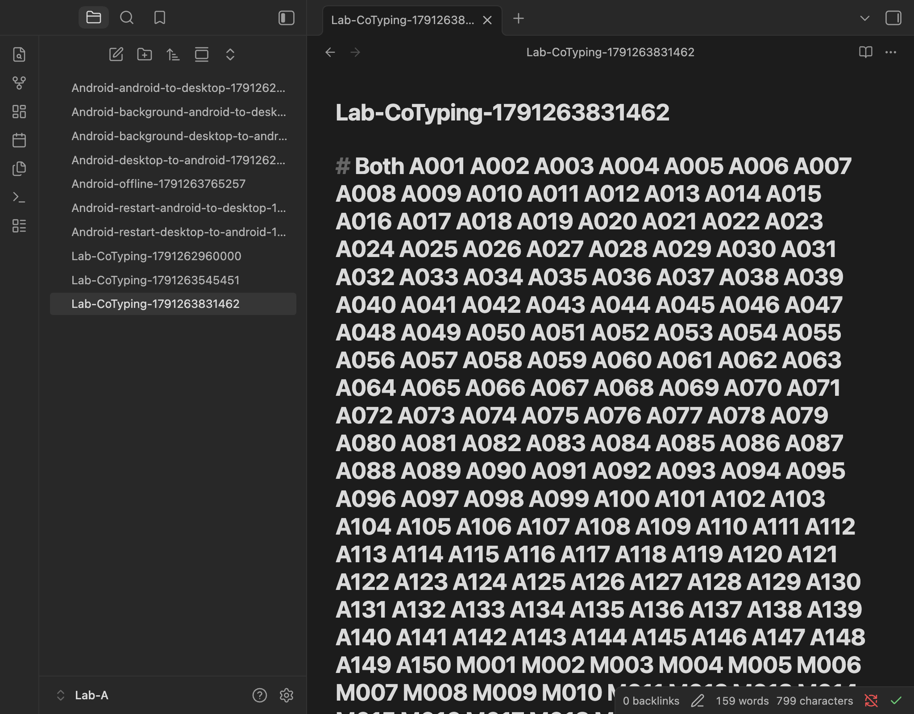
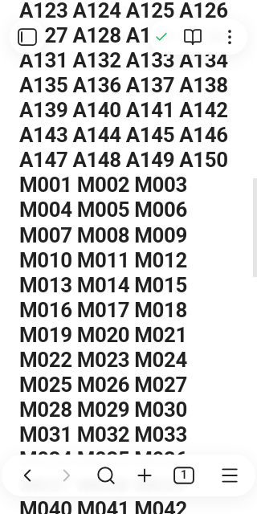
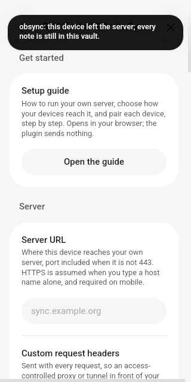

# Repaired insertion boundaries on native clients

Candidate `a6cd169943938b37b81881b2015a226a0df5e603` fixes the prefix and
word-separator failures described in the [desktop regression](2026-10-05-sync-boundaries.md).
This record retains every Android attempt, including failures. It does not
mark physical iPhone acceptance or release readiness complete.

## Artifacts and reproduction

The fresh Android emulator ran official Obsidian 1.13.4 on Android API 35,
ARM64, with two virtual CPUs, 2 GiB memory and software rendering. The APK
SHA-256 was `80505ced8442fafb2d681ecd66645f7855a3ea8beadfa7230f8d003e1101ff8b`.
The desktop peer used Obsidian 1.13.4 and a mock keychain. Android used its
normal native custody. A new disposable account communicated through normal
certificate-verified HTTPS with the original authentication, encryption and
durable writes enabled. This optional relay route is not a private-path or
Cloudflare account/billing validation.

Independent reads of all three installed Android plugin files matched:

| File | SHA-256 |
| --- | --- |
| `main.js` | `7ca3e25a2ce31f698f9489880fcebb84ae8d43fe1be74830250cb3970ffd434b` |
| `manifest.json` | `aae46364e30769a65b56cba53c65a89f104cd1cf5d5c5d6978bbedb3afb9eb42` |
| `styles.css` | `43dd0db8ccce20e88a3c63ec2ea35e46ce4133912c0e797da036e37a6499287b` |

Server SHA-256: `7c05a4bb731d85fb50c81db7bd2c8888df85fb89e2a63c8710126a545d7d8534`.
Use the never-merge branch `gpt-6-high/325-coedit-experiment`, its
`experiments/sync-117/ANDROID.md` and `PHONE.md` lifecycle recipes, and a
new external run for each session. Exact driver digests and reduced results
are in the [receipt](2026-10-05-mobile-boundaries-117.json).

```sh
node experiments/sync-117/android-journeys.mjs \
  experiments/sync-117/harness "$PEER_RUN" "$ANDROID_RUN" \
  cotype "$ANDROID_VAULT"
```

Run each journey sequentially, wait for process exit, open every resulting
capture, and finish both controllers. Never reuse a live manifest, enrollment
or downloaded fixture from this record.

## Android observations

| Journey | Observed result |
| --- | --- |
| Pairing | Two automatic attempts failed: a native connection refusal, then a comparison deadline. Later independent comparisons matched and manual native approval completed key persistence. Automatic pairing is not a PASS. |
| Initial typed transfers | PASS; desktop to Android 16,690 ms, return 3,340 ms; independent disk/editor bytes and identity agreed. |
| First one-minute co-typing attempt | FAIL at the unchanged 120-second convergence deadline; desktop admitted 150 tokens, the slow Android renderer admitted 8. Later disk readback retained all 158, but the original failure remains. |
| Profiled co-typing repeat | PASS; 150 trusted insertions per peer, zero untrusted inputs, all 300 tokens once, separated and in each writer's order; one file per peer, exact disk/editor bytes and shared identity. Convergence 11,607 ms after typing stopped. |
| Background/reopen | PASS without pairing again; transfers 2,802/3,013 ms. |
| Native app restart | PASS without pairing again; transfers 2,787/2,976 ms. |
| Offline edit/reconnection | PASS; authenticated transport proved offline, local input saved, then automatic peer application in 1,493 ms after reconnection. |
| Unprofiled co-typing repeat | Same complete 150 + 150 token/byte/identity assertions passed in 11,251 ms. The subsequent Android capture timed out; a fresh capture of each peer succeeded and both were inspected. The failed command remains recorded. |
| Leave | PASS in 1,396 ms; independently confirmed server revocation, forgotten server/device metadata and unchanged hashes for all ten local notes. |

Transfers are ordered desktop-to-Android/return. These are individual bounded
observations, not matched baseline/candidate speed measurements. The co-typing
driver moves the caret before each insertion and cannot prove cursor stability.
Its existing ten-second recent-input hold remains. Two successful repeats do
not erase the first stall. A 90-second CPU profile of the successful repeat
was 91.24% idle and did not reproduce the earlier stall; it identifies no
cause for that failure. No security or convergence deadline was relaxed.

The final captures show separated `A150 M001` at the writer boundary. They
show only their viewport; the byte assertions establish the complete streams.
The Leave capture shows forgotten server settings and the local-note notice.

| Desktop convergence | Android convergence | Android after Leave |
| --- | --- | --- |
|  |  |  |

Two earlier Android captures contained an obsolete failed-pairing notice with
the temporary endpoint. They were removed after inspection; only their hashes
and removal reason remain. No credential, relay URL or personal note is in the
published images. A finite scan of 120 server journal/blob files, 439,886 bytes,
found none of 19 exact full synthetic note-name/content probes. This supports
that storage observation; it is not a general cryptographic or metadata proof.

## Physical phone and teardown

The repaired candidate was not installed on the physical iPhone. Safari left
a zero-byte `Obsync-Phone-Validation-1-1-7.zip.download` in the verified
On My iPhone/Downloads location despite a complete server-side HTTP response.
Closing a tab with Command-W closed Mirroring's Mac window instead. Reopening
required Mac Touch ID/login, so physical retesting and recoverable removal of
that exact placeholder remain blocked. Browser test-tab identity is uncertain;
the unrelated original tab was preserved. The previous synthetic vault was
absent from its device parent before this attempt. Personal vaults were not
opened or changed.

Both foreground controllers exited zero. Relay children and owned process
groups are absent; runtime, private credentials, accounts, profiles, live
manifests and copied session inputs were removed and their absence checked.
Clipboard restoration passed. Hash/ownership/open-handle checks preceded
removal of 1,633,004 bytes of copied preparation ZIP/binary inputs. Reduced
receipts and inspected synthetic captures remain. The phone placeholder is
the explicit exception; no complete phone cleanup claim is made.
