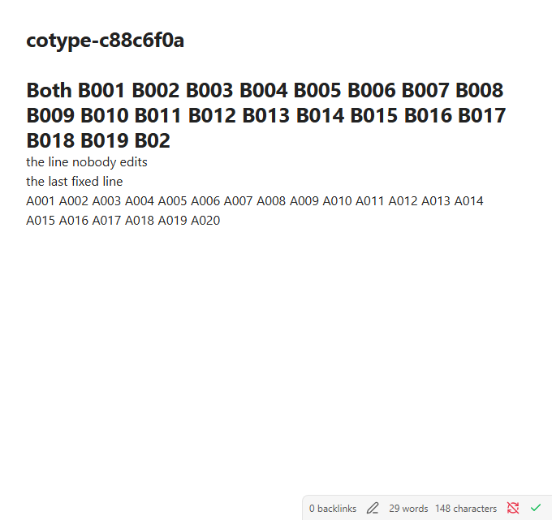
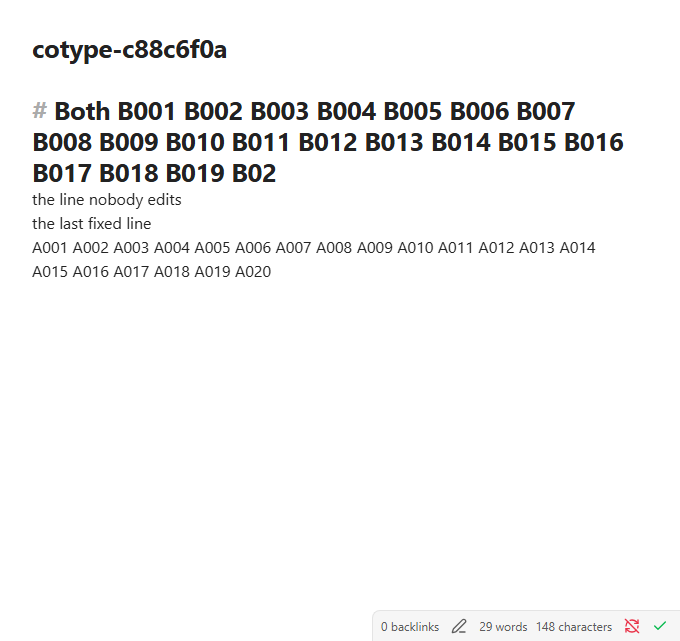
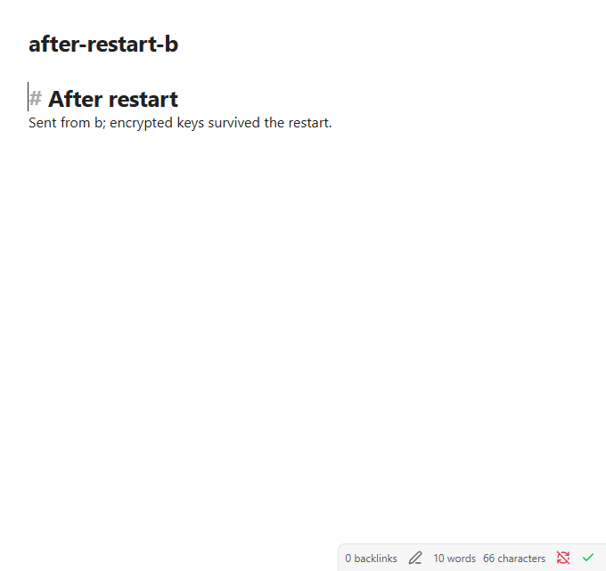

# Native Windows acceptance, 2026-10-05

Fourteen native Obsidian journeys passed on Windows, including encrypted
credential storage across a real quit/relaunch and bidirectional transfers
after restart. All six original synthetic editor captures were downloaded,
opened and inspected. This closes the Windows visual/restart evidence gap;
it does not establish phone acceptance or low-latency concurrent editing.

## Source and reproduction

The [Desktop matrix run](https://github.com/snaraj/obsync/actions/runs/37351477069/job/111903711941)
was triggered by candidate `519c0e50616cff58fffb772f172c5aad6620bba3`.
Actions checked out merge commit `fd68c6248a0a4d5b80edd1e4799f5d1100ded139`;
GitHub's commit API confirmed its parents as protected base
`72bdcf94ed40fc8769c8baad5a6b2db56ae92cfe` and that candidate head. Every
capture receipt names the checked-out merge commit. The locally built candidate
bundle hash is `8f6b05d7dd8f589c4781f117d0ce37eabd9bd0f8cd4ffe2751200c53ee9028ed`.
The retained Windows job/capture receipts do not independently measure that
hosted bundle hash. This candidate has not been released.

The native Windows job used Obsidian 1.13.7/Electron 43.3.0, two fresh profiles,
NTFS and a trusted TLS endpoint. Its recipe is
`.github/workflows/desktop-matrix.yml` and `scripts/ci/obsidian-drive.mjs`.
Follow the [Windows capture instructions](../validation.md) for a fresh run;
download `windows-editor-captures` and inspect every PNG. Download or upload
success alone is not visual acceptance. The separate
[native CLI matrix](https://github.com/snaraj/obsync/actions/runs/37351477191)
passed the ordinary-user installation, context, replay, uninstall and peer-access
refusal journey on Windows.

## Observations and limits

| Observation | Result |
| --- | --- |
| Setup, pairing, notes in both directions, rename, folders | PASS; initial transfers 1008/1010 ms |
| Ten sequential edits | p50 1014 ms; nearest-rank p95/max 1036 ms |
| Concurrent trusted input | 99 + 99 keystrokes over 20,084 ms; exact content on both disks and editors; no conflict copy |
| Convergence after last completed insertion | 10,683 ms; existing co-edit hold remains a responsiveness gap |
| Closed watcher and index repair | PASS; watcher restored; no echo publication |
| NTFS capitalization rename, trash, locked file | PASS; locked edit arrived after release, 61,077 ms from edit |
| Native encrypted credential restart | Both profiles reopened paired from persistent secret storage, with matching revisions before/after |
| Transfers after restart | 1029/1011 ms; no unencrypted-storage warning |

The harness checks encryption availability, non-plaintext stored credentials,
revision agreement and successful reads through Obsidian's secret-storage API.
These are separate from the screenshots, which establish visible note content.
Electron's backend-name diagnostic is Linux-only and is recorded as unavailable
on Windows; encryption or credential-check exceptions still fail the journey.
This is native Windows credential custody evidence, not an extraction or
compromise-resistance audit of the operating system.

The screenshots below show matching content in both peers. Source-mode markup
can differ with focus. No dialog or notice covers the editor; each receipt's
editor hash equals its independently read disk hash, and the PNG hash matches
the retained file. They contain only synthetic notes and no pairing/setup data.
The [reduced receipt](2026-10-05-windows-117.json) retains source, image hashes,
inspection result and all fourteen journey outcomes.

| Phase | Peer A | Peer B |
| --- | --- | --- |
| Concurrent input settled |  |  |
| First post-restart note |  |  |
| Second post-restart note |  |  |

Earlier attempts failed actionlint's job-level context rule, then a Linux-only
diagnostic method on Windows. The harness fixes preserve all custody checks;
seven focused tests and the guard mutation checks pass. The best-effort cleanup
step completed on a disposable hosted runner; removal of each resource was
not independently verified. Retained local material is limited
to reduced evidence, synthetic captures and diagnostic job logs. No personal
Windows installation or vault was changed. Physical-phone acceptance and the
formal artifact review remain outstanding.
